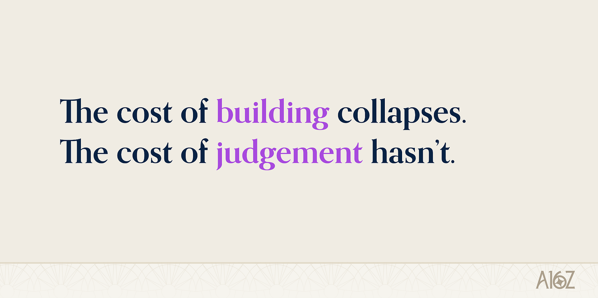
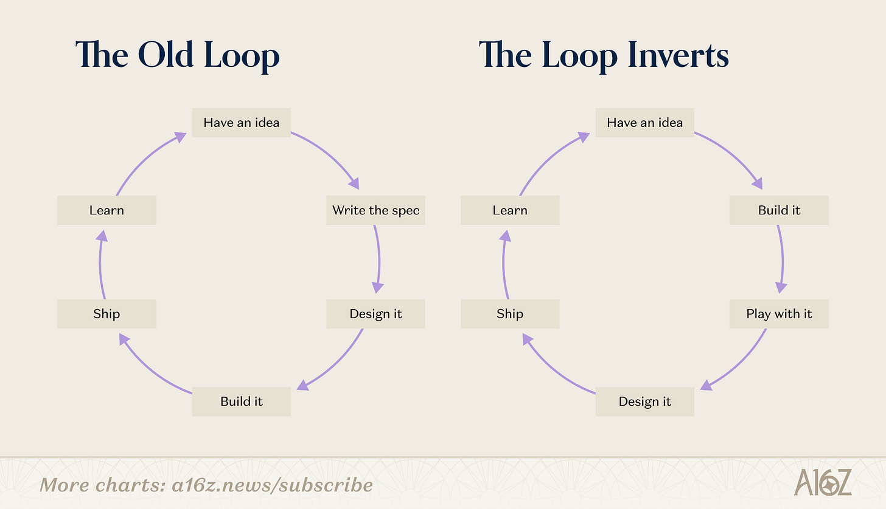
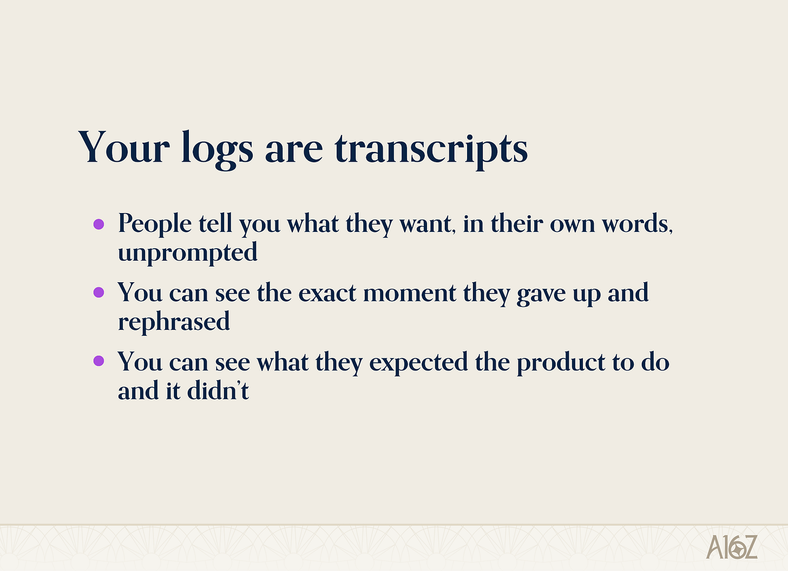
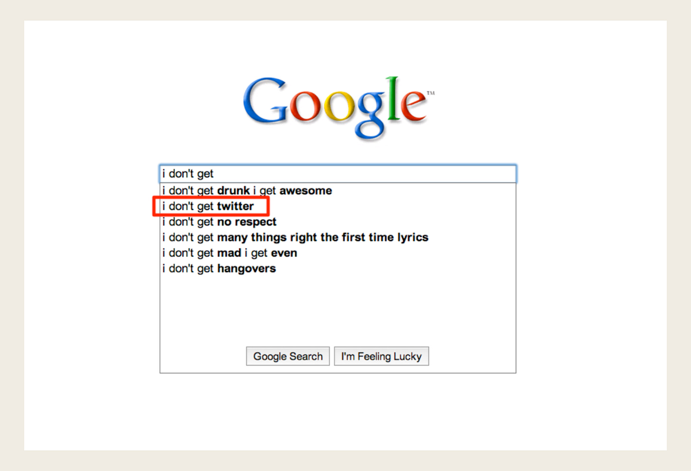
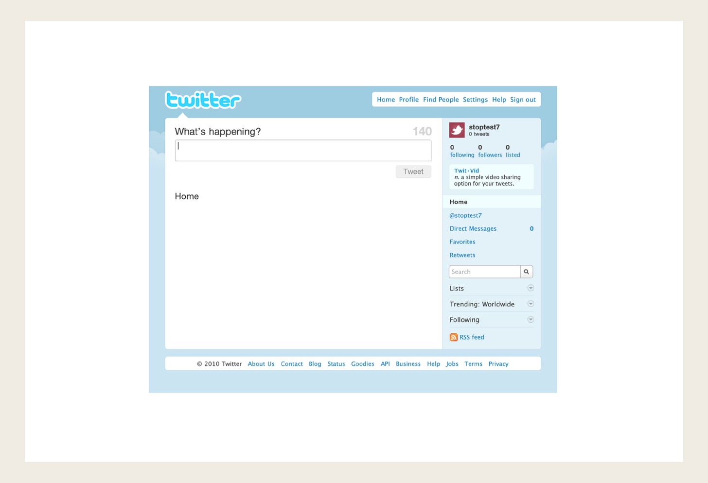
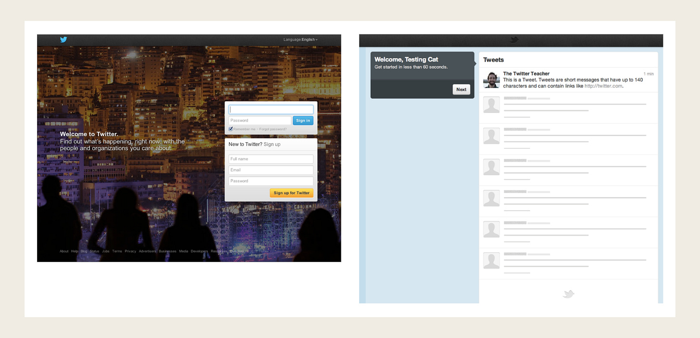
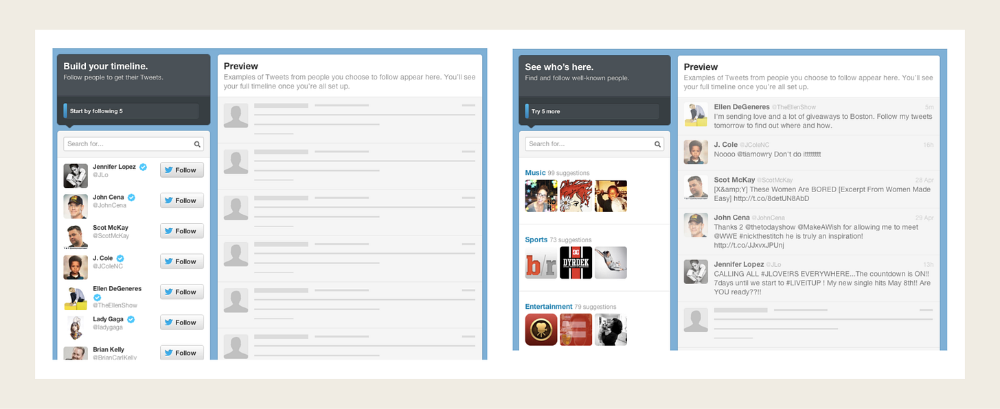
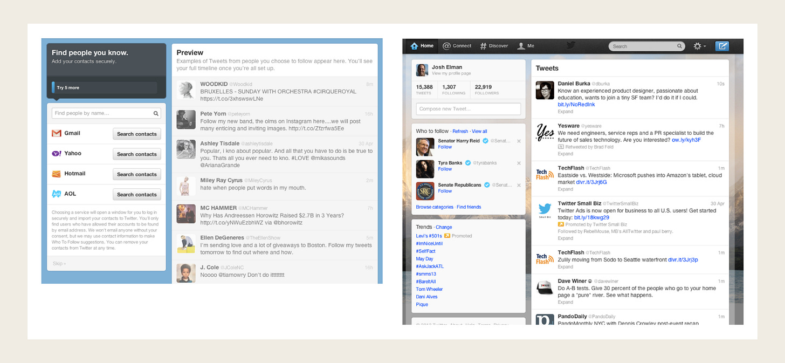
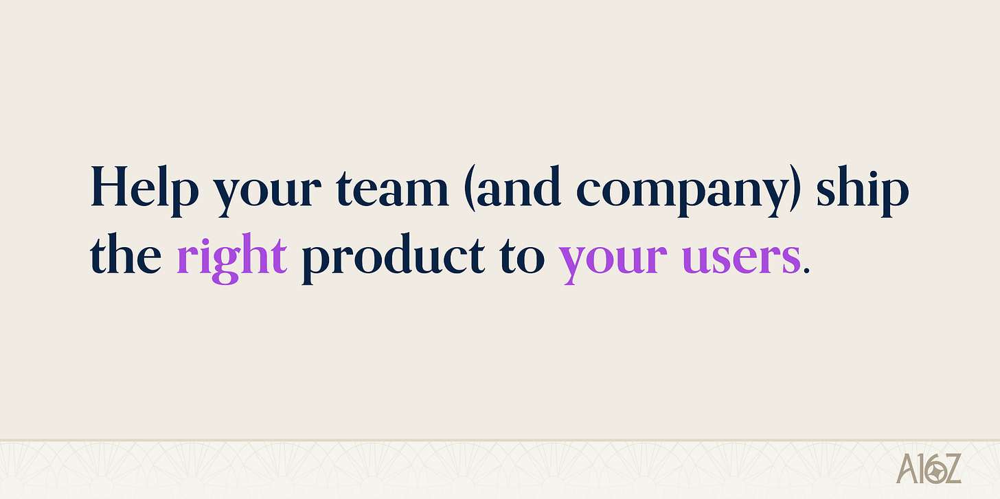

What AI is changing. What it’s not.

AI 正在改变什么，以及它没有改变什么。

> 作者 / Author: Josh Elman
> 发布时间 / Published: 2026-09-14T22:02:07+08:00
> 原文链接 / Source: https://www.a16z.news/p/product-management-is-still-all-about

Product management is all about telling stories. So let me share how *I* think about product management, and how AI has changed it, by telling you one.

产品管理就是讲故事。所以，让我通过给你讲一个故事，来分享我如何看待产品管理，以及 AI 如何改变了它。

## The interview question I’ll never forget / 我永远不会忘记的那道面试题

I started my career as an engineer at RealNetworks, and in a few years I was responsible for the product and engineering team for RealPlayer. It was a pretty meaningful consumer product at the time - it had hundreds of millions of users, and helped bring audio and video to the early internet. I’d sit in meetings with people over on the business side, who’d suggest ideas like, “We should show an ad every time the player starts.” I knew this wasn’t the right thing to do, but I had no way to argue with their Excel spreadsheets showing how much money we’d make. I wanted to become a *real* product manager, and concluded I should probably go to business school.

我的职业生涯从 RealNetworks 的工程师开始，几年之后我开始负责 RealPlayer 的产品与工程团队。当时它是一个相当有分量的消费级产品——拥有数亿用户，把音频和视频带进了早期互联网。我会和业务侧的人一起开会，他们会提出这样的建议：“我们应该在播放器每次启动时展示一条广告。”我知道这不是对的做法，但我没办法拿他们的 Excel 表格来反驳——那些表格显示我们能赚多少钱。我想成为一名真正的产品经理，于是我得出结论：我大概应该去读商学院。

I started business school at Berkeley, and soon after arriving I saw on my former college email list that LinkedIn was hiring. I applied, and found myself in an interview with Reid Hoffman. He sat down and asked me an interview question I’ll never forget:

我在伯克利开始读商学院，到校不久后，我在前大学的邮件列表上看到 LinkedIn 正在招人。我投了简历，并进入了与 Reid Hoffman 的面试。他坐下来，问了我一道我永远不会忘记的面试题：

“So, you want to be a product manager. What is the artifact that a product manager produces?”

“那么，你想成为一名产品经理。产品经理产出的工件是什么？”

He elaborated. Engineers have an artifact: code. Business development has an artifact: signed contracts. Designers make the visual look and the graphics. The CEO has the org chart, the funding plan, and the vision that keeps everyone together. What about a product manager?

他进一步解释。工程师有工件：代码。商务拓展有工件：签下的合同。设计师做出视觉外观和图形。CEO 有组织架构图、融资计划，以及把所有人凝聚在一起的愿景。那产品经理呢？

I told him that I wasn’t sure product managers really had “artifacts” like that, but that the fundamental thing we do is gather up everything that’s going on and write it down in a *spec*. The spec is the blueprint. It’s where we define the requirements, and everything we’re going to do, and it becomes one of the most important documents in the company because it unlocks every team to go build from there.

我告诉他，我不确定产品经理真的有那样的“工件”，但我们的根本工作是收集正在发生的一切，并把它写进一份规格说明书。规格说明书就是蓝图。我们在其中定义需求，定义我们将要做的一切；它会成为公司里最重要的文件之一，因为它解锁了每个团队去构建。

I was clearly nervous. I think he noticed, because he reassured me that it was a fine answer. I ended up getting the job, dropped out of business school to join LinkedIn, and I’ve been thinking about that question ever since.

我当时显然很紧张。我想他注意到了，因为他安慰我说这是一个不错的回答。我最终得到了这份工作，从商学院退学加入了 LinkedIn，而从那以后我一直在思考这个问题。

## The evolution from spec to story / 从规格说明书到故事的演进

Because I *gave the wrong answer*.

因为我给出了错误的答案。

This was still the Waterfall Era of building software. At LinkedIn we were trying to reimagine a jobs platform within a social platform - where hiring managers could see job applications in the context of mutual connections, candidates could see job listings and find ways through their network to get to the front door. During this discovery process, I wrote a 120-page spec defining the entire experience, and what the requirements were.

那时还处于构建软件的瀑布流时代。在 LinkedIn，我们试图在社交平台里重新构想一个招聘平台——招聘经理可以在共同人脉的背景下看到求职申请，候选人可以看到职位列表，并找到通过自己人脉抵达前门的方式。在这个探索过程中，我写了一份 120 页的规格说明书，定义了整个体验以及各项需求。

I’ve thought a lot about it in the years since. Because that spec, obviously, is not the most important artifact. The *story* is.

此后这些年，我对它思考了很多。因为那份规格说明书显然不是最重要的工件。故事才是。

The spec describes a system, what it must do, and what boxes must be checked off before it is done. *That is not the art of product management.* Product management is about telling the story of people who are going to use the product, and why it will matter in their lives. It has to be immediately understandable, by whoever you’re talking to. And it has to be *repeatable* - people need to be able to pass it around faithfully, without you being in the room.

规格说明书描述一个系统、它必须做什么、以及在完成之前必须勾选哪些框。那不是产品管理的艺术。产品管理关乎讲述将要使用产品的人的故事，以及它为什么会在他们的生活中重要。它必须能被你交谈的任何一个对象立刻理解。而且它必须是可重复的——人们需要能够忠实地把它传递出去，而不需要你在场。

That is a completely different document, and a completely different job.

那是一份完全不同的文件，也是一份完全不同的工作。

[Watch on YouTube](https://www.youtube.com/watch?v=PVKhoFcTpsI)

Ten years ago I gave a talk about product management, and people *still* send it to me; which is either flattering, or a sign that the field hasn’t moved. I’ll consider both possibilities. Anyway, the whole talk came down to one sentence: “**A product manager helps their team (and company) ship the right product to their users.”** I spent most of the talk breaking down that sentence, word by word.

十年前我做过一场关于产品管理的演讲，人们至今还在发给我；这要么是恭维，要么说明这个领域没有进步。两种可能我都会考虑。总之，整场演讲归结为一句话：“产品经理帮助他们的团队（和公司）向用户交付正确的产品。”我用演讲的大部分时间逐字拆解了这句话。

- *Helps their team.* You’re not the leader. A lot of people think the product manager is the leader. You’re the person who *helps* make the thing happen. Which means you must … / 帮助他们的团队。你不是领导者。很多人认为产品经理就是领导者。你是那个帮助事情发生的人。这意味着你必须……
- Understand your *team* and your company. Your team is your domain: you have to understand it! And you have to understand how it sits inside the bigger picture, so you can serve the company’s goals and not just yours. / 理解你的团队和你的公司。你的团队就是你的领域：你必须理解它！而且你必须理解它如何处在更大的图景之中，这样你才能服务于公司的目标，而不只是你自己的目标。
- *Ship*. We can talk all we want, but at the end of the day, all that matters is putting the product in front of customers. / 交付。我们想聊多少都可以，但归根结底，唯一重要的是把产品呈现在客户面前。
- *The right product for your users*. We’ve finally arrived at the job: honing in on what “right” actually means. / 为用户提供正确的产品。我们终于来到了这份工作的核心：精确界定“正确”到底意味着什么。

How much of that changes in a world of AI?

在一个 AI 的世界里，这其中有多少会改变？

## What is changing / 正在改变的事情

Obviously *something* has changed, a few things actually. On the one hand, it’s changing how we code, and how fast we can get from an idea to something running. On the other hand, it’s changing what users expect a product to *be*. I think we’ve barely tapped this, especially in consumer. Being able to describe what you need and have the product deliver it, maybe with agents running in the background, without you having to learn and interface.

显然有些事情改变了，实际上是好几件事。一方面，它改变了我们写代码的方式，以及从一个想法到跑起来的东西能有多快。另一方面，它改变了用户对产品应该是什么的期待。我认为我们几乎还没触及这一点，尤其是在消费领域。能够描述你需要什么，然后让产品交付它——也许还有智能体在后台运行——而不必由你去学习和操作界面。

There’s no question that the cost of *making stuff* has collapsed. It’s no longer all that difficult to scope something out and try it; that gives you enormous flexibility. But the cost of *judgment* hasn’t changed at all. Figuring out what to build is more important now than ever.

毫无疑问，做东西的成本已经崩塌。把某件事划定范围并试一试，不再那么困难；这给了你巨大的灵活性。但判断力的成本完全没有改变。弄清该构建什么，如今比以往任何时候都更重要。

Product development is a loop. It used to be that someone had an idea - and it doesn’t have to be you; in a good company it can come from anywhere. You try it. You write a spec, or a product brief, or whatever your name for that document is. There’s some up front cost to it: scoping, designing, arguing - everything that must happen before you spend precious engineering time. These are all rituals that we invented in order to protect engineering time from bad decisions. Because you only got six or eight turns around that loop a year.

产品开发是一个循环。过去是某人有了一个想法——不必是你；在一家好公司，它可以来自任何地方。你去试它。你写一份规格说明书，或者产品简报，或者你对那份文件的任何叫法。它有一些前期成本：划定范围、设计、争论——在花掉宝贵的工程时间之前必须发生的一切。这些都是我们发明出来的仪式，用来保护工程时间不被糟糕的决策消耗。因为你一年只有六到八次绕这个循环的机会。

Then making things became *absurdly* cheap. Not somewhat cheaper; a different order of magnitude. And what has happened is really interesting. That old loop is still very much there - just rearranged into a new order.

然后，做东西变得荒谬地便宜。不是便宜一点；是不同数量级的便宜。而接下来发生的事情非常有意思。那个旧循环依然实打实地在那里——只是被重新排列成了新的顺序。

The old loop went: idea, spec, costing, scoping, everything else, *then* building. *Now:*

旧循环是：想法、规格说明书、成本核算、划定范围、其他一切，然后构建。现在：

- First, take the idea and you build it quickly with AI, just to see how it works and how it feels. / 首先，拿着这个想法，用 AI 快速把它做出来，只是为了看看它如何运作、感觉如何。
- You get to play with it, and figure out how it feels and fits into the overall picture. Prototypes beat “what-ifs”, every time. / 你可以把玩它，弄清它的感觉，以及它如何融入整体图景。原型每一次都胜过“如果……会怎样”。
- *Then* you design it. Now that you’ve played with it, you know what it *is*, and you can actually talk about what it’ll take for this to be more than a prototype. I mean design here in both senses: visual and UX design, and also engineering design. / 然后你设计它。既然你已经把玩过它，你就知道它是什么，你也就真正能谈论：要让这不仅仅是一个原型，需要什么。我这里说的设计是双重含义：视觉和 UX 设计，以及工程设计。
- Then you ship and learn. / 然后你交付并学习。

It completely inverts: from spec-and-scope, to build-and-play. **I think that changes product management more than anything else happening right now.**

它完全倒过来了：从“规格说明书与划定范围”，变成“构建与把玩”。我认为这比当下正在发生的任何事情都更能改变产品管理。

This finally means that **the spec is no longer the deliverable; *for real*.** You don’t have to start by writing a long document and getting everything right on paper. This used to be true in an aspirational sense, but now it’s just obviously true, in a literal sense.

这最终意味着规格说明书不再是交付物；这是真的。你不必从写一份长文档、在纸面上把所有事情都做对开始。过去这在一种理想化意义上是真的，但现在它在字面意义上就是显而易见的真。

But I want to be careful, because there’s an equal and opposite mistake you can make.

但我想小心一点，因为有一个等量且相反的错误你可能犯。

Demos are almost free now. **Working products are not.** I keep seeing the flip side of this new approach: “That’s great, just ship it.” That’s still not how it works. We all still have to respect that *the distance from a prototype to something real still takes time to cross.*

演示现在几乎免费。可用的产品不是。我不断看到这种新方法的另一面：“那很好，直接发布吧。”这仍然不是它运作的方式。我们所有人都仍然必须尊重：从原型到一个真实产品之间的距离，仍然需要时间来跨越。

There’s a bit of a trope about product managers, that their job is mostly about asking, “Does it fit in the schedule?” Throw that idea away entirely. The most important question is: *Does it fit in the product?*

关于产品经理有一个老套的说法，说他们的工作主要是问：“这符合进度安排吗？”把那个想法彻底丢掉。最重要的问题是：它符合产品吗？

We all have great ideas, and now we all have agents that can code for us. Deciding what to build is officially not a resourcing debate. It is an *impact* debate. “This or that”, not “this or nothing.” Taste and curation matter a lot here, when you have a vision and you really know what you’re trying to do for the world. But the system you build still has to feel complete.

我们都有很棒的想法，现在我们都有能为我们写代码的智能体。决定构建什么，正式来说不再是一场资源之争。它是一场影响力之争。“这个还是那个”，而不是“这个或者什么都没有”。当你有一个愿景、并且你真正知道你想为这个世界做什么时，品味和策展在这里非常重要。但你构建的系统仍然必须感觉完整。

My biggest worry about AI is that it lets us go faster, and therefore just cram everything in. We talk about “AI slop” in content; this is what AI slop means for product. I’ve seen it happen in a few places already, and I think we’re all a bit worried about it. When anyone can build anything, *deciding what to build is the whole job.* And that’s a story problem. What story do you want to tell? What story do you want your customers to understand? What story do you want living in their heads?

我对 AI 最大的担忧是，它让我们跑得更快，因此就把所有东西都塞进去。我们谈论内容里的“AI 垃圾（slop）”；这就是 AI 垃圾对产品意味着什么。我已经在好几个地方看到它发生，我想我们都对此有点担心。当任何人都能构建任何东西时，决定构建什么就是全部的工作。而这是一个故事问题。你想讲什么故事？你想让你的客户理解什么故事？你想让什么故事活在他们脑中？

Your job as a PM is not to write a spec of what the product will do. It is about creating a shared *understanding* - a shared picture of what we’re doing and why. Why is the user here? What do they feel at each step, and why does that matter? Where is it impressive, and where is it boring? It’s okay for a product to be boring occasionally, as long as you know where. But if you can’t write a good script, the product is going to be dull.

作为 PM，你的工作不是写一份描述产品将做什么的规格说明书。它关乎创造一种共享的理解——一幅关于我们正在做什么以及为什么的共享图景。用户为什么在这里？他们在每一步感受到什么，而为什么那重要？它在哪里令人印象深刻，又在哪里无聊？一个产品偶尔无聊是可以的，只要你知道在哪里。但如果你写不出一个好剧本，产品就会变得乏味。

The gift that AI gives you is now you can find this out for free, right up front. You can build it quickly, get a feel for it, play with it, and figure out that one sentence: **what does this product do for somebody in their life?** Because if you can answer that, you can answer my question: “Are people actually using it?” Because now you’ve said what it does, and you’re asking whether they do it.

AI 给你的礼物是：现在你可以在最开始就免费地把这件事弄清楚。你可以快速把它构建出来，感受它，把玩它，然后弄清那一句话：这个产品在某人的生活中为他们做什么？因为如果你能回答这个，你就能回答我的问题：“人们真的在用它吗？”因为现在你已经说了它做什么，而你正在问他们是否做了。

## What isn’t changing / 没有改变的事情

What does it mean to have a “vision” for your product?

对你的产品拥有一个“愿景”意味着什么？

When I say vision, I don’t mean a mission statement. Those matter, but they are not a vision. A vision is the end-to-end **reason for the product to exist for users**. I have a simple framework for this:

当我说愿景时，我不是指使命宣言。那些很重要，但它们不是愿景。愿景是产品为用户而存在的端到端理由。我有一个简单的框架：

- Purpose. Why is someone picking up your product and putting it in their life? / 目的。为什么有人会拿起你的产品并把它放进自己的生活？
- Core actions. When they pick it up, what are they actually doing? There can be more than one thing, you have to understand them all. / 核心行动。当他们拿起它时，他们实际上在做什么？可能不止一件事，你必须理解它们全部。
- Cycle. What is the expected frequency of each of those core actions? / 周期。每一个核心行动的预期频率是多少？

My whole career, as I’ve met with founders and other product people, I ask them: ***are people using your product?*** And they almost always jump straight to user data. “We have a 50% DAU/MAU ratio. We crossed 10,000 signups. We’ve got a million people on the waitlist. Our ARR is a million. We’re doing four billion tokens a day. We hit #3 on the App Store.”

在我整个职业生涯中，当我见到创始人和产品人时，我会问他们：人们在用你的产品吗？他们几乎总是直接跳到用户数据。“我们的 DAU/MAU 是 50%。我们的注册量突破了 10,000。我们有一百万人在等待名单上。我们的 ARR 是一百万。我们每天处理四十亿个 token。我们登上了 App Store 第 3 名。”

Are any of those an answer to the question I asked?

这些当中有任何一个是我所问问题的答案吗？

Sometimes I ask the question again, but I add one more word: **are people** ***really*** **using your product?** And then, sometimes, they clue into what I’m asking about.

有时我会再问一遍这个问题，但加一个词：人们在真的用你的产品吗？然后，有时，他们会领会我在问什么。

LinkedIn’s purpose was to *find* and *be found*. Maybe the core action, for some people, was just responding when somebody reached out. For most people that’s not a daily thing; it might be once or twice a year.

LinkedIn 的目的是找到和被找到。对某些人来说，核心行动可能只是在有人联系时做出回应。对大多数人来说，那不是每天的事；可能一年一两次。

Look at that cycle - once or twice a *year*. Understanding this was critical to LinkedIn working, because the network needed a very large number of people willing to be found, and at least some people doing the finding.

看那个周期——一年一到两次。理解这一点对 LinkedIn 的成功至关重要，因为这个网络需要数量极其庞大的人愿意被找到，以及至少有一些人在做寻找。

LinkedIn was a social network, after all, so you might be tempted to prod users into taking actions every day. We didn’t do that. Instead, we spent enormous time in the early days on making sure people kept their profiles accurate. It was completely fine if you were only found once or twice a year, as long as when it *did* happen, you clicked through and understood, “someone’s reaching out to me, that’s great.”

毕竟 LinkedIn 是一个社交网络，所以你可能会想引诱用户每天都采取行动。我们没有那样做。相反，在早期我们花了大量时间，确保人们保持个人资料的准确。如果你一年只被找到一两次，那是完全可以的，只要当它真的发生时，你点进去并理解：“有人在联系我，那太好了。”

When you’re measuring whether your product is working, those core actions are what matters. Focus on direct traffic: find the people who *literally came to you*. They have the app installed and hit the icon, or they typed your domain in by hand; they went *to you,* of their own volition. That’s the traffic that matters, as opposed to all of the other ways you can get somebody back in the moment.

当你衡量你的产品是否在奏效时，那些核心行动才是重要的。关注直接流量：找到那些真正来到你这里的人。他们装了应用并点开图标，或者手动输入了你的域名；他们出于自己的意愿走向你。那才是重要的流量，相对于所有其他让你把人拉回当下的方式。

And then only really count the people who perform the core actions. Not “briefly opened the app”, but actually engaged with it. On Discord it would be, “got into a live session. Actually read and sent messages.”

然后，只真正计算执行核心行动的人。不是“短暂打开过应用”，而是真正与之互动。在 Discord 上，那会是：“进入了一个实时会话。真正阅读并发送了消息。”

If you can’t define what those core actions are, then *you do not have a product*, because you don’t have something that you understand.

如果你无法定义那些核心行动是什么，那么你就没有产品，因为你没有你理解的东西。

Now, one thing that’s new, and that I love, is that in AI products where the user is talking to the product, or prompting it in some way, you now have a literal transcript of your user journey. You can see what people are saying in their own words. You can see the exact moment someone gave up and rephrased. You can see what they expected the product to do that it didn’t. READ THESE! AI is great for surfacing things you wouldn’t have seen before, but you can’t have it summarize everything, and you can’t have it form your opinion for you. Forming your opinion - figuring out what the story actually is - is the job and the art of product management.

现在，有一件新的事，我很喜欢：在用户与产品交谈、或以某种方式提示它的 AI 产品里，你现在拥有用户旅程的字面记录。你能看到人们用自己的话在说什么。你能看到某人放弃并换一种说法的确切时刻。你能看到他们期待产品做什么、而它没做。去读这些！AI 非常擅长浮现你以前不会看到的东西，但你不能让它总结一切，也不能让它替你形成观点。形成你的观点——弄清故事实际上是什么——是产品管理的工作与艺术。

## Onboarding / 入门引导

Onboarding is the single most important moment you have to tell your story to a customer. They’ve discovered your product - maybe through an ad, a viral invite, an article, whatever. They know you exist; they’re curious and want to try it. **You will never get this much attention from them ever again.**

入门引导是你必须向客户讲述你的故事的最重要时刻。他们发现了你的产品——也许通过广告、病毒式邀请、一篇文章，随便什么。他们知道你的存在；他们好奇，想试一试。你永远不会再从他们那里得到这么多的注意力。

You have to remember, at this point, that not everyone shows up to your product with the same motivation. There are the **eagers**. They want in *so badly*. They’re ready to go. And, just so we’re clear, if you work at the company, you live in eager-land. Everyone internal to your company should be treated like an eager; they’re already steeped in the product every day. When they onboard to the product they think, “I know what I’m doing, this is boring, why is this step here?”

在这一点上你必须记住，不是每个人都带着同样的动机来到你的产品。有急切者。他们非常想进来。他们准备好出发了。而且，说清楚一点，如果你在公司工作，你就生活在急切者之地。你公司内部的每个人都应该被当作急切者对待；他们已经每天沉浸在这个产品里。当他们入门到产品时，他们想：“我知道我在做什么，这很无聊，为什么有这一步？”

On the other hand there are the **fly-bys.** They’re just not that into you. They heard about it, checked it out, but the message didn’t land, and they’re going to bail.

另一方面有飞过者。他们就是没那么喜欢你。他们听说了它，看了看，但信息没有落地，他们会退出。

Those two kinds of users are the edges of the distribution. In between is a big fuzzy middle. These are people who showed up for a reason: they’re curious! They want to learn more! And you genuinely can convert them into core users of your product. These are the people you need to build around. You’ll get the eagers anyway. The middle is who you need to understand.

这两类用户是分布的两端。在中间是一个大的模糊中间地带。这些人是带着理由出现的：他们好奇！他们想了解更多！而你确实可以把他们转化为你产品的核心用户。这些就是你需要围绕之构建的人。你无论如何都会得到急切者。中间地带才是你需要理解的。

Assume your users are motivated and curious. Take the time to introduce the product, step by step. **More simple steps beat fewer complex ones.** I’ve proven this in A/B tests at multiple companies over the years. If every step is discrete and simple, and it’s clear what you’re asking and what you’re teaching, that beats single large screens, or complex choices to keep the number of steps low. Every time.

假设你的用户是有动机且好奇的。花时间逐步介绍产品。更多简单步骤胜过更少复杂步骤。这些年来我在多家公司的 A/B 测试中证明了这一点。如果每一步都是离散而简单的，并且清楚你在问什么、在教什么，那就胜过单一的大屏幕，或者为了保持步骤数少而做的复杂选择。每一次都是。

So how do you actually build that?

那么你实际上如何构建那个？

Start by repeating the core message: **Here’s what this is for.** State the context, inside the product. It’s fine to ask for the basics - email, password, phone. For everything else, explain why you’re asking, and how it relates. Then break your product down into its key concepts, each with a clear action for the user to take.

从重复核心信息开始：这是为了什么。在产品内部陈述背景。问基本信息是可以的——邮箱、密码、电话。对于其他一切，解释你为什么问，以及它如何相关。然后把你的产品拆解成它的关键概念，每个概念都有一个明确要用户采取的行动。

**AI products have made this harder, not easier.** You get the blank prompt box. In some ways it’s the worst onboarding screen ever designed. It’s a magic box. It can do anything. So… what do you want to do?

AI 产品让这件事变得更难，而不是更容易。你得到一个空白的提示框。在某些方面，这是有史以来设计得最糟糕的入门引导屏幕。它是一个魔法盒。它什么都能做。所以……你想做什么？

A lot of products nowadays start with, “Hi, I’m here to help, ask me anything!” Speaking for myself, I am not the most articulate or creative person, in that moment. You have to teach capabilities concept by concept. “If you ask something like this, I can do it.” And then let the product do it. Get the user to at least one valuable use case quickly, ideally with their own data, so it’s actually valuable to them.

现在很多产品以这样的话开始：“嗨，我在这里帮忙，问我任何事！”就我自己而言，在那一刻我不是最善于表达或最有创造力的人。你必须一个概念一个概念地教它能力。“如果你问类似这样的东西，我能做它。”然后让产品去做它。让用户快速达到至少一个有价值的用例，最好用他们自己的数据，这样它对他们就真的有价值。

People ask me sometimes: with a longer flow, won’t more people drop off? *Yes!* But the ones who get through are far, far more likely to actually use your product. If you’re A/B testing two different onboarding flows, do NOT look at how many people made it to the end of the flow. Look at how many people come back the next day, or the next week, and how many took a core action. If you ask them, at that moment, “What is this product?” they should give you more or less the right answer. Your retention data, from this point forward, is your report card.

人们有时问我：用更长的流程，不会更多人流失吗？是的！但那些走完的人，真正使用你产品的可能性要大得多得多。如果你在 A/B 测试两个不同的入门引导流程，不要看有多少人走到了流程的终点。要看有多少人第二天或下一周回来，以及有多少人采取了核心行动。如果你在那一刻问他们：“这个产品是什么？”他们应该给你或多或少正确的答案。从这一刻起，你的留存数据就是你的成绩单。

## A story from Twitter / 一个来自 Twitter 的故事

I’m going to wrap all of this together by telling you a story from Twitter.

我将通过讲一个来自 Twitter 的故事，把这一切串起来。

I joined Twitter in late 2009. We had a growth problem - except it wasn’t really a growth problem. Twitter was in the news constantly. People were blogging about it, the media was talking about it, and plenty of people were asking: “What is this Twitter thing? I need to go figure it out and sign up.” And then millions of them did. But they never came back.

我在 2009 年底加入 Twitter。我们有一个增长问题——只是它并不是真正的增长问题。Twitter 不断出现在新闻里。人们在写关于它的博客，媒体在谈论它，很多人都在问：“这个 Twitter 到底是什么东西？我得去弄清楚并注册。”然后数以百万计的人确实注册了。但他们再也没有回来。

**The problem was that no one could tell you what Twitter *was*.** I can actually prove this:

问题在于没有人能告诉你 Twitter 是什么。我实际上可以证明这一点：

*Caption: “we eventually got to number one.”*

图片说明：“我们最终做到了第一名。”

The way we were doing onboarding was, people would sign up, and see options to “Find your friends” or “Follow 20 random people”. Most people skipped it, and then landed on a page that looked like this:

我们当时做入门引导的方式是：人们注册后，会看到“找到你的朋友”或“关注 20 个随机的人”的选项。大多数人跳过了它，然后落在一个看起来像这样的页面上：

This is pretty terrible! It’s a big empty box. People would look at it and think, “...I don’t have anything to say.” And then they’d leave. If you asked them at that moment, “What is Twitter?” they’d say, “I think it’s about saying something to the world? Or finding my friends? I don’t know.”

这相当糟糕！它是一个大大的空盒子。人们会看着它想：“……我没什么可说的。”然后他们就离开了。如果你在那一刻问他们：“什么是 Twitter？”他们会说：“我想它是关于向世界说点什么？或者找到我的朋友？我不知道。”

So we rebuilt onboarding over a couple of years, and found the thing that worked, which was the Learn Flow. We taught them Twitter, one concept at a time, as a story. And it moved retention more than anything else we shipped that year.

所以我们花了两三年重建入门引导，找到了那个有效的做法，也就是 Learn Flow。我们一个概念一个概念地教他们 Twitter，把它讲成一个故事。而它在那一年里带来的留存提升，超过了我们当年发布的任何东西。

## The Learn Flow, screen by screen / Learn Flow，逐屏来看

First, the new home page: “Welcome to Twitter.” We didn’t try to put content there, just: “Find out what’s happening right now with the people and organizations you care about.” That’s a pretty good description of Twitter, honestly.

首先是新的主页：“欢迎来到 Twitter。”我们没有试图在那里放内容，只是说：“了解你关心的人和机构此刻正在发生什么。”说实话，这是对 Twitter 相当好的描述。

Then: This is a tweet. It’s a short message, up to 140 characters, and it can contain links. Now you know that tweets are the unit of this thing.

然后：这是一条推文。它是一条短消息，最多 140 个字符，可以包含链接。现在你知道推文是这东西的单位了。

Next you have to build your timeline. So we showed you a timeline. We made you click “follow” on people on the left. And when they click follow, their tweets appeared on the right. So you get the whole idea, in one motion: *I click follow, tweets show up, that’s my timeline.* Which is the actual concept of Twitter - tweets, following, and a timeline.

接下来你必须构建你的时间线。所以我们向你展示了一条时间线。我们让你点击左边的人身上的“关注”。当他们点击关注时，他们的推文出现在右边。所以你一下就得到了整个想法：我点击关注，推文出现，那就是我的时间线。这正是 Twitter 的实际概念——推文、关注和时间线。

And then, finally, your timeline. You’d recognize every account on it, because you had actually followed them yourself.

然后，最后，你的时间线。你会认识上面的每一个账号，因为是你自己关注了他们。

Onboarding is your story.

入门引导就是你的故事。

## The right product for your users / 为用户提供正确的产品

Your job as a product manager is to help your team and your company ship the right product to your users. In a world of AI, the shipping is less of the problem than it used to be. Figuring out the *right* product, and who your users are, is just as important as it has ever been. If not more.

作为产品经理，你的工作是帮助你的团队和你的公司向用户交付正确的产品。在 AI 的世界里，交付比以前不那么成问题了。弄清正确的产品、以及你的用户是谁，和以往一样重要。如果不是更重要的话。

Always ask whether people are really using your product. Understand what that means. Think about the purpose, the core actions, the cycle. Spend more time on onboarding than feels reasonable. It’s where you convert the fuzzy middle, and it’s where you actually tell the story of your product.

永远要问人们是否真的在使用你的产品。理解那意味着什么。思考目的、核心行动、周期。在入门引导上花比你感觉合理的更多时间。那正是你转化模糊中间地带的地方，也是你真正讲述你的产品故事的地方。

Use AI to go faster on the prototypes — but don’t speed up your judgment. Don’t give up your judgment. Don’t just say, “Well, let’s test it and see.” That’s how you end up with a sloppy product. Keep your judgment everywhere. The hardest part of the job is still balancing all of our creativity as product managers against all the data we now have access to.

用 AI 在原型上跑得更快——但不要加快你的判断。不要放弃你的判断。不要只说：“好吧，让我们测一测看看。”那正是你最终得到一个草率产品的方式。在每一处都保持你的判断。这份工作最难的部分，仍然是在我们作为产品经理的所有创造力，与我们如今能获取的所有数据之间取得平衡。

Good luck!

祝你好运！
