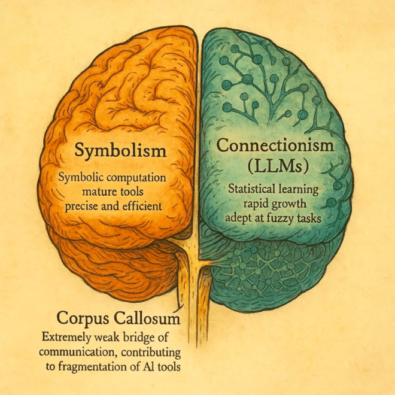
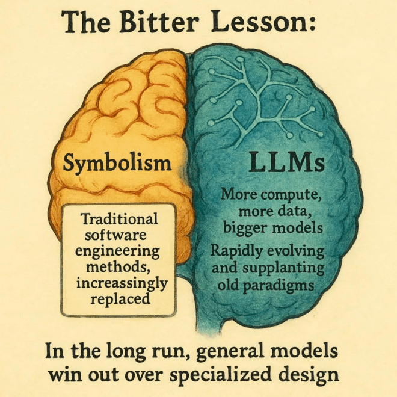
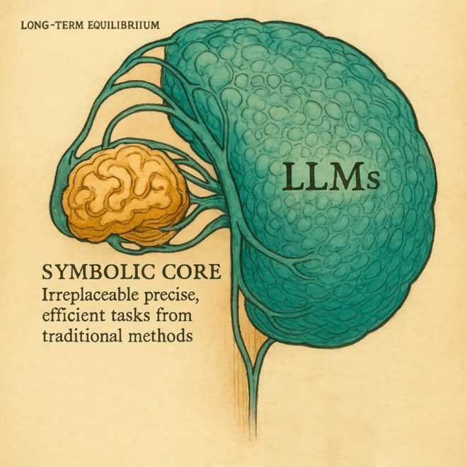

# 苦涩的教训的边界

> 日期: Post date
March 28, 2025

> 原文链接: https://ai.farmostwood.net/boundary-of-the-bitter-lesson/

---


	
	

		
		
	

		- Post author
						
    
        
            
        
    

					
					
						By [木遥](https://ai.farmostwood.net/author/farmostwood/)
- [Post date
March 28, 2025](https://ai.farmostwood.net/boundary-of-the-bitter-lesson/)
- Categories
						
					
					
						In [Notes](https://ai.farmostwood.net/category/notes/)


	

	
	

	

		
			
[ENGLISH VERSION](#boundary-of-the-bitter-lesson-eng)


前几天在群里和朋友聊用 AI 写代码的痛点，我说我最大的抱怨是它在完成某些看似很平凡的任务的时候异常吃力，比如最常见的操作：把一个代码库里的某个变量全局统一改名。这个事显然开发环境有现成的接口，但 AI 只会逐个文件编辑，又慢又浪费还容易出错。这件事之所以荒谬，在于 cursor 自己就是个开发环境。换句话说，它在这件事上表现的像是那种两个部门老死不相往来的大公司，明明一个部门已经把某件事做到了近乎完美，另一个部门却对此不闻不问，非要用自己的笨办法重来一遍。


这听起来像是一个简单的可以修复的 bug，但它背后反映的是 AI 现状里一个巨大的鸿沟，这个鸿沟时时处处在各种 AI 应用里会以不同面貌展现出来。你试试看给一个业外人士（比如你的父母）解释为什么 AI 算不清楚两个数字谁大谁小，你会发现这种解释惊人地困难，因为人民群众的直觉在这里是合乎情理的：再怎么说，它自己就是个电脑，它为什么不直接算一下呢？另一个例子是我在玩 GPT 4o 生成图像的时候发现虽然模型虽然强大，但它仍然完成不好诸如「把一张风景照主体内容不动，把上面的天空再往上延伸一些」这样的 outpainting 任务，而这即使在十年前对传统图像处理来说就不是什么特别困难的问题了。


在这里，我们谈论的实际上仍然是自人工智能这个概念于1956年在达特茅斯诞生之日起就阴魂不散的「符号主义 vs. 联接主义」之争。在基于统计神经网络的大语言模型走上主流地位之前，人们一直认为基于符号计算的专家系统是通向智能最有希望的道路，几十年来的软件工程实践在这条路上已经走了足够远，常用的工具（比如传统的软件开发环境）基本打磨到了极致。直到上世纪末联接主义这个烧了几十年的冷灶咸鱼翻生，基于神经网络的大语言模型从零开始试图重写从轮子到火箭发动机的一切已有的软件工程成就。它遵循的是完全不同的生长逻辑，因此对习惯了旧世界的我们来说，它的表现常常好得莫名其妙也差得莫名其妙，有些技能近乎魔法，有些方面又笨拙得宛如一个弱智。前面所说的变量改名就是个有代表性的例子，事实上，这里的难点甚至都不在于语法解析，而在于更底层的文本替换——对旧世界来说，哪怕在亿兆级别的文本里要把所有的 A 都替换成 B 也不费吹灰之力，以至于你根本都不觉得这还是一个「任务」。但对大语言模型来说这件事天生困难，并且难度随着文本大小急剧上升。绘画也是这样，你想直接让今天的生图模型「对图片按照某些明确到像素级别的规则做某些明确定义好的操作」极其困难，它觉得整体重画一遍比较省事。对用户来说这种体验常常令人抓狂。


打一个不精确的比喻。这两种模式可以粗略对应于大脑的左右半脑。基于符号主义的左脑在过去几十年里得到了充分的发育，基于联接主义的右脑在过去十年里急起直追，并且仍然在极速进化。问题在于这两个半脑之间沟通——对应于人脑胼胝体的功能——极其孱弱，才会出现 cursor 的编程助手不知道如何调用 cursor 的编译功能这种奇葩问题。


于是人们开始引入中间层。


在现实中这个中间层会被人们冠以各种不同的称呼，有人认为自己做的叫垂直 AI，有人认为自己做的是 agent，也有人认为自己做的就只是单纯的 wrapper。但在这个上下文里，它实质上起到的总是类似于胼胝体的作用，让神经网络模型这个右脑可以调用已经高度成熟的传统软件左脑的功能来完成更复杂精细的任务。事实上，这一部分的历史欠账已经如此严峻，以至于哪怕接下来一两年里大模型本身的思考能力停止提高（并不是完全不可能），单单改善这个左右脑的对齐问题也能解锁许多前所未有的能力。在今天，如果一个人说自己在搞 AI 创业但又没有直接训练大模型，那他们的工作多半就实际上可以归属于这一类。


这当然在整体概念上是个充满机遇和潜在回报的领域。毕竟，现有的软件工程领域的应用如此繁荣，切入社会的所有方面。但值得改进和革新的方向又俯拾皆是。把现有的专业知识和大语言模型的智能结合起来，再造一次信息化革命，听起来是成千上万现成的创业机会。





但困难（以及有趣之处）在于，虽然这种泛泛而论听起来很难反驳，但你会发现对每一个具体例子而言，人们对它的价值都充满怀疑。问题的根源是这两个半脑中传统的那一个相对静止，而新的那一个每天都在变化。因此任何工作都像是在和历史（确切来说大模型的进化史）赛跑。一个近乎讽刺的事实是，如果两个人都在前年开始投身 AI 图像生成领域，一个花大量时间和金钱投入 ComfyUI 和工作流的研究，另一个两年都在游山玩水，本周 GPT 4o 发布更新之后他们仍然基本上站在同一起跑线上。换句话说，你很难说服自己（和投资人）相信，你不只是在一架上升中的电梯里做俯卧撑。


于是你会看到 Richard Sutton 的 The bitter lesson 被人一遍又一遍提起——我想不出除了 Shannon 等人的早期作品外还有哪篇短文在人工智能历史上有这么大影响力——简单地说，它概括了这样一种原则或者说是哲学：


AI 研究者总想把人类已有的专业知识经验塞进 AI。
它短期确实管用，还带来成就感。
但这么做迟早会遇到瓶颈，甚至阻碍 AI 的进步。


而真正的突破往往来自更多算力和更大的模型。


换句话说，大力出奇迹。除非你的专业应用有某些不同寻常的护城河，比如只有你自己掌握的独家数据，否则长远来看，通用模型总是能赢过专业方法。





回到上面那个左右脑的模型，这基本上就是在说右脑的成长如此势不可挡，以至于终将吞噬和取代左脑。因此任何立足于胼胝体的商业模型早晚都是失效的。或者用很多人很喜欢的一个说法：基于大模型的产品只是一个幻觉，模型本身才是产品。


当然，现实世界总是更为复杂。即使你认同 The bitter lesson 所阐述的原则，你也未必会接受这个极端的一刀切的判断。真正重要的问题在于边界何在，或者说，是否存在一些问题，即使对大模型的发展做最乐观的估计，用传统的（基于左脑的）软件工程解决方案也还是更为经济？如果这样的问题存在，围绕着它们所建立的接口就总是有价值的。


在我看来，这样的问题事实上大量存在。这篇文章开头所写的文本替换就是一个简单但有代表性的例子。你当然可能设想有一天大语言模型的 token 如此便宜，上下文窗口如此之大，以至于它真的能胜任亿兆级别的文本的文本字符替换。但它在这个问题上的效率上限也不过就是做到和传统工具一样好，换句话说，在这个问题上，左脑事实上已经掌握了 ground truth，右脑能做的只是逼近它而已。作为对照，上面举的另一个例子 image outpainting 则不然。虽然今天人们可以通过 Photoshop 一类工具做到这件事，但对它的实现几乎总是伴随着复杂的规则和需要考虑各种现实条件的工作流程，你完全可以想象有一天通用模型能够一鼓作气吃掉它。


现实中的问题几乎总是上面这两个简单例子的复杂混合。它们可能在各种层面纠缠在一起，并且由于历史的惯性并不被分别对待（因为在从前无此必要），但最终它们还是会被小心翼翼的解耦，然后分而治之。在我看来，这里才是所谓 agentic AI 领域的真正挑战：在日新月异一日千里的模型能力进化中辨认出仍然存在长远经济价值的「旧世界」的孑遗，进而围绕着它们构建人工智能接口。即使是为 AI 做带路党，也要做一名有长期利用价值的带路党。





目睹这场洪流之中新旧两个世界之间大规模的技能迁移，以及在洪流冲刷之后新的边界的浮现，可能是当下这个时刻最有意思的体验。


差不多两年前的这时候我写过一段话，后来被很多人转引过：


```
当你抱怨 ChatGPT 鬼话连篇满嘴跑火车的时候，这可能有点像你看到一只猴子在沙滩上用石头写下1+1=3。它确实算错了，但这不是重点。它有一天会算对的。
```


两年后你再访这片沙滩，那只猴子还在，但已经非复吴下阿蒙。此刻它正在充满困惑地摆弄一台袖珍电子计算器。电子计算器太小巧，显然是另一条文明路线下千锤百炼的产品，它的手指太粗太笨拙，还驾驭不了这么精致的工具。于是你充满信心——但也不无恐惧地——等待着它找到开关看懂按钮的那一刻的到来。


---


# Boundary of the Bitter Lesson


A few days ago, while discussing the pain points of using AI for coding in a group chat with friends, I mentioned that my biggest frustration lies in its surprising inefficiency when handling seemingly mundane tasks. Take the most common operation: globally renaming a variable across an entire codebase. While modern IDE already provide native solutions for this, AI assistants stubbornly insist on editing files one by one — slow, wasteful, and error-prone. The absurdity intensifies when realizing that Cursor itself is an IDE. This resembles those dysfunctional corporations where departments refuse to communicate: one department has perfected a solution, yet another department blindly reinvents inferior wheels.


This might appear as a simple fixable bug, but it reveals a fundamental chasm in contemporary AI that manifests across various applications. Try explaining to non-technical people (like your parents) why AI struggles to compare two numbers — you’ll find this unexpectedly challenging, because their intuition makes perfect sense: “It’s a computer after all, why can’t it just calculate?” Another example: when experimenting with GPT-4o’s image generation, I noticed its continued inability to perform basic outpainting tasks like “extend the sky upward without altering the main landscape” — something traditional image processing could handle a decade ago.


Here, we’re revisiting the age-old “Symbolism vs. Connectionism” debate that has haunted AI since its 1956 Dartmouth inception. Before statistical neural networks dominated, symbolic expert systems were considered the golden path to intelligence. Decades of software engineering have polished traditional tools (like classic IDEs) to near-perfection. Then connectionism resurged at century’s end, with neural models attempting to rebuild everything from wheels to rocket engines from scratch. Following entirely different evolutionary logic, these models alternate between magical competence and baffling incompetence. The variable renaming case proves emblematic — the challenge isn’t even syntactic parsing, but elementary text replacement. For traditional systems, replacing all “A” with “B” across terabytes of text is trivial, not even qualifying as a “task”. Yet for LLMs, this scales exponentially in difficulty. Similarly, getting image models to perform pixel-level precise edits remains arduous — they’d rather redraw everything. Users often find this maddening.


An imperfect analogy: these paradigms roughly correspond to cerebral hemispheres. The symbolic left brain matured over decades, while the connectionist right brain has been catching up rapidly in recent years. The crux lies in their weak corpus callosum — the connective tissue. Hence, Cursor’s AI assistant doesn’t know to leverage Cursor’s native refactoring tools.


Thus emerges the intermediary layer.


In practice, this layer wears various labels — vertical AI, agents, or simple wrappers. But functionally, it serves as the corpus callosum, enabling the neural right brain to utilize the mature symbolic left brain’s capabilities. The historical debt here is so substantial that even if model capabilities plateau (not impossible), better hemispheric alignment alone could unlock unprecedented functionalities. Most AI startups not directly training models likely operate in this space.


This presents fertile ground for innovation. Traditional software permeates every societal aspect, offering countless integration points. Combining domain expertise with LLM intelligence could spark another digital revolution, creating innumerable opportunities.


Yet the challenge (and fascination) lies in the moving target. While the symbolic hemisphere remains relatively stable, the neural counterpart evolves daily. All efforts become races against model evolution.


Ironically, someone who spent two years mastering ComfyUI workflows might find themselves neck-and-neck with a vacationing counterpart after GPT-4o’s update — like doing pushups in a rising elevator.


This brings us to Richard Sutton’s “The Bitter Lesson”. It distills a philosophical principle:


1) AI researchers have often tried to build knowledge into their agents,


2) this always helps in the short term, and is personally satisfying to the researcher, but


3) in the long run it plateaus and even inhibits further progress, and


4) breakthrough progress eventually arrives by an opposing approach based on scaling computation by search and learning.


Brute force triumphs. Unless your niche has unique moats (like proprietary data), general models eventually surpass specialized approaches.


Returning to our brain analogy: this suggests the right brain’s expansion might eventually subsume the left. Any corpus callosum based business model thus risks obsolescence. Or as many phrase it: “AI products wrapped around models are illusions; the models themselves are the products.”


Reality proves more nuanced. Even accepting Sutton’s thesis, extreme conclusions needn’t apply. The critical question: do problems exist where traditional solutions remain more economical, even under optimistic model projections? If so, interfaces around them retain enduring value.


I argue such cases abound. The text replacement example represents a simple archetype: traditional tools already achieve ground truth, while models can only asymptotically approach it. Conversely, image outpainting — though manageable via Photoshop’s complex workflows — might eventually fall to general models.


Real-world problems blend these archetypes. Historical inertia often bundles them together, but ultimately they’ll be carefully decoupled. Herein lies agentic AI’s true challenge: identifying “old world” remnants with lasting value amidst rapidly evolving models, then building AI interfaces around them. Even as collaborators with AI, we must position ourselves as enduringly valuable intermediaries.


Witnessing this grand migration of capabilities between old and new worlds, and observing the emerging boundaries post-deluge, constitutes our era’s most fascinating experience.


Two years ago, I wrote a passage frequently quoted:


```
When you complain about ChatGPT’s hallucinations, it’s like watching a monkey write ‘1+1=3’ on the beach with stones. It’s wrong, but that’s not the point. It will get it right someday.
```


Now revisiting that beach, the monkey remains, but transformed. Today, it fumbles with a pocket calculator — a refined tool from another civilization path. Its thick fingers struggle with delicate buttons. We watch with confidence — and not without dread — awaiting the moment it discovers the power button and deciphers the keypad.


		

		
	

