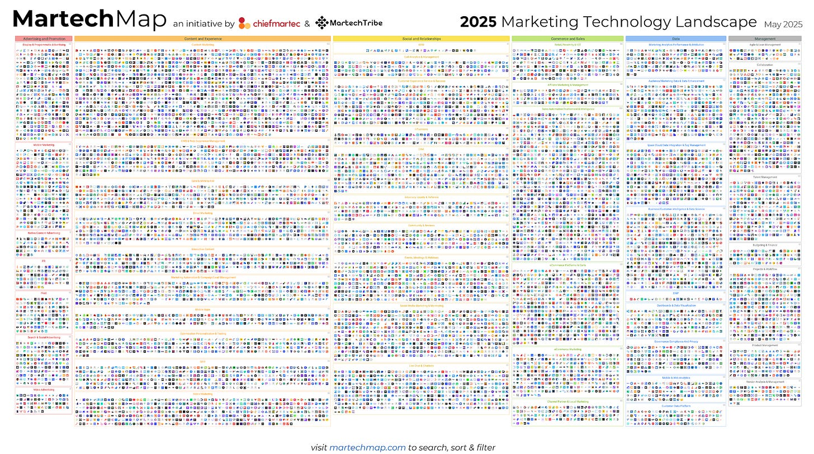
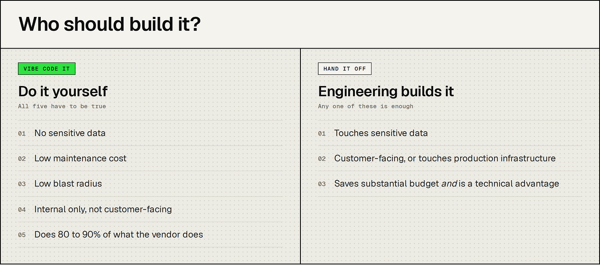

*Matt (Sentry) and Sarah (Railway) share their takes on when to build something yourself, when to reach for engineering, and when to buy software in the age where anyone can cook*

*Matt（Sentry）与 Sarah（Railway）分享他们的看法：在「人人都能下厨」的时代，什么时候该自己动手搭、什么时候该找工程团队、什么时候该直接买软件。*

> 作者: Matt Henderson | 日期: 2026-09-02T23:55:50+08:00

> 原文链接: https://hendersonmatthew.substack.com/p/build-vs-buy-marketing-tools

---

The exponential number of new vendors popping up on the annual marketing technology landscape map is getting out of hand:

每年营销技术全景图（martech landscape）上冒出来的新供应商数量呈指数级增长，已经到了失控的地步：

And yet, we’re all shipping internal tooling in parallel. AI adoption was likely a top-down priority from the CEO, Founder, or CMO this year, but how do we ensure we don’t create a tech debt problem, spend tokens/time on vibe coded tools only one team member uses, and also keep the productivity bar high?

然而，我们每个人都在为自己搭内部工具。今年，AI 落地很可能是 CEO、创始人或 CMO 自上而下推动的优先事项；但我们怎么才能既避免制造技术债、不把 token 和时间浪费在只有一个团队成员在用的 vibe coding 工具上，同时又保持住效率基准？

Experimenting and solving your most annoying problems with AI is always a good thing. And getting the whole team AI-pilled through this method is great, but there’s so many instances where a project simply shouldn’t be reached for bc it’d be better driven with an engineer or outsourced and bought.

用 AI 做实验、解决最让你头疼的问题，永远是好事。用这种方式让整个团队都「AI 上头」也很棒；但在很多情况下，一个项目根本就不该由你亲自上手——交给工程师来主导，或者外包出去、直接买，效果会更好。

> *At Sentry, everyone in marketing is operating with their own skills, their own tools, their own hosted projects. A handful of these skills and tools are duplicative of what other people have or software that already exists in the stack. We’re now starting to converge on what should be shared, how it should be, and what we’re going to keep within our existing SaaS contracts. - Matt*
>
> *在 Sentry，市场团队的每个人都在用自己的一套技能、自己的一套工具、自己托管的项目。其中有一小部分技能和工具，跟别人已有的东西、或技术栈里已经存在的软件是重复的。我们现在开始收敛：哪些应该共享、以什么方式共享，以及哪些继续留在现有的 SaaS 合同里。—— Matt*

We are going to walk through our takes on what should be built vs. bought and to start, we created a framework for deciding **who** should build internal tooling. Then, we’ll list out common categories of marketing technology and share each of our POVs on whether it’s worth building or buying.

接下来我们会逐一展开各自的看法：什么该自建、什么该购买。开始之前，我们先用一个框架来判断**由谁**来搭内部工具。然后我们会列出营销技术中常见的几类工具，分别说明我们认为它值得自建还是值得购买。

## Framework for who should build / 关于「由谁来搭」的框架

Creating an internal system for building can help drastically improve likelihood that tool will be maintained and used widely.

建立一套内部的开发体系，能大幅提高工具被持续维护、并被广泛使用的可能性。

> *At Railway, we have an internal MCP that’s borderline god within the organization. It holds a shared set of skills, tools, guardrails, and the like so anyone using it can create internal tooling safely. Beyond safety, it holds guidelines for things like brand design and architecture specs so our internal tooling is pleasant to look at. This setup is possible because: we have a highly technical team; we spend a lot of effort perfecting our tooling; we’re still under 50 employees. - Sarah*
>
> *在 Railway，我们有一个内部 MCP，在公司里几乎被奉为「神明」。它承载了一套共享的技能、工具、护栏等等，任何人用它都能安全地创建内部工具。除了安全，它还包括品牌设计、架构规范之类的准则，让我们的内部工具看起来也赏心悦目。这套机制之所以能成立，是因为：我们有一支技术能力极强的团队；我们在打磨工具上投入了大量精力；而且我们目前员工数还不到 50 人。—— Sarah*

But knowing when to reach for eng help and knowing when to DIY could save you many hours and wasted resources/tokens. So we came up with a general framework:

但知道什么时候该求助工程团队、什么时候该自己动手，能帮你省下大量时间，以及被白白浪费的资源和 token。于是我们总结出一套通用框架：

Occasionally a customer-facing vibe-coded tool could be *fine*. Maybe it’s a survey tool or template creator that lives on your website. but customer facing tools always need more scrutiny.

偶尔，一个面向客户的 vibe coding 工具也可以是*可以接受的*。也许它是挂在官网上的问卷工具或模板生成器。但面向客户的工具永远需要更严格的审视。

Ok with that out of the way, let’s get into each decision on whether to build or buy a tool for marketing. We both went through 8 scenarios and separately flagged if we’d build or buy that marketing software or system.

好，框架讲完了，我们来逐项看每个营销工具该自建还是该购买。我们俩各自过了一遍 8 个场景，并分别标注了会自建还是会买这套营销软件或系统。

## Build vs. Buy: marketing decisions / 自建还是购买：营销工具上的取舍

1. CRM / 客户关系管理系统（CRM）

  1. Sarah - **buy.** an automation-forward CRM (like Attio) so you can use it as a datastore and build reporting on top of it. Salesforce may be a necessary evil at scale, as much as I hate to admit it. / 莎拉——**买**。选一个以自动化为核心的 CRM（比如 Attio），你就能把它当数据存储来用，并在它上面搭报表。规模做大之后，Salesforce 可能是个「必要的恶」，虽然我很不想承认。  
  2. Matt - **buy.** Salesforce, HubSpot, etc. They have so many integrations that make life easier and the customer data becomes actionable. Google ads conversion passthrough, sales tools like Gong integrate, ops workflows are automated, reporting on opportunities is out of the box, etc. Don’t build this. / 马特——**买**。Salesforce、HubSpot 之类的。它们的集成多到能让日子轻松很多，客户数据也变得可执行：Google Ads 转化回传、Gong 这类销售工具对接、运营流程自动化、商机报表开箱即用，等等。这个东西别自建。
2. CMS / 内容管理系统（CMS）

  1. Matt - **build**. This is one marketing technology I see dying off over the next two years. Everyone wants to edit their website in code now that LLMs like Claude make this 10x easier to update pages, spin up new ones, utilize skills as templates, etc. One great engineer working to create guardrails, scalable systems, etc. will enable the rest of the team to build it all out and move faster. I wrote more on our website migration out of a CMS [here.](https://substack.com/home/post-p-199627523) / 马特——**自建**。这是我认为未来两年会逐渐消亡的一类营销技术。既然 Claude 这类 LLM 让更新页面、新建页面、把 skills 当模板用等操作都容易了 10 倍，现在所有人都想直接用代码编辑官网。让一位优秀工程师去搭护栏和可扩展的系统，团队其他成员就能把整套东西自己搭出来、并跑得更快。关于我们从 CMS 迁出官网的经历，我[这里](https://substack.com/home/post-p-199627523)写得更详细。  
  2. Sarah - **build** but only if you have good design AI guardrails, are ready to vibe code your website, and have an eng-forward GTM/marketing team. Without those 3 things, your website is going to look like AI slop. / 莎拉——**自建**，但前提是你有良好的设计类 AI 护栏、准备好用 vibe coding 的方式做官网，并且有一支工程导向很强的 GTM／市场团队。少了这三点，你的官网看起来就会像 AI 生成的垃圾（AI slop）。
3. Audience data platform / 受众数据平台

  1. Sarah - **build** full stop. Any audience tool I’ve used is great at first, but hits a wall after a certain amount of customization. Your ICP is your company’s secret sauce and getting it right is a competitive advantage. / 莎拉——**自建**，没有商量余地。我用过的任何受众工具，一开始都很好用，但自定义到一定程度就会撞墙。你的 ICP 是公司的独门秘方，把它做对就是竞争优势。  
  2. Matt - **depends**. One of the tools I built in an afternoon allows you to define your ICP, then it will create thousands of youtube video URLs that you can use as targeting in google ads for youtube ads. But tools like Clay (for B2B) exist to create ICP accounts, enrich, and find identities. So I’d build what you can, then use cheap, proven tools for the rest. / 马特——**看情况**。我花一个下午搭的一个工具，可以让你定义自己的 ICP，然后生成成千上万个 YouTube 视频 URL，用来在 Google Ads 里做 YouTube 广告定向。但像 Clay（面向 B2B）这样的工具，存在的意义就是创建 ICP 账户、做数据补全和身份查找。所以我倾向：能自建的部分自建，剩下的用便宜、经过验证的工具。
4. BI tools / BI 工具

  1. Sarah - **buy** because it’s a PITA to build. Just ask the Omni team how long it took them to implement all the quirks that come with editing charts, or the Hex team how long it took to get their AI query agent right. There is no competitive advantage to having your own BI tool, and the requirements are fairly standard across different organizations. / 莎拉——**买**，因为自建实在太折腾。去问问 Omni 团队，把编辑图表那些千奇百怪的细节都做出来花了多久；或者问问 Hex 团队，把 AI 查询 Agent 调对花了多久。自建 BI 工具没有任何竞争优势，而且不同组织的需求其实相当标准化。  
  2. Matt - **buy** because you need a data eng team to correctly make a scalable database and logic behind the scenes. The business will run on that, but build your own dashboards for blind spots like social listening data, or AI visibility data. Anytime you log into a separate tool for reporting, ask yourself if you could just build something to automate that. / 马特——**买**，因为你得有一支数据工程团队，才能在背后把可扩展的数据库和逻辑做对。业务会跑在这套东西上；但像社交聆听数据、AI 可见度数据这类盲区，可以自己搭看板。每当你登录另一个工具去看报表时，都该问自己一句：这件事能不能自己搭个东西自动化掉？
5. Emailing system / 邮件系统

  1. Sarah - **buy**. [Customer.io](http://customer.io) is the answer for any company pre-series C, and for most even after. Managing domain verification, email batch sends, DMARC policies, etc is also a PITA. Have a tool that manages the technicals, allows you to add your own design, and use it to your heart’s desire. / 莎拉——**买**。对 C 轮之前的公司来说，答案是 [Customer.io](http://customer.io)；对大多数公司来说，即使过了 C 轮也依然适用。域名验证、邮件批量发送、DMARC 策略这些技术活本身也够折腾。用一个负责技术细节、同时允许你套自己设计的工具，然后尽情用它就好。  
  2. Matt - **build**. I’m a big fan of what Resend is doing and if I had to start from scratch, I’d start there. I use it on my side projects and it works great for asking a coding agent “spin up a retention email sequence for once a customer hits 6 months of usage. Use my design system.” and it just works. Having your email templates and sequences all in code is a dream for updating. Sentry already has a well thought out and integrated system via Inflection, so I wouldn’t rip it out just to vibe code something. / 马特——**自建**。我非常欣赏 Resend 在做的事，如果必须从零开始，我会从它起步。我在自己的副项目里用它，效果很好：直接对编码 Agent 说「给客户使用满 6 个月的情况搭一条留存邮件序列，用我的设计系统」，它就能跑通。把邮件模板和序列全部放进代码里，更新起来简直是梦想。Sentry 已经通过 Inflection 有了一套考虑周全、深度集成的系统，所以我不会为了 vibe coding 就把它拆掉。
6. AEO / SEO tracking / AEO／SEO 追踪

  1. Sarah - **buy** tools like Ahrefs and Gauge, which are built to run tests at scale and scrape tools via integrations. Both have the advantage of using aggregate data to make better suggestions, use it to your advantage. / 莎拉——**买** Ahrefs、Gauge 这类工具，它们本身就是为规模化跑测试、通过集成做抓取而造的。两者都有「用聚合数据给出更好建议」的优势，善加利用。  
  2. Matt - **buy**. Build your own tools/skills/dashboards/views based on the tools you buy. Ahrefs/Profound are what we use which help me automate AI visibility and SEO reporting as well as give context to my agents to update our site. / 马特——**买**。在你买来的工具之上，再自己搭工具／技能／看板／视图。我们用 Ahrefs／Profound，它们帮我自动化 AI 可见度和 SEO 报表，也给我的 Agent 提供上下文去更新官网。
1. AB testing platform / AB 测试平台

  1. Sarah - **don’t do** except for when you reach a huge scale. Trust your convictions and run isolated tests on other platforms (like Google ads is a great place to test messaging). / 莎拉——**先别做**，除非你已经做到极大的规模。相信自己的判断，在其他平台上跑单点测试（比如 Google Ads 就是测试文案的绝佳场所）。  
  2. Matt - **build** a simple directional tool if you have your website in code (before/after analysis). Don’t buy until you reach a scale that matters. [Statistical significance calculators](https://abtestguide.com/calc/) exist so you could test the amount of sessions and conversions you get to see if a tool would even be able to make good decisions for you. / 马特——如果你的官网已经在代码里，就**自建**一个简单的方向性工具（做前后对比分析）。在规模真正重要之前不要买。现在有[统计显著性计算器](https://abtestguide.com/calc/)，你可以先用自己拿到的会话量和转化数算一算，看一个工具究竟有没有能力替你做出好的判断。
2. Attribution system / 归因系统

  1. Sarah - **build** - a [waterfall attribution algorithm](https://sarahsnewsletter.substack.com/p/marketing-attribution-a-guided-map) will get you really far. Sure, things like MMM exist, but unless you reach huge scale, you won’t have the numbers to make the investment worth it. Run timed tests, fail fast, and iterate. / 莎拉——**自建**——一套[瀑布式归因算法](https://sarahsnewsletter.substack.com/p/marketing-attribution-a-guided-map)就能带你走很远。MMM 这类方法当然存在，但除非你规模极大，否则数据量撑不起这笔投入。做限时测试，快速失败，持续迭代。  
  2. Matt - **build**. I worked with my BI team to write the SQL logic that we still use. I talk about ways to measure top of funnel [here](https://hendersonmatthew.substack.com/p/what-weve-learned-spending-70-of) based on how we spend 70% of our budget on awareness efforts. / 马特——**自建**。我和 BI 团队一起写的那套 SQL 逻辑，到现在还在用。我们把 70% 的预算花在认知度建设上，基于这一点，我在[这里](https://hendersonmatthew.substack.com/p/what-weve-learned-spending-70-of)聊过漏斗顶端的衡量方式。

## Navigating tool decisions / 如何做工具决策

Interestingly enough, we both did this exercise separately and we disagreed on very little.

有意思的是，我们俩是各自独立做这个练习的，结论上的分歧却极少。

- Everywhere we said “build” was a category where the vendor is selling you a schema, a UI, and a set of integrations on top of data you already own: audience data, attribution, dashboards, the content layer of your site. You’re more buying someone else’s opinion about how your data should be shaped and how to automate on top of it, but now you can set up that system yourself. / 凡是我们说「自建」的品类，供应商卖的其实是：在你已经拥有的数据（受众数据、归因、看板、官网的内容层）之上，加一层 schema、一个 UI 和一组集成。你买到的更多是「别人对你数据该如何组织、该如何在其上做自动化」的意见；而现在，这套系统你自己就能搭起来。
- Everywhere we said “buy” - it was a category where the vendor does something hard and boring on your behalf: deliverability, compliance, uptime, a crawler fleet, integrations that break every time a partner ships an API change. / 凡是我们说「买」的品类，都是供应商替你做那些又难又枯燥的事：送达率、合规、可用性、爬虫集群，以及每逢合作方改动 API 就会崩掉的那些集成。

When evaluating vendors for future decisions or renewals, we put together a few practical questions you can leverage:

在为未来的决策或续约评估供应商时，我们整理了三个可以直接拿来用的实际提问：

- If you cancel tomorrow, what breaks, who notices, and how long would it take to replace it in-house? If few would notice and you can build, there’s your answer. / 如果明天就取消，什么会坏掉？谁会注意到？要在内部替换它需要多久？如果很少有人会注意到，而你又搭得出来，答案就很清楚了。
- Is what you like the product, or the data you’ve put in it? If it’s your data, find out today what it costs to get back out. / 你喜欢的究竟是这个产品，还是你自己填进去的数据？如果是你的数据，今天就该弄清楚：把它拿回来要付出什么代价。
- Could you get an API/MCP version of the product that would enable you to build LLM workflows rather than log into a walled UI? If so consider tradeoffs (think [dataforSEO](https://dataforseo.com/) vs. a SEO platform). / 你能不能拿到这个产品的 API／MCP 版本，从而不必登录一个封闭的 UI，而是直接搭建 LLM 工作流？如果可以，就要权衡取舍（想想 [dataforSEO](https://dataforseo.com/) 对比一个 SEO 平台）。

You won’t win or lose based on the tools you choose. You will, however, win or lose based on the speed at which you can implement strategies you write down. Tools help you make good decisions, but your *internal* tools help you implement those decisions.

决定胜负的不会是你在工具上的选择。真正决定胜负的，是你把写下来的策略落地执行的速度。工具帮你做出好的决策，而你的*内部*工具帮你把决策真正落地。

If you’ve replaced something on this list with an internal tool, or tried and rolled it back, we’d love to hear about it. Drop a note in the comments.

如果你用内部工具替换了这份清单上的某个东西，或者试过之后又回滚了，我们很想听听你的经历。欢迎在评论区留言。
