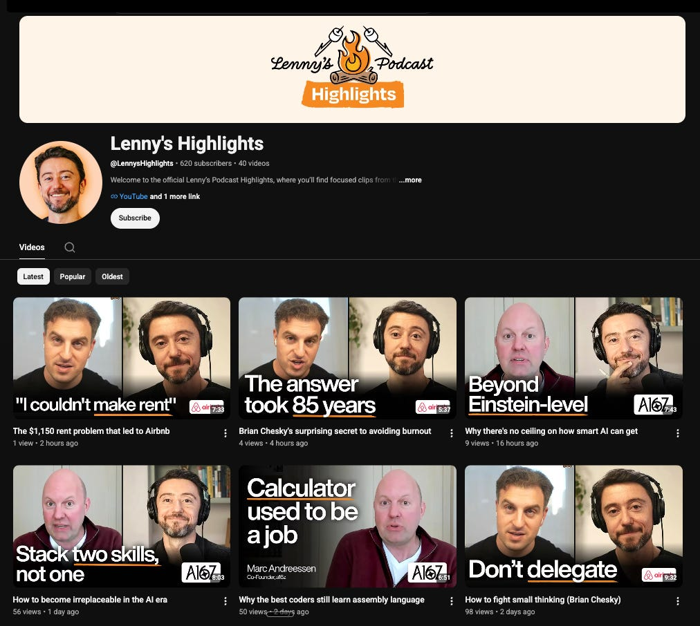

# 🧠 Community Wisdom: Building without clear PM requirements, selling a product before building it, pricing fast-moving B2B SaaS, a year of job hunting, and more

*Community Wisdom 199*

> 作者: Kiyani | 日期: 2026-08-30T02:59:48+08:00

> 原文链接: https://www.lennysnewsletter.com/p/community-wisdom-building-without

---

---

*A big thank-you to this month’s community sponsor, Matic. Matic is the robot vacuum and mop that earns its place in your home, cleaning with the obsessive thoroughness you’d do yourself if you had the time. Built with on-device AI and privacy-first design (no cloud cameras, no babysitting), it learns your floors, avoids messes other robots smear, and handles edges, corners, and transitions without supervision. A little presence with personality, one you’ll actually want around. Matic is giving away a full year of free bags to Lenny’s Community members—check it out here!*

---

## 📆 Upcoming meetups

Upcoming community-organized meetups—click the city name to RSVP:

- **Almaty**. September 2nd. Thanks to** @Rusty**
- **Amsterdam**. September 2nd. Thanks to **@Adriana Mosnoi**, **@Ruslan Doronichev** & **@Luke Rynne Cullen**
- **Asheville**. September 23rd. Thanks to **@Nathan Phillips**
- **Atlanta**. September 10th. Thanks to **@Ravish C.**
- **Bali**. September 26th. Thanks to **@Veronica**
- **Barcelona**. September 17th. Thanks to **@Marc Bisbal**
- **Berlin**. September 4th. Thanks to **@Sarah**
- **Boston**. September 17th. Thanks to **@Mohammed Azhar**
- **Buenos Aires**. September 2nd. Thanks to **@Andrei Ovcharenko**
- **Charlotte**. September 3rd. Thanks to **@Barton Holdridge**
- **Denver**. September 9th. Thanks to **@Matt Dwyer**
- **Detroit**. September 24th. Thanks to **@Ryan Baik**
- **Lisbon**. September 14th. Thanks to **@Gabriela Naumnik** & **@Nina Un**
- **Long Beach. September 17th. Thanks to @Raphael Sisa** & **@Evan Goldin**
- **London**. September 15th. Thanks to **@Maria Busmayer** **(Revolut)** & **@Shray Jain-Surana**
- **Luxembourg**. September 10th. Thanks to **@Tzu-Ting Wang**
- **Milan**. September 30th. Thanks to **@Daniele** & **@Subir**
- **Munich**. September 29th. Thanks to **@Iulia Moroti**
- **New York**. September 16th. Thanks to **@Aayushi Kapadia** & **@Zakir Tyebjee**
- **Oslo**. September 10th. Thanks to **@Jonathan Mylvaganam**
- **Portland**. September 23rd. Thanks to **@Atsushi Hisaka**
- **Philadelphia**. September 17th. Thanks to **@Keriann Sabatini**
- **Taipei**. September 11th. Thanks to **@George Chiao Chan**
- **Tokyo**. September 15th. Thanks to **@Tomo**
- **Toronto**. September 16th. Thanks to **@Jessie Wang**
- **Seattle**. September 24th. Thanks to **@Carl Vellotti**

*Can’t find your city and want to host one? Just DM @Riya in our Slack. Learn more here.*

---

## New YouTube channel: Lenny’s Highlights 💥

Lenny just launched [a new YouTube channel](https://www.youtube.com/@LennysHighlights) where he shares focused clips from his longer podcast episodes. Each clip goes deep on just one topic from the full conversation, making it super easy to find bite-sized nuggets of wisdom.

If you’ve ever wanted a specific answer from an episode without listening to the whole thing, this channel is for you. **Subscribe here**.

---

## 🎁 A free month of Grok Bot

Lenny has partnered with SpaceXAI to give every Lenny’s Newsletter paid annual subscriber one month of Grok Bot for free.

This is the first time SpaceX has partnered with anyone like this, and Lenny is thrilled to make this amazing product available to more people.

**If you’re already an annual subscriber, grab your deal at LennysProductPass.com and search for “Grok.” **If not, [upgrade here](https://www.lennysnewsletter.com/subscribe).

Lenny’s been hooked on Grok Bot since before it came out, and his usage has only gone up. Seriously, it’s really, really good. **Get your free month here.**

---

# 🎙️ New podcast episodes this week

**How to close $100K+ enterprise deals, step by step | Jen Abel (co-founder of JJellyfish and GM of enterprise sales at State Affairs): YouTube, Spotify, Apple Podcasts**

**I spent $20,000 on Devin in a month. Here’s what I learned | Ryan Carson (five-time founder, solo founder of Untangle): YouTube, Spotify, Apple Podcasts**

---

# 💥 Top threads this week

## 1. Can engineers build without clear requirements from their PM?

> **Has anyone implemented effective situations where engineers are building without needing clear requirements and asks from their PM? I see how this could enable speed, but also see some material risks to this mindset and MO, so curious if there are effective and safe ways in which this can be done. ↗**
> **—Olivia Cameron**

**BD: **I know PostHog has a [uniquely engineer-led way of building product](https://posthog.com/newsletter/product-management-is-broken), with PMs working a bit differently than inside other orgs. I’m not from PostHog, but maybe someone who is can chime in.

**Griff: **Yes, but that just means the engineering team members are playing the role of PM.

**Sean Rockwood: **It depends on what you’re building. Cursor, PostHog, Anthropic and Linear are infamously flat/non-PM led, but in those cases the builder *is* the user, so they don’t need market insights, research etc.

Very different when you’re serving a unique ICP.

**Olivia Cameron: **Yeah, this is in a healthcare company selling B2B2C products.

**Barada: **If you are working closely with businesses, it’s always better to have a PM in the loop. The role understands consumer needs carefully and is able to translate into a language for building that is interpretable by consumers as the product scales.

The language of engineering rarely translates to business language unless the product is selling to other engineering teams.

**Keith Porter: **I ran this as an experiment with mixed success. We paired 5 engineers directly with internal SMEs from appropriate teams (Solutions, Success, Support, Ops) and gave each pairing a “vision doc” that pointed them in a particular direction and asked them to work directly together to experiment and figure out the best way to fulfill that vision. What went well: lots of very rapid and pretty cool prototyping and lots of “oh yeah, I can just patch that little frustration” fixes to the main platform along the way. What didn’t go as well: engineers didn’t feel like they had any idea wtf they were supposed to do day-to-day, and SMEs struggled to graduate out of “fix this specific issue I experience daily” to “here’s a new way of approaching the end user’s daily life”. That was a ~2-month experiment, and in my opinion I would continue it, as the benefits were strong and the shortcomings were coachable.

**Hunter: **It’s a good way to build the wrong thing quickly, or the right thing quickly. Eng is definitely more effective when brought in early for direction beyond just feasibility, but you do need that connection to the customer somewhere. Generally speaking, as others have said, this ends with a Tech Lead type being a de facto PO/PM. You can build people for this role internally through promotions through Support or Success, or hire staff+ product engineers directly.

**Dan Gent: **The way I’ve seen this tackled is not by implementing a situation where there’s an engineering team that has to work without a PM but instead encouraging “product thinking” in your engineers.

This basically means getting them to think like a PM, ask why, go and clarify requirements or translate requests into problems they can solve.

It will sometimes work and sometimes not because people are different, some just want to do tech, but the ones that show promise here and could become more valuable will reveal themselves.

No affiliation, but we got the team to read [Product Driven](https://productdriven.com/) by Matt Watson and then had sessions where we discussed the issues raised.

You may still need a PM—but you might need them less and they might be adding value on top of a team that’s already able to shape things well.

**Hunter: **This is basically shift-left for Engineering haha.

And agree with the above—engineering can take over product tactics, allowing PMs more strategic breadth.

I find the PM shift-right where they get pulled into the weeds (the opposite of this, PMs shipping prod code) to be the corresponding antipattern.

**Katrina Collins: **I only experienced it once and in a startup environment where we were a team of 5 and at that time I was a QA. We didn’t have PO/PM and most decisions were made by dev + QA based on the market feedback, research or investors expectations…

I do think that today PMs should be able to vibe code their ideas using skills/plugins designed by developers for more aligned code generation with code reviews and optional QA…

**Joseph Chekanoff: **Our team has more developers than product managers, so we’re pulling the engineering talent closer to requirements and seeing success with that. Because they know the product’s technical details (stack, debt, other cobwebs), they’re able to work with Matt Pocock’s [Grill](https://github.com/mattpocock/skills/blob/main/skills/productivity/grilling/SKILL.md) skill to write better plans.

**Josh Herzig-Marx: **So... I generally don’t have my PMs write PRDs or other requirements. I’d have them take responsibility at the Epic level and then have the engineers decompose into requirements/stories/whatever.

This isn’t the same as “engineers build without needing clear requirements”:

1. Engineers *never* have clear requirements. Those are our white whale, our El Dorado, our Grail. Requirements are [clarified through conversation](https://jhm.fyi/p/better-conversations-perfect-docs).
2. This is just forcing the conversations earlier in the process but in fact reinforces the cross-functional goal of having the entire team participate in developing requirements.

(In rereading my article, sad now I missed the opportunity to say “the map is not the territory.”)

**Julie Kopp: @**Olivia Cameron, in my experience in healthcare B2B2C, it is important to establish context and the user and customer experience. The PM and designer both help to provide the context and the outcome we are working to deliver. There is often a Payer/Employer/Health System experience, a Patient experience, and possibly a clinician experience. There are a lot of regulations and privacy issues to incorporate as well.

I’ve also led product orgs where we focus on the problem definition, discovery, and a lot of collaboration first. Engineers are part of this from the beginning and then we leave it up to the engineering team to define the “how”. The team aligns on the problem and a high-level scope. I have moved away from requirement documents and PRDs. It limits the innovation and creativity that we often need to solve challenging problems. When the team is working and iterating together, the results are better and the opportunities to “fail fast” can be supported.

**Jason Fletchall: @**Olivia Cameron, is your situation of having engineers w/o much guidance from PMs a temporary one or a potentially permanent one?

I ask since temporary situations like this are common IME (rapid growth with eng hired first, PM suddenly departed, etc.) and I take a particular approach. In my experience covering multiple squads while needing to backfill/hire PMs, I’ve found people within the team who could stretch into building the understanding of the customer, taking on analysis, and in some cases acting as the lead. And being transparent up front about the team needing to step up into understanding the customer and business, and trusting them to make decisions, has tended to motivate most of the team members.

I’ve still always handled escalations and some formalities like signing off on milestones, and have always been present for the team for big planning ceremonies.

**Ashley Rolfmore: **Pretty much any situation where I’ve seen this work:

- The engineers have access to user research results and take an active interest in the userbase. This includes API platforms where the user profile is “someone who is writing code to make calls to the API”.
- Designers and/or are domain experts are embedded in the team if necessary, or are on easy access (finance, infosec).
- The overall knowledge landscape is relatively clean and stable *or* it’s easy to model, e.g. it’s B2C or, if it’s B2B2C, it’s very clear who all the audiences are and the playbook of which one wins if there’s a conflict, or it’s a company where the details of the sector are well known and it’s a greenfield module/product for the same users.
- The product management area is scoped to remove a lot of the commercial elements affecting build decisions, e.g. pricing, GTM, external partners. So ideal candidates tend to be: internal products, SaaS where pricing is handled by a group function, and so on.

I think weirdly the last one is the most important—the commercial awareness is extremely rare to find—even in product managers (!).

**Olivia Cameron: **Thank you all, this has been really useful.

@Jason Fletchall to answer your question—it’s not a coverage question, we have PMs on these teams. It’s an ownership question: where the lines sit between product and engineering.

Follow-up for the group on that—my default (stated slightly reductively for brevity) is product owns the why and what, eng owns the how, and the when is a joint conversation. The what gets shaped by joint conversation too, that’s where the best thinking comes from, but at some point someone has to make the call and that’s where ownership matters. Curious whether that matches how others operate, where people have seen it drawn differently and work well, and how this split holds up now that building is becoming a shared capability through AI. Are you seeing the lines blur, or doubling down on defined ownership boundaries?

**Josh Herzig-Marx: **I think that’s both a clear and a common perspective.

The only reason I don’t always use that (even though I think it’s correct) is the observation that handoffs are where the struggle happens and where teams fail. So I try to reduce the handoff (by pulling engineering in as early as possible) and accelerate it (by having engineering be the ones who decompose Epics into user stories/tasks/whatever.

**Julie Kopp: **I agree with @Josh Herzig-Marx’s well-stated summary. Unfortunately, the friction comes when engineering teams are used to having everything defined for them (e.g. PRD). The more they own the definition of the “how” and even the “what”, the more you’ll get closer to the ideal you defined. It’s usually much more nuanced, and that is where your strong leadership and collaboration skills come in.

**Ashley Rolfmore: **I’ll have to go find the comment where I mentioned this before, but I recall a fireside chat at a conference (2018—8 years ago!) with two panelists accidentally falling into two sides of this argument:

- If the engineer doesn’t care, they don’t belong in our organisation
- If you assume these types of engineers can be managed in a certain way, with certain scopes, you can still get good work at the end

But most of us work in teams where we have less influence over the engineering leadership—so more below on that!

If you have a team that has been historically incentivised to rely on a heavily detailed PRD (or equivalent), and you are moving them to a model where it’s more fluid, I’ve done some things to help:

- Take the fall if there’s a misunderstanding, volunteer that you’d be doing this up front. What you’re actually building here is trust that together, you will work it out. And that PRD is a safety net for their own job right now. You need to demonstrate that you trust them, and that you know it will take them a while to get there, and they need to trust you that you both will work it out without it hitting random performance reviews or equivalents if there’s a misunderstanding.
- Enlist the more junior members of the team for pilots—they’re usually keen to own something, and are less entrenched in “shoulds”.
- Get them demoing more often—to each other, to colleagues, etc.
- Add “digests” of customer research into the daily standup—let that transparency slip through.
- There will inevitably be code barriers to achieving this—tech debt, team skills don’t collate around a whole user story easily, and so on. Ensure you have an ally somewhere to help you move those areas.

If you haven’t already given [User Story Mapping](https://www.oreilly.com/library/view/user-story-mapping/9781491904893/) a go, it’s a nice format to “kick off” that dialog. It will, however, fail if they’re missing customer and user context… so start to get that seeping into the group (or big bang learning as part of a planning sprint).

(I mention these because they’ve worked for me, across a few teams now—I can offer specific examples in DM if you’d prefer.)

**Josh Herzig-Marx: **Super-actionable advice. Nothing to add. No notes.

OK—one note:

The analogy I keep in my head and sometimes use is to think of this empowering of engineers and moving them “leftward” is a team skill. That helps me remember that we shouldn’t expect to be good at it in the beginning. In fact, we should expect to be bad at it! But if we keep practicing, we’ll see improvement. (This is to head off the too-common “We tried it once, it wasn’t a success, let’s try something else” or the inevitable, “Josh is bad at this, and he’s part of the team so there’s no reason the rest of us should keep working at it.”)

**Jeevan Patil: **From my experience, this works if the feature that the engineering team is building is either incremental or experimental (proof of concept). If it is a completely new experience, new product, a different market segment with different persona and/or strategic in nature, having a PM rigor and prioritization is a must. Otherwise PMs are relegated to working with legal, finance, support and outbound/GTM.

**Josh Herzig-Marx: **Seems relevant and worth sharing John Cutler’s excellent Startup Motions list: [publish.obsidian.md/cutlefish/Startup+Motions](https://publish.obsidian.md/cutlefish/Startup+Motions). Find your own!

## 2. Selling before you’ve built the product

> **Has anybody actually sold repeatedly to prospects who demonstrated ***pull*** (aka demonstrated demand to pay to solve a project they’re currently blocked from making progress on), while only offering a deck as the supply and without having built a product (ideally one that cannot be offered as a service)? What was that process like for you?** **↗**
> **—Jason McCoy**

**Kevin Holland: **Genuinely hopeful + curious—I’m reworking two demand hypotheses right now while reading Power of Pull.

**San Gunawardana: **I’ve seen what I think you’re describing done in both hardware and enterprise SaaS, but every one required a heroic amount of credibility and 100% derisked terms (100% refundable no questions asked, termination for convenience, etc.).

If I’m interpreting your question correctly, then I’d expect this is how all the electric car companies get their start/launch new models..?

**Jason McCoy: **Electric cars seem like an entirely different category. I’m thinking more of traditional SaaS for B2B.

**Josh Herzig-Marx: **I have! Only once and it was a long time ago. It was selling a marketing and analytics tool to a small grocery chain, and we did it on the basis of our pitch and our smile.

On a smaller scale, I’ve done this for existing products where we’re adding required (“required”) functionality.

Arguably, I did this at Google as well when launching commerce products to retailers (you’d think Google’s name would bring credibility, but to retailers it was the opposite). (I say arguably, because while there were contracts, there was no cash payment. That said, our customers/partners still experienced it as expensive.)

The thing all of these had in common were contracts where payments didn’t begin until the service was being delivered. Like, we’d sign and negotiate a real contract, but terms only began on the day they could begin using the product.

It was a *great* way to know if you really had pull... and a pitch is maybe the best MVP.

**Dmitry Trofimets: **Yes, through paid pilot—never lying that it’s almost built or smth, just admitting that it’s in the works, you’re early, *but* you get to direct the engineering as if you were building this for yourself. Even with vibe coding, it’s actually better to have someone actually think about the product hard enough and not you having to do it yourself.

**San Gunawardana: **Similar to above responses, I’ve done it in enterprise SaaS. IME to do this you’re finding people who genuinely know you don’t have the product yet but are excited to join you for a journey. They also need to have absolute conviction that you can deliver (ideally by having an amazing track record of having done the same thing previously for others). And you still need to 100% derisk it for them financially. It’s a really high bar to clear, and I don’t know how well it’d work outside of enterprise.

## 3. Pricing a fast-moving B2B SaaS product without SKU sprawl

> **Hi all! Does anyone have advice on pricing for a rapidly developing B2B SaaS product?**
> **For context, I recently joined an early-stage start-up here in the UK. We’re in a relatively niche market and are starting to saturate it, so our growth strategy relies on both expanding into new markets and increasing the ACV of our existing customer base. Our current pricing approach consists of a combination of a fixed monthly subscription fee + usage credits, with overage pricing above plan limits. It works well since it flexes with value delivered.**
> **Our challenge is that we ship a meaningful new capability every 2-3 months and want each release to lift ACV without having everything as a bolt-on (and therefore overcomplicate our offering). Has anyone navigated pricing a growing product suite in a way that grows ACV over time without turning into a sprawling menu of add-ons/SKUs? Really curious to hear what’s worked (and what hasn’t!), especially at a similar stage.** **↗**
> **—Riley Orabona Wagner**

**Mike Lembo: **Funnel the new SKUs into an existing meter like your “usage credits”.

Otherwise you can bake it into your monthly. Customers will inevitably have issues with monthlies creeping up, but so long as there is willingness to pay for what you are shipping, you should also see them accept the updated pricing.

**Jon Belluomo: **Hey @Riley Orabona Wagner, for the customers I work with in the B2B tech sector, we like to look at total costs incrementally of our services across AI token usage, overhead etc. and try to bucket total costs to our customers as an all-in cost. Yes, your overhead will go up over time, but the market is getting tired of getting charged on a per-usage basis. Best to charge a bit higher to likely cover your costs/maintain margin and lump an increase every 6 months with reason. Seems like your customers are larger so they may put in guardrails in your terms/conditions for price certainty too, so less constant volatility in pricing, the better.

**Tamara Ceman: **Are you selling to small, mid, or enterprise?

I’ve been through a few similar scenarios in the past few years, and there’s definitely a double-edged-sword nature to fast development, but the grade depends on the size of the company typically (which dictates the purchasing mindset), as well as depth of pre-development communication (e.g. if the new features come from customer interviews as a validated need vs. somewhere else).

**Lucinda Musa: **For the monthly subscription, you can still have annual contracts for that and then raise the price for the next renewal. Then for new customers, start with the increased price. It’s very common for customers who got there first, you’ll have lower margins as the product improves and make it up as they renew (assuming annual contracts work for your customer; it usually does for enterprise or mid-market).

You can also update positioning to say “you’re buying the team and roadmap, in addition to the product today” to anchor customers for future price increases.

Honestly, I think customers are more ok with increasing prices that are simple to understand than with complex, unpredictable prices that may be lower. Understandable pricing > low pricing. So err on the side of high all-in, not nickel and dime.

**Riley Orabona Wagner: **Thank you all for the responses! Super interesting to get your insights.

Our target customers are primarily small/mid-size companies, with most having fewer than 25 employees. They’re typically not very tech-literate beyond our software and are generally quite price-sensitive. We do a decent job of trying to flush out willingness-to-pay during our product discovery, but it’s certainly a challenge to balance pricing across different customer segments, particularly as the product grows and evolves.

**Tamara Ceman: **Oh, got it! Definitely sounds challenging. Especially for price-sensitive folks, adding too many options can actually decrease perceived value.

In other words, at some point they might start asking, “Why are we paying x when we’re using 30% of the product?” What I’ve seen work well in the past is splitting the product into core features vs. vertical/use-case-specific add-ons, with loads of testing, of course. This way, the core price remains the same, improvements to core features remain, and the added options either roll into a higher plan or are offered as an expansion, depending on the model. Again, testing is the only way to really go, so you’re doing things right.

## 4. A year of job hunting and almost no interviews

> **Hello friends, I could really use your help...**
> **I have been on the job hunt for 1 year (almost exactly). I’ve applied to hundreds of roles, updated and revamped my resume multiple times, but have had only 1 interview (direct referral from an old friend) in all of that time.**
> **I’m feeling defeated, and like I should give up being a PM. I’m unsure if this is a “me” problem or just how the market is right now. Would anybody be willing to offer some of their time to review my resume and offer some guidance? ↗**
> **—Micah Haid**

**Josh Herzig-Marx: **It’s not just you, but that sounds really frustrating. If you like, DM me your resume and we can schedule some time to talk. I’m not a career or job-search coach, but I can tell what I’m seeing and hearing from others.

**Glasha Marcon: @**Micah Haid I’m really sorry. I’m hearing this from others as well—including someone I know well. If you are looking for someone to be in good company with, let me know and I can connect you.

**David Marc Siegel: **So sorry you’re facing this. Happy to help in any way I can—but I’m willing to bet this is due to the hard environment out there right now. Cold comfort, I know—but still.

**Jason McCoy: **It’s definitely the job market. The overall hiring rate is the worst it’s been since 2008.

The combination of layoffs + AI usage + remote work applicants + decimated talent teams + ghost jobs has created the perfect storm of intense competition for very few jobs (relatively speaking).

I know folks in Product, Design, and Engineering who are all in the same boat and who all were previously very hireable.

**Sarah Maledy: **Hey Micah! I just took a look at your profile on LinkedIn. While unfortunately Jobber isn’t able to hire in Chicago, I see tons of potential left on the table in your LinkedIn page. You have a compelling mix of product, engineering, and design experience, which is a valuable “builder” profile in the market right now, and fintech specialization on top!

I would recommend spending some time building out your profile—think of it as your public, online resume. Build out each role you’ve carried, and add in your most impactful projects (especially fintech ones, with results if you have them), your work with AI, tech stack/tooling, and build out your about page with your passions and where you thrive best.

While the market has certainly shifted a ton over the last few years, there are still recruiters and hiring managers who are sourcing talent to fill their roles, and it’s very possible that your profile is simply not showing up in their searches. Some use boolean strings, but many are now using tools like Gem AI, Pin, or Metaview to source for their specific requirements.

Good luck out there. I hope you land something great very soon!

**Steven Jones: **It is a bit of a tough time out there right now, so don’t be too hard on yourself. Some ideas:

- I think it’s more important than ever to work your personal network. AI is changing the nature of hiring, and trying to get direct intros is very useful. Consider expanding this technique a little further than you might have in the past. Do you have any friends of family that may be able to make introductions (not just professional colleagues)?
- I think you could be doing more with your LinkedIn. Are you attending any events? There are a ton of interesting meetups, conferences, etc. in Chicago. You can attend those and post about what you hear to show that you are active in the community. Consider joining a local association as a volunteer so that you can throw that on LinkedIn to show you remain active. In a single weekend, you can use Claude Code and a few other tools to launch a side project so that you can showcase how you are adapting to using new tools and able to take initiative, etc.
- You have enough experience that you could also be providing some mentoring. Look for opportunities to act as a judge/mentor through programs at local schools.
- As you do that networking, make more connections on LinkedIn. That way, when a hiring manager is looking at your resume, you are more likely to show up as a 2nd degree instead of 3rd+ degree connection. I’ve got some connections in Chicago, so I’ve just sent you a request. Every connection can close the number of hops between you and a hiring manager, which is useful.

# 🤓 Top finds

**1. The Best Way to Drive Demand in Marketplaces Is Hiding in Plain Sight via Rishi
**Pretty awesome post by Dan Hockenmaier and Casey Winters on driving marketplace demand.

**2. How People Without Formal Power Gain Influence via Mirco Bianchini
**This is gold!

**3. The System of Execution: Anthropic’s $2 Trillion Bet on What Comes After Intelligence via Deb Mukherjee
**“The layer that captures organizational intent, carries authority through action, verifies results, retains context, and gets paid for accountable work.”

**4. Six days a week is not the solution via Josh Herzig-Marx
**I know this. We all know this. But we still keep making the same mistakes in how we try to run our organizations. I appreciate the thoughtful reminder:

- Diversity outperforms homogeneity
- Psychological safety outperforms fear
- Focus outperforms hours

# 😂 Meme of the week

*via Justin Goff*

*Have a fulfilling and productive week 🙏*

---