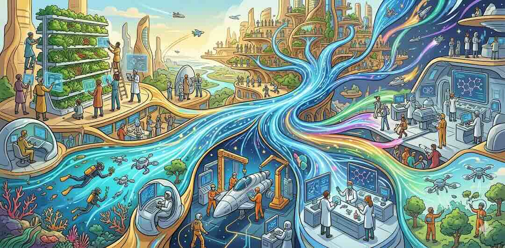
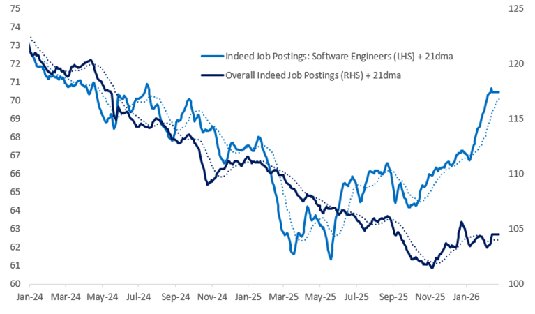
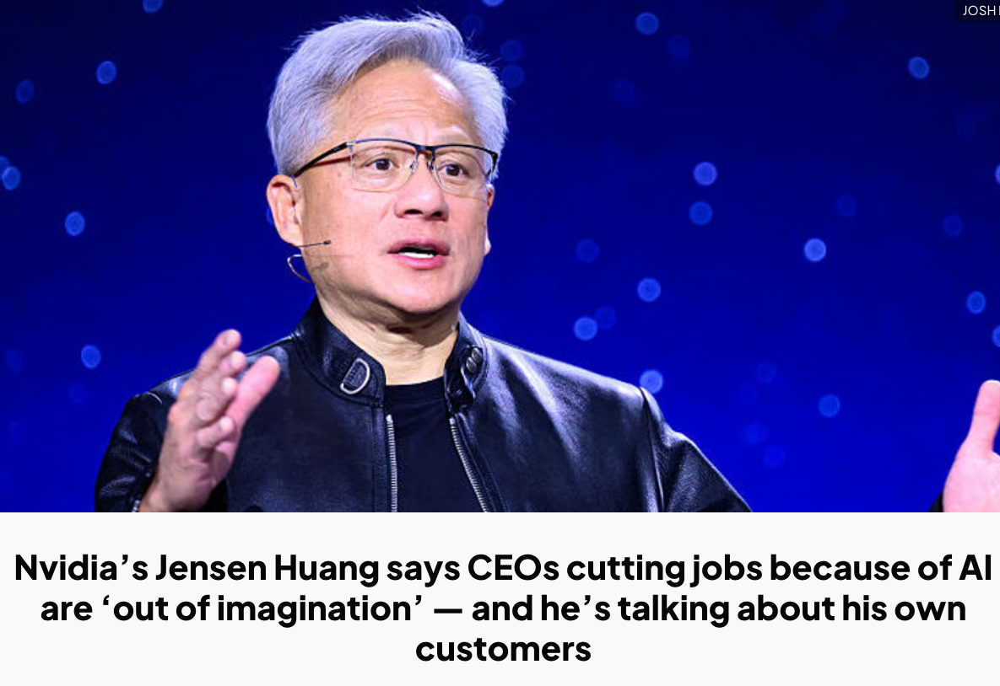

# 杰文斯悖论：AI 会增加人的工作岗位 - 得到APP

> 作者: 万维钢·现代思维⼯具100讲

> 原文链接: https://www.dedao.cn/course/article?id=m845Ln7q69yKOOoW7YKrkebvGDYjgl

---

     

   
    杰文斯悖论：AI 会增加人的工作岗位
   

 
        万维钢·现代思维⼯具100讲
       
      2026年5月31日 晚上10:43
       杰文斯悖论：AI会增加人的工作岗位 
          14分19秒
         
    转述：怀沙AI
  在我写这期文章的时候（2026 年 5 月），硅谷正弥漫着一股末世之感。虽然 AI 带动经济火热，街头歌舞升平，但很多有识之士相信这一切都是暂时的……因为他们认为 AI 会很快干掉大量的人类工作岗位。

Anthropic 的 CEO 达里奥·阿莫迪（Dario Amodei）最近就像个末日先知。他在几个场合表示 [1]，AI 将在一到五年内消灭*一半*初级白领岗位，把失业率推到 10%—20%；科技、金融、法律、咨询，尤其是其中的入门级岗位，都会中招。阿莫迪还像为民请命一般呼吁：AI 公司和政府不要再继续粉饰太平了！

 而你对此可能也有些体感。过去两年间，硅谷连续有几家大厂打着 AI 的名义裁员。有美国名校计算机专业的大学生，毕业没找着工作。有人认为初级程序员岗位已经都消失了……

但是这一讲，我要说一个暴论：AI 不但不会减少，而且会大大增加人的就业岗位。

事实上，现在已经出现了早期信号。请看下面这张图，出自城堡证券（Citadel Securities）发表于 2026 年 2 月的一份报告 [2] ——

 图中用 Indeed 岗位发布数据比较了软件工程师和整体招聘岗位的走势，其中最显眼的是，软件工程师岗位在 2025 年五、六月间，已经实现了触底反弹。

当然，新岗位发布的数目仍然比疫情前、比 2021—2022 年的科技泡沫高点都低一些，但是，这是一个很好的迹象。不是说 AI 最先干掉的就是编程这项工作吗？怎么软件工程师的岗位反而最先反弹了呢？

这很可能不是反常，而是一个经济学规律的一次完美展示，叫做「杰文斯悖论（Jevons Paradox）」。

✵

要理解其中的逻辑，咱们先回到 1865 年的英国。

英国正处于工业革命的巅峰，可是当时的人也有一种末日焦虑：支撑帝国心跳的是煤炭，蒸汽机、铁路、工厂、轮船，全都吃煤。那煤炭要是挖完了怎么办？各路天才想方设法改进技术，把蒸汽机效率提高了好几倍，都比以前省煤，于是人们设想，煤炭总消耗量肯定会降下来。

可是就在此时，一个叫威廉·斯坦利·杰文斯（William Stanley Jevons）的 30 岁经济学家出了一本书，叫《煤炭问题》（*The Coal Question*）[3]，说，你们想得太简单了。

![[William Stanley Jevons]](images/img_18_0aca5c6c.png)
*[William Stanley Jevons]*

 杰文斯的判断是：蒸汽机越省煤，煤动力就越便宜 → 煤动力越便宜，更多行业就会用它 → 更多行业用它，英国总煤耗反而会*上升*。

这就是杰文斯悖论。而历史上事实果然如此。

而且这是一个普遍规律。咱们说一个发生在中国新疆的类似的事儿。

你知道新疆很多地方是干旱的。在上世纪 90 年代，天山地区推广了农业“滴灌”技术。过去浇一亩地需要用很多水，现在省了不少。那你说，总用水量是不是就应该下降了？并没有。

农民一看既然每亩用水少了，那我为什么不多种一点？而且既然滴灌提高了单产，那我能不能再种点更赚钱的经济作物？既然收益上来了，我是不是应该多开垦一些耕地？

结果是天山地区从 1996 年推广滴灌以来，20 年间用水反弹超过 115% [4]。也就是说总用水量是以前的两倍还多。

现在 AI 消耗电力不也是同样的逻辑吗？AI 公司的算法越来越高效，英伟达的芯片一代比一代省电，单次推理越来越便宜 —— 可是数据中心的总耗电量却在疯狂飙升。

这些故事的结局应该都会很好，毕竟人没有那么容易被资源限制死。但这个道理是，原来效率不是刹车，而是油门。

✵

一旦你有了杰文斯悖论这个眼光，你会发现生活中到处都是它的影子。

比如说写作。十年前没有 AI，我自己调研、有时候甚至是读纸质书，用铅笔画大纲，然后纯手打输入，再用眼睛盯着屏幕逐行修改……如果我这一天能保持很好的工作纪律，大约要花 6—7 个小时才能写好一篇文章。那你说现在有了 AI，我可以用 AI 调研、跟 AI 讨论、用语音输入、用 AI 审稿，每一步都能省下时间，我能不能用 4 个小时写篇文章呢？

结果是出一篇文章的时间一点都没缩短，往往是更长。这是因为 AI 让我对文章有了更多的要求：我会探索更多的想法，调研更多的文献，可选的案例更丰富，文章逻辑密度更高，篇幅也更长了，我变得更计较遣词造句，偶尔还要加入插图和漫画。

如果你也用 AI 做过自己以前做的工作，你会有同感。老板不会因为 AI 帮你提速了，就说太好了，早做完早休息！老板只会说既然十分钟就能出一版，那我们先做三版看看……你左一个需求右一个想法，最终把所有工作时间填满还不够。

别的事情不也是如此吗？你用上了一个购物就返现的省钱 App，每笔消费的确都能给你省钱……结果因为购买门槛降低，你更想买买买，总花费反而增加了不少。

再比如说，现在有微信、飞书、AI 会议纪要这些应用，人与人之间的沟通成本大大降低了，那我们的会议时间是不是应该减少呢？也没有。又是拉群，又是同步，又是对齐，发起会议的门槛近乎为 0，使得会议数量反而比以前多了。

这个洞见是：当你提高效率、降低了单位资源消耗的时候，你同时降低了行动的门槛。门槛一降，原本被抑制的、甚至你都想不到的需求就会像洪水一样释放出来。

 ✵

杰文斯悖论原本说的是效率越高就越消耗资源 —— 但你只要把“提高效率”改成“自动化”，把“资源”改成“人的工作”，这个悖论就变成了：自动化会增加人的工作。

历史已经一再验证了这个规律 ——

19 世纪纺织机械刚出现的时候，有所谓“卢德分子”担心织布工要失业，就去砸机器。哪里想到布料价格暴跌的结果是普通人从只有一套衣服变成了有十几套，纺织工的数量反而大大增加了。

1970 年代，自动取款机（ATM）普及，大家都预测银行柜员将会消失。事实上单个网点需要的柜员人数的确减少了，但是因为运营成本降低，银行开始在每个街角疯狂开设新分行，柜员的总数不降反升。更重要的是，柜员不再只是“数钱的机器”，他们被解放出来去处理更复杂、更有价值的像开户、理财咨询这些工作。

快进到几年前，计算机视觉刚刚普及的时候，有学者断言放射科医生要失业了。后来的现实却是因为 AI 让看片成本大幅下降，医院开始给患者开出大量的预防性核磁共振和 CT 检查，导致扫描量激增。AI 帮医生筛选了 90% 的正常片子，而剩下的 10% 疑难杂症和最终的签字担责依然需要人类。于是现在全球范围内的放射科医生不是失业了，而是严重短缺 [5]。

类似地，电子表格没有消灭会计，而是让财务分析、预算管理、商业建模的业务扩张。搜索引擎没有消灭研究员，反而制造了 SEO、内容运营、数据分析和数字营销这些新岗位……等等等。

一个最新的例子来自中国。有个美术外包平台叫“米画师”，运作模式是需求方发布订单，比如说“我想要一个头像”“我想要一个什么样的动漫人物”，然后由画师在平台上接单。你说现在每个人都可以用 AI 画画了，是不是这门业务就不存在了呢？

恰恰相反。2022 年 10 月，因为一次知名的 AI 绘图模型泄露事件，几乎免费的 AI 绘画能力突然降临到大众手中，导致米画师上的单张图像平均价格下降了 64% —— 但是订单数量，却增加了 121%，结果是总收入增加了 56% [6]。原有的创作者没有被挤走，他们保留了大部分的市场份额，增长则主要来自过去“不值得做”的低端个人订单。

✵

这个规律不只是「价格下降 → 订单增加 → 总市场变大」，还有一个重要特点是「任务改变」。

一个岗位不是一个动作，岗位是一组任务的组合。会计不是“输入数字”，医生不是“看化验单”，律师不是“查法条”，程序员不是“敲代码”……这些岗位都包含判断、审美、责任等等不可被 AI 取代的任务，还可以包含各种因为 AI 而产生的新任务。

AI 干掉的是任务，而不是岗位。劳动经济学里早就有个「任务模型（task-based model）」[7]，说自动化确实有「替代效应（displacement effect）」，会把某些原来由人做的任务交给机器 —— 但新技术也会创造新任务，让劳动重新进入生产过程，这叫「复职效应（reinstatement effect）」。

就在 2025 年，世界经济论坛（World Economic Forum）发布一份就业报告 [8]，认为到 2030 年，全球宏观趋势预计创造 1.7 亿个新岗位、替代 9200 万个旧岗位，等于净增加 7800 万个岗位。美国劳工统计局（Bureau of Labor Statistics）也明确说 [9]，AI 可能降低软件产品价格、从而增加软件开发、AI 商业解决方案和维护 AI 系统的需求，所以预测美国软件开发人员 2023—2033 年就业增长 17.9%。

当然我们还要拭目以待。但是，站在此刻看，AI 的确在改变世界，也很有可能带来奇点 —— 但是，经济学理论和过往的历史经验并不支持“AI 会导致大失业”这个末日假说。

✵

如果要顺应杰文斯悖论的历史大势，我们就不能站在旧任务那一边，而要站在新需求这一边。咱们不妨大胆畅想一下，AI 会创造哪些新岗位。

历史经验仍然可以帮我们。简单说，当新技术把门槛降下来之后，那些过去不会做、做不起和不值得做的任务，就成了新的生意。

**第一类是直接与 AI 相关的岗位 ——**

比如「AI 工作流架构师」：不只是写提示词，而是把一个公司的销售、客服、数据、法务、财务流程改造成 AI 可执行、可审计、可追责的系统。

比如「智能体监督员」：管理一群 AI agents，让它们分工、协作、升级、复盘，像以前管理实习生一样管理机器员工。

比如「模型评测师」和「红队测试员」：专门找 AI 的幻觉、偏见、越权、漏洞和危险行为。未来模型越多，验收模型的人越值钱。

比如「知识库园丁」：维护企业内部数据、权限、语义结构、版本和来源。AI 吃数据，数据就需要厨师，还需要食品安全检查员。

比如「机器人舰队管家」：当清洁机器人、配送机器人、巡检机器人、护理机器人进入城市，总要有人负责调度、维修、异常处理和人机冲突调解。

**第二类是生活增强岗位 ——**

比如「个人学习导演」：这不是传统家教，而是用 AI 给一个学生定制长期学习路径、每日反馈、错题追踪和项目挑战。

比如「老人生活增强师」：用 AI、传感器和机器人帮老人管理用药、运动、社交、家庭联系和紧急响应。不是替代亲情，而是让亲情少一点鸡飞狗跳。

比如「微型体验策划人」：给一个家庭、一场生日、一段旅行、一个社区节日生成剧本、音乐、视觉、路线和互动游戏。过去只有大活动才值得策划，未来小生活也值得定制。

比如「个人数字档案馆员」：帮人整理照片、视频、聊天记录、文章、家族故事，做成可搜索、可传承、可展示的数字生命档案。

比如「一人电影制片人」：普通人不但可以拍电影，而且可以被拍电影。一个人带着 AI 做分镜、角色、配音、剪辑、特效，直接为一小群人、一个小家庭、一个小教育场景拍一部电影。

**第三类是信任与责任岗位，**这些任务以前就是必须的，但是现在变得更重要，以至于值得升级成专门的岗位 ——

比如「AI 输出审计师」：专门检查 AI 写出的法律文本、医疗建议、财务报告、科研摘要有没有错，错在哪里，风险归谁。

比如「人类责任签署人」：在医疗、金融、法律、教育等高风险场景里，AI 可以给建议，但最后要有一个懂业务的人签字、解释和担责。

比如「首席审美官」：AI 可以生成一万张图，但选出那张最有灵魂、最能触动人心的一张，只能靠你。

当能力变便宜，需求就会变复杂。当任务被自动化，责任就会被人格化。

✵

杰文斯悖论和鲍莫尔成本病都告诉我们现代化是个好消息。提高效率是好消息；别人提高效率你没提高，对你也是好消息。人们总会有些担心，但即便是你担心的那事儿，终究也是好消息。

杰文斯悖论更深刻的洞见是，人类社会不是爱节约的机器 —— 人类社会更像一台欲望发动机。当技术把一个门槛降低，人类不会说“够了”，人类会说“那我们还想要这个、这个和那个”。

就在 2026 年 GTC 大会期间，英伟达 CEO 黄仁勋接受采访说 [10]：「那些为了 AI 裁员的公司都缺乏想象力（out of imagination）。真正有想象力的公司应该用 AI 扩张，而不是收缩（do more with more）。」

 杰文斯会完全同意他的说法。AI 是对人的解放，而不是对人的限制。只有想象力是我们的限制。

 注释

[1] VandeHei, Jim, and Mike Allen. “AI Jobs Danger: Sleepwalking into a White-Collar Bloodbath.” Axios, May 28, 2025.

[2] Frank Flight, “The 2026 Global Intelligence Crisis,” Citadel Securities, February 24, 2026. https://www.citadelsecurities.com/news-and-insights/2026-global-intelligence-crisis/

[3] Jevons, William Stanley. The Coal Question. London: Macmillan, 1865.

[4] Wang, Yanyun, et al. “The Verification of Jevons’ Paradox of Agricultural Water Conservation in Tianshan District of China Based on Water Footprint.” Agricultural Water Management 239 (2020).

[5] UDS Health. "AI in Radiology: Why Demand for Humans is Growing 9%." UDS Health Blog, February 15, 2026. https://udshealth.com/blog/ai-radiology-demand-for-humans-growing/.

[6] Zhang, Kaichen, Zixuan Yuan, and Hui Xiong. “The Impact of Generative Artificial Intelligence on Market Equilibrium: Evidence from a Natural Experiment.” arXiv, 2023. https://arxiv.org/abs/2311.07071

[7] Acemoglu, Daron, and Pascual Restrepo. “Automation and New Tasks: How Technology Displaces and Reinstates Labor.” Journal of Economic Perspectives 33, no. 2 (2019): 3–30.

[8] World Economic Forum. The Future of Jobs Report 2025. Geneva: World Economic Forum, 2025.

[9] Machovec, Christine, Michael J. Rieley, and Emily Rolen. “Incorporating AI Impacts in BLS Employment Projections.” Monthly Labor Review. U.S. Bureau of Labor Statistics, February 2025.

[10] Huang, Jensen. Interview by Jim Cramer. “CNBC Exclusive: Transcript: Nvidia Founder & CEO Jensen Huang Speaks with CNBC’s Jim Cramer on ‘Mad Money’ Today.” CNBC, March 17, 2026.

      划重点
     
      添加到笔记
      1.杰文斯悖论：蒸汽机越省煤，煤动力就越便宜 → 煤动力越便宜，更多行业就会用它 → 更多行业用它，英国总煤耗反而会*上升*。
2.当你提高效率、降低了单位资源消耗的时候，你同时降低了行动的门槛。门槛一降，原本被抑制的、甚至你都想不到的需求就会像洪水一样释放出来。
3.自动化会增加人的工作。AI 干掉的是任务，而不是岗位。当能力变便宜，需求就会变复杂。当任务被自动化，责任就会被人格化。写笔记划线删除划线复制  
                  首次发布: 2026年5月31日 晚上10:43
                 
#### 我的留言

  
    凡哥杂谈
     ** 
      打开悬浮窗
     ** 
      全屏
          0 / 5000

        
### 用户留言

 全部 精选 筛选  - 至尊女宝
            05-31  **
      关注
          成都有很多小区今年都上线了外卖机器人，四个月送了近三万单。外卖小哥到小区门口把餐塞进去，机器人自己过闸机、按电梯、送到门口，全程五分钟。按说这样外卖小哥可能接单会变少，结果数据统计说那片的骑手不但没少，配送效率上去了，单量反而暴增了。以前一中午跑 30 单就撑死了，现在机器人和人混着干，一中午能干 60 单，还不用爬楼送门口，收入反而涨了。
---

效率上去了，配送门槛下来了，然后呢？大家点外卖的频次直接翻倍。性价比一旦够低，所有的克制都成了伪命题。配送员并没有被 AI 替代，人机协同，还有增收，只是从以前那个纯爬楼送货机器进化为调度 + 质检 + 紧急处理工，所以效率提升不是刹车反而是油门。
---

所以我们应该换个想法，不能再琢磨我这份工作 AI 能不能干得比我好，应该琢磨的是如果我手下多了一群任劳任怨、不用睡觉的 AI 实习生，我能干成什么以前不敢想的事。未来的岗位不会少，只是形态变了，离审美 + 责任 + 决策这些核心人力强项越来越近。其实大学就业难不是岗位在减少，是整个任务金字塔被重构，底层的任务被抽走后，塔尖的新任务量反而爆发，但塔尖缺的岗位还没大量供给。
---

该慌的从来不是 AI 要替我们，而是我们思考问题的方式还停留在工业时代，以前觉得效率就是一切，忘了创造力才是永远稀缺的长胜秘诀。

 
    展开
   
   
      9
      
    14
   
    186
   
      分享
          
            左星星
            05-31  **
      关注
          以前的空调很费电，家里人心疼电费，只有最热的时候才舍得开。晚上也是睡前开两小时，妈妈半夜起来，还会悄悄把空调关掉。后来空调越来越节能，我们家反而从 “睡前开两小时”，变成了 “整晚开着”。甚至有时爸妈在客厅开，我在卧室开，妹妹在书房也开。单台空调确实更省电了，但全家的总耗电量反而增加了。
---

以前家里没有洗碗机，饭后洗碗是我的任务，每天大概要洗七八个碗。后来买了洗碗机，洗碗变省事了，大家做饭也更放松：多烧几道菜，多用几个盘子，杯子也随手换。结果，洗碗这件事轻松了，但围绕吃饭产生的碗碟和厨房活动反而更多了。
---

以前春节前，我会拍一段拜年视频，发给朋友、同事、家人和客户。拍视频很费时间，要写脚本，要调整状态，镜头前表现不自然，还要反复重拍。今年春节，某平台推出了 AI 视频制作功能，可以自动生成脚本、配音和分镜。视频制作门槛降低后，我反而开始给不同的人定制不同版本。结果，做视频的时间没有减少，反而增加了。
---

当一件事变得更便宜、更方便、更容易，人不会自动停下来，而是会把原来不敢想、不值得做、没条件做的事情都拿出来做。杰文斯悖论提醒我们，不要只看技术替代了什么，更要看技术打开了什么。

 
    展开
   
   
      9
      
    10
   
    137
   
      分享
          
            一叶而知秋
            05-31  **
      关注
          【思维工具－杰文斯悖论】
---

杰文斯悖论说：效率提升 *→* 门槛降低 *→* 需求释放 *→* 总消耗上升。顺着这个逻辑，我心中忽然跳出一个似乎相反的脑洞 ——
---

过去几百年，养活一个孩子的物质效率大大提升了：婴儿死亡率暴跌、营养和医疗普及。按照悖论的逻辑，人们应该生越来越多的孩子才对。可现实恰恰相反，全球生育率断崖式下跌，而且越是养孩子效率高的地区，越不愿意养孩子。
---

当然，效率提升会带来观念转变 —— 但观念的底层，仍然离不开生产关系与生产力这对矛盾体的基本托底。
---

在请教万老师之前，我自己先推演了一番。
---

我的理解是，关键区别在于：杰文斯悖论真正适用的场景是 —— 效率提升触及了真正的瓶颈约束，且该需求缺乏替代品。19 世纪的煤几乎没有替代品，便宜了就多烧；算力便宜了，AI 应用就爆发。
---

但 “孩子” 的情况完全不同。第一，瓶颈变了：养育的物质成本确实降了，但现代社会真正的瓶颈是时间的机会成本，而这个成本随着经济发展暴涨，效率提升根本没触及它。第二，替代品出现了：孩子的每个功能 —— 情感寄托、养老保障、社会传承 —— 几乎都有替代方案（宠物、金融市场、社群、自我实现）。替代性越高，效率提升就越难触发 “多用” 的反弹。
---

更深一层看，这是回报结构的变化：农业社会孩子的劳动产出留在家庭内部，是私人回报；现代社会孩子的产出（税收、社保、GDP）主要外部化给了国家和经济体，但成本（时间、金钱、机会成本）仍由家庭承担。这个成本 - 收益的不对称，才是生育量塌掉的结构性原因。
---

一个更轻量的对照是洗衣机：洗衣效率提升，衣物清洗总量确实上升（杰文斯那一面）；但解放出来的时间流向了健身、进修、娱乐，而不是无限洗衣服（欲望迁移的另一面）。
---

这样看来，杰文斯悖论应该有它的适用边界：在 “瓶颈被触及 + 替代性低” 时成立；当瓶颈没被触及、或替代性高到可以换赛道时，用量不升反降。人类的欲望总量没有减少，只是从 “数量”（多生）转向了 “质量”（深度的自我体验）。
---

想请教万老师：这两个现象在底层逻辑上是否仍然有统一框架可以解释？还是说，杰文斯悖论的激活条件本身就有严格约束？

 
    展开
   
   
      5
      
    18
   
    66
   
      分享
          
            李盈
            05-31  **
      关注
          技术创造需求，从而创造更多工作岗位的案例比比皆是，就拿网约车这个市场来说。十几年前，当网约车刚出现的时候，网约车司机和出租车司机发生了剧烈的冲突。
---

那会儿大家都觉得这是一种零和博弈，因为乘客选择了网约车，出租车就没活干了。事实是网约车出来之前，全国出租车日接单量 150 万单，而现在用车日接单量突破 3500 万单。
---

不到 10 年时间，这个需求居然增加了 20 倍。和 10 年前相比，出租车司机的数量并没有发生特别大的变化，而网约车司机从无到有，现在仅滴滴平台上就有超过 3000 万人。
---

就这，还没有计算用车平台自己的雇员人数。由此可见，因为打车越来越便捷，而且价格也越来越透明，打车的需求得到了一次彻底的释放，短途及夜间出行人数爆发式增长。

 
    展开
   
   
      3
      
    1
   
    61
   
      分享
          
            王艳
            06-01  **
      关注
          深夜，我坐在电脑前看着课程文稿，竟然笑得前仰后合。这是 AI 出现以来，我读过最有趣、也是最有希望的一篇文章 —— 终于有人站出来为 AI 正名了。
---

我觉得黄仁勋真的好了不起，当别人因为 AI 裁员时，他敢说 "那些公司都缺乏想象力"。而得到和万 Sir 也很了不起，持续将最先进的思路给到我们这些普普通通的学员。真的很感恩！
---

曾几何时，挥舞铲子的人也焦虑挖掘机会抢走自己的饭碗，但不少人后来成了挖掘机操作能手。汽车问世时，绝望的马车夫中们也有许多率先握住了方向盘，成了历史上第一批司机。
---

当年高铁在国内刚开通时，父亲盯着电视里的新闻，不屑地说：“哼，这么贵，谁会去坐？” 当时我也有点替高铁公司捏把汗。可后来永州到长沙通了高铁，我几乎每周都会去买 2 张票 —— 女儿在长沙，周末我得赶过去陪她。那十年下来，花在高铁票上的钱，真是不敢细算。如今一到节假日，想买到心仪的高铁车票，不花点钱给抢票平台，几乎别想有满意的座位。高铁的出现，实实在在激发了大家出行的巨大需求。
---

“得到大脑” 上线那晚，专家版用户被拉进一个群。我当晚做得最多的一件事，就是不停地应大家邀请，去关注小伙伴们的账号 —— 他们都在兴奋地发小红书的第一篇笔记，或者推送可读性不错的微信公众号文章，不少人当即立下了日更的 flag。AI 的出现，让越来越多人加入了文字创作的行列。我有几位企业家朋友，过去从不动笔，如今因为有了 AI 变得跃跃欲试：想写公众号，推广自己的企业和产品。正如杰文斯悖论所说 —— 能力变便宜，需求就会变复杂。不过，即便有了 AI，一篇文章的可读性，终究还是需要一定的文字功底去修改和打磨。
---

上周的商会活动上，一位助力中小企业主打造个人 IP 的伙伴分享了他的创业故事。他带着 20 来人的团队，专门为中小企业主制作短视频：先收集素材，了解产品，拍几张产品图和办公场景图，然后每天用即梦、豆包生成短视频，每天用委托者的账号推送相应作品。视频里的人一个个动作优雅，姿势帅气，说话流利，背景可接地气，可高大上，场景随需求变换自如。大家看了，直呼开眼界。虽然看得出来有 AI 制作的痕迹，但这对于那些想做短视频却不知从何下手、又怕被潮流抛在身后的人来说，这简直是福音。每月花一千多块，就能保证日更，多省心，听说需求量不少。这位伙伴的生意火爆得很。有了 AI，这些人会失业吗？当然不会，AI 让他们忙都忙不过来好不好！

 
    展开
   
   
      2
      
    4
   
    39
   
      分享
          
            黄加伦—我叫张子鸣
            05-31  **
      关注
          现代思维工具 100 讲「杰文斯悖论」
 
如今 AI 写作早已无处不在。一键生成文案、秒出散文小说、轻松补齐文章片段，越来越多人陷入焦虑：文字工作会被人工智能彻底取代吗？写作这件事，以后还有意义吗？
 
在人民日报的专访中，莫言和余华就回答了这些问题。
 
余华说，他看过一份 AI 替代行业榜单，作家排在二十多位，看过前面二十位的追悼会后，才能知道作家要怎么 “活”。
---

在他看来，写作从来不是简单的文字拼接，从来不是拼辞藻、拼句式的技术活。AI 可以复刻工整的文笔，堆砌华丽的词句，却永远复刻不了真实的情绪、细腻的细节，还有独一无二的人生阅历。
 
那些藏在文字里的委屈、动容、遗憾与温暖，那些只有亲身走过人生路才能体会的感触，是算法永远无法模拟的灵魂。
---

所以余华说：AI 时代，原创力越强，越不会被淘汰。
 
而莫言则是坦言自己多次测试过 AI 写作，AI 能快速写出格律工整、辞藻精美的诗词与辞赋，行文毫无破绽，可通篇空洞无物，没有态度，没有思想。
 
莫言说，所有 AI 创作，本质都是对人类过往作品的重组与模仿。AI 依靠人类源源不断的原创内容投喂才能进化，没有人类全新的思考与故事，AI 的创作能力就会彻底停滞。AI 是好用的写作助手，可以帮忙整理大纲、润色文字、排查语病，但它永远无法成为真正的创作者。
 
机器可以学习所有写作技巧，却没有喜怒哀乐，没有悲欢离合，没有扎根生活的亲身经历。
 
其实不止写作，各行各业皆是如此。AI 擅长重复、高效、标准化的工作，可人类独有的共情力、思考力、生活阅历、突发的灵感，永远无法被代码复制。
 
我们不必害怕 AI 来袭，更不必盲目内卷。技术永远是工具，而人才是思想的源头。
 
文字的尽头从来不是精巧的句式，而是滚烫的人心；人生的底气从来不是机械的效率，而是独一无二的自我。

 
    展开
   
   
      3
      
    评论
   
    29
   
      分享
          
            caicai
            06-01  **
      关注
          联想到一个朋友分享的成长经历：这位朋友，为了获得更好的发展机会离开了待了很多年的公司。离职时，领导劝他说：“收入虽然增加了，但由俭入奢易，由奢入俭难。” 这句话让他犹豫过，也害怕过，但最终还是选择向前。
多年后再回头看，他说：“谁说由俭入奢之后一定还要入俭？” 这句话恰好回应了今天的学习。
---

很多人以为，人追求的是节约和稳定。但杰文斯悖论告诉我们，人类从来不是一台追求节约的机器，而是一台不断创造新需求的发动机。
---

当收入提高时，人们追求的往往不只是更贵的消费品，而是更丰富的体验、更广阔的视野和更多的人生选择。当能力增长时，人们也不会停留在原来的目标，而会产生新的追求。
---

就像蒸汽机提高效率后，人们没有减少煤炭使用，而是创造出铁路、工厂和轮船等新的需求；人生也是如此。当生存压力降低后，人们不会停止前进，而是开始追求成长、自由和更大的可能性。
---

启发：很多时候，推动一个人离开舒适区的，表面上是收入，实际上是对未来更多可能性的渴望。收入增长只是结果，真正增长的是一个人容纳世界的能力。

 
    展开
   
   
      1
      
    评论
   
    25
   
      分享
          
            朱翔
            06-01  **
      关注
          *❌*你在低效率部门『鲍莫尔成本病』对你是好消息？我觉得万老师没讲完下半句，你工资被高效率部门拉上去的前提是【你还在那个岗位上】。岗位还在，任务变了，你得提前更换技能包。我们现在公司还有程序员，竟然都没有用过 “Claude” 解决真实开发问题，我表示震惊和担忧。

  
   
      4
      
    2
   
    24
   
      分享
       
        作者 回复：
       我今天看到一个数字，好像是说全世界现在有超过 9 亿人用过 ChatGPT，但是用过 Codex 的只有 500 万人，这里面有巨大的 Alpha。   
            依韵
            06-01 编辑  **
      关注
          从理论上，我相信这个趋势，我也相信未来会更好。但现实上我目前还看不到希望，不知道这个趋势啥时候来，啥时候切实提供更多的岗位，说着 AI 大家都看好未来，可身边的事实缺截然相反，降薪、裁员、失业每天都在真实发生，AI 的趋势也四五年了，又真的带来了多少岗位？

  
   
      2
      
    2
   
    21
   
      分享
       
        作者 回复：
       这些经济困难并不是 AI 带来的。AI 大潮带来的芯片大潮、半导体大潮，反而成了中国现在经济最重要的亮点
我们现在唯有期待这个亮点，能带来并形成更大的飞轮，带动其他行业向前增长   
            爱听947的道友
            05-31  **
      关注
          万老师今天这篇让我想到上周的课程，另一个看似相反的框架 —— 鲍莫尔成本病。两个悖论对冲着看，音乐会市场那个越贵越的现象就解释通了。
---

鲍莫尔成本病说的是：弦乐四重奏今天演一遍还是 40 分钟，莫扎特时代也是 40 分钟，生产率没提升，但人力成本跟着整个经济涨，票价只能涨。这是成本端的硬约束，逃不掉。
---

杰文斯悖论说的是：流媒体、直播把听音乐的门槛打到了接近零，按直觉，能在家免费听谁还花钱去现场？但实际发生的是 —— 门槛降低让大量人入了门，入门之后反而更想去现场。
---

一个推票价，一个拉需求，方向相反，但在音乐会市场上同时成立。关键在于：杰文斯悖论释放的不是同质需求，是升级需求。在家听流媒体满足的是听到音乐，但满足之后立刻催生下一个需求：我想在场。这两个需求不是替代关系，是阶梯关系，低门槛体验喂养的是高门槛欲望。
---

---

再往深一层，两个悖论不是对冲，是共生。杰文斯把人送上阶梯，鲍莫尔保证阶梯顶端的东西永远稀缺。弦乐四重奏永远需要四个人坐在你面前，这件事的低效恰恰是它的不可替代性。如果有一天 VR 真的完美模拟了音乐厅声场，现场会不会死？我觉得应该不会，因为现场的价值从来不是更好的声音，而是不可复制的在场。
---

所以这两个悖论合在一起，其实在说同一件事：效率革命越彻底，不可压缩的人类时间就越值钱。

 
    展开
   
   
      2
      
    5
   
    21
   
      分享
          
            moral
            06-01  **
      关注
          目前个人感觉现在的企业招聘好像要么只看工作经验，没工作经验或者不对口，完全不给面试机会，有时候工作经验有一点不对口也不会给面试机会……
---

要么看学历，重点大学毕业的往届生，如果没经验或者不对口，可能会给点面试机会，应届毕业生会好些没那么多的限制，其他的就更惨了……

  
   
      3
      
    1
   
    19
   
      分享
       
        作者 回复：
       这里边有一个问题是大学教育的失败。大学教育把教技能变成了教课程，导致学生既缺乏通用的高智力、高智能，又缺乏具体的实战经验，专业稍微不对口就没有用。

大学教育需要改革。另一方面，社会也许应该出现那些专门给人提供经验的机构或者业务。   
            爱听947的道友
            05-31  **
      关注
          我最近做了一个实验：用 AI 帮我整理古典音乐入门歌单。
---

AI 帮我查版本，排曲目，写简介，以前要一周的活儿，现在半天搞定。省了 80% 的时间，按理说我该闲下来了吧？
---

没有。六周之内，我产出了巴洛克 100 条、海顿四周听单，莫扎特 TOP20，四周晨间排期…… 比以前多了五倍不止。省下来的时间全花在了选择上 —— 选哪个版本，排什么情绪坡度，周一该听什么，周四状态差该接住什么情绪。
---

这件事让我重新理解了万老师今天讲的这个概念：杰文斯悖论。
---

 效率提升，反而更忙
---

所以你要问我有没有那个焦虑：AI 会不会替代我？
---

我的答案是不会，是问错了问题。该问的不是 AI 能不能干我的活，而是我愿不愿意站在选择的那一步。
---

愿意选择，意味着你敢说 "就这条，我押了"。愿意为选择担责，意味着选错了你认。愿意把自己的品味和判断押上去，意味着你接受被评价。这些事，AI 一件都做不了，不是因为技术不够，是因为选择这件事的本质就是有人格的。没有人格，就没有选择，只有排序。
---

我做歌单的时候，最花时间的不是整理，是选。选哪首放周一，选哪个版本推荐，选今天该听什么，这些选择里藏着我的品味、我的情绪判断、我和音乐之间数千个小时的私人关系。这部分时间，AI 提速不了。
---

所以如果你也在焦虑 AI 替代的问题，试试换个方向想：别去跟 AI 比执行力，去占据那个替别人做选择的位置。谁愿意站在选择的那一步，谁就坐在了不可压缩的时间里。

 
    展开
   
   
      1
      
    4
   
    19
   
      分享
          
            黄庭謙
            06-01  **
      关注
          老师您好，接着本科最后提到的 “想象力”。我希望请教如何拓展自己的想象力，以及如何培养下一代想象力的事儿。
---

首先对于我本人，①学生时代对知识和社会及其缺乏，大三后接近步入社会的时候才意识到生存危机，从第一份在日本做制造业设计的工作开始，不敢怠慢的做低维度奋斗。②回国后从事生产性服务行业，需要解决客户或项目上各类问题，虽然 15 年时间通过实践建立了系统性思维和多种应变模型，任然困惑于没有自我突破。
---

其次，关于下一代” 想象力” 培养，作为工薪阶层的我深感无力，似乎能改善的也只有自己的认知和行为，在小孩希望尝试时，学会控制自己说不或额外干预。（背景是我性格中有因为内心缺乏安全感而产生很强控制欲的因素）
---

希望请教老师的见解，感谢

 
    展开
   
   
      3
      
    2
   
    18
   
      分享
       
        作者 回复：
       这里更有用的想象力不在书本上，也不在人的头脑里，而是在现场。

像您在工作场景之中，如果能发现潜在的需求，这就是非常好的想象力。好东西是在具体的现场出现的，往往那些在书房里的人，反而发现不了这些东西。   
            半支烟
            05-31  **
      关注
          按照杰文斯悖论的逻辑，我来回答一下我之前在鲍莫尔成本病那一讲提出的问题。
如果 AI 全自动加速出现 ，首先会扩大人们的出行需求。以前可去可不去的地方都可以去，比如周末从三线城市到省会去购物娱乐，都是非常便捷的可选项。一天往返的车程都不再需要考虑驾驶疲劳或者出行费用太高而成为阻碍。都市圈会扩大，商圈、旅游圈也会扩大，甚至人与人见面的需求可能也会扩大，毕竟便捷了很多，有面对面交友的需求可能也会扩大。
在这些变化之上，司机应该不会失业，而是可能会成为专门的 AI 驾驶监督员。驾龄、违章率、事故率可能会成为重要的就业指标 (提前注意一下自己的违章情况吧)。这样的话年纪大的司机反而可能有更好的就业前景。年轻司机可以转行，当然也会有更加专业的要求，比如职业赛车手。
而且，人类驾驶得需求应该也不会消失，其中也有个人偏好会选择自驾或人类司机驾驶，只不过人类司机价格可能会更高要求可能也会比较复杂。就回到了鲍莫尔成本病的逻辑中。那么在人类驾驶与 AI 智能驾驶的复杂环境下，AI 驾驶应该也需要时常更新数据，人类驾驶员应该也可以成为 AI 驾驶数据提供员。驾驶员不是失业，而是有了更多的就业可能性。
---

当然，未来可能并不一定完全按照这个逻辑来发展，但是这种可能性还是存在的。那么至少我们就不必完全悲观。做好自己的事，应该比担惊受怕的停滞不前要好的多。

 
    展开
   
   
      2
      
    评论
   
    18
   
      分享
          
            玉峰而行
            05-31  **
      关注
          AI 拿不走的，是判断与担当
---

纵观历次技术迭代，新技术永远只能替代人力的部分基础任务，从来无法取代一整套完整岗位。
---

监控摄像头没有淘汰刑警，DNA 鉴定技术没有淘汰刑警，大数据研判工具同样没有。所有警务科技，替代的从来只是指纹比对、轨迹查询、信息筛查这类机械、重复、标准化的基础工作，无法取代侦查人员最核心的判断与决策。
---

不仅如此，技术升级还带来了连锁变化：警方破案效率提升，社会对治安的期待随之提高，犯罪模式也同步更新、日趋复杂。线索来源变得多元，新型案件不断涌现，侦查办案的整体工作量非但没有减少，反而持续上涨。
---

这就是警务领域的杰文斯悖论：侦查技术越先进，需要处理的侦查事务就越多。放在过去，基层派出所一年经手的刑事案件寥寥无几。而如今，网络诈骗、跨境犯罪、虚拟货币洗钱等新型犯罪层出不穷。技术降低了犯罪门槛，也拓宽了犯罪边界，案件类型越来越复杂，总量源源不断，永远处理不完。
---

自动化与 AI 只会取代单一碎片化任务，而非某个职业本身。与此同时，新技术会催生大量全新的配套任务，让人的劳动以全新形式重新参与进来。所谓人机协同，本质从来不是 AI 替代人类，而是 AI 赋能人类。
---

万老师在文中提到的 “人类责任签署人” 概念，在警务行业体现得尤为具体。AI 可以辅助研判线索、分析数据、给出参考方案，但立案与否、是否抓捕、案件如何定性、出具怎样的处置结论，这些关键决策，最终必须由懂业务、懂法律、懂人情世故的警务人员敲定、解释并承担全部责任。任何一项警务决策，背后都牵扯复杂的法律界定、人情考量和社会影响，这些变量是算法永远无法计算和权衡的。
---

未来的趋势已经很清楚：重复机械、有固定标准、高强度消耗体力精力的基础工作，会逐步交给 AI 完成。而局势判断、风险权衡、责任兜底这类核心能力，不仅不会被技术淘汰，战略价值还会越来越高。
---

往后从业者比拼的不再是记忆力、执行力、熬夜抗压这类可被工具弥补的浅层能力。真正拉开差距、无法被 AI 复制的，是内化于人自身的默会经验：面对杂乱线索抽丝剥茧的洞察力，身处复杂局面找准方向的判断力，风险来临、责任压身时敢于担当的定力。
---

科技越发达，工具越智能，这些独属于人的底层核心能力，就愈发珍贵。

 
    展开
   
   
      1
      
    评论
   
    17
   
      分享
          
            孟华静 Meng Huajing
            06-01 编辑  **
      关注
          用上得到大脑以后，以前写 1000 字的小短文最多 1 小时搞定，现在不停的问小步，一会儿让他当编辑提意见，一会儿让他当读者问收获，反反复复搞几轮，不知不觉 3 小时过去了。

  
   
      1
      
    3
   
    17
   
      分享
          
            Ella
            06-01  **
      关注
          我在学习中有一个很强的体感：AI 在释放需求的同时，也在释放过量可能性。 AI 提高效率以后，学习时间并没有变短，反而可能变得更长、更深。因为 AI 降低了思考、表达和行动计划的启动成本，于是想法、解释、方案和可能路径都会大量涌现。
但这也带来一个新问题：AI 时代的学习好像不再只是做加法，不是知道更多、获得更多、尝试更多，而是越来越需要做减法。也就是在大量信息、想法和行动方向里，判断哪些真正值得自己深入，哪些只是有趣但不值得投入。
---

请教万 Sir：在 AI 把 “展开可能性” 的成本大幅降低以后，人应该如何训练 “收束可能性” 的能力？怎样既保持好奇心和开放性，又不被无限生成的想法和方案带散，而是能把注意力聚焦到少数可以持续迭代、持续沉淀、并且和自己 Edge 匹配的方向上？
万 Sir 有没有总结出一些好方法，帮助我们从 “加法式学习” 转向 “减法式学习”，从追求知道更多，转向更准确地筛选、更坚定地取舍、更长期地沉淀？

 
    展开
   
   
      5
      
    2
   
    15
   
      分享
       
        作者 回复：
       心法就是你要有一个强烈的主观意图，即你到底想干什么，你的价值函数是什么。

一开始你可能并不知道自己想要的，你需要让它做一番探索。在探索之中，你会抓住那些你想要的东西，并给它提供一个方向。

我昨天还专门画了一个漫画来表现这一点：如果你不给它强烈的主观意图，它会快速走向大众化，走向平庸。所以意图非常重要，而这个意图并不是你一开始就有的，它往往是你通过探索、通过对材料的观察之后形成的。   
            susan
            06-01 编辑  **
      关注
          上周二晚上，莫名其妙地，右腿膝盖处忽然就水肿了，弯曲困难，腿窝处像包了一层棉被。我没去医院，请 AI 帮我看看可能是什么原因。结果，它给出了三种可能：痛风急性发作、隐匿性滑膜炎，或微创伤导致的半月板 / 韧带损伤，还分别给出了症状解释以及建议意见。经过我们几轮的对话，尽管心里七上八下，我最终还是决定先不上医院，选择了自己 48 小时冰敷，加外用消炎药，减少不必要的走动，同时晚上睡觉时抬高腿部进行处理。
---

几天下来，症状已经轻了不少。有点后怕，当时我就在心里想，自己如果能拥有一个家庭私人医生，那该多好，起码能帮我对 AI 的判断做一个专业确认。杰文斯悖论，让我看到希望在向我走来。
---

“当能力变便宜，需求就会变复杂，任务自动化，责任就会被人格化”。可不是吗？几十年前家里能请保姆家政的，只是家境宽裕的有钱人，而如今上闲鱼你都能买到优惠券，部分家务外包的需求，被很大程度地释放了出来。月嫂，这个曾经几乎是由家庭里老人承担的任务，如今是城市里每一个育龄女性对市场的刚需，价格水涨船高，从 8k~3 万不等。AI 的进程如此迅猛，随着效能提升门槛降低，为什么未来我不可能有自己的私人医生，以减少自我决定时内心的忐忑？
---

 杰文斯悖论里最妙的那个洞见是，在降低了单位消耗的同时，降低了行动门槛，从而导致了新需求的释放。我喜欢这个洞见，也渴望以自己能抵达的方式，与之共舞。

 
    展开
   
   
      2
      
    9
   
    15
   
      分享
          
            Monte Carlo 精英怪
            06-01 编辑  **
      关注
          万老师您好，杰文斯悖论增加的岗位是否主要都是服务性岗位？鲍尔默成本病与杰文斯悖论是不是一个问题，可以相互推导，物便宜了人变贵了，自动化程度高物便宜了，行动门槛低了欲望多了，需要更多自动化的赛道，总人口没变，需求大于供给，导致人变贵了。每逢这样转变的颠簸期，是做鲍尔默的理发师还是杰文斯的新职业，普通人怎么选择更优？

  
   
      5
      
    2
   
    15
   
      分享
       
        作者 回复：
       是的，主要都是服务型岗位。

因为服务业是难以规模化的，整个历史的趋势就是农业岗位大大减少。比如美国现在的农业岗位已经不到 1%，中国的农业岗位也在大幅减少。

而工业的问题在于它并不能吸纳很多就业。无论美国还是中国，工业岗位的总人数都在减少，所占比例也在下降。目前唯一能真正容纳大量就业的只有服务业。

而且从另一方面说，人也更愿意在服务业工作。历史上一再发生的局面是：年轻人宁可在餐馆打工，也不愿意去流水线当工人，哪怕流水线给的工资更高。   
            刘纪宏
            06-01  **
      关注
          周末聚餐时，席间朋友抽空上完一小时线上外教课（卷王）。也让我联想到当下的现象：AI 同声传译日渐成熟，不少人便觉得没必要再学英语。
---

可事实并非如此。翻译工具打通了基础沟通壁垒，人们出境交流、跨境合作的热情大涨，英语的应用场景变得更广，市场对具备外语能力的人才需求反而持续上升。
---

每一轮技术革命都会重塑行业生态，固守旧思维的人终将掉队，主动拥抱变化才能把握机会。这也印证了一个规律：技术提升效率，不仅不会减少需求，反而会催生更多增量。
---

AI 只是能力的延伸，从来不是能力的替代品。工具解放了重复劳作，却对人的综合素养提出了更高要求。顺势而为、持续精进，才能在时代变革中稳稳立足。

 
    展开
   
   
      1
      
    评论
   
    14
   
      分享
- 加载中...

  回顶部             上一篇  下一篇      留言   手机端      