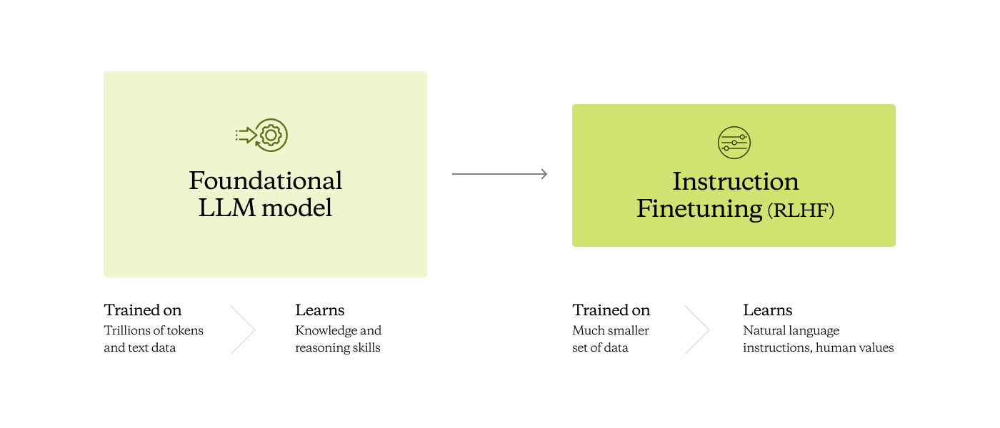
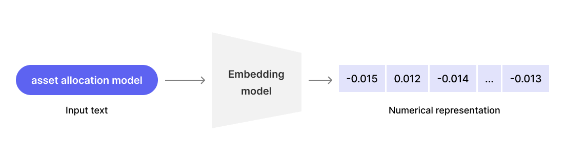
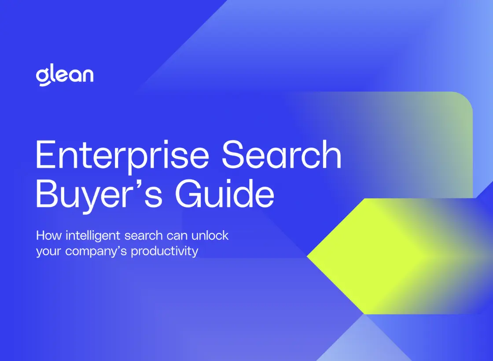
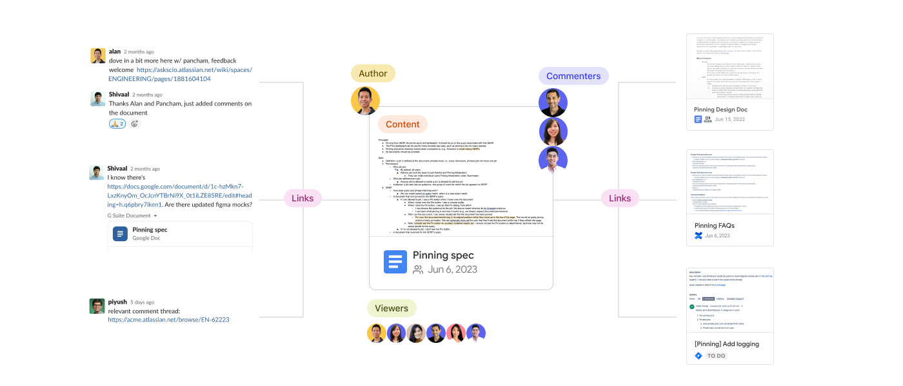
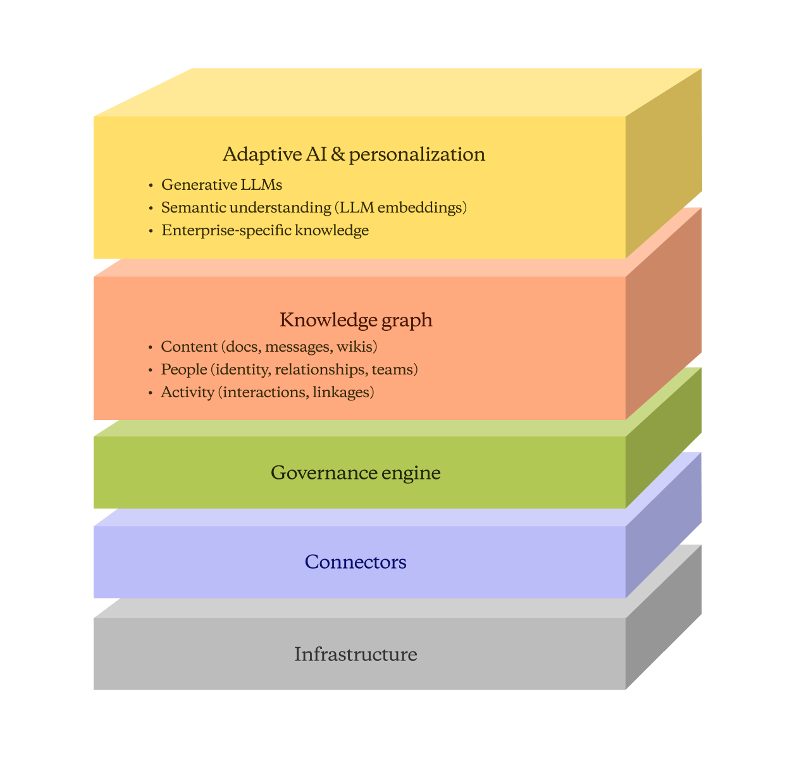

# How to build an AI assistant for the enterprise

*See how Glean works.*

> 作者: Chau Tran

Engineering | 日期: Jul 09, 2023

> 原文链接: https://www.glean.com/blog/how-to-build-an-ai-assistant-for-the-enterprise

---

9minutes read[Chau Tran

Engineering](/authors/chau-tran)[Mrinal Mohit

Engineering](/authors/mrinal-mohit)[Arvind Jain

CEO](/authors/arvind-jain)

### Table of contents

[The challenges of fine-tuning LLMs on enterprise data](#the-challenges-of-fine-tuning-llms-on-enterprise-data)[Retrieval Augmented Generation: Vector search is not enough](#retrieval-augmented-generation-vector-search-is-not-enough)[Data: Scalable permission-aware indexing](#data-scalable-permission-aware-indexing)[Topical relevance: Hybrid search with reranking](#topical-relevance-hybrid-search-with-reranking)[Personalization: Extensive knowledge graph](#personalization-extensive-knowledge-graph)[Integrating LLMs: Enhancing search itself](#integrating-llms-enhancing-search-itself)[Unlock the full value of generative AI today – not tomorrow](#unlock-the-full-value-of-generative-ai-today-not-tomorrow)[Have questions or want a demo?

We’re here to help! Click the button below and we’ll be in touch.

Get a Demo](/get-a-demo)Share this article:

Large Language Models (LLMs) like GPT-4 and PALM are powerful reasoning engines that form the foundation of most text-based generative AI experiences seen today. Ask the LLM a question, and it usually provides an intelligent answer. They are able to reach into the depths of knowledge provided by the data they were trained on – or what we call "world knowledge".

But what about data that is proprietary – say, information restricted to your company’s employees? If you ask a generic LLM a question about the status of your latest customer deal, it will likely tell you that it doesn’t have enough context to answer. Worse yet, it might hallucinate and fabricate an incorrect reply, resulting in the spread of misinformation and potentially serious workflow consequences.

Applying generative AI technologies like ChatGPT to enterprise data is challenging given the complexity of handling security permissions, scaling infrastructure, and establishing a broad, high-quality knowledge graph. In this blog post, we’ll walk through some approaches to make ChatGPT work on enterprise data, their pitfalls, and how Glean solves for them through [Glean Chat](https://glean.com/blog/glean-chat-launch-announcement).

## The challenges of fine-tuning LLMs on enterprise data

In the previous generation of natural-language-processing models (e.g. BERT, RoBERTa, and others), one popular paradigm was “fine-tuning” – where one would start with the weights of a foundational model, and then train them to better fit the needs of their specific tasks and domain.

However, how has the fine-tuning paradigm fared in today’s era of LLMs? Let’s start with how a modern LLM like ChatGPT is trained:

1. First, a “foundational model" is trained on massive amounts of data (trillions of tokens), which requires immense compute power (costing millions of dollars). This is what it costs to build the impressive reasoning and generation abilities you’ve seen from ChatGPT.
2. Then, the model enters a fine-tuning stage where it’s trained to follow natural language instructions, and aligned to human values. This stage is critical to ensure the model behaves ethically by avoiding potential harms like toxicity, bias, and privacy violations.

**

A seemingly natural way to infuse proprietary knowledge into an LLM is at the fine-tuning stage. However, the fine-tuning stage is meant to improve task-specific performance, not to teach the model about new knowledge. When an LLM is fine-tuned on unfamiliar knowledge, it actually [increases hallucinations](https://www.youtube.com/live/hhiLw5Q_UFg?feature=share). This is because we’re essentially teaching the model to generate responses for topics it does not have a strong, factual understanding of. It’s why we agree with [OpenAI](https://github.com/openai/openai-cookbook/blob/main/examples/Question_answering_using_embeddings.ipynb) that “fine-tuning is better suited to teaching specialized tasks or styles, and is less reliable for factual recall.”

Alternatively, one could try including company private data at the foundational pretraining stage through domain adaptation (similar to [BloombergGPT](https://www.bloomberg.com/company/press/bloomberggpt-50-billion-parameter-llm-tuned-finance/), or [MedPALM](https://sites.research.google/med-palm/)). While this approach is effective for adapting LLMs for broad domains, it has several fundamental limitations when building an [enterprise AI](https://www.glean.com/blog/enterprise-ai-search-rag)copilot:

1. **Freshness** – One could fine-tune models on a snapshot of their company’s data, but what happens when that changes on an hourly basis? Users are interested in having the most recent and relevant data, but continually training the model to provide that is expensive and difficult to maintain.
2. **Permissions** – Not every employee has access to see all of the data within their company. Sensitive conversations might happen between the CEO and the CFO, performance reviews might be restricted to managers, and engineers might not have access to Salesforce. Throwing “all” data into a LLM results in generated answers leaking sensitive details.
3. **Explainability** – When your employees are relying on an assistant to help them with their job, you want the answers to not just be correct, but verifiable. If a support agent recommends a fix for a ticket using an assistant, they should be able to verify what document was the source of the recommended fix. Does a source document even exist? Did the model hallucinate one? Is the document canonical, or was last updated 10 years ago? Is there any additional context in the document they should know about? All of this is impossible to process if you trust LLM generations blindly.
4. **Catastrophic forgetting** – The amount of proprietary data in your company is several orders of magnitude smaller than the vast amount of data used to train a base LLM. As a result, fine-tuning the model risks it either forgetting much of the broad, general world knowledge it had originally gained, or failing to learn the nuances of your proprietary data.

In conclusion, while fine-tuning/training LLMs is appealing for improving task-specific performance, there are too many limitations and risks with this approach for [workplace AI assistants](https://www.glean.com/product/workplace-search-ai).

## Retrieval Augmented Generation: Vector search is not enough

To separate the ability of LLMs to generate coherent, well-reasoned responses from their (in)ability to reliably retrieve factual knowledge, the system can be designed as a pipeline. We first retrieve knowledge through a separate search system, and *then* give it to the LLM to read in order to ground its reasoning and synthesis. This is widely known as [Retrieval Augmented Generation (RAG)](https://www.glean.com/blog/how-to-build-an-ai-assistant-for-the-enterprise).

- Knowledge is always as recent and relevant as possible, since the regularly updated search index is inserted into the LLM at query-time.
- The LLM will never access something a user doesn't have access to.
- Users can look at the subset of documents which were fed into the LLM and to verify that the generated response is grounded in truthful information.
- Catastrophic forgetting doesn’t happen, as it retrieves relevant knowledge at query-time rather than trying to retain all knowledge within the model.

At the heart of RAG is the retrieval component – underpinning the security of your company’s data and the relevance of the generated responses your workers need to succeed. We’ll go through why this is essentially a search problem, along with some of the technical requirements of implementing this in the enterprise setting.

### Data: Scalable permission-aware indexing

When building the data layer for an [enterprise search solution](https://www.glean.com/blog/top-enterprise-search-software), there are a couple approaches to consider.

Federated search across individual app APIs is one approach, but it comes with major downsides. Each app's search API has its own nuances, requirements, and rate limiting, making it largely unscalable. Federated search also results in suboptimal ranking algorithms (since they only understand data within that single app, and search features in SaaS are usually underinvested), ultimately providing a poor search experience.

A better solution is to build a centralized index by crawling and indexing data from all sources. However, building a scalable, permission-aware crawler and search platform is an engineering challenge that can take years of work – from scaling to corpuses billions of documents in size, to creating a unified document model that’s capable of handling a wide variety of different data sources.

Glean provides over [100 pre-built connectors](https://www.glean.com/connectors) that hook into apps like Google Drive, Slack, Jira, Salesforce, and more – helping users start indexing data quickly and skip years of development. For enterprise customers with hundreds of thousands of employees, billions of documents, and hundreds of terabytes of data, Glean’s infrastructure (built over a period of nearly five years) handles data at this scale wonderfully.

By indexing data from all sources into a single platform, Glean is able to build a **cross-app knowledge graph **that thoroughly understands all the content, context, and collaborators across the organization. By then applying advanced ranking algorithms to surface the most relevant results, Glean delivers a vastly improved search experience over systems that use individual app APIs.

For any company looking to unlock the value of their data, a scalable indexing platform with pre-built connectors is the way to go over federated search. Glean provides turnkey access to [enterprise search](https://www.glean.com/blog/what-is-enterprise-search) with an indexing solution built for the modern SaaS-powered workplace.

### Topical relevance: Hybrid search with reranking

With a scalable indexed corpus, the next challenge is retrieving the most relevant knowledge for a given query. Among the billions of documents in your company’s corpus, how do you find the ones that contain the most useful, accurate, and up-to-date information?

To fetch these “relevant” documents to feed into the LLM, vector search has emerged as a prime candidate. The system “embeds” each piece of text into a vector of numbers, and stores that in a vector database. When a query comes, it’s similarly embedded into the database. The closest file to the query in the vector space is then sourced as the most relevant piece of information.

Database providers such as Pinecone or Weaviate have been getting a lot of attention lately. What isn’t discussed enough, however, is that the *quality *of the vector embeddings is usually a bigger bottleneck than having a database to host those embeddings.

We’ve shown [previously](https://www.glean.com/blog/unlocking-the-power-of-vector-search-in-enterprise) that if you** fine-tune embedding encoders** on company-specific data, you can get far better matching quality than most “generic” embedding models, open-source (MPNet, E5, Instructor) or close-source (OpenAI, Cohere). This of course requires expertise in training these models, along with the infrastructure to do so continuously. Glean has been steadily building and refining this over the past years.

**

But even though embeddings are powerful, traditional keyword-based methods are far from being obviated. In fact, what works well in practice are “hybrid” methods, which take the best of classical information retrieval techniques and modern neural-network based semantic embedders ([Thakur et al. (2021)](https://arxiv.org/abs/2104.08663)). Tuning a **hybrid retrieval and reranking** system is an extremely complicated task – it requires training models to combine dozens different ranking signals (including semantic similarity, keyword match, document freshness, personalization features, and more) in order to produce a final relevance score. Our search models are continuously learning and improving from every query to provide the most relevant results for each employee.

## Enterprise search buyer’s guide

Enterprise search solutions have become essential to ensuring employee satisfaction, workflow efficiency, and business success. Discover what features and capabilities to look for when considering the best search solution for you.

[Get The Resource](/resources/guides/enterprise-search-buyers-guide)
### Personalization: Extensive knowledge graph

Even with a perfect textual search system, documents that are textually related to the search query may not always contain the right information to answer a user’s question. For example, an engineer may ask where the latest design specs are kept. However, the search results may contain hundreds of documents/pull requests/messages about the topic. This scenario is also why we believe that using a much larger context window (up to 1 million tokens) would not eliminate the need for search relevancy, since providing wrong and outdated information would cause the language model to give an incorrect answer.

Dense vector methods are specifically designed to handle text, whereas in reality, there are more data mediums at play. To make search personalized to each individual user, Glean continually builds a **knowledge graph of all information** being created within your company. The nodes in this knowledge graph include:

- **Contents** – Individual documents, messages, tickets, entities, etc.
- **People** – Identities and roles, teams, departments, groups, etc.
- **Activity** – Critical signals and user behavior, sharing and usage patterns

**

The edges in the graph are how all these entities interact with each other:

- **Document linkage** – Documents that are linked from other documents, or mentioned by other users are more likely to be relevant ([PageRank - the paper that started Google](https://blogs.cornell.edu/info2040/2019/10/28/the-academic-paper-that-started-google/))
- **User-User interactions** – Documents from authors who are on the same team, who I have interacted with in the past, whom I have an upcoming meeting with, … are more likely to be relevant to me.
- **User-Document interactions** – Documents that I (or someone from my team) created/edited/shared/commented/… are all more likely to be relevant to me

### Integrating LLMs: Enhancing search itself

LLMs are not only useful for summarizing and synthesizing search results – they can also enhance the overall search experience. For example, LLMs enable the enterprise AI copilot to do **advanced** **query planning**, allowing systems to interpret natural language commands and translate them into a set of search queries that yield the intended results. A command like:

"*Read through our Glean Chat code changes in the last month. Give me a list of enhancements we are making to the feature. You can also check our #project-glean-chat channel for more discussion.*"

…could be translated into two search queries, and synthesize results from them:

- Github pull requests in the last month that mentions “Glean Chat”
- Messages from the #project-glean-chat Slack channel that talks about project progress

LLMs can also help bootstrap domain-specific encoders for new customers by **augmenting sparse real-world data** with machine-generated examples ([Promptagator](https://arxiv.org/abs/2209.11755), [InPars](https://arxiv.org/abs/2202.05144)). Since each customer's data is used exclusively to train their own encoders, synthetic data helps compensate for the lack of large in-domain datasets while retaining the customer's unique language and terminology. This results in enterprise-adapted encoders that are customized for and generalize better to each customer's data.

‍

**

## Unlock the full value of generative AI today – not tomorrow

Building an enterprise-ready ChatGPT system is no small feat. There are significant requirements around freshness, permissions, explainability, and catastrophic forgetting that come with applying LLMs to company data. While vector search and embeddings have received a lot of recent interest, developing high-quality embeddings and the infrastructure to support them at scale is an engineering challenge of its own. For most companies, developing an in-house solution for unlocking the power of LLMs in their workplace data will require years of work and expertise across machine learning, search, and scalable data infrastructure.

Rather than building from scratch, Glean provides an out-of-the-box solution for enterprise search and knowledge management powered by the latest generative AI technologies. Glean's underlying platform also enables you to easily build custom point solutions through our APIs for numerous enterprise workflows. The end result is an enterprise implementation that harvests the benefits of generative AI at a fraction of the cost and complexity of an in-house solution.

With Glean, companies can stay focused on higher-level goals like driving new business and innovation, while fast-tracking to success through the latest innovations in generative AI without having to wait. To see how Glean helps leading companies unlock the value of their data, [request a demo today](https://www.glean.com/get-a-demo). You'll be on your way to transforming how your organization leverages knowledge through market-leading enterprise search and [AI-powered chat assistance](https://www.glean.com/product/assistant) – without any of the hassle of building it yourself.

[Back to all stories](/blog)

## 

[Get The Resource](#)Work AI for all.[Get a Demo](/get-a-demo)

## Work AI that works.

[Get a demo](/get-a-demo)

