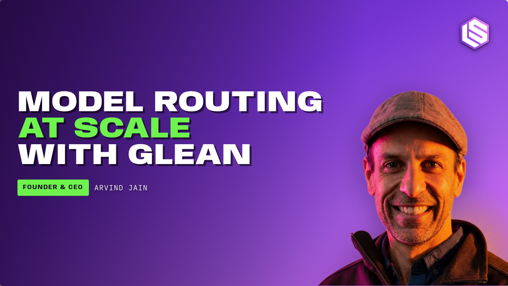
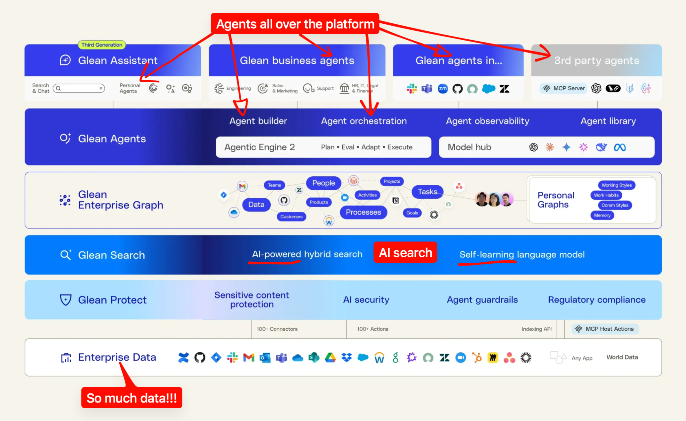
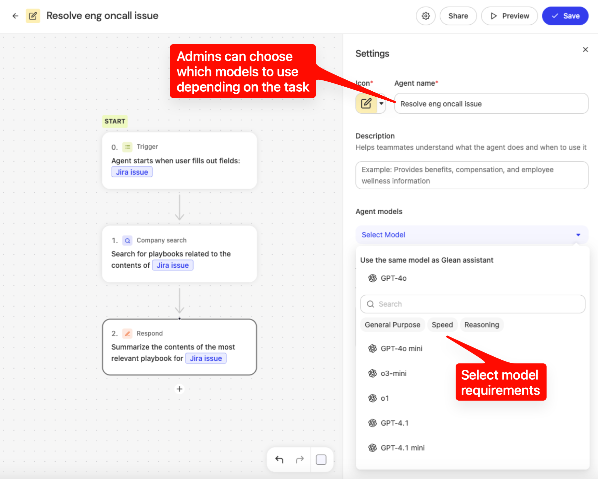
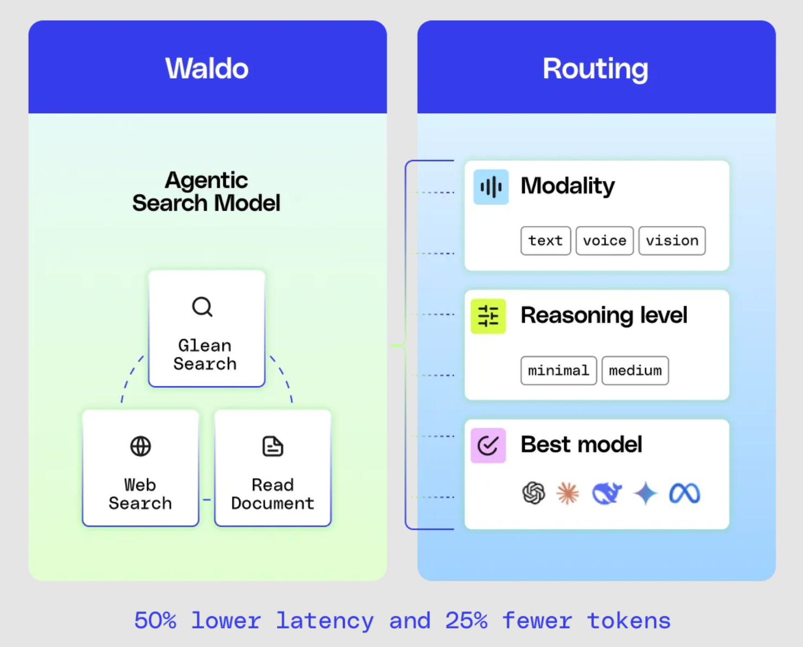
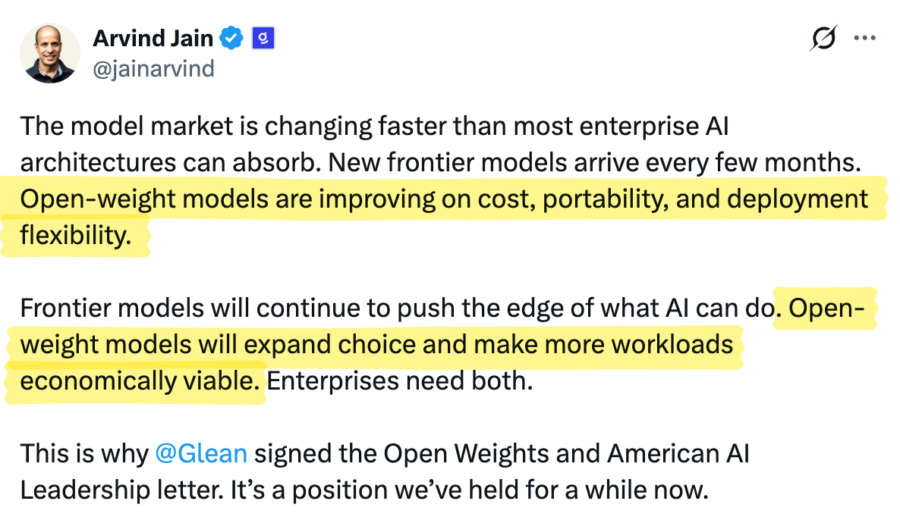
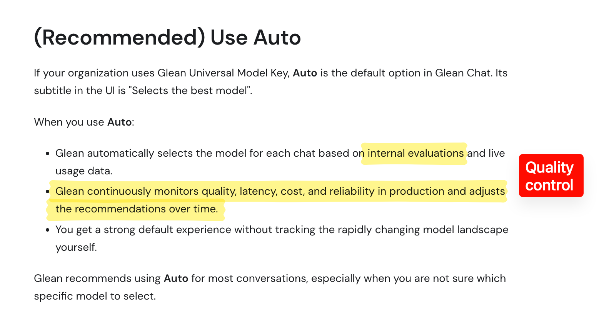
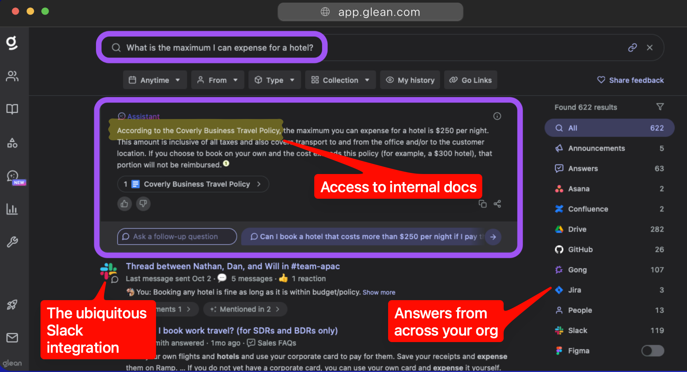

> **Frontier Model Cost and Open-Weights Popularity is Driving Demand for Model Routing**
> 前沿模型成本与开放权重崛起，正在驱动模型路由需求
>
> 作者 Author：Richard MacManus · 发布 Published：2026-08-19 · 来源 Source：[Latent Space](https://www.latent.space/p/glean-model-routing)

With the intense competition among frontier model companies, together with ever-increasing power of open-weight models like Kimi K3 and Qwen3.8-Max, **model routing** has become a key part of AI deployment. We’ve just seen [Stripe buy OpenRouter for over $7B](https://www.latent.space/p/ainews-stripe-buys-openrouter-for), but the trend is equally hot in enterprises.

随着前沿模型厂商之间的激烈竞争，加上 Kimi K3、Qwen3.8-Max 等开放权重模型能力不断增强，**模型路由（model routing）**已成为 AI 落地部署的关键环节。我们刚看到 [Stripe 以超 70 亿美元收购 OpenRouter](https://www.latent.space/p/ainews-stripe-buys-openrouter-for)，而这一趋势在企业侧同样火热。

[Glean](https://www.glean.com/), co-founded and led by ex-Google Distinguished Engineer **Arvind Jain**, specializes in bringing AI to large organizations. It was last valued at $7.2B after [a $150M Series F fund raise](https://www.glean.com/blog/glean-series-f-announcement) last June. This year, it reached [$300 million in annual recurring revenue (ARR)](https://x.com/jainarvind/status/2060077511212445874) — a three-fold increase over 15 months.

[Glean](https://www.glean.com/) 由前 Google 杰出工程师 **Arvind Jain** 联合创立并掌舵，专长于把 AI 带进大型组织。去年 6 月完成 [1.5 亿美元 F 轮融资](https://www.glean.com/blog/glean-series-f-announcement)后，其估值达到 72 亿美元。今年其年度经常性收入（ARR）已达 [3 亿美元](https://x.com/jainarvind/status/2060077511212445874)——15 个月内增长三倍。

Part of Glean’s mission is to **select which model to use for each task** — or indeed if an LLM is even required.

Glean 的使命之一，就是**为每个任务挑选合适的模型**——乃至判断到底是否需要用 LLM。

"A big goal of Glean is to avoid using LLMs for tasks where we don’t need them," Jain told Latent Space. "Sometimes you’ll see queries in Glean where people are adding two numbers or multiplying two numbers. They could have used a calculator to do that."

「Glean 的一个重要目标是：在不需要 LLM 的任务上，避免使用 LLM，」Jain 对 Latent Space 表示。「有时你会看到用户在 Glean 里做两个数字相加或相乘的查询——他们本可以用计算器完成。」

But what Glean is mostly trying to do is bring what Jain calls **"one really powerful personal co-worker"** to enterprise employees. And that means being a kind of meta-harness for leading LLMs.

但 Glean 真正想做的，是把 Jain 所称的**「一个真正强大的个人同事」**交付给企业员工。这意味着它要充当各类头部 LLM 的一种「元编排层（meta-harness）」。

Glean announced its [third-generation Glean Assistant](https://www.glean.com/press/glean-introduces-third-generation-ai-assistant-new-enterprise-graph-to-enable-the-superintelligent-enterprise) last September; these days, agents are a big part of Glean’s system.

Glean 于去年 9 月发布了[第三代 Glean Assistant](https://www.glean.com/press/glean-introduces-third-generation-ai-assistant-new-enterprise-graph-to-enable-the-superintelligent-enterprise)；如今，智能体（agents）已成为 Glean 系统的重要组成部分。

"You can think of Glean today as a superset of ChatGPT, Claude, Gemini, Grok," Jain said. "All these different AI products that we’ve been using day to day, Glean combines the power of all of them into one experience."

「你可以把今天的 Glean 理解为 ChatGPT、Claude、Gemini、Grok 的超集，」Jain 说。「我们日常使用的这些不同 AI 产品，Glean 把它们全部的能力融合进同一个体验中。」

With enterprises, bringing AI technology into an organization is just half the challenge. **The other half is bringing organizational knowledge into the AI systems.**

对企业而言，把 AI 技术引入组织只是挑战的一半。**另一半，是把组织知识带进 AI 系统。**

"Ultimately our business is to deeply understand your data, knowledge, and information, but also how work happens inside your company," Jain said.

「归根结底，我们的业务是深度理解你的数据、知识和信息，也包括理解公司内部的工作是如何发生的，」Jain 说。

## How model routing is done in Glean / Glean 如何做模型路由

So what does model routing mean in practice? Basically, Glean offers three levels of model selection:

那么模型路由在实践中意味着什么？基本上，Glean 提供三个层级的模型选择：

1. Employees can explicitly choose a model. / 员工可以显式选择某个模型。
2. Administrators can restrict models or impose usage limits. / 管理员可以限制可用模型或设定用量上限。
3. Glean’s automatic mode selects a model dynamically for each task. / Glean 的自动模式会为每个任务动态选择模型。

[Configuring models](https://docs.glean.com/administration/configure-llms) for certain tasks.

为特定任务[配置模型](https://docs.glean.com/administration/configure-llms)。

It turns out **automatic mode is mostly chosen by Glean’s customers for economic reasons.**

事实证明，**客户选择自动模式，主要出于经济原因。**

"Why are people talking about model routing? Why are they excited about it? It’s mostly because of cost," Jain told us.

「为什么大家都在谈论模型路由？为什么对它兴奋？主要还是因为成本，」Jain 告诉我们。

Another co-founder of Glean, engineering lead Tony Gentilcore, [recently claimed](https://x.com/tonygentilcore/status/2087662417920643462) that **Glean "is 4x more cost-effective" than Claude Code**, "averaging $0.45 per task versus $1.84 for Claude Cowork." He put that down to Glean’s "harness and routing capabilities."

Glean 的另一位联合创始人、工程负责人 Tony Gentilcore [近期声称](https://x.com/tonygentilcore/status/2087662417920643462)，**Glean「比 Claude Code 成本低 4 倍」**，「每个任务平均 0.45 美元，而 Claude Cowork 为 1.84 美元」。他将此归功于 Glean 的「编排层与路由能力」。

Individually, many of us are getting great value out of our $20, $100 or $200 monthly subscription to an LLM provider. But for an enterprise, the per-user costs can easily spiral out of control.

作为个人，我们很多人每月花 20、100 或 200 美元订阅 LLM 服务，都觉得物有所值。但对企业来说，按用户计费的成本很容易失控式膨胀。

"AI models have been getting expensive," Jain said. "Like, if you look at Opus or the latest models of GPT, the most advanced models. Not only are they very powerful, they can run much more complex tasks than the previous models. **But on a per token basis, they’re more expensive — sometimes double or quadruple the rates of the previous models. And then users actually use them to run much longer tasks.** So you’re spending, like, 10 times, 20 times, more, on a per user basis, than what you were doing last year. So the costs have gone up a lot."

「AI 模型正变得越来越贵，」Jain 说。「比如你看 Opus 或最新一代 GPT，这些最先进的模型，不仅能力很强，能跑比前代复杂得多的任务。**但按 token 计，它们更贵了——有时是前代价格的 2 到 4 倍。而用户确实会用它们去跑更长的任务。**所以按用户算，你今年的花费可能是去年的 10 倍、20 倍。成本涨得非常厉害。」

## The human feedback loop / 人类反馈循环

Another key factor in Glean’s rise is that **it gets to see how ordinary business users are using AI**. The product is potentially deployed to every employee as a "coworker," and it’s also used to build and deploy agents across all departments and functions.

Glean 崛起的另一个关键因素在于，**它能观察到普通企业用户如何使用 AI**。该产品有可能作为「同事」部署到每一位员工，也被用于在各部门、各职能中构建和部署智能体。

Among its customers, [Zillow reports](https://www.glean.com/resources/customer-stories/zillow) 80% adoption across 7,000 employees, while [at Booking.com](https://www.glean.com/resources/customer-stories/booking-com), "Glean became the first AI platform adopted company-wide." That kind of penetration gives Glean an enviable view into how AI is being used in enterprises.

在它的客户中，[Zillow 报告](https://www.glean.com/resources/customer-stories/zillow)其 7000 名员工中有 80% 已采用，而在 [Booking.com](https://www.glean.com/resources/customer-stories/booking-com)，「Glean 成为首个全公司范围采用的 AI 平台」。这种渗透率让 Glean 得以罕见地纵览企业内 AI 的真实使用方式。

**"So we are getting to observe what people are actually doing with AI on a very broad basis,"** said Jain. "We are getting to see when they’re on different types of tasks with AI, what models do they select first, and when they are not satisfied, when they actually upgrade to some other model [that] actually gives them the right results."

「**所以我们能在非常广的层面上，观察到人们到底在用 AI 做什么，**」Jain 说。「我们能看到，当用户用 AI 处理不同类型任务时，他们首先选什么模型；当他们不满意时，又会在何时切换到另一个真正给出正确结果的模型。」

This human feedback loop, at scale, helps improve the model routing system.

这种大规模的人类反馈循环，有助于持续改进模型路由系统。

## Here’s Waldo, gathering raw materials / Waldo：收集原材料

Another part of Glean’s architecture is a model called Waldo, which Jain described as sitting on top of the large language models. Waldo was [introduced in April](https://x.com/glean/status/2049127230370881870) as **"Glean’s first agentic search model."**

Glean 架构的另一部分是名为 Waldo 的模型，Jain 描述它位于大语言模型之上。Waldo 于 [4 月发布](https://x.com/glean/status/2049127230370881870)，被称为**「Glean 首个智能体式搜索模型（agentic search model）」**。

[Glean claims that](https://www.glean.com/ai-agents/agent-harness) Waldo, its agentic search model, "reduces latency by 50% and tokens by 25%, reserving advanced models for work that needs them."

[Glean 声称](https://www.glean.com/ai-agents/agent-harness)，其智能体式搜索模型 Waldo「将延迟降低 50%、token 消耗降低 25%，把先进模型留给真正需要的任务」。

In [a technical blog post](https://www.glean.com/blog/waldo-launch), Waldo was portrayed as a kind of filtering process for user queries: it "decides how to break down the question, which tools to use, what to read next, and when it has enough evidence to hand off to a frontier model for a high-quality answer."

在[一篇技术博客](https://www.glean.com/blog/waldo-launch)中，Waldo 被描述为用户查询的一种过滤流程：它「决定如何拆解问题、使用哪些工具、接下来读取什么，以及何时已掌握足够证据，可以移交给前沿模型以生成高质量答案」。

This means the **model routing is happening _after_ Glean has determined what Jain calls the "raw materials" that are needed for the task.**

这意味着，**模型路由是在 Glean 确定了 Jain 所称的任务「原材料（raw materials）」之后才发生的。**

"We’re able to assemble the raw materials needed to do the work without burning LLM tokens," he added.

「我们能够在不动用 LLM token 的情况下，组装好完成工作所需的原材料，」他补充道。

A corollary of this is that a cheaper model with better context may outperform a frontier model loaded with irrelevant data.

由此引申出一点：一个上下文更好、但更便宜的模型，可能胜过一个塞满无关数据的前沿模型。

## The rapid rise of open-weight models / 开放权重模型的快速崛起

Jain confirmed there is **now significant interest from enterprises in open-weight models**, primarily due to cost concerns. But this has only happened over the past few months.

Jain 确认，**如今企业对开放权重模型的兴趣显著上升**，主要源于成本考量。但这只是过去几个月才发生的事。

"Last year, the usage [of open source LLMs] was minuscule and nobody was really seriously considering open source," he said. Partly that was because of the "stigma" of many of these open source models being developed outside the US.

「去年，[开源 LLM 的]使用量微乎其微，没人在认真考虑开源，」他说。部分原因是许多开源模型在美国境外开发，带有某种「污名」。

But suddenly, interest among enterprise customers has risen.

但突然之间，企业客户的兴趣起来了。

[Jain’s tweet](https://x.com/jainarvind/status/2081806858592121063) on July 27, 2026, in support of open-weight models.

[Jain 于 2026 年 7 月 27 日的推文](https://x.com/jainarvind/status/2081806858592121063)，表达对开放权重模型的力挺。

"So in the last three months, because AI got so expensive, businesses have started to find it untenable to maintain these AI investments," Jain said. **"Given that open source is an order of magnitude cheaper to do tasks, it has created a lot of interest. Today, I can say that in most enterprises, they are considering open source models to be a key part of their AI strategy."**

「所以在过去三个月里，因为 AI 变得太贵，企业开始发现维持这些 AI 投入难以为继，」Jain 说。**「鉴于开源完成任务的成本低一个数量级，这引发了大量兴趣。今天我可以断言，在大多数企业里，它们正把开源模型视为 AI 战略的关键组成部分。」**

More than that, organizations tend not to rely on just one or two providers anymore — and the rise of open-weight models is driving this trend.

不仅如此，组织不再倾向于只依赖一两家供应商——而开放权重模型的崛起正在推动这一趋势。

"Nobody is willing anymore to rely on only one model provider, or two, and **nobody thinks that they can survive without open source**," Jain said.

「没有人再愿意只依赖一家或两家模型供应商，而且**没有人认为可以脱离开源而生存**，」Jain 说。

## Evals / 评估

You can’t have a serious conversation about AI in 2026 without discussing evals — assessing the quality of results from LLMs. I asked how Glean goes about doing evals and how that is fed back into the model routing system.

在 2026 年，谈论 AI 而不提 evals（评估，即对 LLM 输出质量的评测）是不可能的。我询问了 Glean 如何开展评估，以及评估结果如何反馈到模型路由系统中。

Jain said they have **"internal testing systems" where they compare real-world workloads, across different query classes, with alternative options**. So they let the model choose a route and in parallel they try to complete the same task with "some other models which are maybe a little bit less expensive and a little bit more expensive."

Jain 表示，他们拥有**「内部测试系统」，会在不同查询类别上，用多种备选方案对比真实工作负载**。也就是说，他们让模型自行选择一条路由，同时并行地用「另一些可能稍便宜、或稍贵一点的模型」去完成同一任务。

How Glean [monitors quality](https://docs.glean.com/get-started/golive/model-choice).

Glean 如何[监控质量](https://docs.glean.com/get-started/golive/model-choice)。

Glean then uses **"AI-based judges"** to determine "how spot-on the model router was."

随后，Glean 使用**「基于 AI 的评审员（AI-based judges）」**来判断「模型路由器的选择有多精准」。

"So there’s this continuous learning that gets updated with new real-world traffic, where basically what is happening is that **you let the model router do the work for the user, but behind the scenes you run the same task**," Jain explained.

「所以存在一种持续学习机制，会随着新的真实流量不断更新——本质上就是：**你让模型路由器替用户干活，但在幕后你运行同一个任务**，」Jain 解释道。

He added that this is done for only "a small fraction" of the real-world usage, but at Glean’s scale that’s more than enough to help train and improve the model router.

他补充说，这只对真实用量中的「一小部分」执行，但以 Glean 的规模，这已足以训练和改良模型路由器。

## From enterprise search to end-to-end AI platform / 从企业搜索到端到端 AI 平台

One of the trends we’ll be monitoring going forward on Latent Space is how AI systems are being implemented within enterprises — and how some of these organizations are going full-on AI-native.

Latent Space 未来将持续关注的一个趋势是：AI 系统如何被落地到企业内部，以及其中一些组织如何全面转向 AI 原生。

Glean is an especially interesting company to monitor for these trends, since **it was one of the very first enterprise-facing AI companies.** It was founded in early 2019, initially to tackle enterprise search. As Jain put it, Glean was "the first player to work with transformers and language models for businesses."

Glean 是观察这些趋势尤其有趣的一家公司，因为**它是最早一批面向企业的 AI 公司之一**。它成立于 2019 年初，最初是为了攻克企业搜索。正如 Jain 所说，Glean 是「首个将 transformer 和语言模型用于商业场景的玩家」。

[Glean’s AI Answers](https://docs.glean.com/user-guide/assistant/ai-answers) draws "directly from your organization’s documentation."

[Glean 的 AI Answers](https://docs.glean.com/user-guide/assistant/ai-answers)「直接源自你组织的文档」。

[In April 2023](https://www.latent.space/p/deedy-das), swyx interviewed **Deedy Das** of Glean. Das, who is now a partner at venture firm Menlo Ventures, was a founding engineer at Glean. But even at that point, in 2023 — about four years into Glean — the focus was still mostly on enterprise search.

[2023 年 4 月](https://www.latent.space/p/deedy-das)，swyx 采访了 Glean 的 **Deedy Das**。Das 现为风投机构 Menlo Ventures 的合伙人，曾是 Glean 的创始工程师。但即便在那个时间点——2023 年，Glean 已成立约四年——焦点仍主要在企业搜索上。

Now, in 2026, enterprises aren’t just using AI for search. **AI is becoming an integral part of every employee’s workflow.**

如今到了 2026 年，企业不只是用 AI 做搜索了。**AI 正成为每位员工工作流中不可或缺的一部分。**

That makes Glean a much ’sexier’ AI company, as Das himself said on [his return to the Latent Space podcast last November](https://www.latent.space/p/anthropic-glean-and-openrouter-how?utm_source=publication-search). "Broadly, one of the things that I love about Glean is it’s such a boring unsexy company that became sexy later," he said.

这让 Glean 变成了一家「更性感」的 AI 公司，正如 Das 本人在[去年 11 月重返 Latent Space 播客](https://www.latent.space/p/anthropic-glean-and-openrouter-how?utm_source=publication-search)时所说：「总的来说，我喜欢 Glean 的一点，是它曾经是那么无聊、那么不性感的一家公司，后来却变性感了。」

This brings us full circle back to model routing. Arvind Jain ended our discussion by calling Glean **an "end-to-end AI platform" that gets "used very heavily" by its enterprise customers.** This, he added, allows Glean to "have that data that is required to do effective model routing."

这让我们又回到了模型路由。Arvind Jain 在结束时将 Glean 称为**一个「端到端 AI 平台」，被企业客户「重度使用」**。他补充道，这令 Glean 得以「掌握进行有效模型路由所需的数据」。
