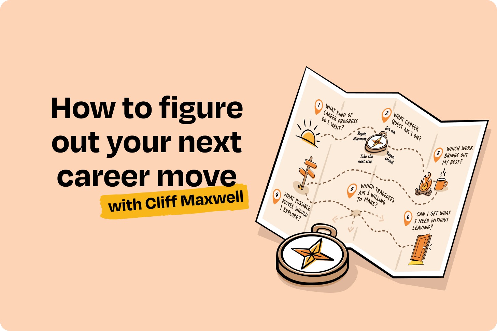
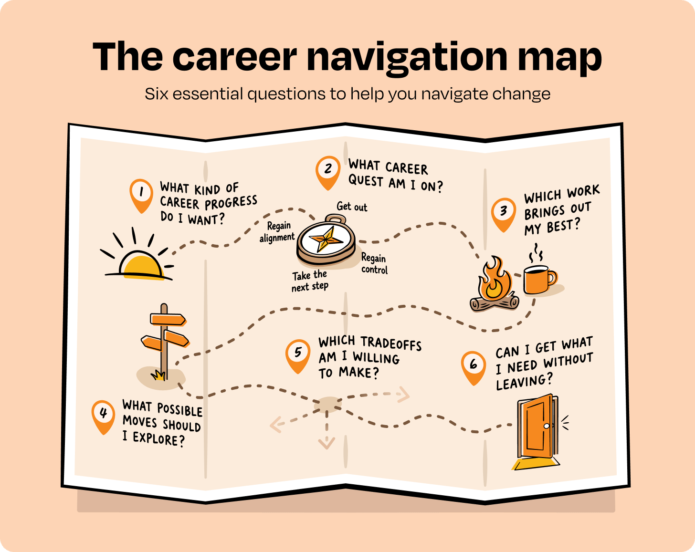
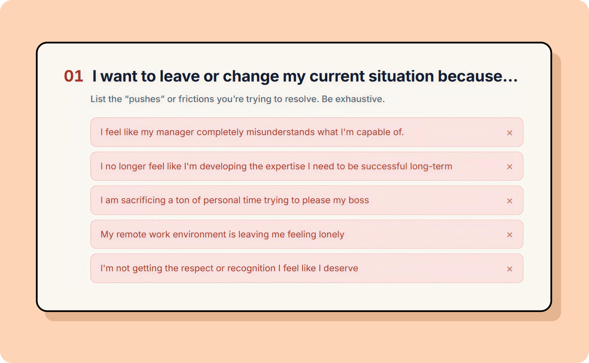
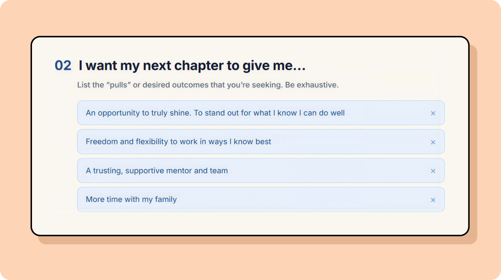
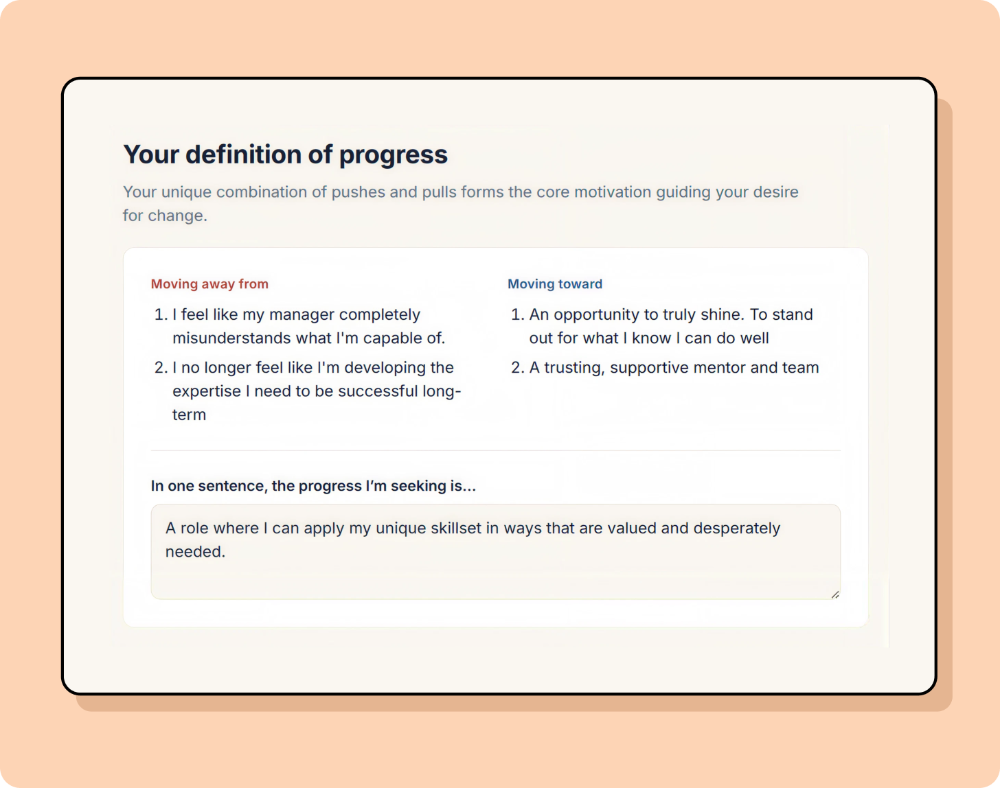
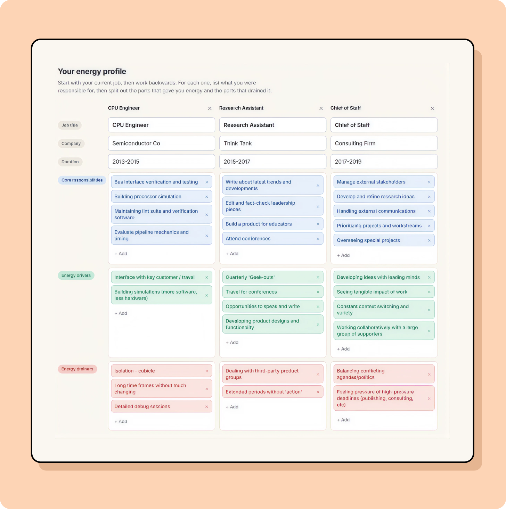
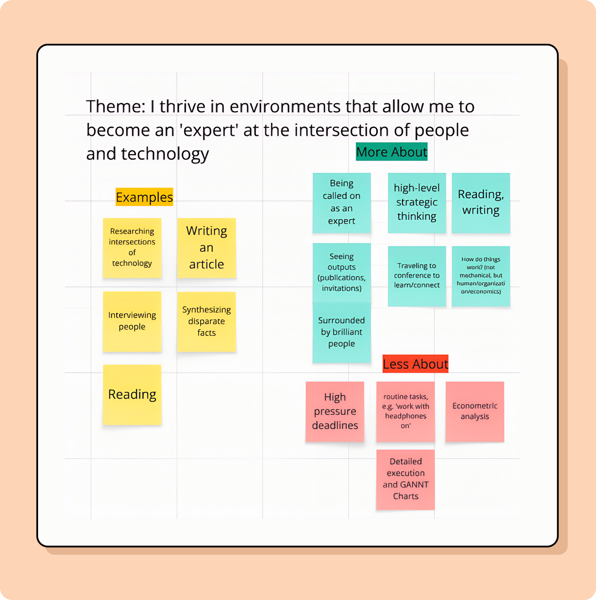

*Six essential questions to help you navigate change*

*六个帮你应对变化的关键问题*

> 作者 / Author: Cliff Maxwell
> 日期 / Date: 2026-08-25T21:04:15+08:00
>
> 原文链接 / Source: https://www.lennysnewsletter.com/p/how-to-figure-out-your-next-career

---

*👋 Hey there, I’m Lenny. Each week, I share deeply researched product, growth, and career advice. For more: Lenny’s Jobs | Lenny’s Podcast | Lennybot | How I AI | Become an AI-Native Builder and my other favorite AI/PM courses*

*👋 大家好，我是 Lenny。每周我都会分享经过深入研究的产品、增长与职业建议。更多内容：Lenny’s Jobs | Lenny’s Podcast | Lennybot | How I AI | Become an AI-Native Builder，以及我最喜欢的其他 AI/PM 课程。*

*P.S. Get a full free year of Cursor, Notion, Replit, Lovable, Wispr Flow, Linear, ElevenLabs, Factory, PostHog, Granola, Brain.fm, Waking Up, and more, by becoming an Insider subscriber (while supplies last). Learn more.*

*附：成为 Insider 订阅用户，即可免费获得一整年的 Cursor、Notion、Replit、Lovable、Wispr Flow、Linear、ElevenLabs、Factory、PostHog、Granola、Brain.fm、Waking Up 等工具（数量有限，先到先得）。了解更多。*

---

Building on last week’s very exciting launch of [Lenny’s Jobs](https://www.lennysjobs.com/) ([that’s a lot of likes](https://www.linkedin.com/posts/lennyrachitsky_announcing-lennys-jobs-the-best-place-activity-7495536257188519936-zT2o/?utm_source=share&utm_medium=member_desktop&rcm=ACoAAABGvmoB4S920iEQfSFO_P91nw2wPqfPoic)!), I’m thrilled to bring you a companion post that will help you clarify what job to look for in the first place.

在上周非常成功的 [Lenny’s Jobs](https://www.lennysjobs.com/) 发布之后（[点赞数相当可观](https://www.linkedin.com/posts/lennyrachitsky_announcing-lennys-jobs-the-best-place-activity-7495536257188519936-zT2o/?utm_source=share&utm_medium=member_desktop&rcm=ACoAAABGvmoB4S920iEQfSFO_P91nw2wPqfPoic)！），我很高兴再带来一篇配套文章，帮你在找工作的第一步就弄清楚：自己到底要找什么样的工作。

Let’s get into it.

我们开始吧。

---

It’s a disorienting time to work in tech right now. For some, the rise of AI is a thrilling adventure, but for others, it’s [a source of existential dread](https://www.lennysnewsletter.com/p/how-tech-workers-are-feeling-in-2026). No matter how you’re feeling, change is coming. The World Economic Forum reports that by 2030, 39% of today’s skills will change or become obsolete, and more than 90 million jobs will be displaced even as 170 million new jobs will be created.

对当下在科技行业工作的人来说，这是一个令人迷失方向的时刻。对一些人而言，AI 的崛起是一场激动人心的冒险；对另一些人来说，它却是[存在性恐惧的来源](https://www.lennysnewsletter.com/p/how-tech-workers-are-feeling-in-2026)。无论你此刻感受如何，变化已经到来。世界经济论坛报告称，到 2030 年，当今 39% 的技能将发生变化或过时，超过 9000 万个岗位将被取代，同时也会有 1.7 亿个新岗位被创造出来。

Every generation of workers in tech has lived through recessions, layoffs, and technological change, but AI’s impact on work will be fundamentally different. It won’t just require new skills. It is redrawing the boundaries between roles and changing the day-to-day responsibilities inside them. Work may feel unstable now, but this will likely be the most stable it feels for a long time.

科技行业的每一代从业者都经历过衰退、裁员与技术变革，但 AI 对工作的影响将有着根本性的不同。它不只是要求你掌握新技能，它正在重新划分岗位之间的边界，并改变岗位内部的日常工作职责。现在的工作也许已经让人感到不稳定，但这很可能是未来很长一段时间里最稳定的状态。

With this much uncertainty on the horizon, it is imperative that you develop the ability to navigate change. As your responsibilities shift and new opportunities emerge, the durable career advantage will come from knowing what kinds of problems, people, and environments bring out your best work—and having a repeatable process for identifying your next step even when the ultimate destination is unclear.

面对如此多的不确定性，培养驾驭变化的能力已是当务之急。当你的职责不断迁移、新机会不断出现，持久的职业优势将来自：清楚什么样的问题、什么样的人、什么样的环境能激发出你最好的工作，并且拥有一套可复用的方法，即便最终目的地尚不明朗，也能据此判断下一步该怎么走。

For the past year I have been building career navigation infrastructure with Bobby Moesta, one of the creators of the Jobs to Be Done framework and a [two](https://www.youtube.com/watch?v=xQV7HVyAJjc)-[time](https://www.youtube.com/watch?v=2wypVv9wZtI) guest on Lenny’s Podcast. Bobby brings a product-oriented lens to career change: you are the customer, and the right next career move is the product you are looking to purchase.

过去一年，我一直在和 Bobby Moesta 一起搭建职业导航基础设施。Bobby 是任务达成（Jobs to Be Done）框架的提出者之一，也是[两度](https://www.youtube.com/watch?v=xQV7HVyAJjc)[做客](https://www.youtube.com/watch?v=2wypVv9wZtI) Lenny’s Podcast 的嘉宾。Bobby 用产品化的视角看待职业转换：你就是用户，而正确的下一步职业选择，正是你想要「购买」的那个产品。

Through more than 1,000 in-depth interviews with professionals changing jobs (some by choice, some by necessity)—and hundreds more people we have coached since—we identified what helps people make a successful job transition, and built a process to support them.

通过对 1000 多位正在换工作的职场人（有些出于主动选择，有些出于被迫）的深度访谈，以及此后我们辅导过的数百位学员，我们识别出哪些因素能帮助人们完成一次成功的职业转换，并据此搭建了一套支持他们的流程。

This is not a laundry list of LinkedIn hacks, resume tips, or ideas for how to automate your recruiting efforts. This is a step-by-step formula for designing a system that allows you to understand yourself, your context, and your best next steps when you’re in a state of change.

这不是一份 LinkedIn 技巧、简历窍门，或如何用自动化手段海投求职的清单。这是一套循序渐进的公式，用来设计一套系统，让你在身处变化之中时，能够理解自己、理解你所处的环境，并找到对自己最优的下一步。

In this post, I’ll help you answer six fundamental questions that will instill confidence and focus anytime you are navigating a transition at work. Each question comes with exercises and tools to help you build understanding.

在这篇文章里，我会帮你回答六个基本问题。每当你需要在工作中经历一次转换，它们都能带给你信心与专注。每个问题都配有练习与工具，帮助你逐步建立起对自己的理解。

1. What kind of career progress do I want? / 我想要什么样的职业进展？
2. What career quest am I on? / 我正处于什么样的职业诉求之中？
3. Which work brings out my best? / 什么样的工作能激发我最好的状态？
4. What possible moves should I explore? / 我应该探索哪些可能的选择？
5. Which tradeoffs am I willing to make? / 我愿意做出哪些权衡？
6. Can I get what I need without leaving? / 不离开，我能否得到自己需要的东西？

Once you know your answers, you’ll be equipped to find your bearings now and every time the labor market throws you a curveball.

一旦你知道了自己的答案，你就掌握了方向感——无论是现在，还是未来每一次劳动力市场向你投出变化球的时候。

## 1. What kind of career progress do I want? / 1. 我想要什么样的职业进展？

About a year ago, we coached an individual who,** **after spending several years at a startup that was running out of funding, assumed his next step was another early role in a venture-backed company.

大约一年前，我们辅导过一位学员。他在一家资金即将耗尽的创业公司待了几年，想当然地以为自己的下一步，应该是再去另一家拿到风投的公司担任早期岗位。

After evaluating his core motivations and reflecting on his growing desire for impact, he found an opportunity to lead the entrepreneurship center at a local university, a job that he previously would have avoided and that none of his peers would have recommended. When he met with the administration, they effectively hired him on the spot, telling him, “You are exactly who we were looking for.” He’s now crushing it in his new role.

在评估了他的核心动机、并反思自己日益增强的「想做出影响力」的渴望之后，他找到了一个机会：去当地一所大学领导创业中心。这份工作在以前是他会刻意回避的，也是他身边所有同僚都不会推荐的工作。当他与校方管理层会面时，对方当场就决定录用他，并告诉他：「你正是我们要找的人。」如今他在新岗位上干得非常出色。

This story demonstrates the difference between career “progress” and “progression,” a distinction that is critical to understand when you are at a transition point in your career.

这个故事说明了职业「进展（progress）」与「晋升（progression）」之间的差别——当你正处于职业转折点时，理解这一区别至关重要。

**Progression** is the philosophy that underpins most people’s mental model of careers. You start as an IC, get promoted, and up and up you go on the imaginary career ladder. This mindset will become increasingly less relevant as AI continues its march through knowledge work. Job boundaries and job titles will continue to blur, new job titles will emerge, and companies will struggle to neatly map job descriptions and career pathways into their org chart or KPIs.

**晋升（Progression）** 是支撑大多数人心智模型的职业哲学：你从一名个人贡献者（IC）起步，获得晋升，然后沿着那条想象中的职业阶梯不断往上爬。随着 AI 持续在知识工作领域推进，这种思维方式的适用性会越来越低。岗位边界与职位头衔会持续模糊，新的职位头衔会不断涌现，而企业将很难把岗位描述与职业路径整齐地映射到组织架构图或 KPI 之中。

**Progress**, on the other hand, is contextual and dynamic. It is ultimately a question of what your professional Job to Be Done is, and allows you to chart your own course rather than follow a single, narrow path of progression. Depending on your context, progress may be about autonomy and flexibility, preparing for the future, respect and recognition, or simply collecting a paycheck during a time of instability. It can look like a more traditional step up, but it may also look like a lateral move or even like a step back from the perspective of others—while it solves the most important problem in your life and gives you space and time to move forward later on.

**进展（Progress）** 则相反，它是情境化的、动态的。归根结底，它回答的是「你职业上的任务达成（Job to Be Done）究竟是什么」，它让你能够绘制自己的航线，而不是沿着一条单一而狭窄的晋升路径前行。取决于你所处的情境，进展可能是自主权与灵活性，可能是为未来做准备，可能是尊重与认可，也可能只是在动荡时期安稳地领一份薪水。它看起来可能像一次更传统的向上一步，但也可能像一次平级调动，甚至在旁人看来是倒退一步——只要它解决了你生命中最重要的那个问题，并给你留出日后继续前行的空间与时间。

A focus on progress is an active commitment to putting yourself in environments that will bring out your best. It helps you stand out amid the army of applicants all reaching for the same rung on the career ladder. Progress gives you the freedom to see your career in chapters and create space to be [emergent](https://www.lennysnewsletter.com/p/what-if-youre-not-supposed-to-have) rather than assuming you have to write one linear story all at once. To do this, you have to define the progress you’re seeking right now.

聚焦进展，是一种主动的承诺：把自己放进那些能激发出你最好状态的环境里。它帮你在那一大群都在争夺同一级阶梯的求职者中脱颖而出。进展让你有自由把职业生涯看成一章一章的章节，并留出空间去[顺势生长](https://www.lennysnewsletter.com/p/what-if-youre-not-supposed-to-have)，而不是假定你必须一次性写完一个线性故事。要做到这一点，你必须先定义清楚：此刻你寻求的进展究竟是什么。

### A 10-minute progress exercise / 一个 10 分钟的进展练习

Take a blank page (or, if you’d like a live template, we made one for you [here](https://try.joinvocation.com/progress-finder)) and complete the sentence: **I want to leave or change my current situation because…**

拿出一张白纸（如果你想要一份可填写的在线模板，我们[在这里](https://try.joinvocation.com/progress-finder)准备了一份），然后补全这句话：**我想要离开或改变现状，是因为……**

Write down every friction or negative force you’re experiencing right now, or that you last experienced at work. We call these **pushes**. Do not polish the language. “My manager changes priorities every three days, and it’s getting exhausting” is more useful than “I want better leadership.” Unpack each one of these, and ask yourself “why” until you get to the root cause.

把你此刻正在经历、或上一次在工作中经历过的每一处摩擦与负面力量都写下来。我们称之为**推力（pushes）**。不要修饰措辞。「我的经理每三天就换一次优先级，这让人筋疲力尽」比「我想要更好的领导力」有用得多。对每一条都层层拆解，不断追问自己「为什么」，直到找到根本原因。

Then complete this sentence: **I want my next chapter to give me…**

然后补全这句话：**我希望我的下一章能给我……**

List the desired outcomes you wish were true right now. We call these** pulls**. Again, make them concrete. “Control over when I do focused work” is more useful than “flexibility.”

列出那些你希望此刻就已成真的期望结果。我们称之为**拉力（pulls）**。同样，要写得具体。「能自主决定什么时候做需要专注的工作」比「灵活性」有用得多。

Now circle the two or three pushes and two or three pulls that carry the most emotional weight. When you see the forces together, you can start to assemble what progress means for *you*, not for anyone else. For example, two people may both feel overburdened by new management, but one wants to join a more supportive team while the other is seeking more autonomy to work alone. Your unique combination of pushes and pulls forms the basis for your career quest, or the core motivation guiding your desire for change.

现在圈出情绪分量最重的两三条推力与两三条拉力。当你把这些力量放在一起看时，你就能开始拼装出进展对*你*而言意味着什么，而不是对其他人意味着什么。举例来说，两个人可能都因为新管理层而感到不堪重负，但其中一个想加入一个更支持人的团队，另一个则在寻求更多独立工作的自主权。你那独一无二的推力与拉力组合，构成了你职业诉求的基础——也就是驱动你想要改变的核心动机。

Below is an example of how this might look for someone seeking a new role:

下面是一个示例，展示一位正在找新工作的人做这个练习可能得到的结果：

## 2. What career quest am I on? / 2. 我正处于什么样的职业诉求之中？

When you are seriously considering a job change, or when change is forced upon you, it’s easy to label and hold onto your most immediate feeling, whether that’s burnout, the excitement of something new, frustration, or disrespect. But underlying these emotions, less-obvious and subconscious factors are working together in a unique combination to animate your core motivation for change. This is your **career quest**.

当你认真考虑换工作，或变化被强加到你头上时，你很容易给自己当下最强烈的感受贴上标签并紧紧抓住它——不管是倦怠、对新事物的兴奋、挫败感，还是不被尊重。但在这些情绪之下，一些更不明显、处于潜意识层面的因素正以独特的组合共同作用，驱动着你改变的核心动机。这就是你的**职业诉求（career quest）**。

Your quest for progress should inform every aspect of your job search, but most people skip this diagnosis and go directly to job boards, answer the recruiter’s call, or ask their network about job openings. They are halfway out the door before deciding what they even need this move to accomplish.

你对进展的诉求本应贯穿求职的每一个环节，但大多数人会跳过这一步诊断，直接打开招聘网站、接起猎头的电话，或者向人脉打听有没有空缺岗位。还没想清楚这次变动到底要达成什么，他们人已经半个身子迈出门外了。

For example, I once coached an individual who was frustrated by the lack of leadership opportunities in his product role at a large tech company. When he was recruited to lead and grow the analytics function at a nearby startup, he felt excited and flattered to finally have the opportunity to grow a team.

举个例子，我曾经辅导过一位学员，他在一家大型科技公司担任产品岗位，因为缺乏带团队的机会而感到挫败。当一家邻近的创业公司挖他去领导并壮大分析团队时，他既兴奋又有些受宠若惊——终于有机会去带一支团队了。

But as we explored other pushes and pulls acting on him, a more nuanced story emerged. Despite the lack of leadership opportunities, he fundamentally liked his job. He was also in the middle of renovating his home, he wanted to be able to spend more time with his two young kids, and he wasn’t all that excited about leaving product for analytics.

但当我们深入挖掘作用在他身上的其他推力与拉力时，一个更微妙的故事浮现了出来。尽管缺少带团队的机会，他本质上还是喜欢自己的工作的。此外，他正在装修房子，希望能有更多时间陪两个年幼的孩子，而且他对从产品转向分析并没有那么兴奋。

The new role solved his most immediate and apparent problem, but it wouldn’t offer him the progress he needed both personally and professionally.

那份新工作解决了他最紧迫、最表面的问题，却无法给到他个人与职业上都真正需要的进展。

In our work with professionals looking to make a change, we have identified four common quests for progress that emerge again and again.

在与希望做出改变的职场人合作的过程中，我们识别出了四种反复出现的常见进展诉求。

These quests are not mutually exclusive; you can be on multiple quests simultaneously, though one usually dominates. Even if you have been laid off and the immediate goal is “I need a job,” reflecting on these quests can help you decide which opportunities deserve your attention, and which you can avoid.

这些诉求并不互斥；你可能同时身处多个诉求之中，不过通常其中一个会占主导。即使你已经被裁员、当下的目标只是「我需要一份工作」，反思这些诉求仍然能帮你判断哪些机会值得投入注意力，哪些可以不必理会。

### Quest 1: Get out / 诉求一：逃离

You have hit a wall you cannot fix from where you stand. Something about the manager, culture, leadership, or environment has made it hard to succeed or remain healthy. The dominant feeling is escape, and the desire to get out is usually quick, not something you stew on for months at a time.

你撞上了一堵以你当前的位置无法修复的墙。经理、文化、领导力或环境中的某些东西，让你难以做出成绩，也难以保持身心健康。主导情绪是逃离，而且想要脱身的念头通常来得很快，不是那种你会反复琢磨好几个月的事情。

**Common pushes:**

**常见推力：**

- Feeling disrespected or not trusted to do great work / 感到不被尊重，或不被信任能把工作做好
- Working for a manager who is wearing you down / 为一位不断消耗你的经理工作
- Losing trust or respect in leadership and/or your peers / 对领导层和/或同事失去信任或尊重
- Not seeing a place to grow in your current organization / 在现在的组织里看不到成长空间

**Common pulls:**

**常见拉力：**

- The pulls are often vague: a fresh start, a healthier environment, or simply “anywhere but here.” / 拉力往往很模糊：一个全新的开始、一个更健康的环境，或者干脆就是「除了这里，哪儿都行」。
- When someone is looking to get out, they often accept the first available escape but run the risk of landing in the same conditions at a different company. / 当一个人一心想逃离时，往往会接受第一个出现的出口，却冒着在另一家公司落进同样处境的风险。

### Quest 2: Regain control / 诉求二：重获掌控

Work has swallowed too much of your life, even if you still enjoy the work itself.

工作吞掉了你生活中太多的部分，即便你依然喜欢这份工作本身。

This quest often follows a change outside work: a new child, caregiving responsibilities, a health issue, or a shift in what you want your life to look like. It can also emerge when a previously manageable role becomes chaotic, or when the way your manager or company leadership is running things no longer works for you.

这类诉求通常出现在工作之外发生变化之后：孩子出生、需要照护家人、健康问题，或者你对自己生活的样貌有了新的期待。当一个原本还可以应付的岗位变得混乱失控，或者你的经理、公司领导层的做事方式不再对你适用时，它也会浮现出来。

**Common pushes:**

**常见推力：**

- Feeling worn down by management / 被管理层搞得筋疲力尽
- Work is dominating your life and you’re starting to make sacrifices / 工作正在主导你的生活，你开始为此做出牺牲
- Unpredictable demands, or feeling challenged beyond your ability / 需求不可预测，或者感到被挑战得超出能力范围
- Little control over your schedule or priorities / 对自己的时间安排或优先级几乎没有掌控权
- A workload that no longer feels sustainable / 工作量已经让人觉得难以为继

**Common pulls:**

**常见拉力：**

- More time to spend with others / 有更多时间与重要的人相处
- A job location that fits better into your personal life / 工作地点更契合你的个人生活
- An employer who properly values your experience and credentials / 一位能真正看重你的经验与资历的雇主
- A scope of responsibility you can sustain / 一份你能长期胜任的职责范围

### Quest 3: Regain alignment / 诉求三：重回契合

Your job has drifted away from what you do best, what you value, or what you originally agreed to do. You may still be performing well. In some cases, that is part of the problem: you have become useful for work that does not fit you, and you don’t feel respected.

你的工作已经偏离了你最擅长的事、你看重的东西，或者你最初同意去做的事。你也许依然表现不错。在某些情况下，这恰恰是问题的一部分：你在那些并不适合你的工作上变得「很有用」，而你并不觉得被尊重。

**Common pushes:**

**常见推力：**

- Being underused or miscast / 被低配使用，或被安排在不合适的角色上
- Watching your responsibilities move away from your strengths / 眼看着自己的职责偏离了优势所在
- A growing gap between your values and the company’s / 你的价值观与公司之间的裂痕越来越大
- Feeling unchallenged or bored / 感到缺乏挑战或无聊
- Not seeing a clear place to grow inside the organization / 在组织内看不到清晰的成长位置

**Common pulls:**

**常见拉力：**

- Work that uses your full capabilities / 能充分发挥你全部能力的工作
- Greater alignment with your values / 与你的价值观更契合
- Recognition that matches your contribution / 与你的贡献相匹配的认可
- A role built around the things you do unusually well / 一个围绕你做得格外出色的事情而设计的角色

### Quest 4: Take the next step / 诉求四：迈向下一步

You have completed something meaningful, mastered the role, or reached a point where the work no longer stretches you. Alternatively, you’ve hit a personal milestone (baby, move, etc.) and want a change. You are not necessarily unhappy. You are simply ready to be challenged and get the support you need to grow.

你完成了一件有意义的事、已经完全掌握了当前角色，或者到了工作不再能让你伸展的地步。又或者，你迎来了人生中的一个新阶段（有了孩子、搬家等），想要一些改变。你不一定不开心。你只是准备好迎接新的挑战，并获得成长所需的支持。

**Common pushes:**

**常见推力：**

- Hitting a personal or professional milestone / 迎来个人或职业上的里程碑
- Feeling unchallenged or bored / 感到缺乏挑战或无聊
- Not seeing a clear place to grow / 看不到清晰的成长空间
- Needing to provide more support for family or loved ones / 需要为家人或所爱之人提供更多支持

**Common pulls:**

**常见拉力：**

- Feeling like a job is a clear step forward / 这份工作让人感觉是明确的一步前进
- Joining a tight-knit team you can count on / 加入一支靠得住、关系紧密的团队
- Developing new skills as part of a stepping stone to something else / 把发展新技能当作通往下一件事的跳板

### A quick quest diagnostic / 一个快速的诉求诊断

Finish this sentence: **More than anything, I need my next move to…**

补全这句话：**我最需要这次变动为我带来的是……**

- Get me away from a situation I can no longer tolerate. / 让我离开一个我再也无法忍受的处境。
- Give me control over my time, workload, or life again. / 让我重新掌控自己的时间、工作量或生活。
- Let me do work that fits my strengths and values. / 让我做契合自己优势与价值观的工作。
- Give me a new challenge or chapter. / 给我一个新的挑战或新的一章。

How you finish the sentence will not capture every part of your situation, but it will usually reveal which quest you may be on—and also help you label what you *don’t* need right now.

你如何补全这句话，并不能涵盖你处境的每一个侧面，但它通常会揭示出你可能正身处哪一种诉求之中——同时也能帮你标记出此刻你*不需要*什么。

## 3. Which work brings out my best? / 3. 什么样的工作能激发我最好的状态？

Most professionals know their skills better than they know the conditions that allow them to do their best work. You take on responsibilities, become known for certain outcomes, develop valuable skills, but are often too busy doing the job to understand the circumstances you need to be successful and feel fulfilled.

大多数职场人了解自己的技能，却远不如了解「能让自己做到最好的环境条件」。你承担起各种职责，因为某些成果而被熟知，发展出宝贵的技能，却常常因为忙于做事而没空去理解：究竟需要什么样的环境，你才能成功并感到充实。

Then a shiny title or compensation increase appears, and you accept a role that actually makes you miserable—an outcome common to ICs-turned-managers who realize too late how much they hate management.

然后，一个光鲜的头衔或一次加薪出现了，你接受了一份实际上让你很痛苦的工作——这种情况在从个人贡献者转为管理者的人身上尤其常见，他们往往太晚才意识到自己有多讨厌管理。

You need to figure out what you need *before* you switch jobs (or are compelled to switch), not figure it out *by* switching. This is what building your energy profile is all about: it provides a blueprint for evaluating new opportunities, along with a starting point for questions you can ask a hiring manager or peer as you explore open roles.

你需要在换工作*之前*（或在被迫换工作之前）就弄清楚自己需要什么，而不是*靠*换工作来弄明白。这正是构建你的能量画像（energy profile）的意义所在：它提供了一份用来评估新机会的蓝图，也是你在探索空缺岗位时，可以向招聘经理或同行提问的起点。

### Build your energy profile / 构建你的能量画像

To get started, grab some Post-it notes or spin up a Miro board, and make a simple timeline of roles you’ve held and the title, company, and duration for each role (including your current role if employed). If you want a pre-built template, [we’ve got one here](https://try.joinvocation.com/energy-profile). The steps below will show you how to fill this out, and I’ve included an example of the beginnings of my own energy profile:

开始前，先准备一些便利贴，或者新建一个 Miro 白板，做一条简单的时间线，列出你担任过的各个角色，以及每个角色的头衔、公司和时长（如果你在职，也包括当前角色）。如果你想要现成的模板，[我们在这里准备了一份](https://try.joinvocation.com/energy-profile)。下面的步骤会告诉你如何填写，我还附上了一份我自己能量画像开头的示例：

#### Step 1: Audit your calendar / 第 1 步：审计你的日历

Pull up the past month of your work calendar and list what you actually did, hour by hour.

调出过去一个月的工作日历，按小时列出你实际做了什么。

Do not use the language of your job description. Describe the activity:

不要用岗位描述里的措辞。去描述具体的活动：

- Collaborative planning meeting / 协作规划会议
- Individual research / 独立研究
- Customer call / 客户电话
- Writing a strategy document / 撰写策略文档

To help you through this, you can integrate your calendar with an AI agent of your choice (via a simple connection or MCP) and use this simple prompt:

为了帮你完成这一步，你可以把自己选择的 AI 助手与日历打通（通过简单的连接或 MCP），然后使用下面这个简单的提示词：

“For the past month, make a list of core meetings and time blocks on my calendar and ask me 1-2 questions about each to uncover what I actually did during those blocks of time. For example, if you see a ‘team meeting,’ ask me briefly what my role was and how I contributed. Then produce a list of the 8-10 core activities in my work life.”

「请列出我过去一个月的日历上的核心会议与时间块，并就每一项问我 1-2 个问题，以弄清我在这些时间段里实际做了什么。例如，如果你看到『团队会议』，就简要地问我在其中扮演什么角色、做了哪些贡献。然后整理出我工作中 8-10 项核心活动。」

#### Step 2: List your energizers / 第 2 步：列出你的充能项

Which tasks energized you?

哪些任务让你感到被充电？

Look for work where you lost track of time, volunteered extra effort, or kept thinking after the meeting ended. Include the tasks that left you with more energy afterward.

去找那些让你忘记时间、主动投入额外精力、或者在会议结束后还在继续思考的工作。也要把那些做完之后让你精力更充沛的任务包含进来。

#### Step 3: List your drainers / 第 3 步：列出你的耗能项

Which tasks did you avoid, postpone, rush through, or perform adequately just to get them over with?

哪些任务是你回避、拖延、草草了事，或者只是为了交差而勉强做到及格的？

Include work you are good at but dislike. Competence and energy are not the same thing. Many careers get built around things a person does well but does not want to keep doing.

要把那些你擅长却不喜欢的工作也列进去。能力与能量不是一回事。很多职业生涯是围绕一个人做得好、却并不想继续做的事建立起来的。

#### Step 4: Repeat the exercise across previous jobs / 第 4 步：在过往工作中重复这个练习

Review your last job, then the one before that. You can’t go hour by hour, but for each role there were likely six to eight core responsibilities or tasks you engaged in on a regular basis.

回顾你的上一份工作，再回顾更前一份。你没法逐小时复盘，但每个角色大概都有六到八项你经常投入的核心职责或任务。

As you complete this, you will begin to see a history of your career written in the language of energy instead of titles or responsibilities.

当你完成这一步，你开始看到一部用「能量」的语言、而非头衔或职责的语言写成的职业史。

#### Step 5: Identify themes among your energizers and drainers / 第 5 步：在充能项与耗能项中识别主题

Revisit the activities you collected in the last step and see if you can identify broader themes or clusters that emerge from tasks that energize and drain you. As you do this, clarity is key. “Working with others” is not a clear theme. Neither is “heads-down work.” Working with whom? On what? Under which conditions? Similarly, “office politics” is not a clear theme for what drains you. What relationship dynamics are problematic? What decision-making processes don’t work for you?

重新审视上一步收集到的活动，看看能否从那些为你充能和耗能的任务中，识别出更大的主题或聚类。做这件事时，清晰是关键。「与人协作」不是一个清晰的主题，「埋头干活」也不是。和谁协作？做什么？在什么条件下？同样地，「办公室政治」也不是一个清晰的耗能主题。到底是哪些关系动态让你难受？哪些决策流程对你不适用？

To help you do this, you can ask questions like:

为了帮你做到这一点，你可以问自己下面这类问题：

- What is this *more* like? / 这*更*像什么？
- What is this *less* like? / 这*更不*像什么？
- Which conditions need to be present? / 需要满足哪些条件？

Below is an example of unpacking a theme that emerged when I built my own energy profile: “environments that allow me to become an expert at the intersection of people and technology.”

下面是在我构建自己的能量画像时，浮现出的一个主题被拆解开的示例：「让我能成为人与技术交汇处专家的环境」。

As your themes begin to emerge, you’ll realize where you shine, where you check out, and what you want out of your next role. This is the foundational work necessary to begin prototyping potential opportunities.

当你的主题逐渐浮现，你会意识到自己在哪里发光、在哪里抽离，以及你希望从下一个角色中获得什么。这是开始为潜在机会做原型设计之前，必须完成的基础工作。

## 4. What possible moves should I explore? / 4. 我应该探索哪些可能的选择？

The average job posting gets 150 to 200 applications before the role is filled. When you open LinkedIn and start applying for posted roles without first considering what you’re looking for, two common problems emerge: you either become overwhelmed by the variety of roles you could plausibly perform and apply to hundreds of jobs unnecessarily, or you become overly attached to the first door that opens to you.

一个普通岗位在招到人之前，平均会收到 150 到 200 份申请。当你打开 LinkedIn，还没想清楚自己在找什么就开始投递，通常会出现两类问题：要么被「自己好像都能做」的各种岗位淹没，不必要地投出几百份申请；要么过度执着于第一扇为你打开的门。

Before you even look at job postings, you need to develop prototypes. In product development, a prototype lets you test an idea and allows space for creative, divergent experimentation before investing effort prematurely. The same principle is useful in careers. You can sketch a possible move, expose it to reality, and learn where your assumptions may be wrong.

在你去看招聘信息之前，你需要先开发原型（prototype）。在产品开发中，原型让你能够测试一个想法，并在过早投入精力之前，留出空间做创造性的、发散式的试验。同样的原则在职业上也很有用。你可以勾勒出一种可能的变动，把它放到现实中去检验，从而发现自己的假设在哪里可能是错的。

For example, one individual Bobby interviewed was a scientist who prototyped what would be an ideal job on paper: expedition coordinator at National Geographic (NatGeo). She was eager to use her skills and science degrees in a respected institution and have opportunities to travel and teach. After finding a former classmate on LinkedIn who had worked at NatGeo, she learned that the role was basically operating as a travel agent. It would not provide her with the progress she was seeking, and would lean into few to none of her energy drivers. This prototyping step allowed her to eliminate an option before spending weeks applying for the role or, worse, several years* doing* it.

举个例子，Bobby 访谈过一位科学家，她在纸面上为自己理想的工作做了原型：国家地理（NatGeo）的探险协调员。她渴望在一个受人尊敬的机构里运用自己的技能与科学学位，并有旅行与教学的机会。后来她在 LinkedIn 上找到一位曾在 NatGeo 工作过的老同学，才了解到这个岗位本质上做的是旅行社的工作。它无法提供她所寻求的进展，也几乎不会用到她的任何能量驱动因素。这个原型设计的步骤，让她在花几周时间申请、或者更糟——花几年时间*去做*这份工作之前，就先排除了这个选项。

Start the prototyping process by exploring three to five possible versions of your next move. To be as divergent as possible, don’t simply consider the same role at a different company. You might explore a new function, an adjacent role, a role you’ve always considered but never really investigated, or a more substantial career shift that utilizes your strengths in an entirely different setting.

启动原型设计流程，先探索三到五个你下一步可能的版本。为了尽可能发散，不要只考虑「同一岗位换一家公司」。你可以探索一个全新职能、一个相邻岗位、一个你一直想过却从未真正研究过的岗位，或者一次更大的职业转向——把你的优势用到一个完全不同的场景里。

Do not worry yet about whether there is an open posting in your location, how much the job pays, or whether a recruiter would understand the move. You are simply building hypotheses.

此刻先别担心你所在地区是否有对应的空缺、这份工作薪水多少，或者猎头能否理解这次变动。你只是在建立假设。

### Prototype the move / 为这次变动做原型

For each possible move, write down the following. If you want to compare options or fill this out live, we’ve built a simple template [here](https://try.joinvocation.com/prototype):

对每一种可能的选择，写下以下内容。如果你想比较不同选项或在线填写，我们[在这里](https://try.joinvocation.com/prototype)做了一个简单的模板：

> **Prototype / 原型：** What is the role or direction? / 这个角色或方向是什么？
> **Quest fit / 诉求匹配度：** How would this move create the progress I need? / 这次变动将如何创造我需要的进展？
> **Energy fit / 能量匹配度：** Which drivers would it use? Which drainers might it contain? / 它会用到哪些驱动因素？可能包含哪些耗能项？
> **Daily reality / 日常现实：** What would I actually spend most of my week doing? / 我一周里大部分时间实际会做什么？
> **People and environment / 人与环境：** Who would I work with? How would decisions get made? What would the pace feel like? / 我会和谁一起工作？决策怎么做？节奏会是什么感觉？
> **Likely costs / 可能的代价：** What would I give up in compensation, flexibility, status, stability, location, or identity? / 我会在薪酬、灵活性、地位、稳定性、地点或身份认同上放弃什么？
> **Critical assumptions / 关键假设：** What would need to be true for this move to work? / 要让这次变动成立，必须为真的是什么？

### Test the prototype through conversations / 通过对话检验原型

Find two or three people who do the work you are considering.

找到两三个正在做你所考虑的那份工作的人。

They may be former colleagues, alumni, friends of friends, members of an online community, or strangers you contact through LinkedIn or X. Do not begin by asking for a referral. You are investigating the work.

他们可能是前同事、校友、朋友的朋友、某个线上社区的成员，或者是你通过 LinkedIn 或 X 联系上的陌生人。不要一上来就要内推。你是在调研这份工作。

Ask questions such as:

可以问下面这类问题：

- What do you spend most of your week doing? / 你一周里大部分时间花在做什么？
- Which part of the role requires the most energy? / 这个岗位哪一部分最耗精力？
- What did you misunderstand before you started? / 在你入职之前，有哪些误解？
- How are decisions made, and who do you spend most of your time with? / 决策是怎么做的？你和谁待在一起的时间最多？
- What frustrates people who take this role? / 做这个岗位的人会因为什么感到挫败？
- What does the job make difficult outside of work? / 这份工作让工作之外的哪些事变得困难？
- Knowing what you know now, would you choose it again? Why? / 以你现在的了解，你还会再选一次吗？为什么？

After each conversation, update the prototype. You may discover that a role you admired contains very little of the work you hoped to do. You may find that the title differs across companies, or that the part you want belongs in an adjacent function.

每次对话之后，都更新你的原型。你可能会发现，一个你原本很羡慕的岗位里，其实几乎没有你想做的工作。你也可能发现，同一个头衔在不同公司含义不同，或者你想要的那部分工作其实属于一个相邻的职能。

It is difficult to choose one path in the abstract. It is much easier to compare several options after you have tested them side by side.

在抽象层面选一条路是很难的。当你把几个选项都检验过、并排放在一起比较时，选择就变得容易多了。

## 5. Which tradeoffs am I willing to make? / 5. 我愿意做出哪些权衡？

No job will maximize compensation, flexibility, growth, stability, prestige, ownership, and meaning at the same time. **There is no such thing as a perfect job.**

没有任何一份工作能同时把薪酬、灵活性、成长、稳定性、声望、自主权与意义感都最大化。**完美的工作是不存在的。**

My first career pivot involved leaving a CPU engineering team to join a nonprofit think tank studying innovation in education. I had spent several years as a part-time teacher and tutor and was spending every non-working moment thinking about the impact of technology on teaching, assessments, and the future of work. The nonprofit role paid roughly half of my engineering salary and required a cross-country move, but it offered me everything I was looking for as I planned a transition into the edtech world.

我的第一次职业转向，是从一支 CPU 工程团队离开，加入一家研究教育创新的非营利智库。此前我做了好几年的兼职教师与家教，几乎每一个非工作时间都在思考技术对教学、对评估、对工作的未来所产生的影响。那份非营利工作的薪酬大约只有我工程师薪水的一半，还需要跨州搬家，但在我计划转型进入教育科技领域时，它给了我当时想要的一切。

The shift you’re considering may not be as drastic as mine was, but whether you stay put or choose to work elsewhere, you are going to have to make tradeoffs. Here are two simple steps to help you make those tradeoffs visible before you reach the offer stage and are pressured to decide.

你正在考虑的转变也许不像我当年那么剧烈，但无论你选择留下还是去别处工作，你都必然要做出权衡。下面两个简单的步骤，能帮你在走到 offer 阶段、被迫拍板之前，就把这些权衡摆到台面上。

### Step 1: Choose your decision criteria / 第 1 步：选定你的决策标准

Select the five or six dimensions that matter most in this move, such as “maintaining flexibility to account for my family’s schedule” or “working alongside leading thinkers and practitioners in the space.” Anchor this list on your pushes and pulls, extracting those things that feel non-negotiable versus those that would be nice to have.

选出这次变动中最重要的五到六个维度，例如「保留能照顾家人日程的灵活性」，或者「与这个领域里顶尖的思考者和实践者共事」。这份清单要以你的推力与拉力为锚，把那些「不可让步」的东西与「有了更好」的东西区分开来。

### Step 2: Force the pairwise questions / 第 2 步：强制做两两对比的提问

Compare the criteria directly with “More A, less B, *or* more B, less A” scenarios.

直接用「更多 A、更少 B，*还是*更多 B、更少 A」的场景，把各项标准两两对比。

- Larger scope with less stability, *or* more stability with smaller scope? / 更大职责范围但稳定性更低，*还是*稳定性更高但范围更小？
- A recognized company with less ownership, *or* greater ownership at an unknown company? / 知名公司但自主权更少，*还是*无人知晓的公司但自主权更大？
- Work you already know how to do, *or* work that requires substantial learning? / 你已经会做的工作，*还是*需要大量学习的工作？
- A mission you care about with lower compensation, *or* higher compensation in work you find less meaningful? / 你真正在乎的使命但薪酬更低，*还是*薪酬更高但你觉得没那么有意义的工作？

This exercise is rooted in a product design and [Jobs to Be Done](https://www.lennysnewsletter.com/p/the-ultimate-guide-to-jtbd-bob-moesta) principle: **contrast creates meaning**. When you explore the extremes of each scenario, you are more able to articulate what it is you actually want.

这个练习源自产品设计与[任务达成（Jobs to Be Done）](https://www.lennysnewsletter.com/p/the-ultimate-guide-to-jtbd-bob-moesta)的一个原则：**对比创造意义**。当你把每个场景的极端都探索一遍，你就更能说清楚自己真正想要的是什么。

The exercises above are useful to do with a friend, mentor, or partner who knows you well enough to call out your BS. You may think you want a certain attribute on the job, but when you drill down, you realize it’s more about what you *think* you should want versus what you actually want.

上面这些练习，最好与一位足够了解你、敢于戳穿你鬼话的朋友、导师或伴侣一起做。你可能以为自己想要工作上的某个属性，但深挖下去会发现，那更多的是你*觉得*自己应该想要的东西，而不是你真正想要的东西。

## 6. Can I get what I need without leaving? / 6. 不离开，我能否得到自己需要的东西？

More than 53% of the people coached during the development of our career-navigation process stayed with their employers, even after they had previously decided to leave.

在我们开发这套职业导航流程的过程中，接受辅导的人里有超过 53% 最终留在了原雇主那里——即便他们此前已经决定要离开。

They did not stay because they became exhausted by the job search or talked themselves into settling. Once they understood their quest, energy profile, prototypes, and tradeoffs, many realized that the progress they wanted might be available inside their current organization, but only if they were willing to have a difficult conversation.

他们留下，不是因为求职过程太累，也不是说服自己将就。一旦理解了自己的诉求、能量画像、原型与权衡，很多人意识到：他们想要的进展也许在现在的组织内部就能得到——但前提是他们愿意去进行一次艰难的对话。

One professional I coached had watched her role change substantially. She was performing work beyond her original job description without receiving the title, compensation, or recognition that normally came with it.

我辅导过一位职场人，她亲眼看着自己的角色发生了很大变化。她做的工作已经超出了最初的岗位描述，却没有拿到通常与这些工作相匹配的头衔、薪酬与认可。

She worked through the process above: she defined the progress she wanted, identified her energy drivers, and explored several possible next roles. Eventually, she found a role that genuinely interested her that other companies were actively hiring for.

她把上面的流程走了一遍：定义了自己想要的进展，识别出自己的能量驱动因素，并探索了几个可能的下一站。最终，她找到了一个真正让自己感兴趣、而且其他公司正在积极招聘的岗位。

Then she went to her manager. Her message was essentially: “The work I am doing today is X. That work normally belongs to a Y role, and I would like to take responsibility for it more formally. I have thought through what the role could include, why it fits my strengths, and how it would help the company. I would prefer to build that here and be recognized for the work I am already doing. Is there a path to making that happen?”

然后她去找了自己的经理。她要表达的意思是：「我今天做的工作是 X。这类工作通常属于 Y 岗位，我希望更正式地把它承担起来。我已经想清楚了，这个角色可以包含哪些内容、为什么它契合我的优势，以及它会如何帮到公司。我更希望在这里把它建立起来，并因为自己已经在做的工作而得到认可。有没有一条路能让它发生？」

Her manager responded by giving her the title, compensation, and responsibilities she had been prepared to leave the company to find.

她的经理给出的回应，是把她原本准备离职去别处寻找的头衔、薪酬与职责，全都给了她。

Will this happen all the time? No. A conversation may not be productive when trust has broken down, leadership is unstable, or the company is already in serious trouble. Some managers will hear a thoughtful proposal and still say no. But strong employees often have more leverage than they assume. Managers know the cost of losing someone valuable, finding a replacement, and waiting for a new hire to become effective.

这种事会一直发生吗？不会。当信任已经破裂、领导层动荡不安，或者公司已经陷入严重困境时，这样的对话可能不会有任何成效。有些经理即便听到一份周全的提议，依然会说不。但优秀员工所拥有的筹码，往往比他们自己以为的更多。经理很清楚失去一位有价值的员工、找到替补、再等新人上手见效，这些代价有多高。

Remember that the quality of the conversation matters. “I deserve more” or “I’m not happy here” gives the manager little to work with. A specific account of the progress you want, the role you could play, and the value it would create is much easier for a manager to respond to.

要记住，对话的质量很重要。「我应该得到更多」或者「我在这里不开心」这样的话，经理几乎无从下手。而一份具体的说明——你想要的进展是什么、你能扮演什么角色、它将创造什么价值——则让经理更容易接话。

### A structure for the conversation / 这场对话的结构

#### 1. Explain what has changed / 1. 说清楚发生了什么变化

Describe the current situation without turning the conversation into a list of grievances.

描述当前的状况，但不要把对话变成一份控诉清单。

> “Over the past year, my responsibilities have shifted toward X.”
>
> 「在过去一年里，我的职责已经向 X 偏移。」

#### 2. Explain the progress you are seeking / 2. 说明你所寻求的进展

Connect the request to the kind of work you want to do and the contribution you want to make.

把你的请求与你想做的工作类型、想做出的贡献联系起来。

> “I have realized that I do my best work when I am doing Y, and I would like to build more of my role around it.”
>
> 「我意识到，当我做 Y 这类工作时状态最好，我希望自己的角色能更多地围绕它来构建。」

#### 3. Make a concrete proposal / 3. 提出一个具体的方案

Describe the scope, title, responsibilities, or working arrangement you want.

描述你想要的范围、头衔、职责或工作安排。

> “I would like to explore formalizing this as Z. Here is what I think the role could own.”
>
> 「我想探讨把它正式化为一个 Z 岗位。以下是我认为这个角色可以负责的内容。」

#### 4. Connect it to the organization / 4. 把它与组织关联起来

Show why the proposal is useful to the company, not only to you.

说明为什么这个方案对公司有价值，而不只是对你有好处。

> “This would give one person clear ownership of A, reduce B, and help us accomplish C.”
>
> 「这会让 A 有清晰的唯一负责人，减少 B，并帮助我们达成 C。」

#### 5. Ask what would need to be true / 5. 问一句「需要什么才能成立」

Invite an honest discussion rather than demanding an immediate answer.

邀请一次坦诚的讨论，而不是要求一个即时的答复。

> “What would need to be true for us to make that work here?”
>
> 「要让这件事在我们这里落地，需要满足哪些条件？」

You may hear yes, you may hear no, or you may learn that the company can offer part of what you need but not all of it. Any of those answers gives you better information than assuming you have to leave and applying for unknowns elsewhere. Sometimes the answer is learning how to fix the devil you know rather than joining the devil you don’t.

你听到的可能是「可以」，可能是「不行」，也可能是公司能提供你所需的一部分、但不是全部。以上任何一种答案，都比「假定自己必须离开、然后去申请别处那些未知的机会」给你更多信息。有时候，答案是学会修好你熟悉的那个魔鬼，而不是去投奔一个你不熟悉的魔鬼。

## You are the captain now! / 现在，你是船长了！

I cannot tell you which skill, tool, model, or AI workflow will determine the next 20 years of your career. Your company may change direction. The rocketship you thought you joined may sputter. Your role may be restructured. A new AI model may transform work that currently feels stable. Your own life will change too.

我无法告诉你，哪种技能、工具、模型或 AI 工作流会决定你未来 20 年的职业生涯。你的公司可能会改变方向。你以为自己登上的是一艘火箭，它可能中途熄火。你的岗位可能会被重组。一个新的 AI 模型，可能会改变此刻看起来还很稳定的工作。你自己的生活，同样也会改变。

Employers, schools, managers, and networks can all help. But as AI shifts every aspect of business and life in the coming years, you are the only one who can chart your course forward.

雇主、学校、经理和人脉，都能帮上忙。但随着 AI 在未来几年改变商业与生活的方方面面，只有你自己，才能绘出前行的航线。

As you navigate your career through uncertainty, keep focused on the six questions above** **and trust that you’ll land on your feet with confidence and enthusiasm for what’s to come.

当你在不确定中穿行于自己的职业生涯时，请始终聚焦在上面这六个问题上，并相信你会稳稳落地，带着信心与热情去迎接即将到来的一切。

*Thanks, Cliff! For more, check out Vocation.*

*谢谢 Cliff！想了解更多，欢迎关注 Vocation。*

*Have a fulfilling and productive week 🙏*

*祝你度过充实而高效的一周 🙏*

---

**If you’re finding this newsletter valuable, share it with a friend, and consider subscribing if you haven’t already. There are group discounts and gift options available.**

**如果你觉得这份 newsletter 有价值，就把它分享给一位朋友；如果你还没有订阅，也欢迎考虑订阅。我们提供团购折扣与礼品选项。**

Sincerely,

诚挚地，

Lenny 👋
