*How to stand out when everyone is running the same playbook / 当所有人都在跑同一套打法时，如何脱颖而出*

> 作者 / Author: Tom Orbach
> 日期 / Date: 2026-09-15T20:45:28+08:00
>
> 原文链接 / Source: https://www.lennysnewsletter.com/p/60-creative-growth-ideas

---

As a bonus, Tom made it easy for you to feed this list into your agent to brainstorm growth ideas for your own product. I encourage you to share this post and the Markdown file with your team (and agents)—it’ll get their creative juices flowing.

作为额外福利，Tom 让你可以轻松地把这份清单喂给你的 agent，为自己的产品头脑风暴增长点子。我鼓励你把这篇文章和这份 Markdown 文件分享给你的团队（以及你的 agents）——它会让大家创意泉涌。

*Tom writes Marketing Ideas, a newsletter about unconventional growth tactics with over 100,000 subscribers, leads growth marketing at Wiz (now part of Google Cloud), and built the Viral Post Generator, which hit 2 million users, was covered by *Business Insider*, *The Guardian*, and BuzzFeed, and was acquired in under a week. Check out his newsletter, and find him on LinkedIn.*

*Tom 主笔 Marketing Ideas，一份专注非传统增长打法的通讯，订阅者超过 10 万；他在 Wiz（现已并入 Google Cloud）负责增长营销，并打造了 Viral Post Generator——这款产品触达 200 万用户，被 Business Insider、The Guardian 和 BuzzFeed 报道，并在不到一周内被收购。欢迎订阅他的通讯，并在 LinkedIn 上找到他。*

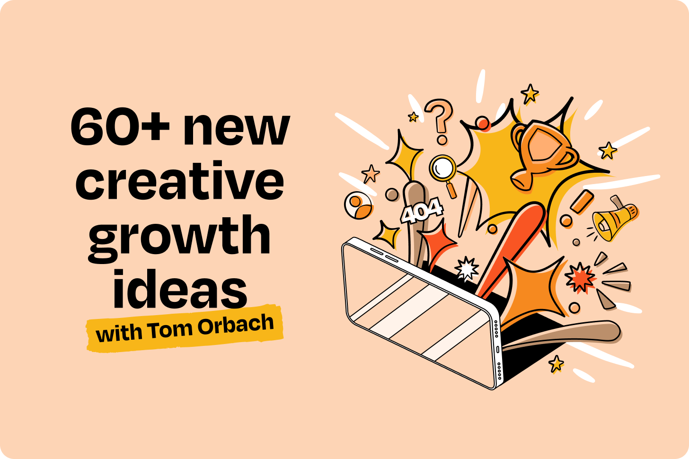

A few years ago, I pitched my VP a growth idea that made *zero* sense on paper. It had nothing to do with our product, we had no way of knowing if it would work, and there was a real chance it would make us look ridiculous. But I ran with the idea anyway, and it became one of the biggest growth wins in the company’s history:

几年前，我向我的 VP 提了一个在纸面上*毫无*道理的增长点子。它跟我们的产品毫无关系，我们无从判断它是否奏效，而且很有可能让我们看起来很可笑。但我还是把这个点子推进了下去，结果它成了公司历史上最成功的增长战绩之一：

We built a fake toy store for cybersecurity executives.

我们为网络安全高管开了一家假玩具店。

We were a startup selling cloud security software, and we just wanted chief information security officers (CISOs) to notice us in a crowd of older, well-known brands.

我们当时是一家卖云安全软件的创业公司，只想在一堆更老牌、更知名的品牌中，让首席信息安全官（CISO）注意到我们。

The store “sold” a [CISO panic button](https://www.cisotopia.com/product-page/ciso-panic-button) and [blindfolds for your legal team](https://www.cisotopia.com/product-page/blindfolds-for-your-legal-team). It cost almost nothing to make, [went viral on Reddit](https://www.reddit.com/r/InternetIsBeautiful/comments/128drz6/this_company_made_a_ciso_toy_store_and_its/), and brought 46,000 visitors in 24 hours. Our goal was to get attention, but our sales team ended up with *hundreds* of qualified leads—and in enterprise security, a single good lead can be worth seven figures.

这家店「卖」的是[CISO 紧急按钮](https://www.cisotopia.com/product-page/ciso-panic-button)和[给你法务团队用的眼罩](https://www.cisotopia.com/product-page/blindfolds-for-your-legal-team)。制作成本几乎为零，却在 [Reddit 上病毒式传播](https://www.reddit.com/r/InternetIsBeautiful/comments/128drz6/this_company_made_a_ciso_toy_store_and_its/)，24 小时内带来 46,000 名访客。我们的目标只是博取关注，但销售团队最终拿到了*数百*条合格线索——而在企业级安全领域，一条优质线索的价值就可能是七位数。

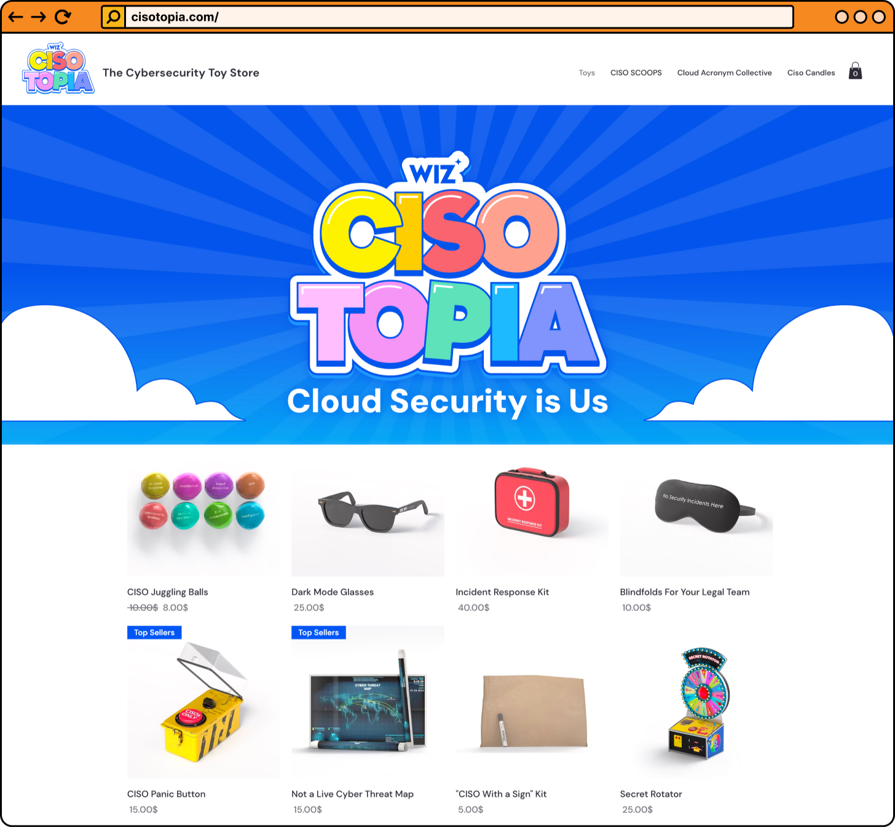

I don’t have to tell you that it’s almost impossible to stand out these days. Everyone seems to be running the same growth playbook: high-production-value video-led launches, paid influencers, SEO/AEO, social, email, maybe some (poorly attended) events. Your competitors are in the same channels, trying to innovate in the same ways.

不用我多说，如今想要脱颖而出几乎是不可能的。所有人似乎都在跑同一套增长打法：高制作水准的视频主导式发布、付费达人、SEO/AEO、社交、邮件，也许还有几场（没什么人来的）活动。你的竞争对手待在同样的渠道里，试图用同样的方式创新。

But attention always goes to what people don’t see coming. The unexpected gets shared for free, remembered for months, and usually costs less than one week of ad spend.

但注意力永远流向人们没预料到的东西。出人意料的东西会被免费分享、被记住好几个月，而且成本通常还不到一周的广告投放。

I’ve pretty much dedicated my life to collecting unexpected growth ideas that worked. Every time I see a startup do something clever, it goes into my list. And most of the time, I dig deeper or even talk to the team behind it: How did they do it? How could I make it even better?

我几乎把全部精力都投在了收集那些奏效的、出人意料的增长点子上。每次看到某家创业公司做了什么聪明事，我就会把它记进清单。而且大多数情况下，我会深挖下去，甚至直接和背后的团队聊：他们是怎么做到的？我能不能做得更好？

After four years of doing this, here are my 64 favorite creative growth tactics, organized by what you’re trying to do:

做了四年之后，以下是我最喜欢的 64 个创意增长战术，按你想达成的目标来归类：

1. I want to generate buzz (without paid ads/influencers) / 1. 我想制造声量（不靠付费广告/达人）
2. I want my launch to make noise / 2. 我想让我的发布炸出声响
3. I want other people to spread the word for me / 3. 我想让别人替我传播
4. I want more leads and conversions / 4. 我想拿到更多线索和转化
5. I want to outsmart my competitors / 5. 我想比竞争对手更聪明
6. I want customers to pay more (and be happy about it) / 6. 我想让客户付更多钱（而且心甘情愿）
7. I want customers to stay forever / 7. 我想让客户永远留下来

You might wonder: Won’t a list like this quickly become stale? Not likely. Each idea has been run by one company, in one niche, usually once. There’s a *lot* of alpha here right now before any of these ideas are overdone. Many people will read this post; very few will actually do them. This is your opportunity.

你可能会想：这样一份清单不会很快过时吗？不太会。每个点子都只被一家公司、在一个细分领域里用过，而且通常只用过一次。在这些点子被用烂之前，眼下这里有*大量*的超额收益。很多人会读这篇文章，但真正会去做的人极少。这就是你的机会。

Also, you definitely don’t need to try all 64. Treat them like lottery tickets—most will do nothing, but one can hit big. Scroll down to a problem you have right now and get inspired by what’s relevant for you. Even better, feed this [Markdown-file version of this post](https://gist.githubusercontent.com/tom-orbach/4dc5f16f2eb61d2648be56563921171d/raw/growth-ideas-structured.md) into your favorite AI agent and brainstorm which ideas make sense for your specific product, brand, and growth goals.

另外，你完全不必把 64 个都试一遍。把它们当成彩票——大多数什么都不会发生，但有一个可能中大奖。往下滑到你当下正面临的问题，从与你相关的部分里找灵感。更好的做法是，把这篇文章的 [Markdown 文件版](https://gist.githubusercontent.com/tom-orbach/4dc5f16f2eb61d2648be56563921171d/raw/growth-ideas-structured.md)喂给你常用的 AI agent，头脑风暴哪些点子适合你特定的产品、品牌和增长目标。

## 1. I want to generate buzz (without paid ads/influencers) 🎉 / 1. 我想制造声量（不靠付费广告/达人）🎉

Attention is the most expensive asset in marketing, and the traditional playbook’s answer is to *buy* it. Everything in this section *earns* it instead, with concepts that are a little outrageous by design: jokes and public stunts that people share on their own. None of them need a launch, a funding round, or any news at all.

注意力是营销里最昂贵的资产，而传统打法的答案是*买*它。这一节里的所有做法则是*赚*它，用的都是有意做得有点出格的概念：笑话，以及人们自发转发的公开作秀。它们都不需要一场发布、一轮融资，甚至不需要任何新闻。

💸 **Spend your marketing budget on anything that isn’t marketing:** Gumloop spent its entire marketing budget filling Vancouver with [street musicians](https://www.linkedin.com/posts/max-brodeur-urbas_what-if-we-spent-our-marketing-budget-on-ugcPost-7473425883563745286-1SVc/) (in front of branded signs) during a conference. Sticker Mule gives [$100,000 a month](https://www.dailygazette.com/leader_herald/news/business/sticker-mule-to-give-away-100-000-a-month-in-marketing-plan/article_b256d994-f5a4-4268-8a9a-c2ded3fecbb2.html) to an influencer who gives strangers $100 bills [on camera](https://www.instagram.com/stickermule). People are tired of ads. Put that budget toward something your audience cares about funding, and you’ll stand out.

💸 **把营销预算花在任何「不是营销」的事情上：** Gumloop 把整笔营销预算花在了一场大会期间——让温哥华满城都是[街头音乐人](https://www.linkedin.com/posts/max-brodeur-urbas_what-if-we-spent-our-marketing-budget-on-ugcPost-7473425883563745286-1SVc/)（站在品牌招牌前）。Sticker Mule 每个月给一位达人 [10 万美元](https://www.dailygazette.com/leader_herald/news/business/sticker-mule-to-give-away-100-000-a-month-in-marketing-plan/article_b256d994-f5a4-4268-8a9a-c2ded3fecbb2.html)，让他[在镜头前](https://www.instagram.com/stickermule)把 100 美元钞票送给陌生人。人们已经厌倦了广告。把这笔预算投到你的受众真正在意的事情上，你就能脱颖而出。

☎️ **Set up a phone number where something cool happens:** Cloaked, a privacy app, set up a hotline that [reads you the sensitive information data brokers are selling about you](https://x.com/keepitcloaked/status/1836797616220246073), a perfect demo for their capabilities. Bland is an AI voice platform, so [their billboard](https://x.com/usebland/status/1785383574419718541) lets potential customers try it out by chatting with one of their agents.

☎️ **开一个电话号码，打过去会发生点酷事：** 隐私应用 Cloaked 设了一条热线，[念出数据经纪商正在贩卖的、关于你的敏感信息](https://x.com/keepitcloaked/status/1836797616220246073)，这本身就是对其能力最完美的演示。Bland 是一家 AI 语音平台，所以[它的广告牌](https://x.com/usebland/status/1785383574419718541)让潜在客户直接和它的 agent 对话，现场试用。

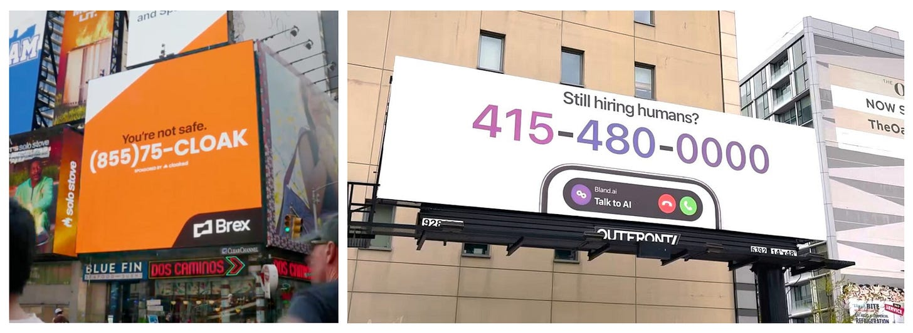

**🎁** **Offer an amazing prize, with a ridiculous requirement:** Browserbase’s CEO [posted](https://x.com/pk_iv/status/1959425430626202065), “The easiest way to get Browserbase equity is to join our company. The second easiest way is by getting a Browserbase tattoo.” He even shipped [a joke calculator](https://v0-browserbase-tattoo-calculator.vercel.app/) for it (face tattoo gets 1% equity!). Or, to pull from a very different industry: a Broadway show called *My First Time* offered free tickets . . . [if you proved you were a virgin](https://www.today.com/popculture/virgins-offered-free-tickets-new-york-show-wbna19733068) (you had to take a lie detector test 😳). Only a few people will participate, but tactics like this generate content that attracts everyone else.

**🎁** **给出一份惊人的奖品，配上一个荒唐的领取条件：** Browserbase 的 CEO [发帖说](https://x.com/pk_iv/status/1959425430626202065)：「拿到 Browserbase 股权最容易的方式是加入我们公司。第二容易的方式，是纹一个 Browserbase 的纹身。」他甚至为此上线了[一个开玩笑的计算器](https://v0-browserbase-tattoo-calculator.vercel.app/)（纹在脸上可拿 1% 股权！）。或者换一个完全不同的行业：一部叫 *My First Time* 的百老汇演出提供免费门票……[前提是你能证明自己是处子之身](https://www.today.com/popculture/virgins-offered-free-tickets-new-york-show-wbna19733068)（你得接受测谎仪测试 😳）。只有极少数人会参与，但这类战术会产出内容，从而吸引其他所有人。

🎈 **Go anti-professional:** One of [the most viral LinkedIn posts of all time](https://www.linkedin.com/posts/tosstheheadshot_why-i-changed-my-linkedin-profile-pic-recently-activity-6712372347107643392-MPaN/) came from a manager who swapped her corporate headshot for a casual, no-makeup photo. Pick a norm of your own and break it in public. You might talk about how much roles actually pay or admit that a big launch didn’t actually meet internal expectations. People are tired of perfectly curated, glossy exteriors of the professional world, so a bit of human messiness will stand out.

🎈 **走反职业化路线：** [史上传播最广的 LinkedIn 帖子](https://www.linkedin.com/posts/tosstheheadshot_why-i-changed-my-linkedin-profile-pic-recently-activity-6712372347107643392-MPaN/)之一，来自一位把自己的职业头像换成一张随意、素颜照片的经理。挑一条你们行业的「规矩」，公开打破它。你可以聊聊各岗位实际给多少钱，或者坦承一次大发布其实并没有达到内部的预期。人们已经厌倦了职场世界里那种精修到完美、光鲜体面的外壳，所以一点点「人的凌乱」反而会显得突出。

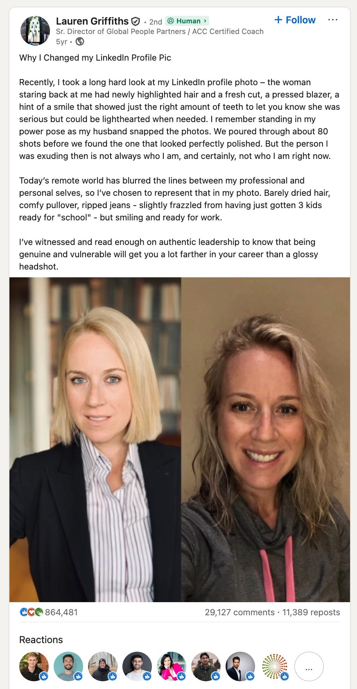

🚯 **Be loudly anti-AI: **AI is obviously the biggest trend in the tech world, so if you’re willing to cut against the current, people will notice. Procreate’s CEO took a major stand on this ([“I really f***ing hate generative AI”](https://x.com/Procreate/status/1825311104584802470)) and has shaped the company’s strategy around it. This level of commitment has to be company-wide, but when it works, it really works—that one video got more than 10 million views and now they’re known for it. If you’re going to avoid using AI to build your product, say it out loud and get public credit.

🚯 **大声反 AI：** AI 显然是科技圈最大的趋势，所以如果你愿意逆流而上，人们会注意到。Procreate 的 CEO 在这件事上明确站队（[「我真的他妈的讨厌生成式 AI」](https://x.com/Procreate/status/1825311104584802470)），并围绕这一点塑造了公司策略。这种级别的投入必须是全公司层面的，但一旦奏效，就真的非常奏效——那条视频获得了超过 1000 万次观看，如今他们因此为人所知。如果你打算在产品构建中避开 AI，就大声说出来，把公开的功劳拿到手。

😂 **Run a meme account for your industry:** The CEO of 1up, an AI platform for sales teams, has publicly said that the company gets [a third of their customer leads from memes](https://techcrunch.com/2025/01/22/sales-knowledge-automation-platform-1up-gets-a-third-of-its-customer-leads-from-memes/). tl;dv has also brought in [as much as a third of signups from social](https://thetiktoksauce.substack.com/p/how-tldv-cracked-b2b-tiktok-with), like their TikTok sketch-comedy series roasting corporate meeting culture. You don’t have to be standup-comic funny to make this work, but you do need to understand the very specific ways your target audience thinks and talks.

😂 **为你的行业运营一个梗号：** 面向销售团队的 AI 平台 1up 的 CEO 公开表示，公司[三分之一的客户线索来自梗图](https://techcrunch.com/2025/01/22/sales-knowledge-automation-platform-1up-gets-a-third-of-its-customer-leads-from-memes/)。tl;dv 也有[多达三分之一的注册量来自社交媒体](https://thetiktoksauce.substack.com/p/how-tldv-cracked-b2b-tiktok-with)，比如他们在 TikTok 上那套嘲讽企业会议文化的短剧系列。要做成这件事，你不必像脱口秀演员那样好笑，但你必须理解目标受众思考和说话的非常具体的方式。

🐵 **Hire a fictional character:** [Trevor From Torq](https://www.linkedin.com/in/trevor-from-torq-241336349/) is a fictional junior media intern played by an actor who “works at” Torq, a cybersecurity company. “Trevor” posts memes on LinkedIn and gets stopped for photos at conferences. Especially in old-school or stuffy industries, a character can say things an official brand (or exec) can’t. Before hiring an actor, just try a new social media account that can test out a different style from your main profile.

🐵 **雇一个虚构角色：** [Trevor From Torq](https://www.linkedin.com/in/trevor-from-torq-241336349/) 是由演员扮演的虚构初级媒介实习生，「就职于」网络安全公司 Torq。「Trevor」在 LinkedIn 上发梗图，在大会现场还会被人拦下来合影。尤其是在老派或沉闷的行业里，一个角色可以说出官方品牌（或高管）不能说的话。在雇演员之前，不妨先开一个新的社媒账号，试试和主账号不同的风格。

✈️ **Post a crazy job listing that doubles as a story:** Rilla, an 80-person AI startup most people had never heard of, got a ton of attention (including press coverage by *Fortune*) because of its job listings: a $1,500/month rent stipend for anyone living within 15 minutes of the office, right alongside a blunt warning about 70-hour weeks. Anthropic [made headlines for a week](https://fortune.com/2025/02/04/anthropic-tells-job-candidates-dont-use-ai-employer-trend) for telling people to *not* use AI assistants during their application process. Review your careers page or job description templates and add something that is startlingly unique, that only your company would say.

✈️ **发一则疯狂的招聘启事，让它同时成为一个故事：** Rilla 是一家 80 人、大多数人从没听说过的 AI 创业公司，却因为招聘启事拿到了大量关注（包括 *Fortune* 的报道）：只要你住在离办公室 15 分钟路程内，就给每月 1500 美元的房租补贴，紧挨着的还有一句关于每周工作 70 小时的直白警告。Anthropic 因为建议求职者*不要*在申请流程中使用 AI 助手而[上了整整一周的头条](https://fortune.com/2025/02/04/anthropic-tells-job-candidates-dont-use-ai-employer-trend)。审视一下你的招聘页面或职位描述模板，加进去一些惊人的、只有你们公司才会说出来的东西。

🎭 **Give your whole team fake job titles on LinkedIn on the same day:** This can’t be used too often, but LinkedIn boosts job changes with extra visibility. Tl;dv [“promoted”](https://www.marketingideas.com/i/179064436/1) all 50+ employees to CEO at once, leading to 50+ “new job” notifications hitting thousands of feeds. Plus, it set the stage for [hilarious “I’m quitting my role as CEO” posts](https://www.linkedin.com/posts/reneeeshaw_i-quit-i-quit-tldv-as-ceo-frankly-the-share-7392117134660825088-Wyhu/?utm_source=share&utm_medium=member_desktop&rcm=ACoAAAYPyQEBmNh-6pwptoS2brWzMTc7OiO1L3Q). 😂

🎭 **同一天给整个团队在 LinkedIn 上换上假职位：** 这招不能太频繁地用，但 LinkedIn 会给职位变动额外的曝光加权。Tl;dv 一次性把全部 50 多位员工[「提升」](https://www.marketingideas.com/i/179064436/1)成了 CEO，于是 50 多条「新工作」通知涌进了成千上万人的信息流。而且，这还为[一堆好笑的「我要辞去 CEO 一职」帖子](https://www.linkedin.com/posts/reneeeshaw_i-quit-i-quit-tldv-as-ceo-frankly-the-share-7392117134660825088-Wyhu/?utm_source=share&utm_medium=member_desktop&rcm=ACoAAAYPyQEBmNh-6pwptoS2brWzMTc7OiO1L3Q)铺好了舞台。😂

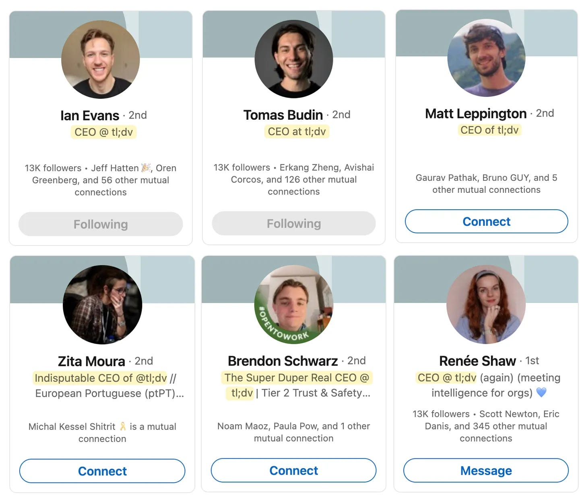

📈 **Use your product’s data to build an industry trend report:** This is a great way to get regular press coverage. Carta used its massive collection of cap tables to create its [State of Private Markets](https://carta.com/data/) report, which tech publications love to quote. When the [Ramp AI Index](https://ramp.com/data/ai-index) showed Anthropic passing OpenAI in workplace adoption, [Axios built a big story around it](https://www.axios.com/2026/05/13/anthropic-openai-workplace-ai-adoption). But you don’t have to start with a massive report. Just make a habit of publicly posting interesting (anonymized!) stats that your team uncovers.

📈 **用你产品的数据做一份行业趋势报告：** 这是获得持续媒体报道的绝佳方式。Carta 用它庞大的股权结构表数据库做出了 [State of Private Markets](https://carta.com/data/) 报告，科技媒体特别喜欢引用。当 [Ramp AI Index](https://ramp.com/data/ai-index) 显示 Anthropic 在工作场景采用率上反超 OpenAI 时，[Axios 围绕它做了一篇大报道](https://www.axios.com/2026/05/13/anthropic-openai-workplace-ai-adoption)。但你不必一上来就做一份宏大的报告，只要养成习惯，公开分享你团队发现的有趣（且已匿名化！）数据就够了。

✏️ **Win those “+reddit” searches:** People add “reddit” to Google searches to go straight to crowdsourced wisdom and skip the SEO trash. There are lots of ways to do this: start question threads that match what people search, be the first helpful comment when someone posts about problems you solve, host AMAs, and share free resources.

✏️ **赢下那些「+reddit」的搜索：** 人们在 Google 搜索里加上「reddit」，是为了直接拿到众包智慧、跳过那些 SEO 垃圾。做法有很多：发起与人们搜索词相匹配的提问帖，当有人发帖提到你能解决的问题时做第一个有用的评论，办 AMA，以及分享免费资源。

🎡 **Make “the world’s first {familiar thing} for {your audience}”:** This is how we got the toy store I mentioned above (I’ve also done a [musical for CISOs](http://cisomusical.com/) and a [meditation app for CISOs](http://cisoasis.com/)). Take something everyone recognizes—a store, a dating app, a comic book—and make it absurdly specific to your niche. Your target audience will love it and the mental mismatch will make everyone else share it. Spotify’s ad team did [Spreadbeats](https://www.youtube.com/watch?v=Zc-U6PM9ilE), the world’s first music video in Excel. Their target audience (media planners) loved it *and* [they won a bunch of advertising awards](https://newsroom.spotify.com/2024-06-21/thats-a-wrap-on-cannes-lions-2024-inside-the-awards-spotify-beach-action-and-more/), which made them even more visible to those ad buyers.

🎡 **做「世界上第一个为{你的受众}而设的{熟悉的东西}」：** 我上面提到的那家玩具店就是这么来的（我还做过[给 CISO 的音乐剧](http://cisomusical.com/)和[给 CISO 的冥想应用](http://cisoasis.com/)）。拿一个所有人都认得的东西——一家店、一个约会应用、一本漫画——把它做得荒谬地贴合你的细分领域。你的目标受众会喜欢它，而这种认知上的错位会让其他人也去转发。Spotify 的广告团队做了 [Spreadbeats](https://www.youtube.com/watch?v=Zc-U6PM9ilE)，世界上第一支用 Excel 做的音乐视频。他们的目标受众（媒介策划人员）非常喜欢，*而且*[他们拿下了一堆广告奖项](https://newsroom.spotify.com/2024-06-21/thats-a-wrap-on-cannes-lions-2024-inside-the-awards-spotify-beach-action-and-more/)，这让他们在那些广告买家面前更显眼了。
## 2. I want my launch to make noise 🚀 / 2. 我想让我的发布炸出声响 🚀

A product announcement is rarely interesting on its own, even when the product is. Every idea in this section adds a reason to pay attention that has nothing to do with your feature list.

产品发布本身很少有趣，哪怕产品本身很有趣。这一节里的每个点子，都会加上一个与你的功能列表无关的「值得关注的理由」。

🕵️ **Launch a rumor instead of a product:** For months, Instinct (an invite-only personal AI assistant) was basically just a waitlist page: no team, no screenshots, and no price. But a few VCs and well-known founders got invites, and they started posting things like [“as close to THE personal AI assistant we’ve all been waiting for”](https://x.com/JasonrShuman/status/2088639230129918355) with no demo, because there was nothing public to demo. The replies were filled with people begging for an invite. By the time the founder [finally introduced himself](https://x.com/noahrshinn/status/2092691344456351744), Instinct had already [raised $350 million in total funding and reached a $2.5 billion valuation](https://techcrunch.com/2026/08/26/viral-ai-startup-instinct-has-raised-350-million-at-a-2-5-billion-valuation/). You can run the small version: launch invite-only, give early access to a few people your audience respects, and ask them to post what they think without showing the product. That’s how you seed exclusivity, hype, mystery, and a dash of FOMO.

🕵️ **发布一则传言，而不是一款产品：** 有好几个月，Instinct（一款仅限邀请的个人 AI 助手）基本上只是一个等候名单页面：没有团队介绍、没有截图、没有价格。但有几位 VC 和知名创始人拿到了邀请，他们开始发帖说[「这几乎就是我们一直在等的那款个人 AI 助手」](https://x.com/JasonrShuman/status/2088639230129918355)——没有演示，因为压根没有公开的东西可以演示。评论区里全是求邀请的人。等到创始人[终于自我介绍](https://x.com/noahrshinn/status/2092691344456351744)时，Instinct 已经[累计融资 3.5 亿美元、估值达到 25 亿美元](https://techcrunch.com/2026/08/26/viral-ai-startup-instinct-has-raised-350-million-at-a-2-5-billion-valuation/)。你可以做小规模的版本：采用邀请制发布，把早期使用权给几位你的受众所尊重的人，请他们发帖说说看法、但不展示产品。这样就能种下稀缺感、热度、神秘感，还有一点点错失恐惧（FOMO）。

🎪 **Livestream the launch:** A startup called Clicky teased their launch with a video pointing to a [Luma page](https://luma.com/f8pizas0) (yes, the IRL events app), got over 1,000 RSVPs, then went live on YouTube walking through the product to an already-stoked chat. Plus, they cut the reactions into a 25-second [highlight reel](https://x.com/heyclicky/status/2048222801434398858), which meant a better launch day *and* tons of great follow-on content.

🎪 **把发布会做成直播：** 一家叫 Clicky 的创业公司用一段视频预告发布，视频指向一个 [Luma 页面](https://luma.com/f8pizas0)（没错，就是那个线下活动应用），拿到 1000 多个 RSVP，然后在 YouTube 上直播，带着已经被点燃的聊天区走了一遍产品。此外，他们还把观众反应剪成了一条 25 秒的[高光视频](https://x.com/heyclicky/status/2048222801434398858)，既让发布日更出彩，*也*产出了大量优质的后续内容。

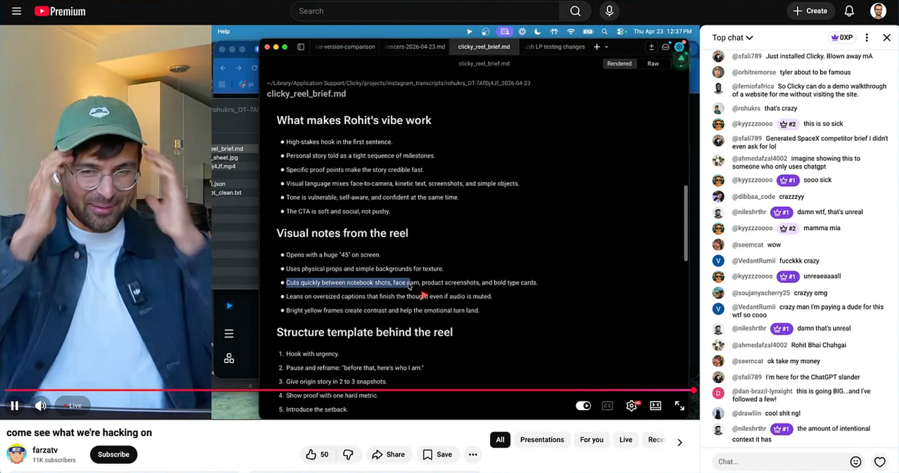

🤫 **Build in not-so-public:** What’s better than building in public? Building alongside a private WhatsApp or Telegram group that makes early users feel like insiders. Base44’s founder called creating early-user groups [“one of my best decisions”](https://x.com/MS_BASE44/status/1995912466145165701) on the way to an [$80 million acquisition](https://techcrunch.com/2025/06/18/6-month-old-solo-owned-vibe-coder-base44-sells-to-wix-for-80m-cash/) six months after starting. Those insiders give you critical early feedback, but they’ll also be a guaranteed source of hype when you launch.

🤫 **「半公开」地做产品：** 比公开构建更好的做法是什么？是同时在一个私密的 WhatsApp 或 Telegram 群里构建，让早期用户感觉自己像内部人。Base44 的创始人把建立早期用户群称为[「我做过最好的决定之一」](https://x.com/MS_BASE44/status/1995912466145165701)，而这家公司启动六个月后就以[8000 万美元被收购](https://techcrunch.com/2025/06/18/6-month-old-solo-owned-vibe-coder-base44-sells-to-wix-for-80m-cash/)。这些内部人会给你关键的早期反馈，但在你发布时，他们也是板上钉钉的热度来源。

👀 **Use incomplete information to pull on people’s curiosity:** Ahead of a big partnership announcement, Lovable posted “coming today…” with the other org’s logo [blurred out](https://x.com/Lovable/status/1980537626315878590). People jumped into the replies to share their guesses, and this *teaser post* ended up with 2.2 million views. By the time they made the big reveal (they’d partnered with Shopify) a few hours later, there was already buzz.

👀 **用不完整的信息勾起好奇心：** 在一场重大合作公布之前，Lovable 发了一条「今天就来……」，配上[被打了马赛克](https://x.com/Lovable/status/1980537626315878590)的对方 logo。人们冲进评论区分享自己的猜测，这条*预告帖*最终拿到了 220 万次浏览。等到几小时后他们正式揭晓（合作对象是 Shopify）时，热度已经起来了。

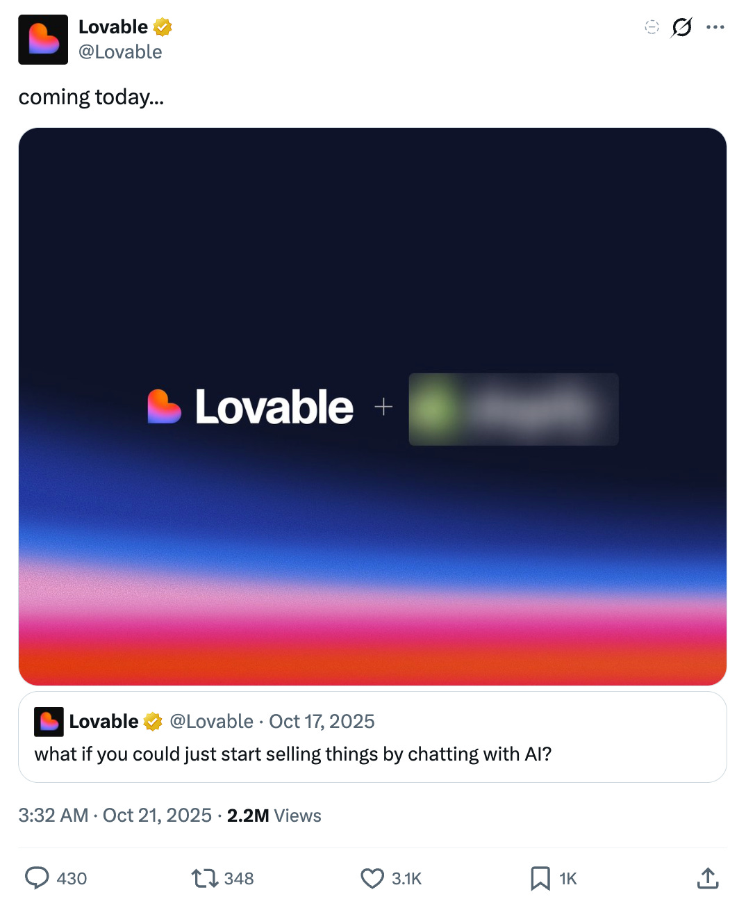

🪖 **Recruit a micro-influencer army:** Create an open [ambassador program](https://tldv.io/ambassador-program/) with no follower requirements and no content approval. Anyone can join, post about you, and get paid based on impressions. This opens things up to fans of your product who have a good instinct for generating attention, even if they don’t already have a large audience. Tl;dv pays $100 per 20,000 views (capped at $700 per post). This has helped them consistently bring in more than 10 million impressions per month. A hundred small creators can often out-distribute one big sponsorship, for a fraction of the price.

🪖 **招募一支微型达人大军：** 做一个开放的[大使计划](https://tldv.io/ambassador-program/)，不设粉丝门槛，也不做内容审核。任何人都能加入，发布关于你的内容，按曝光量拿钱。这让那些对你产品有热情、对制造注意力有敏锐直觉的粉丝也能参与进来，哪怕他们本来没什么粉丝体量。Tl;dv 按每 2 万次浏览付 100 美元（单条帖子最高 700 美元）。这帮助他们稳定做到每月超过 1000 万次曝光。一百个小创作者的分发能力，常常能盖过一个大型赞助，而成本只是其零头。

🎟️ **Let waitlist members cut the line:** Show each signup their exact place in line, and move them up for every friend they bring. Robinhood made this move famous a few years ago, when they landed [nearly 1 million signups before launch](https://viral-loops.com/blog/how-robinhoods-referral-built-a-1m-user/), with each member bringing in three more on average. It scales all the way down: I ran a waitlist-cutting promo before launching my newsletter, which helped drive a bunch of my early subscribers.

🎟️ **让等候名单上的人能插队：** 给每个注册者显示他的确切排队位置，每带来一个朋友就往前挪。Robinhood 几年前让这一招出了名，他们在发布前拿下[将近 100 万个注册](https://viral-loops.com/blog/how-robinhoods-referral-built-a-1m-user/)，平均每个成员带来三个人。这招往下也能用：我在自己的通讯上线前办过一次插队活动，帮我拉来了一批早期订阅者。

🙋 **Launch from the founder’s account, never only the company page:** This is obvious to some, but it’s so important that I have to include it. Personal profiles get two to three times the organic reach of company pages. DuckDuckGo launched with the founder’s casual [“What do you think of my new search engine?”](https://news.ycombinator.com/item?id=315142) post. If you have the budget, run [thought-leader ads](https://business.linkedin.com/advertise/ads/sponsored-content/thought-leader-ads) on LinkedIn on the founder’s post instead of boosting the corporate announcement.

🙋 **从创始人账号发布，绝不要只发公司主页：** 对一些人来说这是常识，但它太重要了，我必须写进来。个人主页的自然触达量是公司主页的两到三倍。DuckDuckGo 就是靠创始人那句随意的[「你们觉得我的新搜索引擎怎么样？」](https://news.ycombinator.com/item?id=315142)完成发布的。如果你有预算，就在 LinkedIn 上针对创始人的帖子投放[思想领袖广告](https://business.linkedin.com/advertise/ads/sponsored-content/thought-leader-ads)，而不是去助推公司层面的公告。

🎣 **Get reporters to pitch ***you*** with the “Journalist Bait” framework**: I know from personal experience—I’ve been featured in *Business Insider*, *The Guardian*, and [BuzzFeed](https://www.buzzfeed.com/meganeliscomb/ai-linkedin-cringe-post-generator) without pitching anyone. Your company update is not news to a journalist. They only care about *spotting the next big trend*. Reframe your product release as a “proof of a cultural shift” and post it on social. Let them find you.

🎣 **用「记者诱饵」框架让记者来***找你***：** 这是我的亲身经验——我从没主动推销过，却被 *Business Insider*、*The Guardian* 和 [BuzzFeed](https://www.buzzfeed.com/meganeliscomb/ai-linkedin-cringe-post-generator) 报道过。你对记者来说，公司动态根本不算新闻。他们只在乎*发现下一个大趋势*。把你的产品发布重新包装成「某种文化转向的证据」，然后发到社交媒体上，让他们来找你。

## 3. I want other people to spread the word for me 📱 / 3. 我想让别人替我传播 📱

Word of mouth is sometimes mistaken for luck. But it’s closer to a design problem: give your happiest users something that makes them look good when they share it, and they’ll do your marketing for you.

口碑有时会被误认为是运气。但它更像一个设计问题：给你最满意的用户一件分享出去会让他们显得很牛的东西，他们就会替你完成营销。

🏆 **Ship your top users a physical trophy:** YouTube sends creators [Play Button plaques](https://support.google.com/youtube/answer/7682560) at 100K, 1M, and 10M subscribers. OpenAI has mailed its API users a [custom metal “token”](https://community.openai.com/t/tokens-of-appreciation-milestone-awards-for-openai-api-token-usage/1361639) at 10 billion, 100 billion, and 1 trillion tokens processed. Everyone wants to show off their accomplishments, and you know the people who receive one of these are going to share a pic on social media (plus put it on their desk or office wall forever).

🏆 **给你的头部用户寄一座实体奖杯：** YouTube 会在创作者达到 10 万、100 万和 1000 万订阅时寄出 [Play 按钮奖牌](https://support.google.com/youtube/answer/7682560)。OpenAI 会向处理量达到 100 亿、1000 亿和 1 万亿 token 的 API 用户邮寄一枚[定制金属「token」](https://community.openai.com/t/tokens-of-appreciation-milestone-awards-for-openai-api-token-usage/1361639)。每个人都想展示自己的成就，而且你知道，拿到这东西的人一定会在社交媒体上晒照片（并把它永远摆在桌上或办公室墙上）。

🖼️ **Give certificates with their name in big letters:** When a customer hits a milestone, send a digital certificate built around their name. Again: people share what makes them look good. When we started doing this at Wiz, customer social shares jumped 300%. Bonus points for sending one to their boss too (“Awarded for building the kind of team that includes [Name]”).

🖼️ **发一份把他们的名字印得很大的证书：** 当客户达成某个里程碑时，寄一份以他们的名字为中心设计的电子证书。还是那句话：人们会分享那些让自己显得厉害的东西。我们在 Wiz 开始这么做之后，客户的社交媒体分享量涨了 300%。把证书也寄给他们的老板还能加分（「表彰你打造了一支包含[姓名]这样的成员的团队」）。

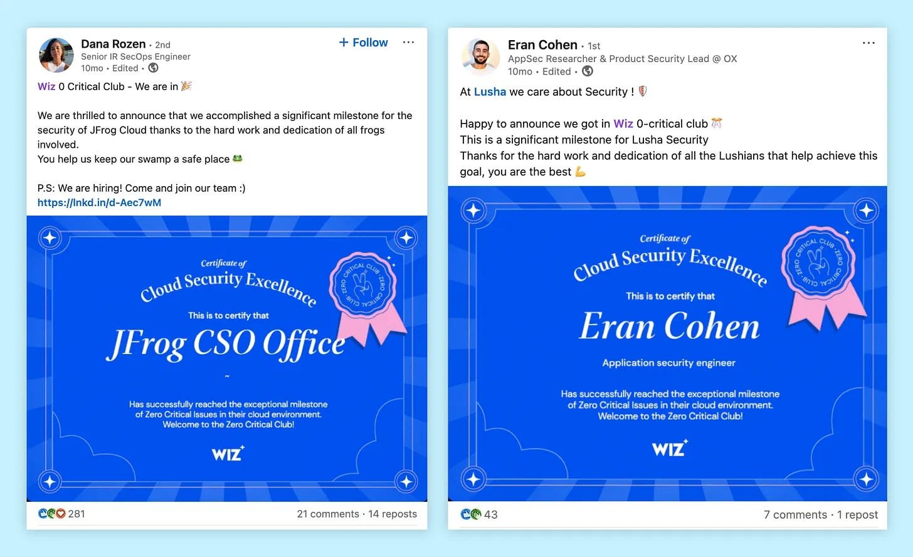

🎧 **Ask 20 experts one tiny question, then publish the results and give them credit:** Email the best-known people in your field with one small ask. Like this: “What’s your favorite song to work to?” Then build a Spotify playlist with all of them, post it, and shout out each expert. [I do this every year](https://www.linkedin.com/posts/wizsecurity_suns-out-funs-out-and-so-is-our-activity-7221142514483757057-HZXU/) with security celebrities, and all of them share it, every time.

🎧 **问 20 位专家一个极小的问题，然后公布结果并给他们署名：**给你的领域里最知名的人发邮件，只提一个小请求。比如：「你最喜欢工作时听哪首歌？」然后把这些歌做成一个 Spotify 播放列表，发出来，并一一 @ 每位专家。[我每年都这么做](https://www.linkedin.com/posts/wizsecurity_suns-out-funs-out-and-so-is-our-activity-7221142514483757057-HZXU/)，找的是安全圈的名人，每一次，他们全都会转发。

📸 **Put your logo where people take screenshots:** X redesigned their interface so that when you screenshot any post, the “Ask Grok” button immediately [changes to the logo “X.com.”](https://x.com/sergeynazarovx/status/1967173366034604064) Every screenshot is now branded. Find what people screenshot most in your product (a result, a score, a report) and make sure your name or brand is right there.

📸 **把你的 logo 放在人们会截图的地方：** X 重新设计了界面，当你截取任何帖子时，「Ask Grok」按钮会立刻[变成「X.com」的 logo](https://x.com/sergeynazarovx/status/1967173366034604064)。现在每一张截图都带着品牌。找出用户在你的产品里最爱截图的东西（一个结果、一个分数、一份报告），确保你的名字或品牌就在那里。

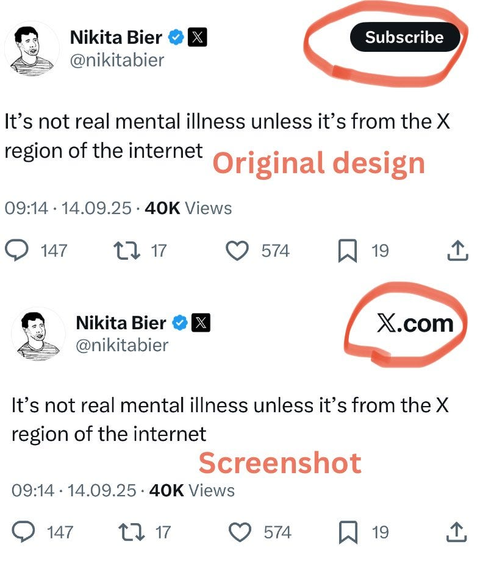

👀 **Make using your product a public act:** To save a thread on X, Readwise users [reply “@readwise save thread”](https://docs.readwise.io/readwise/docs/importing-highlights/twitter) in public, under the thread itself. Every save is a tiny ad, posted by a happy user, shown to everyone else reading the replies. Senja’s free testimonial widgets carry a small “Powered by Senja” link, so every free user’s website automatically advertises Senja—that’s [tens of thousands of views a month, and hundreds of signups](https://www.indiehackers.com/post/how-a-young-entrepreneur-hit-32k-mrr-with-product-led-growth-and-seo-8nbqKzfYAYzcGVjhRb4M). I call this word-of-sight marketing: if your product has an action that people repeat daily, move it where others can see it.

👀 **让使用你的产品成为一个公开动作：** 要在 X 上保存一条长贴，Readwise 用户会[公开回复「@readwise save thread」](https://docs.readwise.io/readwise/docs/importing-highlights/twitter)，就发在贴子下面。每一次保存都是一条小小的广告，由满意的用户发布，展示给所有在读评论的人。Senja 的免费评价组件带一个小小的「Powered by Senja」链接，于是每个免费用户的网站都自动为 Senja 打广告——那是[每月数万次浏览和数百个注册](https://www.indiehackers.com/post/how-a-young-entrepreneur-hit-32k-mrr-with-product-led-growth-and-seo-8nbqKzfYAYzcGVjhRb4M)。我把这叫「视线所及的口碑营销」（word-of-sight marketing）：如果你的产品有一个用户每天都会重复的动作，就把它挪到别人看得见的地方。

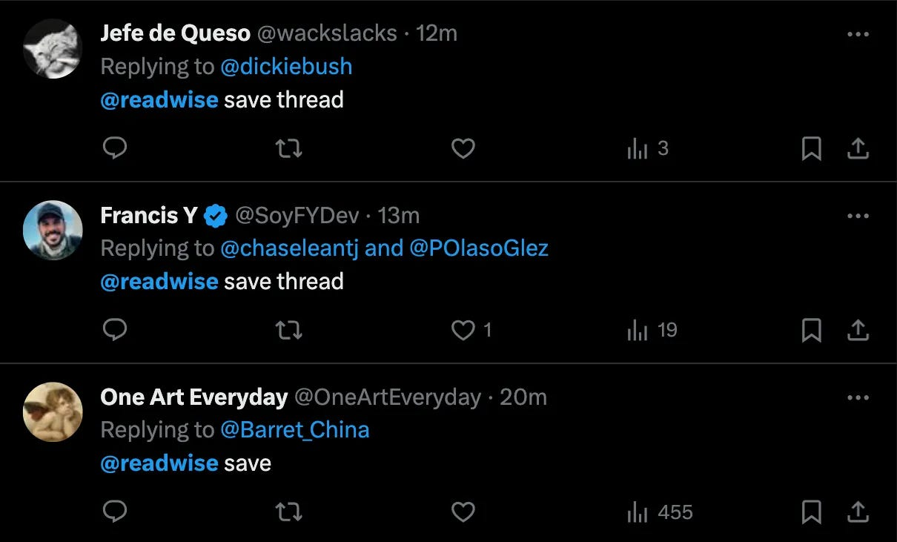

🏅 **Run weird world records and halls of fame:** Clay celebrates the users [who used the product in the strangest place](https://www.clay.com/world-records) (underwater, up a mountain, on jet skis). Of course every featured winner posts about it. Duolingo’s users wanted their streaks celebrated so badly they built a [hall of fame](https://duome.eu/) themselves, now tracking more than 373,000 members.

🏅 **搞一些奇怪的世界纪录和名人堂：** Clay 会表彰那些[在离奇地点使用产品](https://www.clay.com/world-records)的用户（水下、山顶、水上摩托上）。当然，每一位上榜的获奖者都会发帖炫耀。Duolingo 的用户太希望自己的连续打卡被庆祝了，以至于他们自己建了一个[名人堂](https://duome.eu/)，如今已经记录了超过 37.3 万名成员。

🧶 **Offer swag that makes people feel like insiders:** Most swag is so generic it’s invisible. No one is going to notice that 2mm logo on a crappy pen. We’ve been giving out an ugly Christmas sweater [that people beg for](https://www.reddit.com/r/hacking/comments/1p8alga/ugly_sweater_from_wiz/) (1,000 comments on one [giveaway](https://www.linkedin.com/feed/update/urn:li:activity:7130540128736792576/) post). What’s the difference? The sweater was covered with inside jokes and Easter eggs that only cloud security engineers would get. Just like [Anthropic’s “thinking” hats](https://www.marketingideas.com/p/what-to-do-if-your-marketing-sucks), the key to nailing this is to make the swag say something about the person who wears it.

🧶 **做出让人有「内部人」感觉的周边：** 大多数周边都太普通，普通到根本看不见。没人会注意到一支劣质笔上那 2 毫米的 logo。我们一直在发的是一件[被人求着要](https://www.reddit.com/r/hacking/comments/1p8alga/ugly_sweater_from_wiz/)的丑圣诞毛衣（一条[赠送](https://www.linkedin.com/feed/update/urn:li:activity:7130540128736792576/)帖下就有 1000 条评论）。差别在哪？这件毛衣上满是只有云安全工程师才懂的圈内梗和彩蛋。就像[Anthropic 的「thinking」帽子](https://www.marketingideas.com/p/what-to-do-if-your-marketing-sucks)一样，把周边做好的关键在于：让这件周边说出关于穿着它的人的一些事。

**🎩 Publish a “Top 25” list of leaders for your industry:** At [Mine](https://mineos.ai/) (my previous startup), our target audience was data protection officers. So we built a [Top DPOs](https://www.marketingideas.com/p/praise-led-marketing) hall of fame. When we told each featured person that they had made the list, every single one of them shared it.

**🎩 发布一份你所在行业的「Top 25 领袖」榜单：** 在 [Mine](https://mineos.ai/)（我上一家创业公司），我们的目标受众是数据保护官。于是我们做了一个 [Top DPOs](https://www.marketingideas.com/p/praise-led-marketing) 名人堂。当我们逐一告知每位入选者他们上榜了，他们每一个人都转发了。

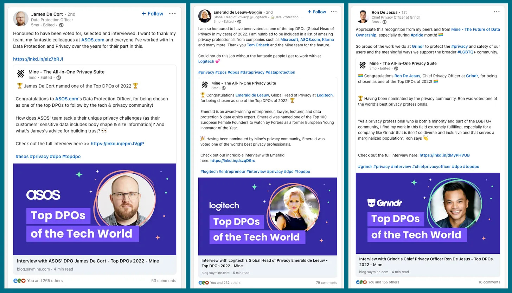

🐙 **Give your power users a mascot:** GitHub used [Octocat](https://myoctocat.com/) to turn one of the most boring categories imaginable (version control!) into an identity that people actively choose to put on laptop lids and hoodies.

🐙 **给你的高活跃用户一个吉祥物：** GitHub 用 [Octocat](https://myoctocat.com/) 把一个你能想象到的最无聊的品类（版本控制！）变成了一种身份标识，让人们主动把它贴到笔记本盖和连帽衫上。
## 4. I want more leads and conversions 💰 / 4. 我想拿到更多线索和转化 💰

You don’t need another form or another ad campaign to get more leads. Some of the best sources are places you never think about, like your 404 page or your Zoom settings. All these ideas leverage surfaces that we all touch every day but, for some reason, don’t consider to be platforms.

要拿到更多线索，你不需要再加一个表单或再做一轮广告投放。一些最好的来源是你从没想过的地方，比如你的 404 页面或你的 Zoom 设置。这些点子利用的，都是我们每天都会碰、却不知为何不把它们当平台看的界面。

⚡ **Use your product on dream customers, then send them the results:** Pick 8 to 10 companies that you’d love to have as customers and give away free value. Send them the output of your product (the report, the audit, the analysis, etc.), without them even asking. Much better than asking them for a demo call. Vanta’s founder [sent Segment a custom SOC 2 gap-assessment analysis](https://review.firstround.com/vantas-path-to-product-market-fit/) before Vanta even had a product, and Segment became the design partner that shaped the company. (For B2C: Try this out on target celeb users.)

⚡ **把产品用在你的梦想客户身上，然后把结果发给他们：** 挑 8 到 10 家你最想拿下的公司，免费送价值。把他们没要过的、你产品的产出（报告、审计、分析等）直接寄给他们。这比约他们开一次演示会好得多。Vanta 的创始人在 Vanta 连产品都还没有的时候，就[给 Segment 发了一份定制的 SOC 2 差距评估分析](https://review.firstround.com/vantas-path-to-product-market-fit/)，后来 Segment 成了塑造这家公司的设计合作伙伴。（做 B2C 的话：拿目标明星用户来试试这招。）

🗣️ **Make Zoom redirect to your testimonials page when calls end: **Zoom has a buried setting ([post-attendee URL](https://support.zoom.com/hc/en/article?id=zm_kb&sysparm_article=KB0070304)) that automatically opens a URL of your choice in attendees’ browsers, in the background, the second a call ends. My team points this at our [testimonials page](https://www.wiz.io/reviews), so every demo closes with the prospect getting some social proof to browse through. Set yours to the page you most want prospects to see next.

🗣️ **让 Zoom 在通话结束时跳转到你的客户评价页：** Zoom 有一个藏得很深的设置（[post-attendee URL](https://support.zoom.com/hc/en/article?id=zm_kb&sysparm_article=KB0070304)），能在通话结束的那一秒，自动在参会者的浏览器里后台打开一个你指定的 URL。我的团队把它指向我们的[客户评价页](https://www.wiz.io/reviews)，于是每一次演示结束时，潜在客户手里都多了一份可以浏览的社会认同。把它设成你最想让潜在客户接着看到的那个页面。

💌 **Change your popup’s “No thanks” to “Maybe later”:** Wikimedia does this on its [donation popups](https://meta.wikimedia.org/wiki/Fundraising/2024-25_Report#SMS), part of an operation that raised $184 million last year. Copy it in your own popups: swap your decline buttons for “Maybe later,” and when someone clicks, show one more small box: “Want us to remind you? Leave your email.”

💌 **把弹窗上的「不用了，谢谢」改成「以后再说」：** 维基媒体基金会在其[捐赠弹窗](https://meta.wikimedia.org/wiki/Fundraising/2024-25_Report#SMS)上就是这么做的，而这是他们去年筹得 1.84 亿美元的那套运作的一部分。照搬到你的弹窗上：把拒绝按钮换成「以后再说」，当有人点击时，再弹出一个小方框：「想让我们提醒你吗？留下你的邮箱。」

🌫️ **Put a blurred screenshot behind your signup form:** One of the weirdest A/B tests I ever ran: adding a blurry product screenshot behind the signup form boosted conversion 25%. It triggers curiosity and a progress illusion (you feel like you’re almost inside).

🌫️ **在注册表单背后放一张模糊的产品截图：** 我做过最奇怪的 A/B 测试之一：在注册表单背后加一张模糊的产品截图，转化率提升了 25%。它会激发好奇心，并制造一种「进度错觉」（你会觉得自己几乎已经进去了）。

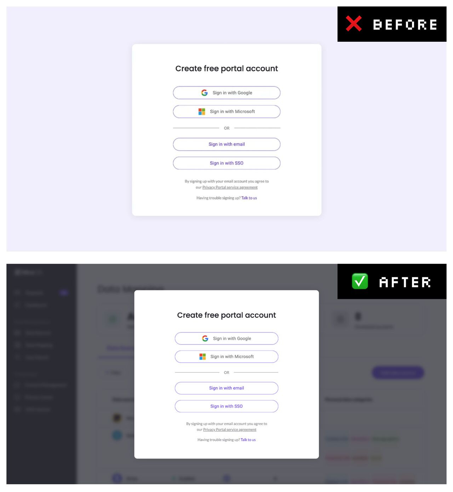

❌ **Put your 404 page to work:** AI chatbots invent URLs all the time, so your 404 page may now be getting more traffic from hallucinating LLMs. TestResults [offers these visitors a prize](https://www.testresults.io/404): “These sexy AirPods trunks are yours. With your name on them.” Pretty weird! But if someone wants them, they fill out a form that has an opt-in lead capture element. Add something like this to your 404s and turn an annoying dead page into a moment of customer delight.

❌ **让你的 404 页面干活：** AI 聊天机器人随时都在编 URL，所以你的 404 页面现在可能正在接收更多来自「幻觉」LLM 的流量。TestResults [给这些访客提供了一份奖品](https://www.testresults.io/404)：「这些性感的 AirPods 收纳盒归你了，上面还能印你的名字。」相当怪！但如果真有人想要，他们就得填一张带有主动订阅式线索采集的表单。给你的 404 页面加上类似的东西，把一个烦人的死页面变成一个让客户惊喜的瞬间。

🎣 **Start video ads by naming ***who*** should watch:** In the first three seconds of any video ad, say the viewer’s job title (or specific problem) out loud. “Hey, product managers” works much better than going straight to talking about your value prop. Deel, Gong, and HubSpot [all do this](https://www.marketingideas.com/i/153491106/the-best-companies-already-do-it).

🎣 **视频广告一开场就点名***谁***该看：**在任何视频广告的前三秒，把观众的职业头衔（或具体问题）直接说出口。「嗨，产品经理们」比一上来就讲价值主张有效得多。Deel、Gong 和 HubSpot [都在这么做](https://www.marketingideas.com/i/153491106/the-best-companies-already-do-it)。

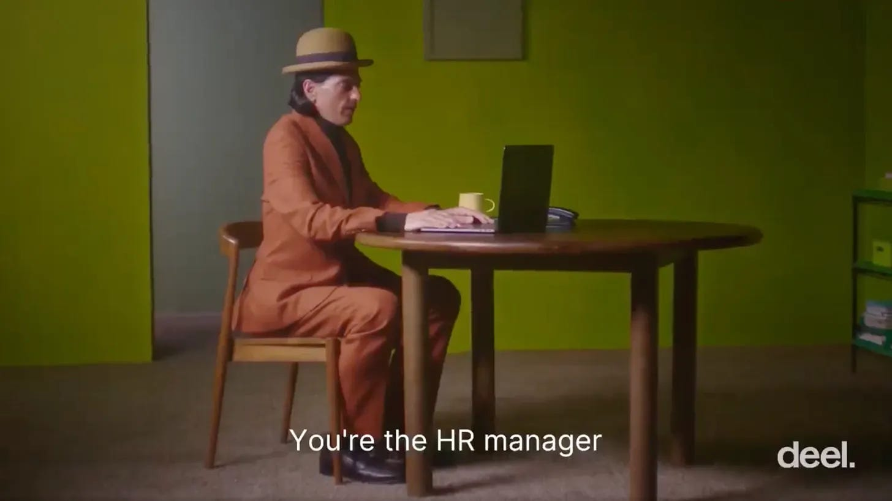

💬 **Run free office hours in your LinkedIn comments:** Prove your team’s expertise by offering personalized advice for anyone who replies. I did [“Drop your website URL below and I’ll reply with one marketing idea”](https://www.linkedin.com/posts/tomorbach_drop-your-website-url-below-ill-reply-activity-7258107293815164928-FD91/) and answered hundreds of responses. This brought me thousands of newsletter subscribers, probably because it proved I know my stuff. Figure out what value you want to be known for and offer it for free where people are already scrolling.

💬 **在 LinkedIn 评论区办免费咨询时间：** 为任何回复的人提供一对一的建议，以此证明你团队的专业能力。我做过[「把你们的网站 URL 贴在下面，我会回你一条营销点子」](https://www.linkedin.com/posts/tomorbach_drop-your-website-url-below-ill-reply-activity-7258107293815164928-FD91/)，回复了数百条。这给我带来了几千个通讯订阅者，很可能是因为它证明了我确实懂行。想清楚你想以什么样的价值被人记住，然后在人们本来就在刷的地方免费提供它。

🛝 **Replace your “Book a demo” button with a “Try it yourself” playground:** No one wants to give their email for nothing or wait for a Zoom call. Set up a dummy version of your product so that people can get to an aha moment without signing up or adding their credit card info. For inspiration, check out Plausible’s [live analytics dashboard](https://plausible.io/plausible.io) for its own site metrics, or Linear’s [demo workspace](https://linear.app/demo), where you can actually create and manage tickets without even signing up.

🛝 **把「预约演示」按钮换成「自己上手试试」的沙盒：** 没人愿意白给邮箱，也没人愿意等一场 Zoom 通话。搭一个你产品的样例版本，让人们不用注册、不用填信用卡信息，就能体验到「啊哈」时刻。找灵感的话，可以看看 Plausible 展示自家站点指标的[实时分析面板](https://plausible.io/plausible.io)，或者 Linear 的[演示工作区](https://linear.app/demo)——在那里你甚至不用注册就能真正创建和管理工单。

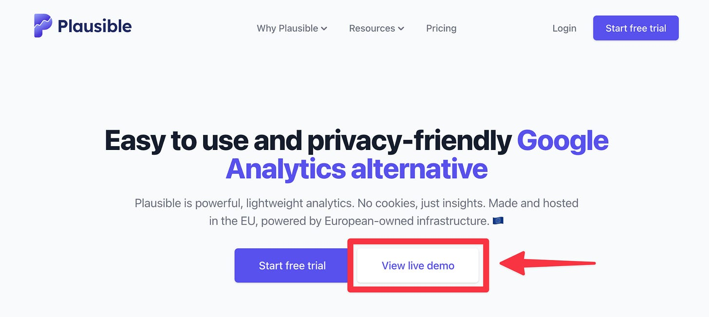

🗓️ **Make premium free during weird windows:** Pluralsight occasionally offers [Free Weekends](https://web.archive.org/web/20230205180830/https://www.pluralsight.com/offer/2023/q1-free-weekend), opening its entire 7,000-course library Friday to Sunday, no card required. A timeboxed window creates urgency a permanent free tier never will. This is like freemium with a deadline.

🗓️ **在奇怪的时段把付费内容免费开放：** Pluralsight 偶尔会推出[免费周末](https://web.archive.org/web/20230205180830/https://www.pluralsight.com/offer/2023/q1-free-weekend)，从周五到周日开放全部 7000 门课程库，不需要信用卡。有期限的窗口能制造出永久免费层永远做不到的紧迫感。这就像带截止日期的 freemium。

🤖 **Add an “Ask AI about us” button:** At the very bottom of [Youform’s homepage](https://youform.com/), they have this section: “Scrolled so much but still not sure? Let your favorite AI tell you if Youform is the right fit.” There’s a button each for ChatGPT, Claude, Perplexity, and Google AI, and clicking one opens that LLM with a pre-written prompt. Since buyers and potential customers are going to do AI-powered research for you anyway, you might as well shape those conversations. Heads up: Claude just started flagging pre-written prompts that arrive through a link—so keep yours short and neutral to avoid suspicion.

🤖 **加一个「去问 AI 我们怎么样」的按钮：** 在 [Youform 首页](https://youform.com/)的最底部，有这么一段：「翻了这么久还是不确定？让你常用的 AI 告诉你 Youform 是否适合你。」下面分别有 ChatGPT、Claude、Perplexity 和 Google AI 的按钮，点任意一个都会打开对应的 LLM，并带上预先写好的提示词。既然买家和潜在客户本来就会用 AI 做研究，不如由你来塑造这些对话。提醒一句：Claude 最近开始标记通过链接传入的预写提示词——所以你的提示词要短、要中立，避免被怀疑。

🧪 **Give away a mini-tool:** Take a feature of your product, strip it down to one simple interaction, and offer it to the world, 100% free (and no email or signup). The Wordware team built a tiny site that [roasts your X profile](https://twitter.wordware.ai/) using their Sauna AI. [8.1 million people tried it and more than 400,000 signed up](https://blog.wordware.ai/twitter-roast-ai-with-llm-orchestration) for the real product, which helped them land [one of YC’s largest seed rounds](https://www.forbes.com/sites/dariashunina/2024/11/27/how-wordware-secured-30m-seed-in-7-days/).

🧪 **送出一个迷你工具：** 从你的产品里拿出一个功能，把它削减成一次简单的交互，然后 100% 免费地开放给全世界（而且不要邮箱、不用注册）。Wordware 团队做了一个小网站，用他们的 Sauna AI [吐槽你的 X 主页](https://twitter.wordware.ai/)。[810 万人试过，超过 40 万人注册](https://blog.wordware.ai/twitter-roast-ai-with-llm-orchestration)了真正的产品，这也帮他们拿到了 [YC 史上最大的种子轮之一](https://www.forbes.com/sites/dariashunina/2024/11/27/how-wordware-secured-30m-seed-in-7-days/)。

💼 **Create your industry’s job board:** People are always looking for new jobs, including your target customers. So catch their attention by collecting every open role in your niche (*not* just the ones your company is hiring for). DataGrail runs [one for privacy professionals](https://www.datagrail.io/community/job-board/), and if you’re not already tracking [Lenny’s Jobs](https://www.lennysjobs.com/), what are you even doing? Bonus: You may get some industry credibility too. When we launched[cloudsecurity.jobs](https://cloudsecurity.jobs/) at Wiz, publications would cite it whenever the security job market came up.

💼 **做一份你所在行业的招聘板：** 人们总是在找新工作，包括你的目标客户。所以把你这行的所有开放职位都收集起来（*不只是*你们公司在招的岗位），以此抓住他们的注意力。DataGrail 做了一个[面向隐私从业者的招聘板](https://www.datagrail.io/community/job-board/)，而如果你还没在盯 [Lenny’s Jobs](https://www.lennysjobs.com/)，那你到底在干嘛？附加好处：你可能还会收获一些行业公信力。我们在 Wiz 上线 [cloudsecurity.jobs](https://cloudsecurity.jobs/) 之后，只要聊到安全岗位市场，媒体就会引用它。

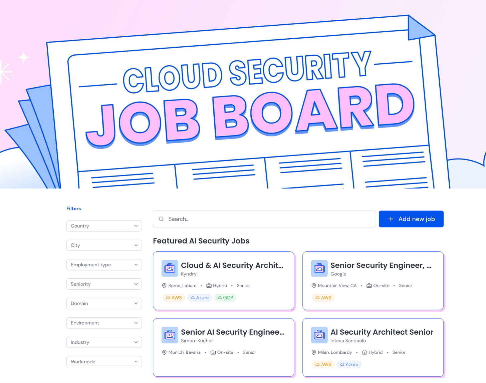

## 5. I want to crush the competition 🥊 / 5. 我想碾压竞争对手 🥊

Your competitor’s customers won’t leave on their own. These ideas catch them at their most annoyed moments and make switching feel easy.

你竞争对手的客户不会自己离开。这些点子会在他们最烦躁的时刻抓住他们，并让「换」这件事显得很容易。

🩸 **Own the “[competitor] coupon code” search:** When someone is googling your competitor’s discount code, they are ready to buy. Intercept that with your own results. BlueNotary keeps a whole [Docusign coupon section](https://bluenotary.us/category/docusign/docusign-coupon-code/) on its website. Splashtop is running the [same play](https://www.splashtop.com/blog/logmein-promo-code-coupon-or-discount) against LogMeIn. Just have the page explain, calmly and fairly, why the alternative (you) is cheaper and better. This is the highest purchase intent on the internet.

🩸 **占领「[竞争对手] 优惠码」的搜索：** 当有人在搜你竞争对手的折扣码时，他已经准备好掏钱了。用你自己的结果去拦截这个搜索。BlueNotary 在自己的网站上养了整整一个 [Docusign 优惠码板块](https://bluenotary.us/category/docusign/docusign-coupon-code/)。Splashtop 对 LogMeIn 打的也是[同一套](https://www.splashtop.com/blog/logmein-promo-code-coupon-or-discount)。只要让页面冷静、公正地解释清楚，为什么替代方案（也就是你）更便宜、更好。这是互联网上购买意图最高的搜索。

🧲 **Let customers import everything from your competitor:** Switching costs are one of the biggest moats that incumbents and category leaders have. If you want their users, remove this friction. Anthropic did this when they launched [memory import from ChatGPT](https://www.macrumors.com/2026/03/02/anthropic-memory-import-tool/). Find the dataset that holds your competitor’s customers hostage and build the migrator. (Note: This one will likely need some engineering time, but it’s worth it.)

🧲 **让客户能把竞争对手那边的一切都导入过来：** 转换成本是现有玩家和品类领导者最大的护城河之一。如果你想要他们的用户，就把这道摩擦去掉。Anthropic 推出[从 ChatGPT 导入记忆](https://www.macrumors.com/2026/03/02/anthropic-memory-import-tool/)时就是这么做的。找出那个「劫持」着你竞争对手客户的数据集，然后把迁移工具做出来。（注意：这一条大概需要一些工程投入，但值得。）

🧳 **Do the heavy lifting of switching ***for*** them:** Kit (formerly ConvertKit) offers [free migrations on every paid plan](https://kit.com/migrations), with a full white-glove concierge rebuild (forms, automations, templates, integrations) at 10,000 or more subscribers. Richpanel goes even further: They’ll actually [buy out your existing contract](https://www.richpanel.com/contract-buyout), so their help-desk service is free until your current vendor’s contract expires. You can try this manually with a few customers, and if it works, scale it.

🧳 **替他们把迁移这件重活干完：** Kit（原 ConvertKit）在[所有付费方案上都提供免费迁移](https://kit.com/migrations)，订阅数达到 1 万及以上时，还会有一整套「白手套」式的管家级重建（表单、自动化、模板、集成）。Richpanel 走得更远：他们会真的[买断你现有的合同](https://www.richpanel.com/contract-buyout)，于是他们的工单服务在你当前供应商的合同到期之前都是免费的。你可以先手动对几个客户试，跑通了再规模化。

🛸 **Shrink your competitor’s category:** ClickUp’s comparison page opens with [“Notion writes down work. ClickUp helps you get it done.”](https://clickup.com/compare/notion-vs-clickup) Asana ran [the same thing](https://www.marketingideas.com/i/152115910/the-marketing-idea) against Trello for years: “Asana is a work management powerhouse. Trello is a Kanban board.” If your competitor is known for just one thing, just say that very clearly and they’ll inevitably look small.

🛸 **把竞争对手的品类缩小：** ClickUp 的对比页开头就是[「Notion 把工作写下来。ClickUp 帮你把工作做完。」](https://clickup.com/compare/notion-vs-clickup) Asana 对 Trello 打了[同样的牌](https://www.marketingideas.com/i/152115910/the-marketing-idea)好多年：「Asana 是工作管理的强者。Trello 只是一块看板。」如果你的竞争对手只因一件事出名，那就把那件事讲得非常清楚，他们自然会显得很小。

⚠️ **Buy search ads on your competitor’s error messages:** Developers often paste error text straight into Google. Anthropic’s ads show up for [those exact searches](https://x.com/0xMasonH/status/1996687988089049165), right when the user is most frustrated with the tool they’re currently paying for.

⚠️ **在竞争对手的报错信息上投搜索广告：** 开发者经常把报错文本直接粘进 Google。Anthropic 的广告会出现在[这些精确搜索](https://x.com/0xMasonH/status/1996687988089049165)的结果里，正好是在用户对当下付费使用的工具最恼火的时候。

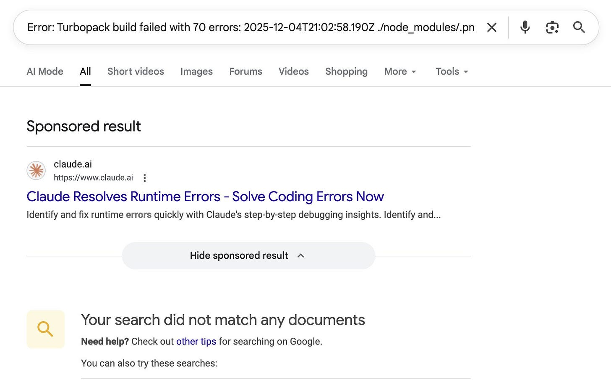

**🪞 Own the search results for your brand’s alternatives:** Buyers search for “[your product] alternatives” when they’re thinking about swapping. At Wiz, we publish our own alternatives page, so comparison shoppers get our framing first instead of the POV of some affiliate blog (or competitor).

**🪞 占领「你的品牌替代品」的搜索结果：** 买家在考虑换工具时，会搜索「[你的产品] 替代品」。在 Wiz，我们自己发布了一个替代品页面，这样比价的人首先看到的是我们的框架，而不是某个联盟营销博客（或竞争对手）的视角。

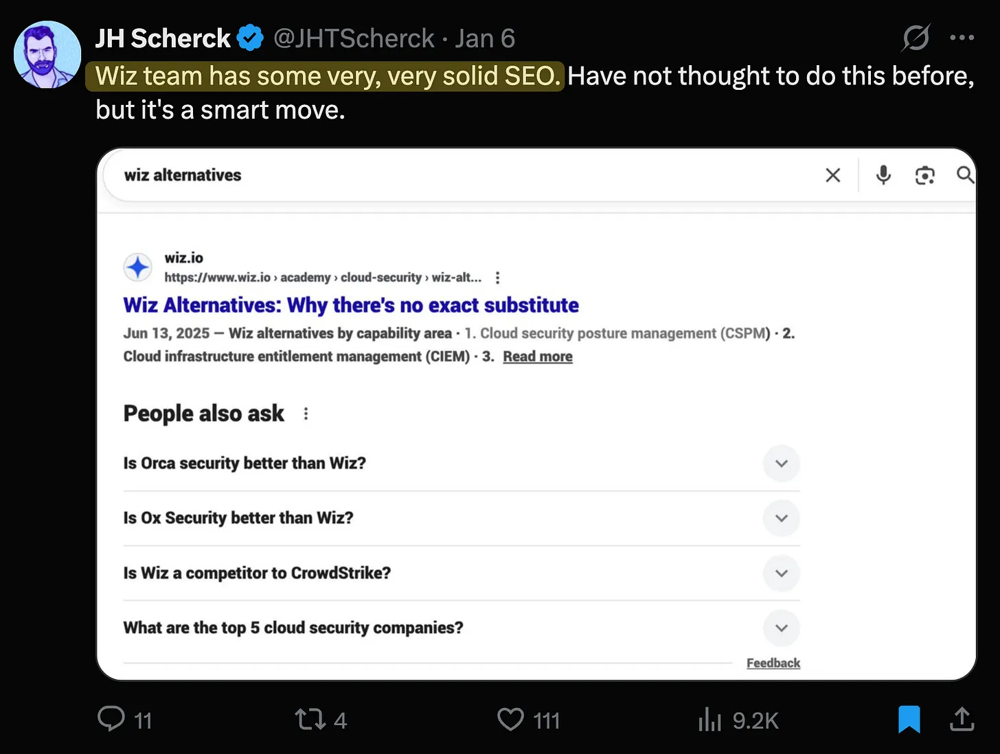
## 6. I want customers to pay more (and be happy about it) 💸 / 6. 我想让客户付更多钱（而且心甘情愿）💸

“Willingness to pay” is a feeling, and feelings can be designed. These ideas make customers feel like they got a deal, even when they’re paying you more.

「支付意愿」是一种感觉，而感觉是可以被设计的。这些点子会让客户觉得占了便宜，哪怕他们其实付给了你更多钱。

💸 **Say “prices go up next week” instead of “sale ends next week”:** This is the same deadline, but “price goes up” is more effective, because people fear losing money far more than they fear missing a deal. Robot-vacuum startup [Matic](https://maticrobots.com/) did this right on their buy button: “$1,245 until 9/9” (the price went up to $1,495 after).

💸 **说「下周涨价」，而不是「下周一优惠结束」：** 这是同一个截止日期，但「要涨价了」更有效，因为人们对失去金钱的恐惧，远远大于对错失优惠的恐惧。扫地机器人创业公司 [Matic](https://maticrobots.com/) 直接把它印在购买按钮上：「1245 美元，截至 9/9」（之后价格涨到 1495 美元）。

💰 **Show them the (literal) price of the status quo:** Teamflow shows you the cost of the alternative, right on their pricing page: [“Before Teamflow: $799 per employee/month.”](https://www.teamflowhq.com/virtual-office-pricing) When you see the next price point at $15, it seems like an incredible deal. Do this to show potential customers how much value you’re actually providing for them.

💰 **把现状的（字面意义上的）价格摆给他们看：** Teamflow 直接把替代方案的成本写在定价页上：[「用 Teamflow 之前：每位员工每月 799 美元。」](https://www.teamflowhq.com/virtual-office-pricing) 当你看到下一个价格点是 15 美元时，那简直像是不可思议的好deal。用这招让潜在客户看到，你其实为他们提供了多大的价值。

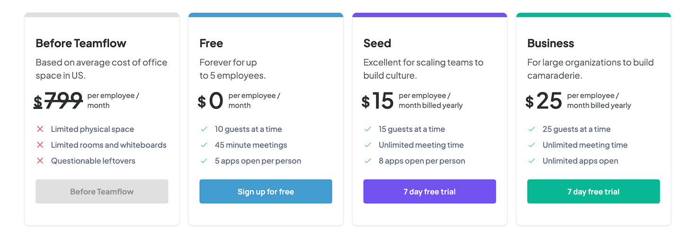

🛍️ **Make discounts feel real by telling people what they could buy with the savings:** Senja’s founder prompts monthly-plan users to switch to annual via email, and lists [9 things they could buy with the money they save](https://x.com/CichyKrzysztof/status/2031991681046782096).

🛍️ **告诉人们省下的钱能买什么，让折扣变得真实可感：** Senja 的创始人会通过邮件引导月付用户切换到年付，并列出[省下的钱可以买的 9 样东西](https://x.com/CichyKrzysztof/status/2031991681046782096)。

⚡ **Offer 110% value as credit, instead of a cash refund:** Aviator Nation offers 10% extra if you choose store credit. Result: [65% of customers keep their money](https://www.loopreturns.com/case-studies/case-study-loop-aviator-nation/) in the ecosystem, boosting revenue by 11%.

⚡ **用 110% 的额度代替现金退款：** Aviator Nation 提供额外 10% 的额度，只要你选择店内余额。结果是：[65% 的客户把钱留在了这个生态里](https://www.loopreturns.com/case-studies/case-study-loop-aviator-nation/)，带动营收提升 11%。

🎯 **Put a relevant customer logo under each pricing plan:** Amplitude’s pricing page matched a real customer logo to every tier: [Chorus.ai on Free, LimeBike on Growth, NBCUniversal on Enterprise](https://web.archive.org/web/20200901013815/https://amplitude.com/pricing). Every potential customer looks at the plan they’re considering and sees someone like themselves already there.

🎯 **在每个定价档位下面放一个相关的客户 logo：** Amplitude 的定价页给每一档都配了一个真实客户的 logo：[免费版放 Chorus.ai，增长版放 LimeBike，企业版放 NBCUniversal](https://web.archive.org/web/20200901013815/https://amplitude.com/pricing)。每个潜在客户看着自己正在考虑的那一档，都会看到一个跟自己相似的客户已经在那儿了。

🤫 **Use a “secret discount” page to undercut affiliate coupons at checkout:** Wix has a [default promo code for 10% off](https://www.wix.com/promo-code/coupons) that shows up right at the top if you search for “Wix promo code.” This is a sneaky win-win: customers feel like they got a deal, but Wix is preventing these potential customers (who are probably already at the checkout screen) from getting a much larger discount (often up to 50%!) from affiliates.

🤫 **用「秘密折扣」页面在结账环节截胡联盟优惠券：** Wix 有一个[默认的 9 折优惠码](https://www.wix.com/promo-code/coupons)，你搜「Wix promo code」时它就出现在最顶部。这是一个狡猾的双赢：客户觉得自己占了便宜，而 Wix 则避免了这些潜在客户（他们很可能已经停在结账页面了）从联盟渠道拿到大得多的折扣（常常高达 5 折！）。

⏳ **Show the work: **Kayak could generate search results instantly, but instead they show each airline where it’s checking prices, one at a time. Turns out, people value things more when they can see the work, even when it’s slower. (Researchers at Harvard [called this “the labor illusion.”](https://pubsonline.informs.org/doi/10.1287/mnsc.1110.1376)) If your product does something hard, show the steps. Maybe even slow it down, rather than delivering the results instantly.

⏳ **把过程展示出来：** Kayak 本可以瞬间生成搜索结果，但它偏偏一家一家地显示正在查询哪家航空公司的价格。事实证明，当人们能看到「工作量」时，他们会更看重结果，哪怕这更慢。（哈佛的研究者[把这叫「劳动幻觉」](https://pubsonline.informs.org/doi/10.1287/mnsc.1110.1376)。）如果你的产品做的是件难事，就把步骤展示出来。甚至不妨放慢一点，而不是瞬间交付结果。

🙏 **Upsell on the thank-you page:** The second after someone pays is when they’re most open to a related offer. Researchers call it [shopping momentum](https://journals.sagepub.com/doi/10.1509/jmkr.44.3.370): a first purchase shifts people from deliberating to buying. It’s also the least annoying place to put one. [Baymard found](https://baymard.com/checkout-usability/benchmark/step-type/cross-sell) that 66% of shoppers got frustrated by a cross-sell that interrupted checkout, but a thank-you page doesn’t interrupt.

🙏 **在「感谢页」上做追加销售：** 一个人刚付完钱的那一秒，是他对相关推荐最开放的时候。研究者把这叫[购物惯性](https://journals.sagepub.com/doi/10.1509/jmkr.44.3.370)：第一次购买会把人从「斟酌」推向「买」。而且这也是最不惹人烦的摆放位置。[Baymard 发现](https://baymard.com/checkout-usability/benchmark/step-type/cross-sell)，66% 的购物者会因为结账流程被打断的交叉销售而恼火，但感谢页不会打断任何东西。

## 7. I want customers to stay forever ❤️ / 7. 我想让客户永远留下来 ❤️

The best retention strategy is customers who are a little obsessed with you. These ideas build that kind of loyalty long before anyone gets near the cancel button.

最好的留存策略，是让客户对你有点着迷。这些点子会在任何人靠近「取消」按钮之前很久，就建立起那种忠诚度。

🏷️ **Name your releases after the customers who asked:** Obsidian’s changelog [thanks community members by name](https://obsidian.md/changelog/2026-06-09-desktop-v1.13.1/) and keeps a public [credits page](https://obsidian.md/help/credits). If possible, mention their company name too: “v2.14, the Martinez release, requested by Elena Martinez, Head of Ops at Acme.” This makes your most engaged customers feel appreciated, plus it provides social proof for every person who reads it *and* encourages them to submit their own feedback.

🏷️ **用提出需求的客户来命名你的版本：** Obsidian 的更新日志会[点名感谢社区成员](https://obsidian.md/changelog/2026-06-09-desktop-v1.13.1/)，并维护一个公开的[致谢页](https://obsidian.md/help/credits)。如果可能的话，也带上他们的公司名：「v2.14，Martinez 版本，由 Acme 运营负责人 Elena Martinez 提出。」这会让最投入的客户感到被重视，同时为每一位读到它的人提供了社会认同，*还*鼓励他们提交自己的反馈。

🐱 **Keep a secret menu:** Aka the In-N-Out playbook. IYKYK, right? Asana has an unofficial “Hacks” tab where [Tab+B fills your screen with cats and Tab+V with dogs](https://zapier.com/blog/hidden-asana-features/), plus celebration creatures when you finish a task. They don’t talk about these publicly, which makes power users want to be the ones to tell others.

🐱 **保留一份秘密菜单：** 也就是 In-N-Out 那套打法。懂的都懂，对吧？Asana 有一个非官方的「Hacks」标签页，[按 Tab+B 会让你的屏幕布满猫，Tab+V 则是狗](https://zapier.com/blog/hidden-asana-features/)，完成任务时还会有庆祝小动物。他们不公开谈论这些，这反而让高活跃用户想成为那个告诉别人的人。

💐 **Give your support team a special budget to go above and beyond when a customer needs it:** A grieving customer told Chewy her dog had died, and Chewy sent her a refund. Plus flowers. You better believe that customer is going to stick around. (Bonus: [her tweet](https://x.com/alcesanna/status/1536930380082728961) about it now has nearly 600,000 likes. 👀) Doing this well at scale requires the right customer support culture and training reps, but you can start with just a small discretionary budget for your top rep to use for these kinds of instances.

💐 **给你的客服团队一笔特别预算，让他们在客户需要时多做一步：** 一位正在经历丧亲之痛的客户告诉 Chewy 她的狗去世了，Chewy 给她退了款，还送了花。你完全可以相信，这位客户会一直留下来。（附加效果：她[那条相关的推文](https://x.com/alcesanna/status/1536930380082728961)如今有将近 60 万个赞。👀）要在规模化的情况下把这件事做好，需要正确的客服文化和话术培训，但你可以先从一个很小的自由支配预算开始，交给最优秀的客服代表用于这类场景。

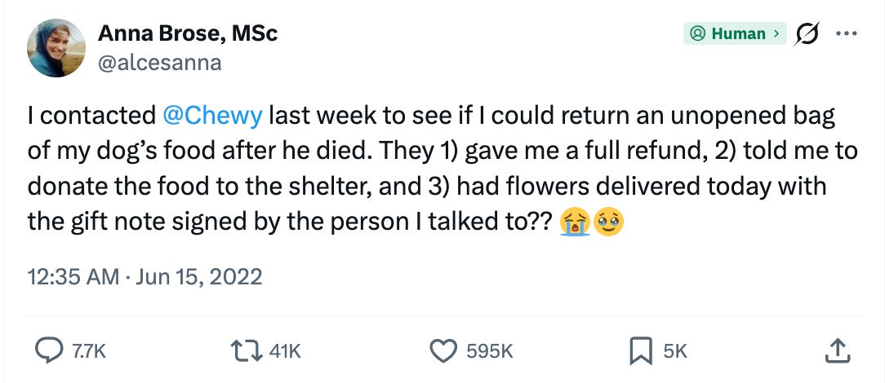

📉 **Offer an opt-***down*** before the opt-out:** When flower delivery service Bloom & Wild started ramping up Mother’s Day messaging, they avoided massive list churn by letting subscribers just opt out of that specific campaign. These [“opted-down” customers went on to show 1.7 times the lifetime value](https://medium.com/the-thoughtful-marketing-community/can-offering-customers-an-opt-out-of-marketing-around-sensitive-occasions-really-improve-the-29a975f623c4) of everyone else. Put a “send me fewer emails” choice above your unsubscribe link. Or go further, with a “one email a year, only our single best thing” tier.

📉 **在「退订」之前先提供「降频」：** 当鲜花配送服务 Bloom & Wild 开始密集推送母亲节营销时，他们通过允许订阅者只退出那一档特定活动，避免了名单的大规模流失。这些[「降频」客户的终身价值后来是其他人的 1.7 倍](https://medium.com/the-thoughtful-marketing-community/can-offering-customers-an-opt-out-of-marketing-around-sensitive-occasions-really-improve-the-29a975f623c4)。把你的退订链接上面放一个「少给我发点邮件」的选项。或者更进一步，做一个「一年只发一封、只发我们最好的那一个东西」的档位。

⏸️ **Offer pause instead of cancel:** Same vibe as the one above—offer a “pause” option so that a temporary budget pinch or busy season doesn’t completely remove them from your system. Reactivating dormant customers is much easier (and cheaper) than trying to get them back into the system if they’re all the way out. Start your cancel flow with this option, instead of just skipping straight to the “Tell us why?” survey.

⏸️ **提供「暂停」而不是「取消」：** 和上一条同一个思路——提供一个「暂停」选项，这样一次暂时的预算紧缩或旺季忙碌，就不会把他们彻底从你的系统里移除。重新激活沉睡客户，比等人彻底走掉之后再拉回来要容易得多（也便宜得多）。把你的取消流程从这个选项开始，而不是直接跳到「告诉我们原因？」的问卷。

👴🏻 **Show users how long they’ve been with you:** Display “member since” dates or account age somewhere visible. OpenAI’s ChatGPT Atlas browser showed exactly how many days ago you joined ChatGPT. This gives your OGs something to brag about and can also keep people around because they want to keep their streak going.

👴🏻 **让用户看到他们陪了你多久：** 在显眼的地方显示「注册于」日期或账号龄。OpenAI 的 ChatGPT Atlas 浏览器会精确显示你是多少天前加入 ChatGPT 的。这给了你的老用户一个可以炫耀的资本，也能让人留下来，因为他们想把这条连续记录延续下去。

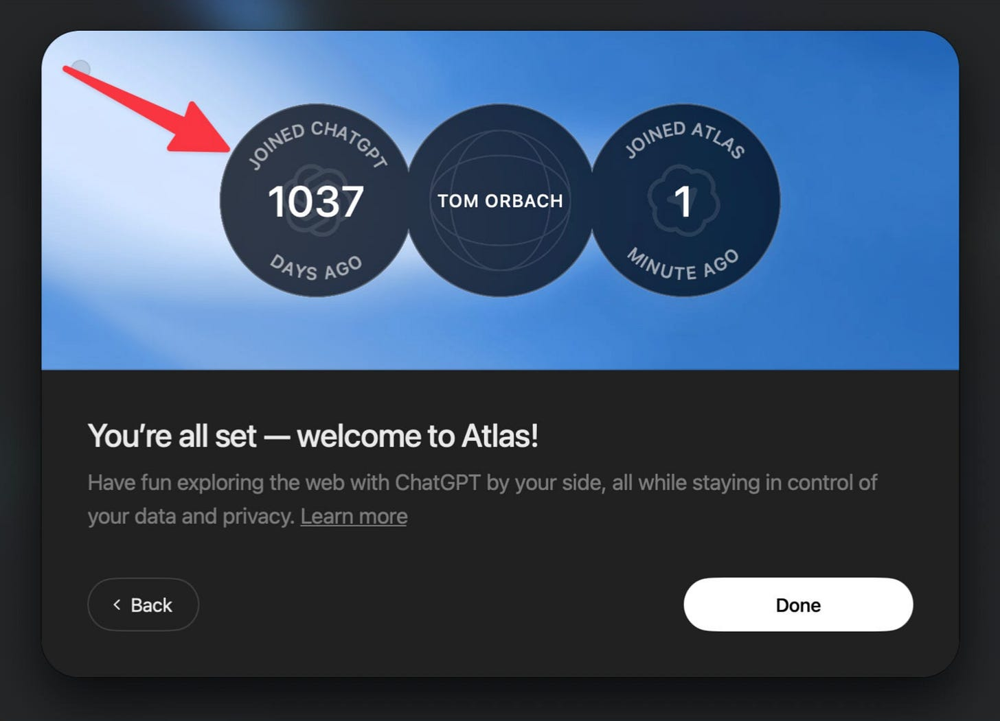

✍️ **Humanize your business with** **handwritten notes:** In a [field experiment](https://app.sciencesays.com/p/handwritten-notes) with 1,232 customers, a handwritten thank-you note doubled repeat spend ($25.97 to $52.07). Interestingly, if you’re looking to scale up this approach, photocopies of real handwriting worked just as well. But handwriting-style fonts had no impact on participants. Also: pairing the note with a discount killed the effect entirely.

✍️ **用** **手写便条** **让你的生意更有人味：** 在一项涉及 1232 名客户的[实地实验](https://app.sciencesays.com/p/handwritten-notes)中，一张手写感谢卡让复购支出翻了一倍（从 25.97 美元升到 52.07 美元）。有意思的是，如果你想规模化这套做法，真实手写字的复印件效果一样好。但手写体字体的便条对参与者毫无影响。另外：把便条和折扣搭配在一起，效果会被完全消灭。

👋 **Have the founder personally welcome new users:** Beehiiv’s CEO says he’s [messaged “every single new user (20K+ of them).”](https://www.linkedin.com/posts/tyler-denk_beehiiv-just-crossed-2m-mrr-but-most-activity-7419385767291949056-FZ4x) A personal note from the founder shows commitment to the customers and can be a great way to collect user feedback, right at the start of their experience with your company.

👋 **让创始人亲自欢迎新用户：** Beehiiv 的 CEO 说他[给「每一位新用户（超过 2 万人）都发过消息」](https://www.linkedin.com/posts/tyler-denk_beehiiv-just-crossed-2m-mrr-but-most-activity-7419385767291949056-FZ4x)。一封来自创始人的私人留言，展示了对客户的重视，也是在他们与你公司相处的起点收集用户反馈的绝佳方式。

🎓 **Use “limit reached” emails to celebrate instead of scold:** Imagine receiving a notification with “Congratulations, you just out-used 94% of accounts!” instead of the default usage-limit email that opens with “Sorry, you’ve exceeded . . .” Make them feel proud rather than guilty or obligated. As far as I can tell, no big brand does this yet. You could be the first!

🎓 **把「已达上限」的邮件写成庆祝，而不是训斥：** 想象一下收到这样一条通知：「恭喜，你的使用量已经超过了 94% 的账号！」而不是默认那封以「抱歉，你已超出……」开头的限额邮件。让他们感到自豪，而不是愧疚或有义务。据我所知，还没有哪个大品牌这么做。你可以做第一个！

## Capture attention when it’s still cheap / 在注意力还便宜的时候把它抓住

Every idea in this list works for the same reason: it’s not what everyone else is doing. The standard playbook isn’t wrong; it’s just crowded, especially now, and crowded channels only get more expensive. The unexpected stuff is where attention is still cheap. Crowded channels work like auctions: the more companies there are bidding for the same audience, the more every moment of attention costs. But a surprise skips the auction altogether. When people see something they didn’t expect, they stop and share it on their own, so distribution is free and the only real cost is the idea.

这份清单里的每个点子之所以有效，原因都一样：它不是别人正在做的事。标准打法并没有错，它只是太拥挤了——尤其是在现在——而拥挤的渠道只会越来越贵。注意力仍然便宜的地方，是那些出人意料的东西。拥挤的渠道像拍卖：为同一批受众出价的公司越多，每一刻注意力的成本就越高。但一次意外直接跳过了拍卖。当人们看到没预料到的东西，他们会停下来、自发分享，于是分发是免费的，唯一真正的成本就是那个点子本身。

If something flops, it’ll get forgotten (the internet has the memory of a goldfish). But one winner can set a completely new trajectory for compounding growth. Find the section that matches your biggest challenge this quarter, run one of the ideas, and see if you can surprise yourself.

如果某个点子失败了，它会被遗忘（互联网的记忆力跟金鱼差不多）。但一个赢家就能为复利式增长开启一条全新的轨迹。找到与你这个季度最大挑战相对应的那一节，挑一个点子跑起来，看看你能不能让自己都感到意外。

*Thanks, Tom! For more, check out his newsletter and find him on LinkedIn.*

*谢谢你，Tom！想看更多内容，欢迎订阅他的通讯，并在 LinkedIn 上找到他。*

*Have a fulfilling and productive week 🙏*

*祝你有一周充实而高产 🙏*
