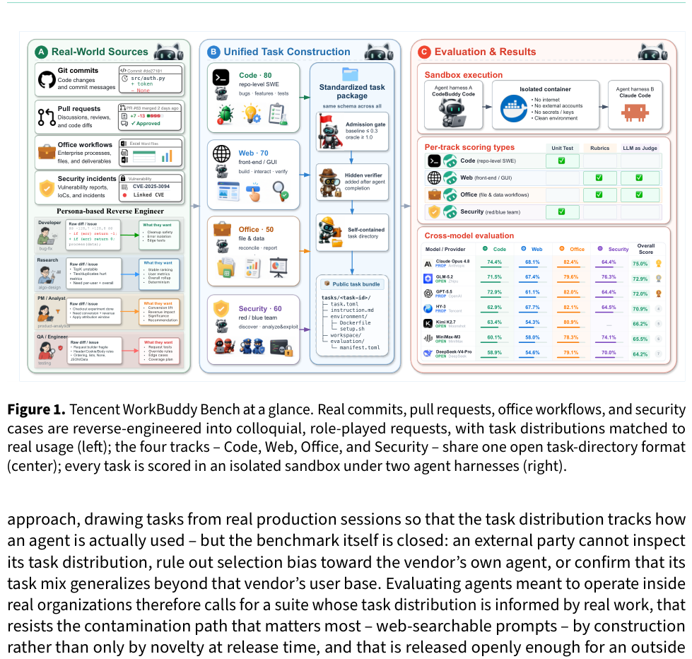
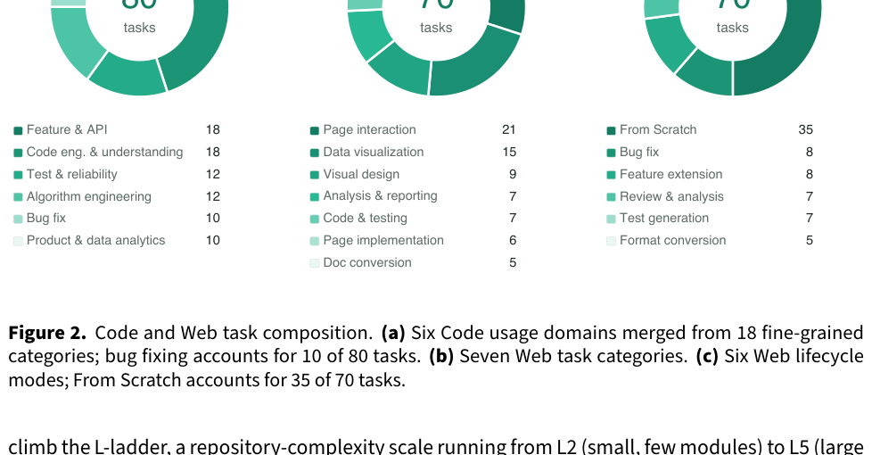
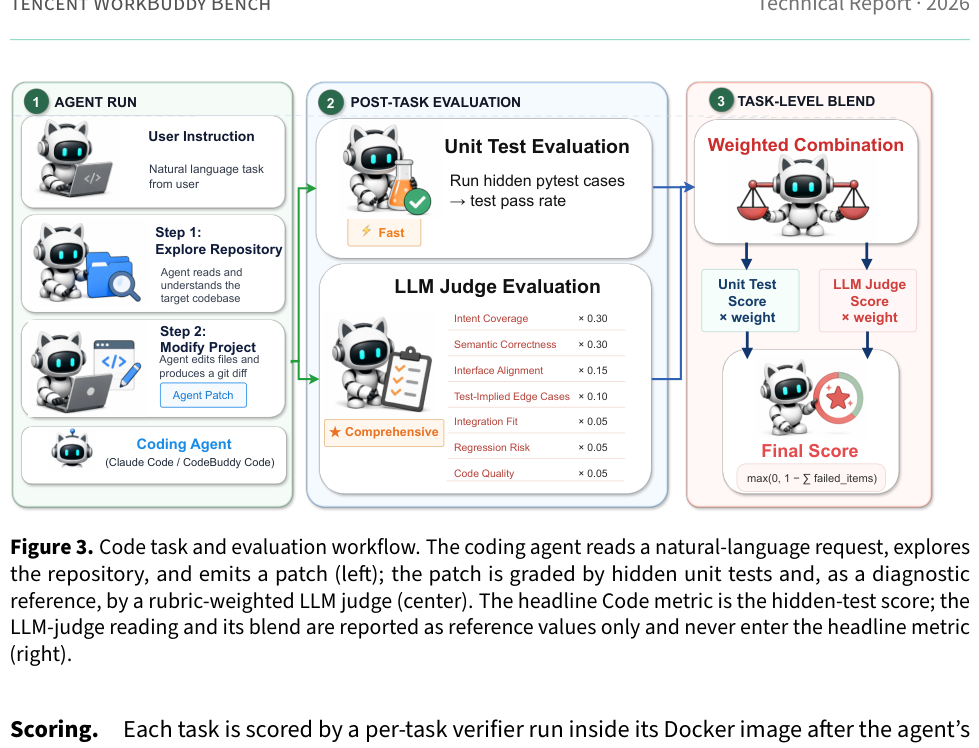
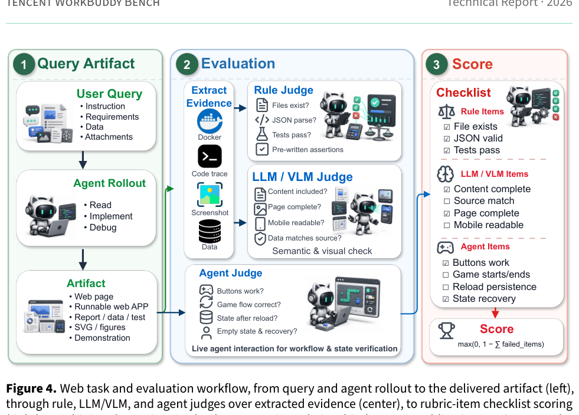
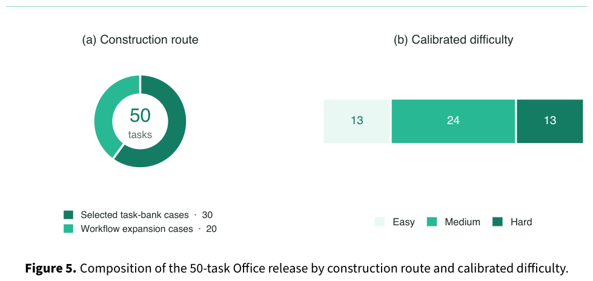
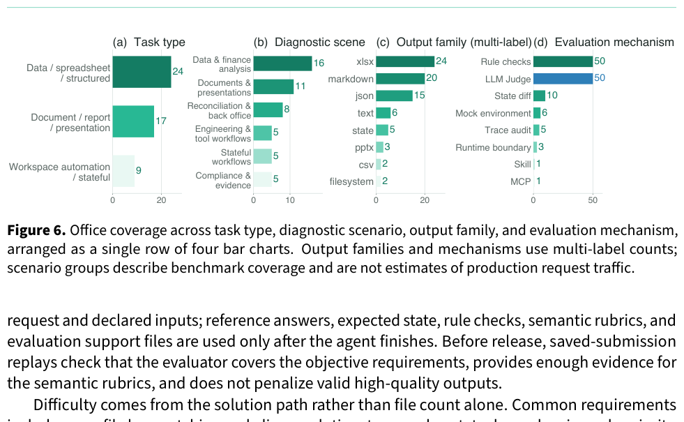
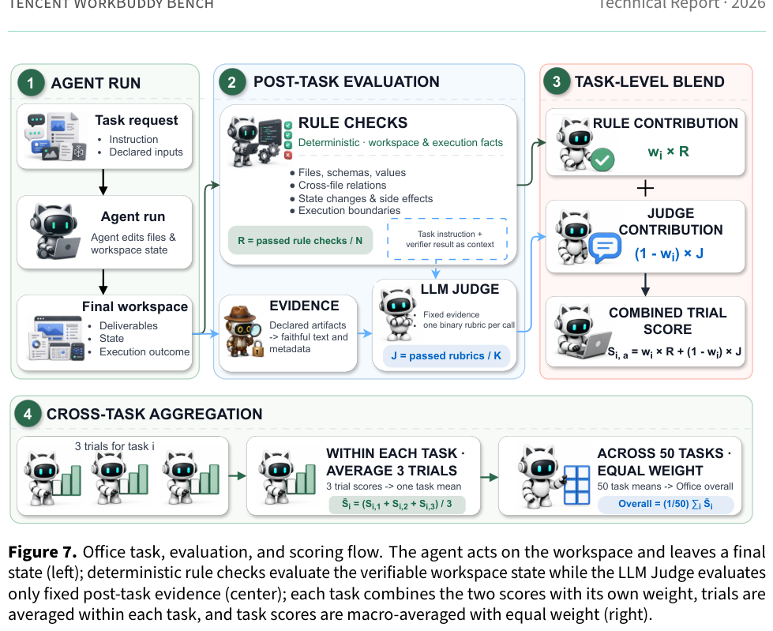
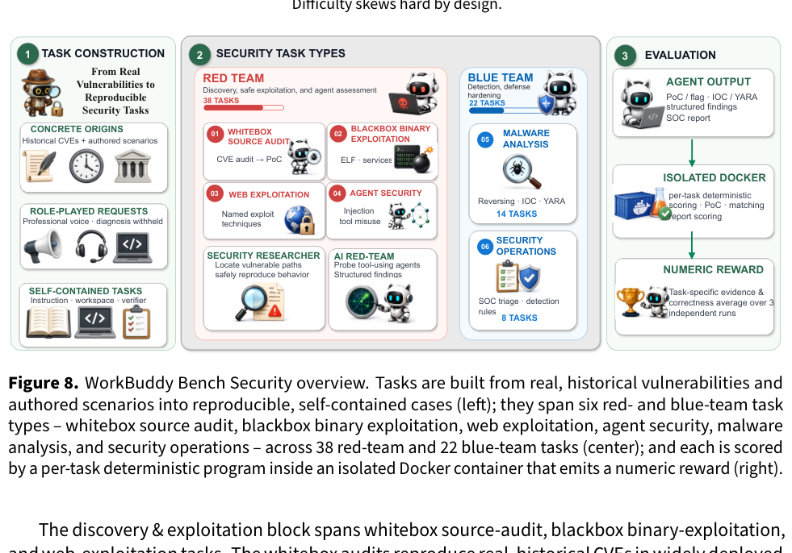
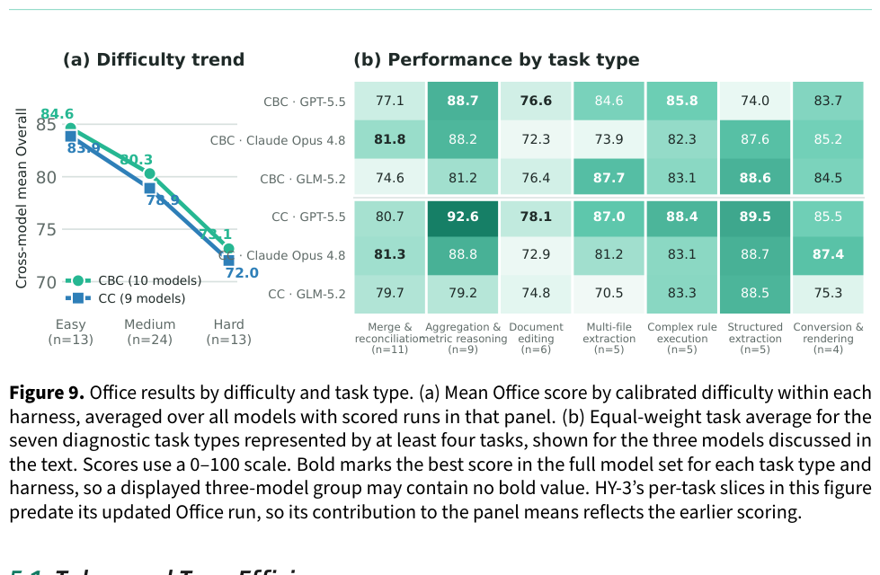

A Multi-Domain Coding-Agent Benchmark with Contamination-Resistant Task Construction / 面向多领域编程智能体、具备抗污染任务构建的基准评测

Tencent WorkBuddy Bench Team / 腾讯 WorkBuddy Bench 团队

Youtu Lab · Keen Security Lab · Workbuddy · Yunding Security Lab / 优图实验室 · 科恩安全实验室 · Workbuddy · 云鼎安全实验室

July 24, 2026 / 2026 年 7 月 24 日

原文链接 / Source: https://arxiv.org/pdf/2607.20911

发布日期 / Published: 2026-07-24

**Abstract. / 摘要。**

Abstract. In this paper we introduce Tencent WorkBuddy Bench, a multi-domain evaluation suite for coding agents; this report documents its construction methodology, scoring protocol, and a cross-model leaderboard. At its core is a unified evaluation framework for constructing and running distribution-informed coding-agent tasks across four work domains – Code, Web, Office, and Security. Rather than adapting public issue text, every task is reverse-engineered from a real commit, pull request, or business scenario and rewritten as a short, colloquial, role-played request, so that a task's prompt is not recoverable by web-searching the underlying issue, pull request, or commit thread. Because the dataset is released openly – task directories, environment images, evaluation harness, tests, and reference solutions – contamination resistance rests on this construction together with dataset versioning rather than on secrecy. The four subsets – repository-level engineering, front-end development, office and business workflows, and red-/blue-team security – probe complementary facets of real work, each with its own verification style. All are packaged in a uniform task-directory format and run, under a uniform and reproducible protocol, on two agent harnesses (CodeBuddy Code and Claude Code); the full open release makes the benchmark reproducible end to end and directly auditable, since any third party can re-run each task and inspect its content. Because each subset uses a different scoring instrument, scores are not comparable across subsets and the suite reports no suite-wide average. We report a cross-model leaderboard across several model families.

本文介绍 Tencent WorkBuddy Bench，一套面向编程智能体的多领域评测套件；本报告记录其构建方法、评分协议以及跨模型排行榜。其核心是一套统一的评测框架，用于在四个工作领域——Code、Web、Office 和 Security——构建并运行由真实分布所指导的编程智能体任务。每道任务并非改写公开 issue 文本，而是从真实的 commit、pull request 或业务场景反向工程，并改写成简短、口语化、角色扮演式的请求，从而使任务提示无法通过在网上搜索对应的 issue、pull request 或 commit 讨论线程而被还原。由于数据集开放发布——包括任务目录、环境镜像、评测框架、测试与参考解——抗污染能力依赖于这一构建方式以及数据集版本管理，而非保密。四个子集——仓库级工程、前端开发、办公与业务流程，以及红/蓝队安全——分别探测真实工作的互补侧面，并各自采用不同的验证风格。它们都以统一的任务目录格式打包，并在统一、可复现的协议下，于两套智能体评测框架（CodeBuddy Code 与 Claude Code）上运行；完整的开放发布使该基准可端到端复现、并可直接审计，因为任何第三方都能重跑每道任务并检查其内容。由于各子集使用不同的评分工具，分数不可跨子集比较，套件也不报告套件级总分。我们报告了覆盖多个模型家族的跨模型排行榜。

## 1 Introduction / 引言

Coding agents are weighed today against two very different kinds of benchmark, each with a different trade-off. Static, public suites such as SWE-bench and SWE-bench Verified [1, 2] fix a task set at release time: their problem statements, and often their solutions, circulate openly on the web, so a rising score can reflect memorization of a specific issue thread or pull request rather than genuine repository-level reasoning, and their scope is narrow – overwhelmingly single-issue bug resolution. The same crawlability problem holds beyond code: benchmarks for front-end generation [3] and web agents [4] draw on public repositories, screenshots, and websites that are themselves crawlable. Vendor production benchmarks such as CursorBench [5] take the opposite approach, drawing tasks from real production sessions so that the task distribution tracks how an agent is actually used – but the benchmark itself is closed: an external party cannot inspect its task distribution, rule out selection bias toward the vendor's own agent, or confirm that its task mix generalizes beyond that vendor's user base. Evaluating agents meant to operate inside real organizations therefore calls for a suite whose task distribution is informed by real work, that resists the contamination path that matters most – web-searchable prompts – by construction rather than only by novelty at release time, and that is released openly enough for an outside party to re-run each task and audit its content directly.

编程智能体如今对照两类截然不同的基准来衡量，各自有不同的取舍。SWE-bench 和 SWE-bench Verified [1, 2] 这类静态公开套件在发布时即固定任务集：其问题陈述——往往还有解答——在网上公开流传，因此分数上升可能反映的是对特定 issue 线程或 pull request 的记忆，而非真正的仓库级推理，且其范围狭窄——绝大多数是单 issue 缺陷修复。同样的可爬取问题也存在于代码之外：前端生成 [3] 与 Web 智能体 [4] 的基准取材于本身即可被爬取的公开仓库、截图和网站。CursorBench [5] 这类厂商生产基准则采取相反做法，从真实生产会话中抽取任务，使任务分布贴近智能体的实际使用方式——但基准本身是封闭的：外部方无法检查其任务分布、排除偏向厂商自有智能体的选择偏差，也无法确认其任务组合能否推广到该厂商用户群之外。因此，要评测旨在进入真实组织内部运作的智能体，就需要一套套件：其任务分布由真实工作所指导，从构建上（而非仅靠发布时的新颖性）抵御最关键的污染路径——可被网络搜索到的提示，并且开放到足以让外部方重跑每道任务、直接审计其内容。

Figure 1. Tencent WorkBuddy Bench at a glance. Real commits, pull requests, office workflows, and security cases are reverse-engineered into colloquial, role-played requests, with task distributions matched to real usage (left); the four tracks – Code, Web, Office, and Security – share one open task-directory format (center); every task is scored in an isolated sandbox under two agent harnesses (right).

图 1. Tencent WorkBuddy Bench 一览。真实的 commit、pull request、办公流程与安全案例被反向工程为口语化、角色扮演式的请求，任务分布与真实使用相匹配（左）；四条赛道——Code、Web、Office 和 Security——共享一套开放的任务目录格式（中）；每道任务都在隔离沙箱中、于两套智能体评测框架下评分（右）。



We present Tencent WorkBuddy Bench, a multi-domain evaluation suite for coding agents; this report documents its construction methodology, scoring protocol, and a cross-model leaderboard. At its core is a unified evaluation framework for constructing and running distribution-informed coding-agent tasks across four work domains – Code, Web, Office, and Security (Figure 1) – evaluated under a shared, reproducible protocol on two agent harnesses (CodeBuddy Code and Claude Code). Code targets repository-level software engineering: locating, modifying, and verifying changes inside real open-source codebases under role-played, colloquial requirements. Web targets front-end artifacts across generation, modification, analysis, and quality assurance, from page implementation and data visualization to stateful interaction, testing, reporting, and document conversion. Office targets business workflows involving multiple files and deliverables. An agent must read mixed-format local files, carry information across deliverables, update workspace state, and leave results that another person can use. Its evaluation target is the final verifiable workspace state: deliverables, file structure, state changes, evidence, and task-specific execution boundaries. Security spans the security-team spectrum – vulnerability discovery and safe reproduction, malware analysis, security operations, and agent-security assessment – rather than the writing of fixes. All four subsets share a common task-directory format, a common admission protocol, and a common execution infrastructure. What they do not share is a scoring instrument: Code uses hidden tests – “hidden” meaning held out from the agent while it solves, not withheld from the public, since the full test suite ships in the open release – Web a rubric with rule checks for deterministic constraints, LLM/VLM judges for textual, structured, and visual semantics, and an agent-judge for interactive state and workflow checks, Office a task-specific blend of deterministic rule checks and semantic rubrics evaluated by an evidence-grounded LLM Judge, and Security a deterministic scorer, so scores are not comparable across subsets and the suite reports no suite-wide average – a deliberate design fact, not a gap to be closed. The unification is of construction and harness, and the benchmark is released openly and is directly auditable: the protocol, task format, task directories, environment images, evaluation harness, tests, and reference solutions are all public, so any third party can re-run each task and inspect its content.

我们介绍 Tencent WorkBuddy Bench，一套面向编程智能体的多领域评测套件；本报告记录其构建方法、评分协议以及跨模型排行榜。其核心是一套统一的评测框架，用于在四个工作领域——Code、Web、Office 和 Security（图 1）——构建并运行由真实分布所指导的编程智能体任务，并在两套智能体评测框架（CodeBuddy Code 与 Claude Code）上、按共享且可复现的协议进行评测。Code 面向仓库级软件工程：在角色扮演式、口语化的需求下，于真实开源代码库中定位、修改并验证变更。Web 面向前端产物，覆盖生成、修改、分析与质量保障，从页面实现与数据可视化，到有状态交互、测试、报告与文档转换。Office 面向涉及多文件与交付物的业务流程。智能体必须阅读混合格式的本地文件，在交付物之间传递信息，更新工作区状态，并留下他人可用的结果。其评测目标是最终可验证的工作区状态：交付物、文件结构、状态变更、证据，以及任务特定的执行边界。Security 覆盖安全团队的工作谱系——漏洞发现与安全复现、恶意软件分析、安全运营，以及智能体安全评估——而非编写修复。四个子集共享统一的任务目录格式、统一的准入协议，以及统一的执行基础设施。它们并不共享评分工具：Code 使用隐藏测试——“隐藏”指解题时对智能体不可见，而非对公众保密，因为完整测试套件随开放发布一并提供——Web 使用评分细则，其中包括针对确定性约束的规则检查、针对文本/结构/视觉语义的 LLM/VLM 评判器，以及针对交互状态与工作流检查的智能体评判器，Office 使用由确定性规则检查与基于证据的 LLM Judge 所评估的语义评分细则构成的任务特定混合方案，Security 使用确定性评分器，因此分数不可跨子集比较，套件也不报告套件级总分——这是刻意的设计事实，而非有待填补的缺口。统一的是构建与评测框架，且该基准开放发布、可直接审计：协议、任务格式、任务目录、环境镜像、评测框架、测试与参考解全部公开，因此任何第三方都能重跑每道任务并检查其内容。

Why these four belong in one suite. A coding agent placed in real organizational work no longer only edits code: the same agent is asked to build a web front-end, produce or reconcile an office document, and reason about a security artifact. Code, Web, Office, and Security are the four artifact and workflow boundaries that this work crosses, and the suite treats them as one because the task shape is identical at every boundary – the agent is dropped into a workspace, produces an artifact from a natural-language request, and is graded by a verifier it never sees. That shared shape, not a shared scoring rule, is what makes the four subsets one suite.

这四者为何同属一套套件。进入真实组织工作中的编程智能体不再只编辑代码：同一智能体还会被要求构建 Web 前端、生成或核对办公文档，并对安全产物进行推理。Code、Web、Office 和 Security 是这项工作所跨越的四条产物与工作流边界；套件将它们视为一体，是因为在每一条边界上任务形态都相同——智能体被放入一个工作区，根据自然语言请求产出产物，并由它从未见过的校验器评分。使四个子集成为一套套件的，是这种共享形态，而非共享的评分规则。

Resistance to the contamination path that matters most – web-searchable prompts – is a first-class design constraint, not an afterthought. Tasks are not reproductions of public issue titles or tutorial exercises: each is reverse-engineered from a real commit, pull request, or business scenario and rewritten as a short, colloquial, role-played request whose instruction withholds the root cause, the reference diff, and any framing that would hand the agent the solution, so a task's prompt is not recoverable by web-searching the underlying issue or pull-request thread. Because the dataset is released openly, that construction-level resistance is backed by dataset versioning rather than by secrecy; Section 2 details the mechanism and scopes honestly what it does and does not resist.

抵御最关键的污染路径——可被网络搜索到的提示——是一等设计约束，而非事后补救。任务并非对公开 issue 标题或教程习题的复现：每一道都从真实的 commit、pull request 或业务场景反向工程，并改写成简短、口语化、角色扮演式的请求，其指令隐去根因、参考 diff，以及任何会把解法直接交给智能体的框架，从而使任务提示无法通过在网上搜索对应的 issue 或 pull request 线程而被还原。由于数据集开放发布，这种构建层面的抗性由数据集版本管理支撑，而非保密；第 2 节详述该机制，并如实界定它抵御与不抵御的范围。

Task distributions are informed by analysis of real usage, not by reuse of real usage data. Each subset's mix of categories, task modes, and difficulty is matched against internal usage taxonomies – query-intent categories and request-structure patterns – so that, for example, Code's 80 tasks span five requester roles and task types well beyond bug fixing (Section 3). What is analyzed and matched is the distribution of real requests, not the requests themselves: no raw user prompt, session, or user data is reused or exposed in a released task. It is also what lets the suite be released in full and audited openly, where raw-session benchmarks face privacy constraints that limit disclosure.

任务分布由对真实使用的分析所指导，而非复用真实使用数据。各子集的类别、任务模式与难度组合对照内部使用分类体系——查询意图类别与请求结构模式——进行匹配，因此例如 Code 的 80 道任务覆盖五种请求者角色，以及远超缺陷修复的任务类型（第 3 节）。被分析并匹配的是真实请求的分布，而非请求本身：发布的任务中不复用、不暴露任何原始用户提示、会话或用户数据。这也使套件能够完整发布并公开审计，而原始会话基准则面临限制披露的隐私约束。

Contributions. This report makes four contributions. 1) We introduce Tencent WorkBuddy Bench, a suite of four parallel subsets – Code, Web, Office, and Security – that evaluate coding agents on repository-level software engineering, front-end web development, office and business workflows, and security-team workflows under one reproducible harness. 2) We construct tasks with a distribution-informed methodology that resists prompt contamination: each is reverse-engineered from a real commit, pull request, or business scenario, matched against internal usage taxonomies, and rewritten as a colloquial, role-played natural-language requirement, not reproduced from public issue text or drawn from user sessions. 3) We develop an evaluation methodology that reaches beyond pass/fail unit tests. Every admitted task clears baseline/oracle admission gates (baseline reward ≤ 0.3, oracle reward ≥ 1.0), confirming that the untouched / 贡献。本报告作出四项贡献。1）我们介绍 Tencent WorkBuddy Bench，由四个并行子集——Code、Web、Office 和 Security——组成的套件，在同一可复现的评测框架下评测编程智能体在仓库级软件工程、前端 Web 开发、办公与业务流程以及安全团队工作流上的表现。2）我们以由分布所指导的方法构建任务，从而抵御提示污染：每一道都从真实的 commit、pull request 或业务场景反向工程，对照内部使用分类体系进行匹配，并改写成口语化、角色扮演式的自然语言需求，而非复现公开 issue 文本或取自用户会话。3）我们提出一套超越通过/失败单元测试的评测方法。每道获准任务都通过 baseline/oracle 准入门槛（baseline reward ≤ 0.3，oracle reward ≥ 1.0），确认未改动的

Table 1. Suite at a glance: the four subsets, each scored under a dual harness (CodeBuddy Code and Claude Code). All subsets are the initial public release.

表 1. 套件一览：四个子集，均在双评测框架（CodeBuddy Code 与 Claude Code）下评分。所有子集均为首次公开发布。

| Subset<br>子集 | Domain<br>领域 | Scale<br>规模 | Metric<br>指标 |
| --- | --- | --- | --- |
| Code<br>代码 | Repository-level SWE<br>仓库级 SWE | 80 tasks<br>80 个任务 | Hidden-test score per run<br>每次运行的隐藏测试得分 |
| Web<br>前端 | Front-end / GUI<br>前端 / GUI | 70 tasks<br>70 个任务 | Rubric scoring (rule / LLM-VLM / agent)<br>评分细则打分（规则 / LLM-VLM / 智能体） |
| Office<br>办公 | Office data & file workflows<br>办公数据与文件工作流 | 50 tasks<br>50 个任务 | Task-specific Rule/Judge blend<br>任务特定的规则/评判器混合 |
| Security<br>安全 | Red- & blue-team security<br>红蓝队安全 | 60 tasks<br>60 个任务 | Programmatic scoring.py (no LLM judge)<br>程序化 scoring.py（无 LLM 评判器） |

workspace does not already pass and that at least one reference solution reaches full verifier reward; front-end artifacts are scored through rule checks for deterministic constraints, LLM/VLM judges for textual, structured, and visual semantics, and an agent-judge that drives the running artifact to inspect interactive flows and state. For Office, deterministic rule checks verify files, structure, values, state, and execution boundaries, while an LLM Judge evaluates binary semantic rubrics using fixed evidence extracted after the task ends. The two scores are reported separately and combined using each task's preconfigured weight. 4) We report a cross-model leaderboard spanning multiple model families under two evaluation harnesses (CodeBuddy Code and Claude Code).

工作区并非已经通过，且至少有一份参考解能达到校验器的满分奖励；前端产物通过针对确定性约束的规则检查、针对文本/结构/视觉语义的 LLM/VLM 评判器，以及驱动正在运行的产物以检查交互流程与状态的智能体评判器来评分。对 Office，确定性规则检查验证文件、结构、取值、状态与执行边界，而 LLM Judge 则使用任务结束后提取的固定证据评估二元语义评分细则。两项分数分别报告，并按每道任务预先配置的权重合并。4）我们报告了在两套评测框架（CodeBuddy Code 与 Claude Code）下、覆盖多个模型家族的跨模型排行榜。

In short, this report provides three things: the suite's design, the current task-set composition of each subset, and the cross-model leaderboard. Table 1 summarizes the four subsets.

简言之，本报告提供三件事：套件的设计、各子集当前的任务集构成，以及跨模型排行榜。表 1 概括了四个子集。

The remainder of the report is organized as follows. Section 6 first positions the suite against existing public and vendor-production agent benchmarks in the code and web domains. Section 2 then describes the suite's shared design principles, task format, and execution model, followed by sections detailing each of the four subsets, the evaluation harness and scoring methodology, results, and limitations.

报告其余部分组织如下。第 6 节首先将本套件与代码和 Web 领域现有的公开基准及厂商生产智能体基准进行定位。第 2 节随后描述套件的共享设计原则、任务格式与执行模型，再依次详述四个子集、评测框架与评分方法、结果以及局限。

## 2 Task Construction / 任务构建

This section states the suite-level construction protocol of Tencent WorkBuddy Bench. Across all four subsets – Code, Web, Office, and Security – tasks follow the same broad stages: sourcing, rewriting into realistic requests, assembling the agent-visible workspace, isolating evaluation assets until the episode ends, and packaging each task as a self-contained directory. User data is kept out of construction throughout. The scoring instruments and any subset-specific admission checks are not uniform: Code uses hidden tests, Web uses rule, LLM/VLM, and agent-judge rubric items, Office uses a task-specific blend of deterministic rule checks and evidence-grounded LLM Judge rubrics, and Security uses a deterministic scoring.py. Because these instruments differ, scores are not comparable across subsets and the suite reports no suite-wide average; this is a deliberate design decision, not a limitation to be corrected. This section covers construction and packaging; execution and per-track scoring are specified once, in Section 4.

本节陈述 Tencent WorkBuddy Bench 的套件级构建协议。在全部四个子集——Code、Web、Office 和 Security——中，任务遵循相同的大致阶段：取材、改写成真实请求、组装智能体可见的工作区、在回合结束前隔离评测资产，并将每道任务打包为自包含目录。构建全过程不纳入用户数据。评分工具及任何子集特定的准入检查并不统一：Code 使用隐藏测试，Web 使用规则、LLM/VLM 与智能体评判器的评分细则条目，Office 使用确定性规则检查与基于证据的 LLM Judge 评分细则的任务特定混合方案，Security 使用确定性的 scoring.py。由于这些工具不同，分数不可跨子集比较，套件也不报告套件级总分；这是刻意的设计决策，而非有待纠正的局限。本节覆盖构建与打包；执行与各赛道评分在第 4 节一次性规定。

Task sources. Every task is anchored to a concrete origin of one of two kinds: a real upstream artifact – a historical commit or pull request in an open-source repository (Code), or a real, historical CVE (Security's whitebox-audit tasks) – or a concrete business scenario (Web, Office, and the synthetic task families of Code and Security). Which scenarios are worth building, and in what proportion, is decided against internal usage taxonomies: each subset's mix of categories, task modes, roles, and difficulty is matched to the *distribution* of real requests, never to the requests themselves. No raw user prompt, session, or other user data enters any task; construction is informed only by aggregate distributions. Within the business-scenario branch, Office uses two construction routes: tasks reconstructed from task specifications and target capabilities, and tasks expanded from abstracted office workflows. Both are packaged as self-contained workspaces containing only openly shareable inputs and pass the same checks for workspace integrity, evaluation assets, calibration, and release readiness.

任务来源。每道任务锚定于两类具体起源之一：真实的上游产物——开源仓库中的历史 commit 或 pull request（Code），或真实的历史 CVE（Security 的白盒审计任务）——或具体的业务场景（Web、Office，以及 Code 与 Security 的合成任务族）。哪些场景值得构建、按何种比例构建，对照内部使用分类体系决定：各子集的类别、任务模式、角色与难度组合匹配的是真实请求的*分布*，而绝非请求本身。任何原始用户提示、会话或其他用户数据都不会进入任务；构建仅由聚合分布所指导。在业务场景这一分支中，Office 使用两条构建路径：从任务规格与目标能力重建的任务，以及从抽象办公流程扩展的任务。两者都打包为仅含可公开分享输入的自包含工作区，并通过相同的工作区完整性、评测资产、校准与发布就绪检查。

**Rewriting protocol.** Tasks are not written as tidy issue titles or textbook exercises. Where a task derives from a real upstream artifact, its original context is reverse engineered and rewritten as a short, colloquial, underspecified natural-language request; where it is authored from a business scenario, the request is written directly in the same voice. Either way the request reads as a plausible ask from a colleague or customer – Code additionally voices every task through one of five requester personas (developer, algorithm engineer, product manager, QA, operations), and Security assigns each task domain a professional role – and the instruction withholds the root cause, the reference diff, and any framing that would hand the agent the solution, so the agent must locate the relevant surface of the workspace itself before it can act. This stands in contrast to benchmarks that supply a detailed, already-diagnosed issue report.

**改写协议。** 任务并不写成整洁的 issue 标题或教科书习题。当任务源自真实上游产物时，其原始上下文被反向工程，并改写成简短、口语化、欠规格的自然语言请求；当任务由业务场景撰写时，请求直接以同样的口吻写成。无论哪种方式，请求读起来都应像同事或客户提出的合理诉求——Code 还通过五种请求者人设（开发者、算法工程师、产品经理、QA、运维）为每道任务配音，Security 则为每个任务领域指定专业角色——并且指令隐去根因、参考 diff，以及任何会把解法直接交给智能体的框架，因此智能体必须先自行定位工作区的相关界面才能行动。这与那些提供已经诊断完毕的详细 issue 报告的基准形成对照。

**Deliberate underspecification.** Across all four subsets, requests are written the way a colleague actually asks – an intent and a constraint, not a specification – and are deliberately left underspecified: they routinely omit the target file or module, the exact schema or interface, edge-case handling, and the precise boundary of the change. Resolving these gaps is part of the task itself: the agent must recover the missing context from the workspace – the repository, data fixtures, or existing code and interfaces – and commit to a reasonable implicit assumption rather than being handed one. This is intentional, not an oversight: it tests requirement disambiguation and grounding as much as code synthesis, and is what separates a realistic work request from a tidy issue title. Reward is computed from task-specific checks, rubrics, or evaluation procedures, not by matching one reference implementation or phrasing. These instruments encode the intended contract, so a plausible but contract-violating output can still fail. The agent is judged on meeting that contract, not on recovering one blessed realization of it.

**刻意欠规格。** 在全部四个子集中，请求按同事实际提问的方式撰写——一个意图加一个约束，而非一份规格——并被刻意保持欠规格：它们通常省略目标文件或模块、确切的模式或接口、边界情况处理，以及变更的精确边界。填补这些缺口本身就是任务的一部分：智能体必须从工作区——仓库、数据夹具，或已有代码与接口——恢复缺失的上下文，并承诺一个合理的隐含假设，而不是被直接给予假设。这是有意为之，而非疏忽：它同时测试需求消歧与落地，而不仅是代码合成，也正是真实工作请求有别于整洁 issue 标题之处。奖励由任务特定的检查、评分细则或评测程序计算，而非匹配某一份参考实现或措辞。这些工具编码了预期契约，因此看似合理但违反契约的输出仍可能失败。对智能体的评判依据是是否满足该契约，而非是否还原其某一种被钦定的实现。

**Post-episode evaluation isolation.** Throughout an episode, the agent sees the task instruction and declared workspace but not the grading assets. Only after the agent has finished acting are task-specific checks, rubrics, or evaluation procedures introduced into the sandbox or invoked by the evaluation pipeline. “Hidden” or “held out” therefore describes solve-time visibility, not secrecy after release: the evaluation assets are public with the rest of the dataset. Their form remains subset-specific – Code hidden tests, Web rubric evaluators, Office Rule–Judge evaluation, and Security’s deterministic scorer – while the shared property is the temporal boundary between acting and grading. Code’s diagnostic gold patch and oracle-gated admission are described in the Code subsection of Section 3.

**回合后评测隔离。** 在整个回合中，智能体能看到任务指令和已声明的工作区，但看不到评分资产。只有在智能体完成行动之后，任务特定的检查、评分细则或评测程序才会被引入沙箱，或由评测流水线调用。“隐藏”或“留出”因此描述的是解题时的可见性，而非发布后的保密：评测资产与数据集的其余部分一并公开。其形态仍因子集而异——Code 的隐藏测试、Web 的评分细则评估器、Office 的规则–评判器评测，以及 Security 的确定性评分器——而共享属性是行动与评分之间的时间边界。Code 的诊断用 gold.patch 以及经 oracle 门控的准入在第 3 节的 Code 小节中描述。

**Task-directory format.** Tasks are packaged using a Harbor [6]-style task-directory convention, with a small delta from the vanilla Harbor layout that separates the agent-visible workspace from post-episode evaluation assets: / **任务目录格式。** 任务采用 Harbor [6] 风格的任务目录约定打包，相对原版 Harbor 布局有一小处差异，用以将智能体可见的工作区与回合后评测资产分开：

```
tasks/<task-name>/
  task.toml
  instruction.md
  environment/
    Dockerfile
  workspace/
  tests/
    test.sh
    grading/
    gold.patch (optional; Code diagnostic reference)
```

instruction.md carries the natural-language request described above. task.toml carries task metadata – category, difficulty, tags, resource limits, and per-role timeouts – under a versioned schema. environment/ defines the sandbox: a Dockerfile that copies in workspace/ and nothing else, so that the agent-visible surface is exactly the repository or business artifact under test. tests/ holds post-episode evaluation assets: test.sh is the entry point and grading/ contains the task-specific checks or evaluation configuration. The optional gold.patch is a Code-specific diagnostic reference; its role in Code's oracle-gated admission is described in Section 3. Because the Dockerfile builds only the visible workspace and everything under tests/ stays outside the image, the post-episode evaluation boundary is a property of the packaging itself, not of runtime configuration.

instruction.md 承载上文所述的自然语言请求。task.toml 承载任务元数据——类别、难度、标签、资源限制以及按角色划分的超时——并采用带版本的模式。environment/ 定义沙箱：一份 Dockerfile，仅拷入 workspace/、别无其他，从而使智能体可见的界面恰好是被测的仓库或业务产物。tests/ 存放回合后评测资产：test.sh 是入口，grading/ 包含任务特定的检查或评测配置。可选的 gold.patch 是 Code 特有的诊断参考；它在 Code 经 oracle 门控准入中的作用见第 3 节。由于 Dockerfile 只构建可见工作区，而 tests/ 下的一切都留在镜像之外，回合后评测边界是打包本身的属性，而非运行时配置。

Execution. How a packaged task is executed – the sandboxed container lifecycle, model connectivity, harness backends, and each track's scoring rule – is specified once, in Section 4.

执行。已打包任务如何执行——沙箱容器生命周期、模型连通性、评测框架后端，以及各赛道的评分规则——在第 4 节一次性规定。

Contamination-resistant task construction. Resistance to contamination comes first from construction. Because tasks are built from real commits, CVEs, and business scenarios and rewritten into role-played natural-language requests rather than copied from public problem statements, no task's instruction text is recoverable by web-searching the underlying issue, pull-request, or commit thread: the searchable-prompt path is closed at the point the task is written, independent of when the task is released. Because the dataset is released openly – task directories, grading tests, and reference solutions included – this resistance can no longer lean on secrecy or on withholding the graded answer. Two open-benchmark mechanisms carry the remaining weight: dataset versioning, under which the suite is periodically refreshed and re-versioned so that a released snapshot can be superseded once exposure to it accumulates, and optional canary strings that let a later training crawl of the released set be detected. The residual exposure is stated in the same breath: a model may already have seen the original public commit or pull-request code, or – for the CVE-anchored security tasks – public vulnerability analysis of the underlying flaw; and, exactly as for any openly released benchmark such as SWE-bench, a public task set is subject to post-release training exposure that versioning mitigates but does not eliminate. The claim is therefore narrow and honest: contamination-resistant task construction closes the searchable-prompt path by construction, and open-release versioning manages exposure over time – not that the suite is contamination-free.

抗污染任务构建。抗污染首先来自构建。由于任务从真实 commit、CVE 和业务场景构建，并改写成角色扮演式的自然语言请求，而非从公开问题陈述复制，任何任务的指令文本都无法通过在网上搜索对应的 issue、pull request 或 commit 线程而被还原：可搜索提示这条路径在任务写就之时即被关闭，与任务何时发布无关。由于数据集开放发布——包括任务目录、评分测试与参考解——这种抗性不能再依赖保密或扣留被评分的答案。两项开放基准机制承担其余权重：数据集版本管理，即套件被定期刷新并重新版本化，从而使某一发布快照在暴露累积后可被取代；以及可选的金丝雀字符串，用于检测随后对已发布集合的训练爬取。残余暴露也一并说明：模型可能已经见过原始的公开 commit 或 pull request 代码，或者——对于锚定 CVE 的安全任务——关于底层缺陷的公开漏洞分析；并且，恰如 SWE-bench 等任何开放发布的基准一样，公开任务集会受到发布后训练暴露的影响，版本管理可以缓解但无法消除。因此主张狭窄而诚实：抗污染任务构建从构建上关闭了可搜索提示路径，开放发布的版本管理则随时间管理暴露——而非声称该套件不受污染。

Version naming. Each subset carries an internal version identifier combining a major index with a date stamp, but the semantics of the major index are subset-specific rather than uniformly sequential, so version numbers are not directly comparable across subsets.

版本命名。各子集带有由主版本号与日期戳组合而成的内部版本标识符，但主版本号的语义因子集而异，并非统一递增，因此版本号不可直接跨子集比较。

### 2.1 What Is Released / 发布内容

The suite is released as a fully open, SWE-bench-style dataset: everything needed to run, grade, and audit a task is public. The construction protocol above, the packaging convention, the task directories, the workspace/environment images, the evaluation harness and its aggregation code, the grading tests, and the reference solutions are all released, so any third party can re-run an individual task and inspect its content directly – the benchmark is fully reproducible and openly auditable, not merely auditable at the level of a published protocol. Table 2 lists what the release contains. The one thing it does not contain is user data, and that is by absence rather than by withholding: no raw user prompt, session, or other user data is used at any point in construction, so there is none to release.

该套件作为完全开放、SWE-bench 风格的数据集发布：运行、评分并审计一道任务所需的一切均公开。上述构建协议、打包约定、任务目录、工作区/环境镜像、评测框架及其汇总代码、评分测试以及参考解全部发布，因此任何第三方都能重跑单道任务并直接检查其内容——该基准完全可复现、可公开审计，而不仅仅是在已发表协议的层面可审计。表 2 列出发布所含内容。其中唯一不含的是用户数据，而这是因为本就不存在，而非扣留：构建过程中任何时候都未使用原始用户提示、会话或其他用户数据，因此也没有可发布的内容。

Table 2. Open release: the dataset ships every component needed to run, grade, and audit a task.

表 2. 开放发布：数据集提供运行、评分并审计一道任务所需的全部组件。

| Component<br>组件 | Status<br>状态 |
| --- | --- |
| Task-directory skeleton and packaging convention (this section)<br>任务目录骨架与打包约定（本节） | Released<br>已发布 |
| Task prompts and instruction text<br>任务提示与指令文本 | Released<br>已发布 |
| Workspace/environment images for offline third-party testing<br>供第三方离线测试的工作区/环境镜像 | Released<br>已发布 |
| Evaluation harness and score-aggregation code<br>评测框架与分数汇总代码 | Released<br>已发布 |
| Grading tests (the verifier held out from the agent at solve time)<br>评分测试（解题时对智能体留出的校验器） | Released<br>已发布 |
| Gold patches and reference solutions<br>Gold patch 与参考解 | Released<br>已发布 |
| Per-task and aggregate scores, and the public leaderboard<br>逐任务分数、汇总分数以及公开排行榜 | Released<br>已发布 |
| User data of any kind<br>任何形式的用户数据 | Not used at all – none exists to release<br>完全未使用——不存在可发布的内容 |


## 3 The Benchmark / 评测集

Tencent WorkBuddy Bench is organized into four complementary subsets – Code, Web, Office, and Security – each targeting a distinct class of realistic agentic tasks while sharing a common task format and scoring philosophy. This section introduces the Code subset; the following sections cover Web, Office, and Security in turn.

Tencent WorkBuddy Bench 由四个互补的子集构成——Code、Web、Office 与 Security——各自面向一类不同的真实智能体任务，同时共享统一的任务格式与评分理念。本节先介绍 Code 子集；随后各节依次介绍 Web、Office 与 Security。

### 3.1 Code / Code 子集

The Code subset measures whether an agent can carry out a real, role-played engineering request against a full open-source repository – not a single-file toy problem, and not a bug report handed to it pre-diagnosed. The agent is dropped into a project checked out at a baseline commit, must locate the relevant code across modules, make the change, and keep the project's hidden tests green. What sets the subset apart is its role and task-type diversity: every task is voiced by one of five requester roles – developer, algorithm engineer (algo), product manager (pm), quality assurance (qa), and operations (ops) – and spans far more than bug-fix work (Table 4, Figure 2(a)).

Code 子集衡量智能体能否针对完整的开源仓库完成一条真实的、角色扮演式工程请求——而不是单文件玩具题，也不是已经预先诊断好的缺陷报告。智能体被放入一个检出到基线提交的项目中，必须跨模块定位相关代码、完成修改，并保持项目的隐藏测试全部通过。该子集的独特之处在于角色与任务类型的多样性：每道题都由五种请求者角色之一发出——developer（开发）、algorithm engineer（algo，算法工程师）、product manager（pm，产品经理）、quality assurance（qa，质量保障）与 operations（ops，运维）——并且远不止缺陷修复一类工作（表 4，图 2(a)）。

Task provenance. Each task expresses its target change as a natural-language, role-played request, so solving it requires reading and reasoning about the repository itself. Of the 80 tasks, 34 are anchored to a real upstream commit against an actual OSS snapshot (Family A); the remaining 46 have no upstream code and divide – with an approximate internal split – between clean-room reimplementations (Family B, 24 tasks, including the 4 tasks that port JavaScript/TypeScript/Rust targets into Python) and fully synthetic workspaces (Family C, 22 tasks), as summarized in Table 3. Published repository counts vary with whether clean-room and ported targets are included, so we do not report an aggregate count.

任务来源。每道题都以自然语言、角色扮演式请求来表达目标变更，因此求解必须阅读并推理仓库本身。在 80 道题中，34 道锚定到真实开源软件快照上的一次真实上游提交（Family A）；其余 46 道没有上游代码，并按大致的内部划分——净室再实现（Family B，24 道，其中包括将 JavaScript/TypeScript/Rust 目标移植为 Python 的 4 道）与完全合成的工作区（Family C，22 道），如表 3 所示。已公布的仓库数量会因是否计入净室与移植目标而变化，因此我们不报告合计数量。

Table 3. Code subset provenance families. Counts sum to the 80-task release: A = 34, B + C = 46.

表 3. Code 子集的来源族。计数合计为 80 题发布集：A = 34，B + C = 46。

| Family<br>族 | Definition<br>定义 | Count<br>数量 | Example<br>示例 |
| --- | --- | --- | --- |
| A | Real OSS snapshot at an upstream commit; the gold patch is the actual human fix<br>真实开源软件在某次上游提交处的快照；gold patch（参考补丁）即为实际的人工修复 | 34 | Django, Flask, pytest, Black, Pydantic, httpx, Celery (≈18 repositories)<br>Django、Flask、pytest、Black、Pydantic、httpx、Celery（≈18 个仓库） |
| B | Clean-room *_like reimplementation of a target library's public API, no original code copied; includes the 4 cross-language ports (JS/TS/Rust originals in Python)<br>对目标库公开 API 的净室 *_like 再实现，不复制任何原始代码；包含 4 个跨语言移植（JS/TS/Rust 原作移植为 Python） | 24 | fastapi_like/openapi.py stub rather than FastAPI itself<br>fastapi_like/openapi.py 桩实现，而非 FastAPI 本身 |
| C | Fully synthetic workspace with CSV/JSON fixtures, authored to exercise a role's workflow directly<br>完全合成的工作区，带有 CSV/JSON 夹具，直接用于演练某一角色的工作流 | 22 | algo workspaces (12) and pm data workspaces (10)<br>algo 工作区（12）与 pm 数据工作区（10） |

Scale and release. Code comprises 80 tasks. Each ships as a self-contained Harbor-style task directory – instruction.md, task.toml metadata, an environment/ Docker snapshot of the target repository, and a tests/ directory holding hidden tests plus a diagnostic gold.patch – following the task-directory format of Section 2.

规模与发布。Code 包含 80 道题。每道题都以自包含的 Harbor 风格任务目录发布——instruction.md、task.toml 元数据、目标仓库的 environment/ Docker 快照，以及存放隐藏测试与诊断用 gold.patch 的 tests/ 目录——遵循第 2 节的任务目录格式。

Oracle-gated admission. Each candidate Code task passes a two-run validation before admission. The task image is first built and its verifier is run against the unchanged baseline workspace. The task's solution/solve.sh then applies the diagnostic gold patch, after which the verifier is run again. Admission requires baseline reward \leq 0.3 and oracle reward = 1.0. This removes tasks whose initial workspace already satisfies too much of the intended contract, as well as tasks whose gold patch cannot achieve full verifier reward. The gold patch is a diagnostic reference for this validation, not the unique correct solution; any patch that satisfies the hidden tests receives the corresponding reward.

Oracle 门控准入。每道候选 Code 任务在准入前都要经过两次运行校验。首先构建任务镜像，并在未改动的基线工作区上运行其校验器。随后任务的 solution/solve.sh 应用诊断用 gold patch（参考补丁），再运行一次校验器。准入要求基线奖励分 \leq 0.3，且 oracle（参考解）奖励分 = 1.0。这会剔除初始工作区已过多满足既定契约的任务，以及 gold patch 无法拿到满分校验器奖励的任务。gold patch 只是本次校验的诊断参考，并非唯一正确答案；任何通过隐藏测试的补丁都会获得相应奖励分。

Domains and difficulty. Tasks carry one of 18 fine-grained categories, merged into six usage domains for readability (Figure 2(a)). Bug fixing accounts for only 10 of the 80 tasks; the other five domains – feature and interface work, code engineering, testing, algorithm engineering, and product/data analytics – carry the remaining 70, a deliberate expansion beyond the “fix a bug, add a feature” framing of earlier benchmarks. Difficulty comes chiefly from cross-module exploration – finding where to edit rather than how – and grows with repository size and structure as tasks

领域与难度。任务带有 18 个细分类别之一，为便于阅读合并为六个用途域（图 2(a)）。缺陷修复仅占 80 题中的 10 题；其余五个域——功能与接口工作、代码工程、测试、算法工程，以及产品/数据分析——承担剩下的 70 题，这是对早期评测集「修一个缺陷、加一个功能」框架的有意扩展。难度主要来自跨模块探索——找出该改哪里，而不是怎么改——并随着仓库规模与结构，在任务

Table 4. Code subset composition (80-task open release).

表 4. Code 子集构成（80 题开放发布集）。

| Dimension<br>维度 | Breakdown<br>构成 |
| --- | --- |
| Roles<br>角色 | developer 30 · algo 19 · pm 15 · ops 10 · qa 6<br>开发 30 · 算法 19 · 产品 15 · 运维 10 · 质保 6 |
| Difficulty (editorial)<br>难度（编审标定） | easy 7 · medium 31 · hard 42<br>易 7 · 中 31 · 难 42 |
| Difficulty (L-ladder)<br>难度（L 阶梯） | L2 4 · L3 27 · L4 40 · L5 9 (centered on L4)<br>L2 4 · L3 27 · L4 40 · L5 9（以 L4 为中心） |
| Admission gate<br>准入门控 | baseline ≤ 0.3, oracle (gold patch) = 1.0 against hidden tests<br>基线 ≤ 0.3，oracle（gold patch）对照隐藏测试 = 1.0 |

climb the L-ladder, a repository-complexity scale running from L2 (small, few modules) to L5 (large multi-module codebases). Table 4 gives the role and difficulty distributions.

沿 L 阶梯攀升而增加，该阶梯是从 L2（小型、模块很少）到 L5（大型多模块代码库）的仓库复杂度量表。表 4 给出了角色与难度分布。

Figure 2. Code and Web task composition. (a) Six Code usage domains merged from 18 fine-grained categories; bug fixing accounts for 10 of 80 tasks. (b) Seven Web task categories. (c) Six Web lifecycle modes; From Scratch accounts for 35 of 70 tasks.

图 2. Code 与 Web 任务构成。(a) 由 18 个细分类别合并而成的六个 Code 用途域；缺陷修复占 80 题中的 10 题。(b) 七个 Web 任务类别。(c) 六种 Web 生命周期模式；From Scratch 占 70 题中的 35 题。



Early evaluation runs during construction showed what failure looks like at repository scale: the dominant zero-score modes were agents looping on test-file edits until timeout, and agents losing their way in a large codebase and editing entirely the wrong files – evidence that difficulty comes from navigation and grounding rather than code synthesis.

构建期间的早期评测运行揭示了仓库规模下的失败形态：占主导的零分模式是智能体反复改测试文件直到超时，以及智能体在大型代码库中迷失方向、改到完全错误的文件——这表明难度来自导航与定位，而非代码生成。

A representative role-played request (product manager, product-analytics, signup_funnel, hard): / 一条代表性的角色扮演式请求（product manager、product-analytics、signup_funnel、hard）：

"The checkout-copy experiment finished; I want to know first whether the new version is better. The data has impression and purchase events – please compute per-group conversion, revenue, and a simple conclusion, and don't count purchases that happen long afterward."

「结账文案实验已经结束；我首先想知道新版本是否更好。数据里有曝光和购买事件——请计算各组转化率、收入，并给出一个简单结论，且不要计入很久之后才发生的购买。」

The request states an intent and a constraint, not an implementation plan: it names neither the relevant file, the expected schema, nor how the attribution window for excluding late purchases should be drawn, leaving the agent to recover that context from the repository itself.

该请求陈述的是意图与约束，而不是实现方案：它既没有点名相关文件、预期模式，也没有说明排除延迟购买的归因窗口应如何划定，而是把这些上下文留给智能体从仓库中自行还原。

Scoring. Each task is scored by a per-task verifier run inside its Docker image after the agent's patch is applied; the headline Code metric is the run-level score, the per-run average of per-task hidden-test scores. Section 4 gives the three verifier forms, gold-patch handling, and the reference readings in full. Figure 3 summarizes this task and evaluation workflow.

评分。每道题在智能体补丁应用后，由任务专属校验器在其 Docker 镜像内运行打分；Code 的主指标是运行级分数，即单次运行中各题隐藏测试分数的平均值。第 4 节完整给出三种校验器形态、gold patch 的处理方式以及参考读数。图 3 概括了该任务与评测工作流。

Figure 3. Code task and evaluation workflow. The coding agent reads a natural-language request, explores the repository, and emits a patch (left); the patch is graded by hidden unit tests and, as a diagnostic reference, by a rubric-weighted LLM judge (center). The headline Code metric is the hidden-test score; the LLM-judge reading and its blend are reported as reference values only and never enter the headline metric (right).

图 3. Code 任务与评测工作流。编程智能体阅读自然语言请求、探索仓库并输出补丁（左）；补丁由隐藏单元测试评分，并作为诊断参考由按评分细则加权的 LLM 评判打分（中）。Code 主指标是隐藏测试分数；LLM 评判读数及其混合值仅作为参考值报告，从不进入主指标（右）。



### 3.2 Web / Web 子集

The Web subset tests whether a model can deliver a runnable, checkable front-end artifact – not simply emit plausible-looking HTML in a chat turn. Every task carries an artifact-not-chat contract: the agent must produce a runnable artifact at a declared output path (for example, an HTML entry point); a well-written answer with no artifact at that path fails regardless of content. Across its 70 tasks, coverage spans front-end artifact generation, modification, analysis, and quality assurance in one task space: page implementation, page interaction, data visualization, visual design, analytical reporting, code testing, and document conversion.

Web 子集检验模型能否交付可运行、可核验的前端产物——而不是在一轮对话中只生成看起来像样的 HTML。每道题都带有「产物而非对话」契约：智能体必须在声明的输出路径（例如 HTML 入口）生成可运行产物；若该路径没有产物，即使文字回答写得再好也判定失败。在全部 70 道题中，覆盖范围把前端产物的生成、修改、分析与质量保障放在同一任务空间：页面实现、页面交互、数据可视化、视觉设计、分析报告、代码测试与文档转换。

Tasks are organized into seven categories (Figure 2(b)): page interaction (21 tasks) and data visualization (15) dominate, together accounting for 36 of the 70 tasks, while the remainder covers visual design, front-end project analysis, code testing, page implementation, and document conversion – work that traditional front-end generation benchmarks rarely exercise.

任务被组织为七个类别（图 2(b)）：页面交互（21 道）与数据可视化（15 道）占主导，合计占 70 题中的 36 题，其余覆盖视觉设计、前端项目分析、代码测试、页面实现与文档转换——这些工作是传统前端生成评测集很少练到的。

Orthogonally, each task is authored to exercise one point in the web-development lifecycle (Figure 2(c)). From Scratch alone would only probe generation ability, so half the suite instead requires fixing front-end state, runtime, or visual defects, extending an existing page or application, reviewing Web project evidence, generating regression tests, or converting source material into a front-end-facing deliverable – so that models which can only create, and not maintain, are not rewarded disproportionately. In panel (c), From Scratch holds exactly half the suite (35 of 70 tasks), with the other half split across bug fix (8), feature extension (8), review & analysis (7), test generation (7), and format conversion (5).

与此正交，每道题都被编写为演练 Web 开发生命周期中的一个节点（图 2(c)）。若只有 From Scratch，就只会探测生成能力，因此套件中有一半转而要求修复前端状态、运行时或视觉缺陷，扩展已有页面或应用，审阅 Web 项目证据，生成回归测试，或将源材料转换成面向前端的交付物——以免只会创建、不会维护的模型获得不成比例的奖励。在面板 (c) 中，From Scratch 恰好占套件的一半（70 题中的 35 题），另一半分布在缺陷修复（8）、功能扩展（8）、审阅与分析（7）、测试生成（7）与格式转换（5）。

A third axis tracks interaction and state complexity. Twenty-five tasks are noninteractive front-end project artifacts, while 45 require interaction or state: single-flow state changes (15), persistence, offline, or cross-state behavior (13), multi-step workflows (9), and light interaction (8). This axis keeps the subset from collapsing into static page generation: many tasks require the artifact's state to change, recover, or stay consistent under user actions.

第三条轴跟踪交互与状态复杂度。25 道题是非交互的前端项目产物，另有 45 道要求交互或状态：单流程状态变化（15）、持久化、离线或跨状态行为（13）、多步工作流（9）以及轻度交互（8）。这条轴避免子集坍缩为静态页面生成：许多任务要求产物的状态在用户操作下发生变化、恢复或保持一致。

Figure 4. Web task and evaluation workflow, from query and agent rollout to the delivered artifact (left), through rule, LLM/VLM, and agent judges over extracted evidence (center), to rubric-item checklist scoring (right), combining deterministic checks, semantic and visual judgment, and live interaction over the delivered artifact.

图 4. Web 任务与评测工作流：从查询与智能体 rollout 到已交付产物（左），经规则、LLM/VLM 与智能体评判对抽取证据打分（中），再到评分细则条目清单打分（右），将确定性检查、语义与视觉判断以及对已交付产物的实时交互结合起来。



A representative request from the page-interaction category (mobile store booking): / 一条来自页面交互类别的代表性请求（移动店铺预约）：

"I want a mobile store-booking page: users pick a service and a time slot, fill in contact details, and confirm. Full slots must not be selectable, and there should be a review step before submitting."

「我要一个移动端店铺预约页：用户选择服务和时间段，填写联系方式并确认。已满的时段不能被选中，提交前还应有确认步骤。」

The ask names an intent and a couple of constraints – slot capacity, a review step before submission – not a full specification, leaving the agent to produce a runnable artifact that a rubric can verify against the requested behavior.

该请求点明了一个意图和若干约束——时段容量、提交前的确认步骤——而不是完整规格，把生成可运行产物、并让评分细则按所请求行为核验的工作留给智能体。

Figure 4 summarizes this artifact-centered workflow, from query interpretation and agent rollout to evidence extraction, complementary judges, and checklist scoring.

图 4 概括了这一以产物为中心的工作流，从查询解释与智能体 rollout，到证据抽取、互补评判与清单打分。

Scoring uses rubric items judged by rule checks, LLM/VLM judges, and an agent-judge. Rule checks cover deterministic delivery constraints such as files, formats, prechecks, and executable tests; LLM/VLM judges review textual, structured, DOM, screenshot, and visual evidence; and the agent-judge drives the running artifact to inspect workflows, state changes, and persistence. A run must still deliver the declared artifact at the declared output path, and tasks run with no access to the live internet, external accounts, keys, or live data. Section 4 gives the item counts, aggregation rule, and model-judge risk in full.

评分使用由规则检查、LLM/VLM 评判与 agent-judge（智能体校验器）判定的评分细则条目。规则检查覆盖确定性交付约束，例如文件、格式、预检查与可执行测试；LLM/VLM 评判审阅文本、结构化、DOM、截图与视觉证据；agent-judge 驱动正在运行的产物，以检查工作流、状态变化与持久化。一次运行仍必须在声明的输出路径交付声明的产物，且任务运行时不能访问实时互联网、外部账号、密钥或实时数据。第 4 节完整给出条目数量、聚合规则以及模型评判风险。

### 3.3 Office / Office 子集

Figure 5. Composition of the 50-task Office release by construction route and calibrated difficulty.

图 5. 50 题 Office 发布集按构建路径与标定难度的构成。



The Office subset tests whether an agent can complete a natural-language work request in a local workspace containing mixed-format files. Inputs include spreadsheets, documents, PDFs, JSON exports, Markdown notes, and file trees; outputs include updated workbooks, reports, structured records, state files, and handoff material. The agent must produce the requested deliverables, keep information consistent across files, update related state, preserve evidence for review, and respect task-specific execution constraints. Evaluation examines the final workspace, which catches failures that a text-answer score misses, such as writing a plausible summary without updating the workbook it describes or creating a file while leaving dependent state inconsistent.

Office 子集检验智能体能否在含有混合格式文件的本地工作区中完成一条自然语言工作请求。输入包括电子表格、文档、PDF、JSON 导出、Markdown 笔记与文件树；输出包括更新后的工作簿、报告、结构化记录、状态文件与交接材料。智能体必须产出所请求的交付物，保持跨文件信息一致，更新相关状态，保留可供审阅的证据，并遵守任务特定的执行约束。评测检查最终工作区，从而抓住纯文本答案分数会漏掉的失败，例如写出一篇像样的摘要却不更新它所描述的工作簿，或创建了文件却让依赖状态不一致。

Scale and coverage. Figures 5 and 6 summarize the Office release. The first separates construction route and calibrated difficulty; the second places task type, scenario, output family, and evaluation mechanism in one aligned row. The open release contains 50 tasks built through two routes: 30 tasks reconstructed from task specifications and target capabilities, and 20 tasks expanded from abstracted office workflows. Both routes produce the same release package and follow the same verification protocol. At the broad task-family level used in this coverage view, the release contains 24 data, spreadsheet, or structured-processing tasks; 17 document, report, or presentation tasks; and 9 workspace-automation or stateful-workflow tasks. The figure also groups tasks into six office scenarios: data and finance analysis (16 tasks), documents and presentation material (11), reconciliation and back-office operations (8), engineering and tool workflows (5), stateful workflows (5), and compliance and evidence organization (5). These groups describe benchmark coverage rather than estimate production request traffic.

规模与覆盖。图 5 与图 6 概括了 Office 发布集。前者区分构建路径与标定难度；后者把任务类型、场景、输出族与评测机制放在同一对齐行中。开放发布集包含经两条路径构建的 50 道题：30 道由任务规格与目标能力重建，20 道由抽象办公工作流扩展。两条路径产出相同的发布包，并遵循同一核验协议。在本覆盖视图所用的粗粒度任务族层面，发布集包含 24 道数据、电子表格或结构化处理任务；17 道文档、报告或演示任务；以及 9 道工作区自动化或有状态工作流任务。该图还将任务归入六个办公场景：数据与财务分析（16 道）、文档与演示材料（11）、对账与后台运营（8）、工程与工具工作流（5）、有状态工作流（5），以及合规与证据整理（5）。这些分组描述的是评测集覆盖，而不是对生产请求流量的估计。

Difficulty is reported in three calibrated tiers: 13 easy, 24 medium, and 13 hard tasks. Output families use multi-label counts: 24 tasks produce spreadsheets, 20 Markdown, 15 JSON, 6 plain text, and 5 workspace or state outputs, with smaller coverage of presentation, CSV, manifest, filesystem, and audit-log deliverables. The release is text-first: its core tasks and evaluation do not require OCR, a vision-language model, or pixel-level layout judgment.

难度按三个标定档报告：13 道 easy、24 道 medium、13 道 hard。输出族使用多标签计数：24 道产出电子表格，20 道 Markdown，15 道 JSON，6 道纯文本，5 道工作区或状态输出，并对演示文稿、CSV、清单、文件系统与审计日志类交付物有较小覆盖。该发布集以文本为先：其核心任务与评测不要求 OCR、视觉语言模型或像素级版式判断。

Construction and difficulty. Each task starts from a target capability or workflow. We then build the agent-visible workspace and separate evaluation assets, test the evaluator on saved submissions, calibrate difficulty, and run release checks. During execution, the agent sees only the request and declared inputs; reference answers, expected state, rule checks, semantic rubrics, and evaluation support files are used only after the agent finishes. Before release, saved-submission replays check that the evaluator covers the objective requirements, provides enough evidence for the semantic rubrics, and does not penalize valid high-quality outputs.

构建与难度。每道题都从一项目标能力或工作流出发。随后我们构建智能体可见的工作区与单独的评测资产，在已保存的提交上测试评测器，标定难度，并运行发布检查。执行期间，智能体只能看到请求与声明的输入；参考答案、期望状态、规则检查、语义评分细则与评测支持文件仅在智能体完成后使用。发布前，对已保存提交的回放会检查评测器是否覆盖客观要求、是否为语义评分细则提供足够证据，以及是否不会惩罚有效的高质量输出。

Figure 6. Office coverage across task type, diagnostic scenario, output family, and evaluation mechanism, arranged as a single row of four bar charts. Output families and mechanisms use multi-label counts; scenario groups describe benchmark coverage and are not estimates of production request traffic.

图 6. Office 在任务类型、诊断场景、输出族与评测机制上的覆盖，排列为单行四张柱状图。输出族与机制使用多标签计数；场景分组描述评测集覆盖，而不是对生产请求流量的估计。



Difficulty comes from the solution path rather than file count alone. Common requirements include cross-file key matching and alias resolution, temporal or state dependencies, rule priority, conflicting or missing evidence, and consistency across multiple deliverables. A hard task may require an agent to reconcile several sources, preserve unresolved conflicts, update both a primary deliverable and a state record, and avoid prohibited side effects. These requirements help distinguish model capabilities without depending on live services or undisclosed accounts.

难度来自求解路径，而不仅仅是文件数量。常见要求包括跨文件键匹配与别名解析、时间或状态依赖、规则优先级、冲突或缺失的证据，以及多个交付物之间的一致性。一道 hard 任务可能要求智能体调和多个来源、保留尚未解决的冲突、同时更新主交付物与状态记录，并避免被禁止的副作用。这些要求有助于在不依赖实时服务或未公开账号的情况下区分模型能力。

A representative task, hospital_bed_utilization, provides a ward configuration table, an admission log, and a bed-status policy table. The agent must compute monthly utilization by ward and bed type and write a two-sheet workbook containing utilization detail and ward-level summaries. A plausible-looking percentage is insufficient: the submission must resolve keys across sources, normalize dates, apply the correct reporting period and policy denominator, preserve the requested schema, and keep detail and summary sheets mutually consistent. The task therefore tests the reliability of a complete file workflow rather than a single calculation.

一道代表性任务 hospital_bed_utilization 提供病房配置表、入院日志与床位状态策略表。智能体必须按病房与床位类型计算月度利用率，并写出包含利用率明细与病房级汇总的两表工作簿。一个看起来像样的百分比是不够的：提交必须跨来源解析键、规范化日期、应用正确的报告期与策略分母、保持所请求的模式，并使明细表与汇总表相互一致。因此该任务检验的是完整文件工作流的可靠性，而不是单次计算。

Scoring. Every Office task uses two scoring components: deterministic rule checks and an evidence-grounded LLM Judge. Rule checks are binary tests of objective requirements that can be evaluated exactly, such as required files, schemas, values, source relations, state transitions, side effects, and execution constraints. Each semantic rubric defines one binary quality condition that the Judge evaluates from fixed evidence generated after the task ends, including submitted deliverables and task-specific state or source summaries. The Judge does not inspect a live workspace or alter recorded rule-check outcomes. All 50 tasks use both components. For selected tasks, state differences (10 tasks), controlled environments (6), execution traces (5), or runtime boundaries (3) provide evidence for rule checks or semantic rubrics; they are not additional scoring channels. Section 4 defines how each task combines Rule and Judge scores, how trials are aggregated, and how unavailable Judge results are handled. Figure 7 summarizes the evaluation flow.

评分。每道 Office 任务使用两个评分分量：确定性规则检查与基于证据的 LLM Judge。规则检查是可精确评测的客观要求二元测试，例如必需文件、模式、取值、来源关系、状态转移、副作用与执行约束。每条语义评分细则定义一个二元质量条件，由 Judge 根据任务结束后生成的固定证据来判定，包括已提交的交付物以及任务特定的状态或来源摘要。Judge 不会检查实时工作区，也不会改写已记录的规则检查结果。全部 50 道题都使用这两个分量。对部分任务而言，状态差异（10 道）、受控环境（6）、执行轨迹（5）或运行时边界（3）为规则检查或语义评分细则提供证据；它们不是额外的评分通道。第 4 节定义每道题如何组合 Rule 与 Judge 分数、如何聚合多次试验，以及如何处理不可用的 Judge 结果。图 7 概括了评测流程。

### 3.4 Security / Security 子集

Figure 7. Office task, evaluation, and scoring flow. The agent acts on the workspace and leaves a final state (left); deterministic rule checks evaluate the verifiable workspace state while the LLM Judge evaluates only fixed post-task evidence (center); each task combines the two scores with its own weight, trials are averaged within each task, and task scores are macro-averaged with equal weight (right).

图 7. Office 任务、评测与评分流程。智能体对工作区采取行动并留下最终状态（左）；确定性规则检查评测可核验的工作区状态，而 LLM Judge 只评测任务结束后的固定证据（中）；每道题按各自权重组合这两个分数，题内对多次试验取平均，再对各题分数等权宏平均（右）。



The Security subset covers the security-team spectrum – red-team discovery and safe exploitation, malware analysis, security operations, and agent-security assessment – asking a sharper question than the bug-fix tasks in Code: can an agent locate a real vulnerability and safely reproduce it in a sandboxed environment the way a security researcher does, analyze a malware artifact or triage an alert stream the way a malware analyst or SOC operator does, and probe a tool-using agent the way an AI red-teamer does. Given a task, the agent must earn each step in turn, with no defect location or expected behavior handed to it up front, and every task runs inside a sandboxed evaluation environment. What distinguishes the subset from the rest of the suite is that it carries no LLM judge anywhere: every task ships a deterministic scoring program that turns agent output directly into a numeric reward, backed by a five-layer anti-cheat infrastructure that closes off hardcoding and enumeration.

Security 子集覆盖安全团队的工作谱系——红队发现与安全利用、恶意软件分析、安全运营，以及智能体安全评估——并提出一个比 Code 中缺陷修复任务更尖锐的问题：智能体能否像安全研究员那样在沙箱环境中定位真实漏洞并安全地复现，像恶意软件分析师或 SOC 运营人员那样分析恶意软件产物或分诊告警流，并像 AI 红队成员那样探测使用工具的智能体。给定一道题，智能体必须逐步挣得每一步，事先不会被告知缺陷位置或期望行为，且每道题都在沙箱评测环境中运行。该子集有别于套件其余部分的一点是：任何地方都不使用 LLM judge；每道题都带有确定性评分程序，把智能体输出直接变成数值奖励，并由五层反作弊基础设施堵住硬编码与枚举。

The Security subset comprises 60 tasks, spanning six fine-grained domains rolled up into four blocks across both red-team and blue-team disciplines (Table 5, Figure 8). Grouped by discipline the suite is red-team-heavy – 38 tasks against 22 blue-team tasks – but still exercises the full defend/detect loop, and difficulty skews hard by design, reflecting the balance of real security work, where difficult cases outnumber easy ones.

Security 子集包含 60 道题，覆盖六个细粒度域，并汇总为横跨红队与蓝队学科的四个区块（表 5，图 8）。按学科分组，该套件偏红队——38 道对 22 道蓝队任务——但仍演练完整的防御/检测闭环，且难度按设计偏向 hard，以反映真实安全工作的平衡：难例多于易例。

Every task's deterministic scorer executes inside an isolated Docker container and writes a numeric reward directly, so the same output re-scored twice returns the same number (Figure 8, right). Section 4 gives the per-scorer definitions – PoC and flag verification, IOC matching, YARA match rate under a zero-false-positive constraint, and macro-F1/Kendall-tau report scoring.

每道题的确定性评分器都在隔离的 Docker 容器内执行，并直接写出数值奖励，因此同一输出评分两次会得到同一个数（图 8，右）。第 4 节给出各评分器定义——PoC 与 flag 核验、IOC 匹配、零误报约束下的 YARA 匹配率，以及 macro-F1/Kendall-tau 报告评分。

Table 5. The Security subset's composition, shown at four-block granularity (60 tasks). The vulnerability discovery & exploitation block subdivides into whitebox source audit, blackbox binary exploitation, and web exploitation, giving the six fine-grained domains referenced in the text.

表 5. Security 子集的构成，按四区块粒度展示（60 道题）。漏洞发现与利用区块再分为白盒源码审计、黑盒二进制利用与 Web 利用，从而得到正文所述的六个细粒度域。

| Block<br>区块 | Role<br>角色 | Tasks<br>题数 | Discipline<br>阵营 |
| --- | --- | --- | --- |
| Vulnerability discovery & exploitation<br>漏洞发现与利用 | Security researcher<br>安全研究员 | 32 | Red<br>红队 |
| Malware analysis<br>恶意软件分析 | Anti-virus engineer<br>反病毒工程师 | 14 | Blue<br>蓝队 |
| Security operations<br>安全运营 | SOC analyst / detection eng.<br>SOC 分析师 / 检测工程师 | 8 | Blue<br>蓝队 |
| Agent security<br>智能体安全 | AI red-team<br>AI 红队 | 6 | Red<br>红队 |

Difficulty skews hard by design.

难度按设计偏向 hard。

The discovery & exploitation block spans whitebox source-audit, blackbox binary-exploitation, and web-exploitation tasks. The whitebox audits reproduce real, historical CVEs in widely deployed upstream projects – binutils, curl, nginx, vim, jq, and fluent-bit – under a two-step find-vuln → poc-verify structure in which the second step is gated on clearing the first. In a representative task of this kind, e.g. one targeting binutils, step one gives the agent only the source tree and asks it to read the parser, trace the data flow, and locate the vulnerable code path, scored against a threshold before the environment unlocks step two; only then can the agent submit a proof-of-concept input, which passes only if it reproducibly triggers an ASAN crash inside the sandboxed container – a pacing meant to mirror a real audit-then-exploit engagement rather than hand over the defect's location up front. The web-exploitation cases are built around specific, named techniques (e.g., House of Apple2 and ECDSA nonce reuse) rather than generic vulnerability classes. The six agent-security tasks probe attack surfaces specific to tool-using AI agents – agent-to-agent prompt injection, ReAct chain hijacking, multimodal prompt-chain injection, tool-schema confusion, data exfiltration via a summarization tool, and delayed-trigger attacks – and each requires the agent to return a structured findings report with a CVSS severity rating, mirroring the deliverable a security team would expect from a pre-launch agent security review.

发现与利用区块涵盖白盒源码审计、黑盒二进制利用与 Web 利用任务。白盒审计在广泛部署的上游项目——binutils、curl、nginx、vim、jq 与 fluent-bit——中复现真实的历史 CVE，采用两步 find-vuln → poc-verify 结构，第二步须通过第一步才能解锁。在这类代表性任务中，例如针对 binutils 的一题，第一步只给智能体源码树，要求它阅读解析器、追踪数据流并定位脆弱代码路径，对照阈值打分后环境才解锁第二步；此后智能体才能提交概念验证输入，且仅当它在沙箱容器内可复现地触发 ASAN 崩溃才算通过——这种节奏意在镜像真实的「先审计再利用」交锋，而不是事先交出缺陷位置。Web 利用案例围绕具体的、具名的技术构建（例如 House of Apple2 与 ECDSA nonce 重用），而不是泛化的漏洞类别。六道智能体安全任务探测使用工具的 AI 智能体特有的攻击面——智能体间提示注入、ReAct 链劫持、多模态提示链注入、工具 schema 混淆、经由摘要工具的数据外泄，以及延迟触发攻击——每道都要求智能体返回带有 CVSS 严重性评级的结构化发现报告，以镜像安全团队在上线前智能体安全评审中期望的交付物。

Figure 8. WorkBuddy Bench Security overview. Tasks are built from real, historical vulnerabilities and authored scenarios into reproducible, self-contained cases (left); they span six red- and blue-team task types – whitebox source audit, blackbox binary exploitation, web exploitation, agent security, malware analysis, and security operations – across 38 red-team and 22 blue-team tasks (center); and each is scored by a per-task deterministic program inside an isolated Docker container that emits a numeric reward (right).

图 8. WorkBuddy Bench Security 概览。任务由真实历史漏洞与编写场景构建为可复现、自包含的案例（左）；它们覆盖六类红队与蓝队任务类型——白盒源码审计、黑盒二进制利用、Web 利用、智能体安全、恶意软件分析与安全运营——共计 38 道红队与 22 道蓝队任务（中）；每道题由隔离 Docker 容器内的任务专属确定性程序评分，并输出数值奖励（右）。



**Anti-cheat.** To keep scores meaningful under fully automated, non-judge verification, every task sits behind a five-layer anti-cheat infrastructure that closes off hardcoding and enumeration along the input, code, and output axes:

**反作弊。** 为了在全自动、无评判的核验下让分数有意义，每道题都置于五层反作弊基础设施之后，沿输入、代码与输出三个轴堵住硬编码与枚举：

- *Banned-literal scanning* against hardcoded answers. / *Banned-literal scanning*（禁用字面量扫描），用于拦截硬编码答案。
- *Renamed-input tests* that check whether an extractor parses structure rather than keying off a filename. / *Renamed-input tests*（重命名输入测试），检查抽取器是否解析结构，而不是按文件名取键。
- *Overlay/tamper tests* against trailing-data manipulation. / *Overlay/tamper tests*（叠加/篡改测试），用于拦截对尾部数据的操纵。
- *Encoding-dependence tests* that require detection rules to anchor on bytes rather than plaintext. / *Encoding-dependence tests*（编码依赖测试），要求检测规则锚定字节而非明文。
- *Low-weight decoy fields* that suppress reward from blind enumeration. / *Low-weight decoy fields*（低权重诱饵字段），抑制盲目枚举带来的奖励。

Like the other subsets, Security is scored under both the CodeBuddy Code and Claude Code harnesses in think mode, averaged over three runs; results appear in Section 5.

与其他子集一样，Security 在 CodeBuddy Code 与 Claude Code 两套 harness 的 think 模式下评分，对三次运行取平均；结果见第 5 节。


## 4 Evaluation Harness and Scoring / 评测框架与计分

A benchmark's numbers are only as trustworthy as the machinery that produces them. Tencent WorkBuddy Bench treats that machinery as a first-class contribution rather than an implementation detail: every task, regardless of track, ships as a self-contained task directory and is executed inside a sandboxed container under one shared harness, and the benchmark is released fully open – task directories, environment images, evaluation code, grading tests, and reference/gold solutions are all public. An external party needs no special access to the benchmark's internal infrastructure and no bespoke evaluation path per subset: a score can be reproduced, and any individual task re-run and audited directly, from the public release alone. This section describes that harness, how agents connect to models under evaluation, and the scoring rule applied per track; the per-subset sections above defer their scoring detail here.

基准的数字只有在产生它们的机制可信时才可信。Tencent WorkBuddy Bench 把这套机制视为一等贡献，而非实现细节：无论属于哪条赛道，每个任务都以自包含的任务目录交付，并在统一评测框架下于沙箱容器中执行；该基准完全开放发布——任务目录、环境镜像、评测代码、评分测试以及参考/金牌解答全部公开。外部方无需对基准内部基础设施的特殊访问，也无需为各子集定制评测路径：仅凭公开发布即可复现分数，并直接重跑、审计任一任务。本节描述该评测框架、智能体如何连接被评模型，以及各赛道的计分规则；上文各子集章节将计分细节推迟到此处。

Sandboxed execution and model connectivity. Each trial runs a task's environment inside an isolated container; the agent sees only the task's declared workspace, and task-specific evaluation assets are introduced into the sandbox or invoked by the evaluation pipeline only after the agent has finished acting, so grading never leaks into the agent's context. Model and sandbox concerns are kept deliberately separate: the harness can reach a model backend either directly or through a local proxy that performs protocol translation, model-name rewriting, and request logging, and it can execute the sandbox either on a local machine or on a remote, isolated sandbox backend. When the sandbox runs remotely, no benchmark-side proxy is ever placed inside it – any protocol handling that would otherwise be the proxy's job is left to the model service itself – and the one combination of sandbox backend and connection mode that cannot satisfy this separation is disabled outright rather than silently falling back to another path. One access asymmetry is disclosed for completeness: the HY (Hunyuan) endpoint used in this evaluation is served first-party by its provider, whereas all other models are accessed through third-party serving endpoints; third-party parameter configuration and request handling may affect metrics.

沙箱执行与模型连通。每次试次在隔离容器中运行任务环境；智能体只能看到任务声明的工作区，任务特定的评测资产仅在智能体完成行动之后才被引入沙箱或由评测流水线调用，因此评分不会泄漏到智能体的上下文中。模型侧与沙箱侧被刻意分开处理：评测框架既可直接访问模型后端，也可通过执行协议转换、模型名改写和请求日志的本地代理访问，并且沙箱既可在本机执行，也可在远程隔离的沙箱后端执行。当沙箱远程运行时，基准侧代理从不被放入沙箱——原本由代理承担的协议处理交由模型服务本身完成——无法满足这一分离的沙箱后端与连接模式组合会被直接禁用，而不是静默回退到另一路径。为完整起见披露一处访问不对称：本次评测所用的 HY（混元）端点由其提供商第一方服务，而所有其他模型均通过第三方服务端点访问；第三方的参数配置与请求处理可能影响指标。

Harness backends. The default execution harness is CodeBuddy Code; Claude Code, which speaks the Anthropic protocol directly, is supported as an alternative wherever a model's own protocol makes that route available. All four tracks are run and reported under both harnesses side by side (dual-harness reporting), since relative rankings can shift between the two – a model that leads under one harness need not lead under the other (Section 5). Reasoning mode (think vs. nothink) is one further configuration axis the harness records per model, alongside the sampling hyperparameters described below; the leaderboard in Section 5 reports the think-mode configuration throughout. Across both harnesses the protocol fixes reasoning effort to high, unifies the context window at 200k tokens with a common auto-compaction threshold, and disables the WebSearch and AskUserQuestion tools; each model otherwise runs with its provider-default inference hyperparameters, as recorded below. Reported results are tied to the specific builds of the two harnesses used in this evaluation, and metrics may shift as harness versions evolve.

评测框架后端。默认执行评测框架是 CodeBuddy Code；直接使用 Anthropic 协议的 Claude Code，在模型自身协议允许该路径时作为替代方案得到支持。全部四条赛道均在两种评测框架下并排运行并报告（双评测框架报告），因为相对排名可能在两者之间变化——在一种评测框架下领先的模型不必在另一种下领先（第 5 节）。推理模式（think 与 nothink）是评测框架按模型记录的又一配置轴，与下文所述采样超参数并列；第 5 节排行榜全程报告 think 模式配置。在两种评测框架上，协议都将推理力度固定为 high，将上下文窗口统一为 200k token 并采用共同的自动压缩阈值，且禁用 WebSearch 与 AskUserQuestion 工具；各模型其余推理超参数使用提供商默认值，如下文记录。所报告结果绑定于本次评测使用的两个评测框架的特定构建，指标可能随评测框架版本演进而变化。

Scoring formalism. Every task t in a track's task set T yields a verifier reward r_{t} \in [0, 1] , and a model's track score is the unweighted mean

计分形式化。赛道任务集 T 中的每个任务 t 产生一个校验器奖励 r_{t} \in [0, 1]，模型的赛道分数为未加权均值

\[
S = \frac {1}{| \mathcal {T} |} \sum_ {t \in \mathcal {T}} r _ {t}, \tag {1}
\]

averaged over independent runs where a track scores more than one. The per-task reward differs by track. For Code, r_{t} is the hidden-test pass rate of the agent's patch. For Web, the reward is computed from a task-specific set of scored rubric items: each item returns pass/fail; let F_{t} be the set of failed non-fatal items, each with penalty p_{t,i} ; and any fatal failure sets the task reward to zero:

在赛道进行多次独立运行时取平均。任务级奖励因赛道而异。对 Code，r_{t} 是智能体补丁的隐藏测试通过率。对 Web，奖励由任务特定的一组计分评分细则项计算：每项返回通过/失败；令 F_{t} 为失败的非致命项集合，每项带有惩罚 p_{t,i}；任一致命失败将任务奖励置零：

\[ r _ {t} = \left\{ \begin{array}{l l} 0, & \text { if any fatal item fails }, \\ \max (0, 1 - \sum_ {i \in F _ {t}} p _ {t, i}), & \text { otherwise }, \end{array} \right. \tag {2}
\]

For Office, the task reward is a task-specific blend of a deterministic Rule score and an evidence-grounded Judge score, defined below; and for Security, the per-task deterministic scorer combines three programmatic terms, r_{t} = w_{1} artifact + w_{2} correctness + w_{3} robustness (Figure 8), averaged over three runs.

对 Office，任务奖励是下文定义的确定性 Rule 分数与证据锚定 Judge 分数的任务特定混合；对 Security，任务级确定性评分器组合三项程序化项，r_{t} = w_{1} artifact + w_{2} correctness + w_{3} robustness（图 8），对三次运行取平均。

Per-track scoring. Every task is packaged and executed the same way, but the reward computed from it is track-specific:

分赛道计分。每个任务的打包与执行方式相同，但从中计算的奖励是赛道特定的：

- Code – the run-level score computed by the Harbor harness [6]: the per-run average of per-task hidden-test scores, which is the headline Code metric throughout this report. The verifier takes one of three forms – a pytest-injected suite (22 of 80 tasks), functional boolean assertions needing no pytest or network access (54 of 80), or a JSON-report scorer for repository-understanding tasks (4 of 80); the gold patch is diagnostic only, and any satisfying patch scores full marks. A task-level aggregate unit-test pass rate and an LLM-judge score are recorded as reference values only. / Code——由 Harbor 评测框架 [6] 计算的运行级分数：各任务隐藏测试分数的每次运行平均值，是本报告全程的 Code 主指标。校验器取三种形式之一——注入 pytest 的套件（80 个任务中的 22 个）、无需 pytest 或网络访问的功能性布尔断言（80 个任务中的 54 个），或面向仓库理解任务的 JSON 报告评分器（80 个任务中的 4 个）；金牌补丁仅作诊断，任何满足要求的补丁均可满分。任务级汇总单元测试通过率和 LLM 评判分数仅作为参考值记录。
- Web – rubric scoring over 786 scored items. Rule checks cover 62 deterministic delivery and precheck items; LLM/VLM judges cover 676 items over text, code, structured content, DOM summaries, screenshots, and visual evidence; and the agent-judge covers 48 items that require operating the running artifact, such as workflow completion, state changes, persistence, and cross-state consistency. Failed items subtract configured penalties (0.1/0.2/0.3), while fatal failures set the task reward to zero. Every task must still deliver a runnable artifact at the declared output path, with no live-internet, external-account, or key access. / Web——对 786 个计分项进行评分细则计分。Rule 检查覆盖 62 项确定性交付与预检项；LLM/VLM 评判覆盖 676 项，涉及文本、代码、结构化内容、DOM 摘要、截图和视觉证据；agent-judge（智能体评判）覆盖 48 项，需操作正在运行的产物，例如工作流完成、状态变化、持久化与跨状态一致性。失败项扣除配置的惩罚（0.1/0.2/0.3），致命失败则将任务奖励置零。每个任务仍须在声明的输出路径交付可运行产物，且不得使用实时互联网、外部账户或密钥访问。
- Office – two separately retained scoring channels, each composed of binary checks. Deterministic rule checks verify objective facts in files, structure, values, cross-file relations, state changes, side effects, and execution boundaries. Each semantic rubric specifies one binary, evidence-based quality condition evaluated by an LLM Judge after the task ends. The Judge receives the public task instruction, the complete set of rule-check results, and only the fixed evidence named by the rubric being evaluated; it does not inspect the live workspace or alter recorded rule-check outcomes. Each task preconfigures how the two channel scores are combined. / Office——两条分别保留的计分通道，各自由二元检查组成。确定性规则检查核实文件、结构、取值、跨文件关系、状态变化、副作用和执行边界中的客观事实。每条语义评分细则指定一个二元、基于证据的质量条件，由 LLM Judge 在任务结束后评估。Judge 收到公开任务指令、完整的规则检查结果，以及仅由当前被评评分细则点名的固定证据；它不检查实时工作区，也不改写已记录的规则检查结果。每个任务预先配置两条通道分数的组合方式。
- Security – hidden-test verification, no LLM judge: every task ships a scoring.py, run in an isolated container, writing a numeric reward directly – exploitation tasks verify a PoC or captured flag, malware-analysis tasks compare IOCs to ground truth, YARA-rule tasks check match rate under a zero-false-positive constraint, and SOC-report tasks score via macro-F1/Kendall-tau against a reference report. Each score averages three independent runs. A five-layer anti-cheat infrastructure (banned-literal scanning, renamed-input tests, overlay/tamper tests, encoding-dependence tests, and low-weight decoy fields) guards against hardcoding across the input, code, and output axes. / Security——隐藏测试校验，无 LLM 评判：每个任务附带 scoring.py，在隔离容器中运行，直接写出数值奖励——利用类任务验证 PoC 或捕获的 flag，恶意软件分析任务将 IOC 与真值比较，YARA 规则任务在零误报约束下检查匹配率，SOC 报告任务相对参考报告以 macro-F1/Kendall-tau 计分。每个分数对三次独立运行取平均。五层反作弊基础设施（禁用字面量扫描、重命名输入测试、覆盖/篡改测试、编码依赖测试，以及低权重诱饵字段）防止在输入、代码和输出轴上硬编码。

Office Rule–Judge composition. For model m on trial a of Office task i, let P_{m,i,a} be the number of the task's N_{i} deterministic rule checks that pass. The Rule score is

Office Rule–Judge（规则检查/评判）组合。对模型 m 在 Office 任务 i 的试次 a，令 P_{m,i,a} 为该任务 N_{i} 项确定性规则检查中通过的数量。Rule 分数为

\[
R _ {m, i, a} = \frac {P _ {m , i , a}}{N _ {i}}. \tag {3}
\]

If task i has K_{i} semantic rubrics and rubric k returns b_{m,i,a,k} \in \{0,1\} , the Judge score is

若任务 i 有 K_{i} 条语义评分细则且评分细则 k 返回 b_{m,i,a,k} \in \{0,1\}，则 Judge 分数为

\[
J _ {m, i, a} = \frac {1}{K _ {i}} \sum_ {k = 1} ^ {K _ {i}} b _ {m, i, a, k}. \tag {4}
\]

The trial score uses the task's preconfigured rule weight w_{i} :

试次分数使用该任务预先配置的规则权重 w_{i}：

\[
S _ {m, i, a} = w _ {i} R _ {m, i, a} + (1 - w _ {i}) J _ {m, i, a}. \tag {5}
\]

Each task fixes w_{i} between 0.70 and 0.95; Office does not use a single global Rule weight. Let A_{i} be the number of available trials for task i. These trials are averaged first, \bar{S}_{m,i} = A_{i}^{-1} \sum_{a} S_{m,i,a} . If T tasks have at least one available trial, the Office score is their equal-weight macro-average,

每个任务将 w_{i} 固定在 0.70 与 0.95 之间；Office 不使用单一的全局 Rule 权重。令 A_{i} 为任务 i 的可用试次数。这些试次先取平均，\bar{S}_{m,i} = A_{i}^{-1} \sum_{a} S_{m,i,a}。若有 T 个任务至少有一次可用试次，则 Office 分数是它们的等权宏平均，

\[
\text { Overall } _ {m} = \frac {1}{T} \sum_ {i = 1} ^ {T} \bar {S} _ {m, i}. \tag {6}
\]

Rule and Judge sub-scores use the same two-level aggregation and remain available for diagnosis. A failed evidence extraction or Judge call assigns zero only to the affected rubric; the remaining rubrics continue. If a trial has no Judge score because the Judge input exceeds the supported length or every Judge call fails, the evaluator retains the Rule score and error state, marks the combined trial score as unavailable, and excludes that trial from both aggregation levels.

Rule 与 Judge 子分数使用相同的两级聚合，并保留供诊断。证据提取或 Judge 调用失败只将受影响的评分细则记为零；其余评分细则继续。若某次试次因 Judge 输入超出支持长度或每一次 Judge 调用都失败而没有 Judge 分数，评估器保留 Rule 分数与错误状态，将组合试次分数标为不可用，并从两级聚合中排除该试次。

Judge-based components and scoring risk. Three components in the suite are model-judged rather than programmatic: Web's LLM/VLM and agent-judge rubric items, whose penalties are configured per task; Office's LLM-judge layer for semantic-quality checks; and Code's LLM-judge score, which is recorded as a reference value only and never enters the headline metric. The known risk is model-judge bias – a judge model can systematically favor particular output styles or its own model family. The exposure is bounded by construction: the headline metrics rest on deterministic verification for Code (hidden tests) and Security (per-task deterministic scorer, no LLM judge); Office reduces, but does not eliminate, LLM Judge risk by binding every binary semantic rubric to fixed post-task evidence, retaining deterministic Rule outcomes as a separate score, and preventing Judge conclusions from altering those outcomes; and Web retains deterministic rule checks for delivery and precheck constraints while grounding LLM/VLM and agent judgments in recorded evidence from the final artifact.

基于评判的组件与计分风险。套件中有三个组件由模型评判而非程序化：Web 的 LLM/VLM 与 agent-judge 评分细则项，其惩罚按任务配置；Office 用于语义质量检查的 LLM 评判层；以及 Code 的 LLM 评判分数，仅作为参考值记录，从不进入主指标。已知风险是模型评判偏差——评判模型可能系统性地偏爱特定输出风格或其自身模型家族。暴露面在构造上被限定：主指标建立在 Code（隐藏测试）与 Security（任务级确定性评分器，无 LLM 评判）的确定性校验之上；Office 通过将每条二元语义评分细则绑定到固定的任务后证据、将确定性 Rule 结果保留为单独分数、并阻止 Judge 结论改写这些结果，来降低（但并非消除）LLM Judge 风险；Web 则保留交付与预检约束的确定性规则检查，同时将 LLM/VLM 与智能体评判锚定在最终产物的已记录证据上。

Inference hyperparameters. A model's effective sampling behavior can be set at three different layers – the vendor's own server-side default, the benchmark's routing/gateway layer, and an explicit override in the job configuration – so the project maintains a per-model hyperparameter record (covering fields such as temperature, top-p, max tokens, and the reasoning/thinking toggle) to avoid conflating the three. This bookkeeping currently spans a schema populated for the seven evaluated models. In practice, most models are run without an explicit sampling override, and the one parameter the benchmark deliberately fixes and reports per model is the reasoning mode.

推理超参数。模型的有效采样行为可在三个不同层设置——厂商自身的服务端默认值、基准的路由/网关层，以及作业配置中的显式覆盖——因此项目维护按模型的超参数记录（覆盖 temperature、top-p、max tokens 以及推理/thinking 开关等字段），以免将三者混为一谈。该台账目前覆盖为七个被评模型填充的 schema。实践中，大多数模型在没有显式采样覆盖的情况下运行，基准刻意固定并按模型报告的唯一参数是推理模式。

Disclosure policy. Tencent WorkBuddy Bench is released as a fully open benchmark: task directories, environment images, evaluation code, grading tests, and reference/gold solutions are all made public alongside the aggregate leaderboard, following the SWE-bench-style convention of publishing the full task set rather than an aggregate-only score. The terms “hidden tests” (for Code) and “held-out evaluation assets” (more generally) describe solve-time visibility, not secrecy: they are unavailable to the agent’s own context during a run and are introduced or invoked only after the agent has finished acting (see above), but they are public in the released dataset like every other task artifact. Contamination resistance instead rests on task freshness at authoring time – tasks are built from content excluded from model-pretraining corpora before the release date – not on withholding task content after release.

披露政策。Tencent WorkBuddy Bench 作为完全开放基准发布：任务目录、环境镜像、评测代码、评分测试以及参考/金牌解答随汇总排行榜一并公开，遵循 SWE-bench 风格的惯例——发布完整任务集，而非仅发布汇总分数。“hidden tests”（对 Code）和“held-out evaluation assets”（更一般地）描述的是求解时可见性，而非保密：它们在运行期间对智能体自身上下文不可用，仅在智能体完成行动之后才被引入或调用（见上文），但在已发布数据集中与其他任务产物一样公开。污染抗性转而建立在撰写时的任务新鲜度之上——任务由发布日期之前被排除在模型预训练语料之外的内容构建——而非发布后扣留任务内容。

## 5 Results / 结果

This section reports the Tencent WorkBuddy Bench leaderboard, read against the question the suite is built to answer: how does agent capability rank across four distinct classes of real work – Code, Web, Office, and Security – and how robust is that ranking when the harness itself changes. Every score is the average of three independent runs in think mode, and all four subsets are scored under both the CodeBuddy Code (cbc) and Claude Code (cc) harnesses. Every model is scored on every track/harness combination; one cell – Claude Opus 4.8’s Code score under Claude Code – comes from a modified-instruction run, marked ‡ in Table 6 and described in its caption.

本节报告 Tencent WorkBuddy Bench 排行榜，对照该套件要回答的问题来读：智能体能力如何在四类不同的真实工作——Code、Web、Office 和 Security——中排名，以及当评测框架本身变化时该排名有多稳健。每个分数都是 think 模式下三次独立运行的平均值，全部四个子集都在 CodeBuddy Code（cbc）和 Claude Code（cc）两种评测框架下计分。每个模型在每一种赛道/评测框架组合上都计分；有一格——Claude Opus 4.8 在 Claude Code 下的 Code 分数——来自修改指令运行，在表 6 中标为 ‡，并在表注中说明。

| Model<br>模型 | Code cbc<br>代码 cbc | Code cc<br>代码 cc | Web cbc<br>网页 cbc | Web cc<br>网页 cc | Office cbc<br>办公 cbc | Office cc<br>办公 cc | Security cbc<br>安全 cbc | Security cc<br>安全 cc |
| --- | --- | --- | --- | --- | --- | --- | --- | --- |
| Claude Opus 4.8<br>原名| 74.43 | 77.90‡ | 68.14 | 69.86 | 82.37 | 83.23 | 64.37 | 65.87 |
| GPT-5.5<br>原名| 72.90 | 76.63 | 61.14 | 64.86 | 81.96 | 86.05 | 64.39 | 77.91 |
| GLM-5.2<br>原名| 71.54 | 77.06 | 67.43 | 60.71 | 79.60 | 79.57 | 76.32 | 80.86 |
| HY-3<br>原名| 62.90 | 66.26 | 67.71 | 66.43 | 82.08 | 80.08 | 64.50 | 65.59 |
| MiniMax-M3<br>原名| 60.14 | 66.42 | 58.00 | 52.57 | 78.28 | 76.30 | 74.14 | 59.30 |
| DeepSeek-V4-Pro<br>原名| 58.92 | 64.59 | 54.57 | 51.57 | 79.11 | 78.71 | 70.04 | 58.73 |
| DeepSeek-V4-Flash<br>原名| 55.73 | 61.89 | 47.29 | 50.29 | 77.47 | 77.54 | 67.11 | 53.90 |

Table 6. Tencent WorkBuddy Bench leaderboard. Scores are 0–100, think mode, averaged over three runs, under the CodeBuddy Code (cbc) and Claude Code (cc) harnesses. Bold on shaded cells marks the best score in each column. ‡Claude Opus 4.8’s Code score under Claude Code comes from a modified-instruction run: on top of the disabled AskUserQuestion tool (Section 4), an explicit do-not-ask, complete-in-one-pass instruction was added, so its setup differs slightly from the other runs.

表 6. Tencent WorkBuddy Bench 排行榜。分数为 0–100，think 模式，三次运行平均，分别在 CodeBuddy Code（cbc）与 Claude Code（cc）评测框架下。阴影格加粗标出各列最佳分数。‡Claude Opus 4.8 在 Claude Code 下的 Code 分数来自修改指令运行：在已禁用 AskUserQuestion 工具（第 4 节）之上，又增加了明确的“不要提问、一次完成”指令，因此其设置与其他运行略有不同。

Per-track leaders. No single model tops every board. Across the eight boards in Table 6, leadership splits three ways: Claude Opus 4.8 leads five – Code under both harnesses (74.43 under cbc; 77.90 under cc, from the modified-instruction run noted ‡ in the table caption), Web under both harnesses (68.14 under cbc, 69.86 under cc), and Office under cbc (82.37), where HY-3 (82.08) is the Office runner-up just below it; GLM-5.2 leads two – Security under both harnesses (76.32 under cbc, 80.86 under cc); and GPT-5.5 leads one, Office under cc (86.05). That an open-weight model, GLM-5.2, tops both Security boards outright is itself a finding: on this suite the gap between open-weight and closed frontier models is board-dependent rather than uniform.

各赛道领先者。没有单一模型在每块榜上都居首。在表 6 的八块榜中，领先地位一分为三：Claude Opus 4.8 领先五块——两种评测框架下的 Code（cbc 下 74.43；cc 下 77.90，来自表注中标为 ‡ 的修改指令运行）、两种评测框架下的 Web（cbc 下 68.14，cc 下 69.86），以及 cbc 下的 Office（82.37），其中 HY-3（82.08）是紧随其后的 Office 亚军；GLM-5.2 领先两块——两种评测框架下的 Security（cbc 下 76.32，cc 下 80.86）；GPT-5.5 领先一块，即 cc 下的 Office（86.05）。开权模型 GLM-5.2 在两块 Security 榜上直接夺冠，这本身就是一项发现：在本套件上，开权模型与闭源前沿模型之间的差距取决于榜单，而非整齐划一。

Harness sensitivity. With all four tracks scored under both harnesses, the harness is visibly not a neutral measurement instrument – and the four tracks are affected to very different degrees. Code shifts the most uniformly: the rank order of models on Code differs between the two harnesses — GPT-5.5 sits ahead of GLM-5.2 under cbc (72.90 vs. 71.54) but behind it under cc (76.63 vs. 77.06) — and Claude Opus 4.8's modified-instruction cc run likewise sits higher than its cbc score.¹ Web is more mixed under Claude Code: four of seven dual-scored models drop, by margins from −1.28 (HY-3) to −6.72 (GLM-5.2), while three rise – Claude Opus 4.8 (+1.72), DeepSeek-V4-Flash (+3.00), and GPT-5.5 (+3.72); the signed mean shift is −1.14, and Claude Opus 4.8 leads Web under both harnesses. Office moves least: five of the seven dual-scored models shift by under two points (median absolute shift 0.86), the exceptions being GPT-5.5 (+4.09) and HY-3 (−2.00). Security shows the largest reordering between harnesses: the mean absolute shift across the seven dual-scored models is 8.6 points. GLM-5.2 leads Security under both harnesses, but below it the board reorders substantially: GPT-5.5 climbs from sixth under cbc to second under cc, while MiniMax-M3 falls from second to fifth.

评测框架敏感性。四条赛道都在两种评测框架下计分时，评测框架显然不是中性的测量仪器——四条赛道受影响的程度也大不相同。Code 的变化最均匀：Code 上的模型名次在两种评测框架之间不同——GPT-5.5 在 cbc 下领先 GLM-5.2（72.90 对 71.54），但在 cc 下落后（76.63 对 77.06）——Claude Opus 4.8 的修改指令 cc 运行同样高于其 cbc 分数。¹ Web 在 Claude Code 下更为混杂：七个双评测框架计分模型中有四个下降，幅度从 −1.28（HY-3）到 −6.72（GLM-5.2），另有三个上升——Claude Opus 4.8（+1.72）、DeepSeek-V4-Flash（+3.00）和 GPT-5.5（+3.72）；带符号均值偏移为 −1.14，Claude Opus 4.8 在两种评测框架下都领先 Web。Office 变动最小：七个双评测框架计分模型中有五个变动不足两分（中位绝对偏移 0.86），例外是 GPT-5.5（+4.09）和 HY-3（−2.00）。Security 在评测框架之间的重排最大：七个双评测框架计分模型的平均绝对偏移为 8.6 分。GLM-5.2 在两种评测框架下都领先 Security，但在其之下榜单大幅重排：GPT-5.5 从 cbc 下的第六升至 cc 下的第二，而 MiniMax-M3 从第二降至第五。

**Refusals on Security.** A small number of Security runs ended in task-level refusals on security-flavored requests. Across the three runs, Claude Opus 4.8 recorded 13 refusals under Claude Code (none under CodeBuddy Code), GPT-5.5 recorded 2 under CodeBuddy Code, and all other models recorded none. These counts are reported for context; the leaderboard scores average over all runs as executed.

**Security 上的拒绝。** 少数 Security 运行在带安全色彩的请求上以任务级拒绝结束。三次运行中，Claude Opus 4.8 在 Claude Code 下记录了 13 次拒绝（CodeBuddy Code 下没有），GPT-5.5 在 CodeBuddy Code 下记录了 2 次，其余模型均无。这些计数供背景参考；排行榜分数对所有已执行运行取平均。

**Coding versus Data & Algo gap.** The Code subset's own category taxonomy separates coding proper from data- and algorithm-style work, and the gap between them is systematic rather than incidental: a per-category breakdown (not shown in Table 6, drawn from the subset's internal per-category results) finds that model/harness configurations almost uniformly score higher on Data & Algorithm tasks than on Coding tasks, at an average of roughly 74% versus roughly 65%. The reading offered alongside that breakdown is that data- and algorithm-style tasks are rarely hard as code – they are hard in business or data semantics – whereas precisely fixing a real repository under an existing contract is the more discriminating skill. Table 6 is consistent with this: in every model/harness configuration scored on both tracks, the Code score sits below the same configuration's Office score, often by ten points or more, whereas the Code score sits above the same configuration's Web score in all but one case – HY-3 is the sole exception, scoring higher on Web than on Code under both harnesses, clearly under cbc (67.71 vs. 62.90) and marginally under cc (66.43 vs. 66.26).

**编码 vs 数据与算法差距。** Code 子集自身的类别分类法把真正的编码工作与数据/算法风格工作分开，两者之间的差距是系统性的，而非偶然：按类别分解（未在表 6 中展示，取自该子集内部的按类别结果）发现，模型/评测框架配置几乎一律在 Data & Algorithm 任务上高于 Coding 任务，平均大约为 74% 对大约 65%。与该分解一并给出的解读是：数据与算法风格任务就代码本身而言很少算难——难在业务或数据语义——而在既有契约下精确修复真实仓库，才是更具区分度的技能。表 6 与此一致：在同时计分两条赛道的每一种模型/评测框架配置中，Code 分数都低于同一配置的 Office 分数，常常低十分或更多；而 Code 分数在除一种情况外都高于同一配置的 Web 分数——HY-3 是唯一例外，在两种评测框架下 Web 都高于 Code，cbc 下差距明显（67.71 对 62.90），cc 下仅略高（66.43 对 66.26）。

**Which Code categories are hardest.** A per-category breakdown of the Code subset (mean reward averaged over all valid configurations) makes the same point at finer grain. The two hardest categories are bug_fix (mean 0.47) and api_contract (mean 0.47) – real-repository regression fixing and precise, contract-honoring interface work – while the easiest are feature_pipeline (0.94) and testing (0.88), which are well-specified synthetic pipelines and test-writing tasks. Several product/analytics categories show an exceptionally wide model spread (product_analytics ranges from 0.08 to 1.00 across models), a signature of tasks where the score turns on whether the model correctly reads the business intent rather than on whether its code runs.

**哪些 Code 类别最难。** Code 子集的按类别分解（对所有有效配置平均的均值奖励）在更细粒度上说明同一点。最难的两类是 bug_fix（均值 0.47）和 api_contract（均值 0.47）——真实仓库回归修复，以及精确、遵守契约的接口工作——最容易的是 feature_pipeline（0.94）和 testing（0.88），即规格明确的合成流水线与写测试任务。若干产品/分析类别显示出异常宽的模型分布（product_analytics 跨模型从 0.08 到 1.00），这是分数取决于模型是否正确读懂业务意图、而非代码能否运行的特征。

**Why bug_fix is the hardest category.** These tasks are real upstream regressions posed colloquially, with the root cause withheld. Solving one means locating an intermittent, context-dependent fault from a one-sentence symptom description – pure repository understanding with no algorithmic difficulty – and then patching it minimally without breaking the surrounding contract. The low mean (0.47) shows that current models still struggle at precisely this SWE-bench-style skill of grounding a vague report in the right lines of a large codebase.

**为何 bug_fix 是最难类别。** 这些任务是口语化提出的真实上游回归，根因被隐去。求解意味着从一句话的症状描述中定位间歇性、依赖上下文的故障——纯仓库理解，没有算法难度——然后最小限度地打补丁，且不破坏周围契约。低均值（0.47）表明，当前模型仍难以掌握这种 SWE-bench 风格的技能：把模糊报告锚定到大型代码库中正确的那些行。

¹Harness–model integration details also matter within a single harness: a diagnostic rerun of HY-3 on the Code subset with cross-turn reasoning passback enabled – thinking content passed back to the backend across turns – scored 66.72 under CodeBuddy Code (+3.82 over the leaderboard configuration) and 68.18 under Claude Code (+1.92), under the same three-run protocol. The leaderboard reports the standard configuration. A related, distinct failure is semantically correct but contract-mismatched code: the model implements the right behavior under the wrong function name, parameter shape, or output format, so a functional verifier still fails it. This is most acute on api_contract, where a task must preserve a precise set of fields under an existing contract and a single dropped field zeroes the checks that depend on it.

¹评测框架–模型集成细节在单一评测框架内部也很重要：对 HY-3 在 Code 子集上启用跨轮推理回传——将 thinking 内容跨轮回传给后端——的诊断重跑，在相同的三次运行协议下，CodeBuddy Code 得 66.72（比排行榜配置高 +3.82），Claude Code 得 68.18（+1.92）。排行榜报告的是标准配置。一种相关但不同的失败是语义正确但契约不匹配的代码：模型在错误的函数名、参数形态或输出格式下实现了正确行为，功能校验器仍判失败。这在 api_contract 上最为尖锐：任务必须在既有契约下保留精确的字段集合，丢掉一个字段就会使依赖它的检查全部归零。

**Two representative failure modes.** Two Code bad cases illustrate the dominant ways points are lost. In an OpenAPI contract task, a model produces behaviorally reasonable output but drops one or two required fields (for example deprecated or examples) or leaves a path parameter's required flag to its default; because the verifier runs a dozen per-field boolean checks, each omission zeroes the checks that depend on it and drags the overall score down sharply – the functionality is not wrong so much as the contract implied by the tests is not matched. In a product-analytics task, the colloquial ask is to compute per-group conversion and revenue while “not counting purchases that happen long afterward” – an implicit conversion-attribution window. High-scoring models filter the late purchases by that window; low-scoring ones ignore the constraint and count every purchase, over-estimating conversion, even though the code runs cleanly either way. The gap comes entirely from whether the business rule was understood, which is why the model spread on this category runs nearly the full range.

**两种代表性失败模式。** 两个 Code 反面案例说明失分的主要方式。在 OpenAPI 契约任务中，模型产出行为上合理的输出，但丢掉一两个必填字段（例如 deprecated 或 examples），或把路径参数的 required 标志留为默认值；因为校验器运行十多项逐字段布尔检查，每一处遗漏都会使依赖它的检查归零，从而急剧拉低总分——功能本身并不算错，而是测试所隐含的契约未被匹配。在产品分析任务中，口语化要求是计算分组转化与收入，同时“不把很久之后才发生的购买计算在内”——这是隐式的转化归因窗口。高分模型按该窗口过滤晚期购买；低分模型忽略该约束并计入每一笔购买，从而高估转化，尽管代码两种写法都能干净运行。差距完全来自是否理解了业务规则，因此该类别上的模型分布几乎拉满全区间。

**Web capability slices.** Web slice results point to a consistent pattern: visual design and analytical reporting are the strongest categories, with code testing and page implementation next, while page interaction and data-visualization semantics expose the most failures. The interaction/state axis tells a complementary story: noninteractive and lightly interactive artifacts score well above stateful ones – single-flow state changes, multi-step workflows, and persistence, offline, and cross-state behavior are the hardest slices in the subset.

**Web 能力切片。** Web 切片结果指向一致模式：视觉设计与分析报告是最强类别，其次是代码测试与页面实现，而页面交互与数据可视化语义暴露出最多失败。交互/状态轴讲述互补故事：非交互与轻度交互产物的分数远高于有状态产物——单流状态变化、多步工作流，以及持久化、离线与跨状态行为，是该子集中最难的切片。

The failure pattern is less about rendering a visible page than about closing a front-end engineering loop. Models often produce a plausible UI but lose consistency among state source, display, persistence, and final payload – the interactive and stateful slices are precisely where scores are lowest – or produce charts and data-visualization outputs without a clear source-to-output evidence trail. By evaluation signal, LLM/VLM items account for most checks and most failed items; rule failures mostly reflect delivery, precheck, format, or executable-test contracts, while agent-judge failures correspond to workflow or state breakage in the running artifact.

失败模式与其说是渲染出可见页面，不如说是未能闭合前端工程闭环。模型常常产出看似合理的 UI，却在状态源、展示、持久化与最终载荷之间失去一致性——交互与有状态切片恰恰是分数最低之处——或产出图表与数据可视化输出，却没有清晰的源到输出证据链。按评测信号看，LLM/VLM 项占大多数检查和大多数失败项；规则失败主要反映交付、预检、格式或可执行测试契约，而 agent-judge 失败对应运行产物中的工作流或状态断裂。

**Office performance by difficulty and task type.** Figure 9 shows how Office performance varies by difficulty and by seven diagnostic task types. Within each harness, cross-model mean scores decline from easy to medium to hard tasks (84.6/80.3/73.1 under cbc and 83.9/78.9/72.0 under cc). Model strengths also differ by task type: Claude Opus 4.8 leads multi-source merge and reconciliation under both harnesses, whereas GPT-5.5 leads five of the seven types shown under cc, including aggregation and metric reasoning, complex rule execution, and structured extraction. This view also reveals differences hidden by aggregate scores: GLM-5.2 is nearly unchanged overall across harnesses (79.60 vs. 79.57), yet its multi-file extraction score falls from 87.7 to 70.5 while complex rule execution remains nearly unchanged (83.1 vs. 83.3).

**按难度与任务类型看 Office 表现。** 图 9 显示 Office 表现如何随难度以及七种诊断性任务类型变化。在每种评测框架内，跨模型均值分数从易到中到难下降（cbc 下为 84.6/80.3/73.1，cc 下为 83.9/78.9/72.0）。模型优势也因任务类型而异：Claude Opus 4.8 在两种评测框架下都领先多源合并与对账，而 GPT-5.5 在 cc 下领先所示七种类型中的五种，包括聚合与指标推理、复杂规则执行和结构化抽取。这一视角也揭示了汇总分数所掩盖的差异：GLM-5.2 跨评测框架总体几乎不变（79.60 对 79.57），但其多文件抽取分数从 87.7 降至 70.5，而复杂规则执行几乎不变（83.1 对 83.3）。

**Common failure patterns in reviewed Office submissions.** We inspected the deliverables and Rule/Judge evidence for selected low-scoring tasks. The same problems recurred: related deliverables were inconsistent, records were not clearly tied to their source or current state, structured files could not be parsed, or agents submitted artifacts without validating them. Because the Office verifier checks files, cross-file relations, state, output contracts, and evidence-grounded semantic requirements, these incomplete workflows lose points even when one deliverable looks plausible.

**已审阅 Office 提交中的常见失败模式。** 我们检查了若干低分任务的交付物与 Rule/Judge（规则检查/评判）证据。同样的问题反复出现：相关交付物不一致，记录未清晰绑定到其来源或当前状态，结构化文件无法解析，或智能体提交产物却未加以验证。因为 Office 校验器检查文件、跨文件关系、状态、输出契约以及证据锚定的语义要求，这些不完整工作流即使某一份交付物看起来合理，仍会失分。

### 5.1 Token and Turn Efficiency / Token 与轮次效率

Figure 9. Office results by difficulty and task type. (a) Mean Office score by calibrated difficulty within each harness, averaged over all models with scored runs in that panel. (b) Equal-weight task average for the seven diagnostic task types represented by at least four tasks, shown for the three models discussed in the text. Scores use a 0–100 scale. Bold marks the best score in the full model set for each task type and harness, so a displayed three-model group may contain no bold value. HY-3's per-task slices in this figure predate its updated Office run, so its contribution to the panel means reflects the earlier scoring.

图 9. 按难度与任务类型划分的 Office 结果。(a) 各评测框架内按校准难度的 Office 均值分数，对该面板中有计分运行的全部模型取平均。(b) 至少由四个任务代表的七种诊断性任务类型的等权任务平均，展示正文讨论的三个模型。分数采用 0–100 标尺。加粗标出完整模型集合中各任务类型与评测框架的最佳分数，因此所展示的三模型组可能不含加粗值。本图中 HY-3 的任务切片早于其更新后的 Office 运行，因此它对面板均值的贡献反映的是较早计分。



Table 7 reports per-run averages of assistant turns, output tokens, and input tokens on the Code subset. Turns are counted as unique assistant messages, including subagent activity alongside the main agent. Output tokens are comparable across the two harnesses; input tokens are reported cache-inclusive – they count cached context reads as well as fresh input – and are not comparable across harnesses, because the two harnesses manage context and caching under different conventions, so input figures should only be read within a harness column. Output-token counts should also not be read as a cross-model efficiency metric: different models use different tokenizers, so a token is not a constant unit of work across models, and the comparisons below are illustrative rather than a rigorous cross-model efficiency ranking.

表 7 报告 Code 子集上助手轮次、输出 token 与输入 token 的每次运行平均值。轮次按唯一助手消息计数，包括主智能体之外的子智能体活动。输出 token 在两种评测框架之间可比较；输入 token 按含缓存报告——既计入缓存上下文读取，也计入新输入——且在评测框架之间不可比较，因为两种评测框架按不同惯例管理上下文与缓存，因此输入数字只应在同一评测框架列内阅读。输出 token 计数也不应被读作跨模型效率指标：不同模型使用不同分词器，因此一个 token 并不是跨模型恒定的工作单位，下文比较是示意性的，而非严格的跨模型效率排名。

| Model<br>模型 | cbc Avg turns<br>cbc 平均轮次 | cbc Output (k)<br>cbc 输出 (k) | cbc Input (k)<br>cbc 输入 (k) | cc Avg turns<br>cc 平均轮次 | cc Output (k)<br>cc 输出 (k) | cc Input (k)<br>cc 输入 (k) |
| --- | --- | --- | --- | --- | --- | --- |
| Claude Opus 4.8<br>原名| 29.51 | 22.3 | 928.7 | 13.2^‡ | 4.7^‡ | 646.5^‡ |
| GPT-5.5<br>原名| 26.92 | 6.9 | 753.2 | 30.44 | 8.7 | 696.5 |
| GLM-5.2<br>原名| 33.06 | 12.3 | 861.4 | 33.73 | 22.0 | 1243.3 |
| HY-3<br>原名| 26.02 | 9.3 | 586.8 | 18.07 | 13.9 | 659.2 |
| MiniMax-M3<br>原名| 28.89 | 8.5 | 1021.4 | 33.90 | 10.6 | 1308.3 |
| DeepSeek-V4-Pro<br>原名| 44.01 | 10.2 | 800.0 | 24.20 | 23.7 | 642.3 |
| DeepSeek-V4-Flash<br>原名| 40.30 | 9.8 | 700.5 | 23.12 | 28.6 | 771.4 |

Table 7. Per-run averages on the Code subset, by harness: turns (unique assistant messages, including subagent activity), output tokens, and cache-inclusive input tokens, in thousands. Output tokens are comparable across harnesses; input tokens are not, because the two harnesses manage context and caching under different conventions. ‡Claude Opus 4.8's Claude Code figures come from the modified-instruction run described in Table 6.

表 7. Code 子集按评测框架的每次运行平均值：轮次（唯一助手消息，含子智能体活动）、输出 token，以及含缓存的输入 token，单位为千。输出 token 在评测框架之间可比较；输入 token 不可比较，因为两种评测框架按不同惯例管理上下文与缓存。‡Claude Opus 4.8 的 Claude Code 数字来自表 6 所述的修改指令运行。

Three observations. First, GPT-5.5 posts top-tier scores on a minimal output budget: its 6.9k tokens per run under cbc is the lowest output budget on that harness, and its 8.7k under cc is the lowest among the standard-protocol runs – against a field that mostly spends 8–29k; the smallest cc output overall belongs to Claude Opus 4.8's modified-instruction run (4.7k). Second, spend and rank are not aligned: DeepSeek-V4-Flash emits roughly 3.3× GPT-5.5's output under cc (28.6k vs. 8.7k) while scoring 14.74 points lower (61.89 vs. 76.63), and GLM-5.2's 77.06 under cc costs 22.0k output tokens against GPT-5.5's 8.7k for a 0.43-point margin – while Claude Opus 4.8 pairs the highest cbc output (22.3k) with the cbc lead. Third, among standard-protocol runs turn counts vary roughly 2.4× across configurations (18.07 to 44.01 per run), and neither extreme aligns with score: the leanest standard configuration is HY-3 under cc at 18.07 turns for a mid-board 66.26, while the two largest turn counts (DeepSeek-V4-Pro at 44.01 and DeepSeek-V4-Flash at 40.30, both under cbc) belong to the two lowest-scoring cbc configurations. Claude Opus 4.8's modified-instruction cc run sits below the standard range at 13.2 turns and 4.7k output tokens per run.

三点观察。第一，GPT-5.5 以极小的输出预算拿到顶级分数：其在 cbc 下每次运行 6.9k token 是该评测框架上最低的输出预算，cc 下的 8.7k 是标准协议运行中最低的——对照大多消耗 8–29k 的一组模型；cc 上整体最小输出属于 Claude Opus 4.8 的修改指令运行（4.7k）。第二，花费与名次并不对齐：DeepSeek-V4-Flash 在 cc 下大约产出 GPT-5.5 的 3.3× 输出（28.6k 对 8.7k），分数却低 14.74 分（61.89 对 76.63）；GLM-5.2 在 cc 下 77.06 花费 22.0k 输出 token，对 GPT-5.5 的 8.7k 仅有 0.43 分优势——而 Claude Opus 4.8 以最高的 cbc 输出（22.3k）搭配 cbc 领先。第三，在标准协议运行中，轮次大约在各配置间相差 2.4×（每次运行 18.07 到 44.01），两端都不与分数对齐：最精简的标准配置是 cc 下的 HY-3，18.07 轮拿到中游的 66.26；最大的两个轮次数（cbc 下 DeepSeek-V4-Pro 的 44.01 与 DeepSeek-V4-Flash 的 40.30）属于 cbc 上得分最低的两个配置。Claude Opus 4.8 的修改指令 cc 运行低于标准区间，为每次运行 13.2 轮与 4.7k 输出 token。

Across subsets. The Code budget profile is not universal. Office runs are the leanest – 16–42 turns and 10–30k output tokens per run across models and harnesses – and Web sits in the middle (13–39 turns), while Security is the heaviest track by a wide margin, at 30–89 turns per run. ^{2} The Security extreme is stark: MiniMax-M3 under cbc averages 88.8 turns and roughly 11.1M cache-inclusive input tokens per run for its 74.14. Across all four tracks, GPT-5.5 is consistently the leanest high scorer: under cbc it posts the smallest output budget of any model on every track – 6.9k output tokens per run on Code, 13.5k on Web, 10.2k on Office, and 7.5k on Security.

跨子集。Code 的预算画像并不普适。Office 运行最精简——跨模型与评测框架为每次运行 16–42 轮、10–30k 输出 token——Web 居中（13–39 轮），而 Security 以很大差距成为最重的赛道，每次运行 30–89 轮。^{2} Security 的极端很鲜明：MiniMax-M3 在 cbc 下平均 88.8 轮，每次运行为其 74.14 分消耗大约 11.1M 含缓存输入 token。在全部四条赛道上，GPT-5.5 始终是最精简的高分者：cbc 下它在每条赛道都交出所有模型中最小的输出预算——Code 每次运行 6.9k 输出 token，Web 13.5k，Office 10.2k，Security 7.5k。


## 6 Related Work / 相关工作

We first position Tencent WorkBuddy Bench against existing agent benchmarks in the code, web, office, and security domains; the suite's own task-construction methodology, subset design, and evaluation harness are detailed in the sections that follow. These are design-time comparisons drawn from the benchmark's own qualitative analysis of task design, not a head-to-head measured evaluation of agents across these suites.

我们首先将腾讯 WorkBuddy Bench 与代码、Web、办公和安全领域的现有智能体基准进行定位；本套件自身的任务构建方法、子集设计与评测框架将在后续各节详述。这些是基于本基准对任务设计的定性分析所做的设计时对比，而非跨这些套件对智能体的头对头实测评估。

Code. The Code subset occupies a similar problem space to the SWE-bench family [1, 2] and to library-from-scratch benchmarks such as Commit0 [7] , but differs in instruction style and role diversity. Where SWE-bench and SWE-bench Verified supply a detailed GitHub issue – and Commit0 a test-driven specification to implement against – Code tasks are authored as short, colloquial requests, closer to how a teammate phrases an ask than to a filed issue, deliberately leaving implementation detail underspecified; and Code spans five requester roles (developer, algorithm engineer, product manager, QA, ops) across 18 categories beyond bug fixing, rather than a single issue-resolution framing. Contamination resistance is pursued differently across the family: LiveCodeBench [8] relies on problems released after model training cutoffs, whereas Code relies on freshly authored task directories – real upstream commits, clean-room reimplementations, and synthetic workspaces – built and held back from publication until the benchmark's release, at which point prompts, hidden tests, and gold patches are published in full alongside it. RepoBench [9] and Aider Polyglot [10] target narrower slices of the same space (repository-level completion and templated multi-language exercises), and Terminal-Bench [11] evaluates general terminal-agent competence rather than repository-scoped code changes.

代码。Code 子集与 SWE-bench 系列 [1, 2] 以及 Commit0 [7] 这类从零构建程序库的基准占据相似的问题空间，但在指令风格和角色多样性上有所不同。SWE-bench 与 SWE-bench Verified 提供详细的 GitHub issue——Commit0 则提供用于对照实现的测试驱动规格——而 Code 任务被撰写为简短、口语化的请求，更接近同事口头提出需求的方式，而非已提交的 issue，刻意让实现细节保持未充分指定；并且 Code 跨越五种提出者角色（开发者、算法工程师、产品经理、测试、运维）和 18 个超出缺陷修复的类别，而非单一的问题单解决框架。抗污染性在该系列中以不同方式追求：LiveCodeBench [8] 依赖模型训练截止日期之后发布的题目，而 Code 依赖新撰写的任务目录——真实上游提交、洁净室重实现和合成工作区——在基准发布前构建并暂缓公开，发布时再将提示、隐藏测试和标准补丁一并完整公开。RepoBench [9] 与 Aider Polyglot [10] 瞄准同一空间的更窄切片（仓库级补全和模板化多语言练习），而 Terminal-Bench [11] 评估的是通用终端智能体能力，而非仓库范围内的代码变更。

 ^{2} Security turn and token statistics still use the earlier turn-counting convention and have not yet been recomputed as unique assistant messages; their turn counts are therefore not directly comparable to the Code figures in Table 7.

 ^{2} Security 的轮次与 token 统计仍使用较早的轮次计数约定，尚未按唯一助手消息重新计算；因此其轮次数不能与表 7 中的 Code 数字直接比较。

End-to-end and production coding-agent benchmarks. Vibe Code Bench [12] evaluates zero-to-one web application development from text specifications through browser-agent workflow tests over deployed applications, making it a close reference point for runnable front-end deliverables. CursorBench [5] pursues a related realism goal by a different route: it traces committed code back to the original agent request from authentic production sessions, so its task distribution is anchored to how one vendor's users actually work rather than to curated issue text. These choices make both benchmarks important reference points, but they leave different gaps for our setting. Vibe Code Bench focuses on from-scratch application construction, while WorkBuddy Web also covers modification, review, front-end project tests, analysis, and conversion. CursorBench is closed-source, so its task set, category distribution, and any selection bias toward the vendor's own agent cannot be independently audited, and its representativeness cannot be confirmed to extend beyond that vendor's user base. Tencent WorkBuddy Bench pursues realism through a distribution-informed route and then releases the result fully open: task categories, shapes, and intents are checked against real usage (Section 3), tasks are reverse-engineered from real artifacts and curated or synthesized to match that distribution rather than released as raw production sessions, and the resulting task directories, environment images, evaluation code, grading tests, and reference solutions are all publicly released and independently auditable.

端到端与生产环境编程智能体基准。Vibe Code Bench [12] 评估从文本规格出发、经已部署应用上的浏览器智能体工作流测试的从零到一 Web 应用开发，因此是可运行前端交付物的相近参照点。CursorBench [5] 以另一条路径追求相关的真实性目标：它将已提交代码回溯到真实生产会话中的原始智能体请求，因此其任务分布锚定于某一厂商用户的实际工作方式，而非经策划的 issue 文本。这些选择使二者都成为重要参照点，但在我们的设定中留下了不同缺口。Vibe Code Bench 聚焦从零构建应用，而 WorkBuddy Web 还覆盖修改、评审、前端项目测试、分析与转换。CursorBench 是闭源的，因此其任务集、类别分布、以及任何偏向该厂商自身智能体的选择偏差都无法被独立审计，其代表性也无法被确认为能延伸到该厂商用户群之外。腾讯 WorkBuddy Bench 通过基于分布的路径追求真实性，然后将结果完全开放发布：任务类别、形态与意图对照真实用法进行核对（第 3 节），任务从真实产物逆向工程，并经策划或合成以匹配该分布，而非作为原始生产会话发布；由此产生的任务目录、环境镜像、评测代码、评分测试和参考解全部公开发布且可独立审计。

Web. Design2Code [3] and Interaction2Code [13] evaluate static and lightly interactive page reproduction from a reference design; FrontendBench [14] extends automatic judging to a broader set of front-end generation tasks; WebArena [4] and VisualWebArena [15] instead evaluate an agent operating an existing browser environment rather than producing a runnable artifact from scratch. Each is strong on one or two axes – static reproduction, interactive generation, browser-agent operation, or code-maintenance realism – but none combines page/UI work, data and chart artifacts, front-end project documents, tests, and analyses, non-scratch lifecycle coverage, runtime interaction/state checks, and rule, LLM/VLM, and agent judging in one evaluation. Table 8 keeps those axes separate rather than reporting task counts, since published benchmark scales are not directly comparable across webpage, interaction, issue, and application-specification units. The comparison is qualitative and self-reported from each benchmark's own published description, not a measured evaluation.

Web。Design2Code [3] 与 Interaction2Code [13] 评估根据参考设计复现静态及轻度交互页面；FrontendBench [14] 将自动评判扩展到更广的前端生成任务；WebArena [4] 与 VisualWebArena [15] 则评估智能体操作既有浏览器环境，而非从零产出可运行产物。各自在一两个轴向上很强——静态复现、交互生成、浏览器智能体操作，或代码维护真实性——但没有一个能在同一评测中同时覆盖页面/UI 工作、数据与图表产物、前端项目文档、测试与分析、非从零生命周期覆盖、运行时交互/状态检查，以及规则、LLM/VLM 与智能体评判。表 8 将这些轴向分开呈现，而不报告任务数量，因为已发布基准的规模在网页、交互、issue 与应用规格等单位之间不可直接比较。该对比是定性的，且来自各基准自身已发表描述的自我报告，而非实测评估。

| Benchmark<br>基准 | UI<br>界面 | App<br>应用 | Data<br>数据 | Doc/test<br>文档/测试 | Scratch<br>从零 | Fix/ext.<br>修复/扩展 | Review/convert<br>评审/转换 |
| --- | --- | --- | --- | --- | --- | --- | --- |
| Vibe Code Bench v1.1<br>原名 | ● | ● | ○ | | ● | | |
| CursorBench 3.1<br>原名 | ○ | | | ○ | ○ | ● | ● |
| Design2Code<br>原名 | ● | | | | ● | | |
| Interaction2Code<br>原名 | ● | ● | | | ● | | |
| FrontendBench<br>原名 | ● | ○ | | | ● | | |
| WebArena<br>原名 | | ● | | | | | |
| VisualWebArena<br>原名 | | ● | | | | | |
| WorkBuddy Web<br>原名 | ● | ● | ● | ● | ● | ● | ● |

| Benchmark<br>基准 | Action<br>动作 | State<br>状态 | Rule<br>规则 | VLM<br>视觉语言模型 | Agent<br>智能体 |
| --- | --- | --- | --- | --- | --- |
| Vibe Code Bench v1.1<br>原名 | ● | ○ | ● | | ○ |
| CursorBench 3.1<br>原名 | | | ○ | | ● |
| Design2Code<br>原名 | | | ○ | ● | |
| Interaction2Code<br>原名 | ● | ○ | ● | ○ | |
| FrontendBench<br>原名 | ● | ○ | ● | | |
| WebArena<br>原名 | ● | ● | ● | | |
| VisualWebArena<br>原名 | ● | ● | ● | ○ | |
| WorkBuddy Web<br>原名 | ● | ● | ● | ● | ● |

Table 8. Web benchmark capability matrix. ● = full coverage, ○ = partial coverage, blank = not covered or not applicable. Axes are task-design and verification coverage, not a head-to-head measured evaluation of agent performance; model-judge bias for VLM and agent-judge layers is discussed separately in Section 7.

表 8。Web 基准能力矩阵。● = 完全覆盖，○ = 部分覆盖，空白 = 未覆盖或不适用。各轴向是任务设计与验证覆盖，而非对智能体表现的头对头实测评估；VLM 与智能体评判层的模型评判偏差在第 7 节另行讨论。

Office. Recent benchmarks cover complementary parts of office-agent work. Workspace-Bench 1.0 [16] evaluates tasks with large-scale heterogeneous file dependencies using fine-grained rubrics across multiple agent harnesses. ClawsBench [17] evaluates capability and safety in snapshot-restored simulations of Gmail, Calendar, Docs, Drive, and Slack. OdysseyBench [18] targets long-horizon, multi-application workflows over extended interaction histories, while SpreadsheetBench 2 [19] probes end-to-end construction, repair, and visualization in complex multi-sheet workbooks.

办公。近期基准覆盖办公智能体工作的互补部分。Workspace-Bench 1.0 [16] 使用细粒度评分标准、跨多个智能体评测框架，评估具有大规模异构文件依赖的任务。ClawsBench [17] 评估在 Gmail、Calendar、Docs、Drive 和 Slack 的快照还原仿真中的能力与安全。OdysseyBench [18] 面向跨越延长交互历史的长时程、多应用工作流，而 SpreadsheetBench 2 [19] 探测复杂多工作表工作簿中的端到端构建、修复与可视化。

ClawsBench and OdysseyBench emphasize interaction across multiple applications, SpreadsheetBench 2 focuses on workbook workflows, and Workspace-Bench addresses heterogeneous file dependencies. WorkBuddyBench-Office, the suite's Office subset, focuses on complete hand-offs in local workspaces containing multiple file formats. Agents must carry source information into deliverables, keep related files and state consistent, and respect execution constraints under CodeBuddy Code or Claude Code. Deterministic rule checks verify files, cross-file relations, state changes, side effects, and execution constraints, while an evidence-grounded LLM Judge scores binary semantic rubrics from fixed post-task evidence. Each task sets its own Rule/Judge weight. These comparisons concern task and verification design; the benchmarks use different task units, environments, and scoring schemes.

ClawsBench 与 OdysseyBench 强调跨多个应用的交互，SpreadsheetBench 2 聚焦工作簿工作流，Workspace-Bench 处理异构文件依赖。WorkBuddyBench-Office，即本套件的 Office 子集，聚焦包含多种文件格式的本地工作区中的完整交接。智能体必须将源信息带入交付物，保持相关文件与状态一致，并在 CodeBuddy Code 或 Claude Code 下遵守执行约束。确定性规则检查验证文件、跨文件关系、状态变更、副作用与执行约束，而基于证据的 LLM 评判器根据任务后固定证据对二元语义评分项打分。每个任务设定自己的规则/评判权重。这些对比关乎任务与验证设计；各基准使用不同的任务单位、环境和计分方案。

Security. Existing security-agent benchmarks each cover a slice of the red-team side: Cybench [20] and NYU CTF Bench [21] score professional-level and competition CTF challenges, InterCode-CTF [22] casts CTF solving as interactive coding with execution feedback, CVE-Bench [23] measures autonomous exploitation of real-world web-application CVEs, and Meta's CyberSecEval series [24, 25] assesses cybersecurity risks and capabilities of the models themselves, from insecure code suggestions to offensive-operation assistance. The Security subset differs on two axes: coverage and scoring. Its 60 tasks span red- and blue-team work in a single suite – vulnerability discovery and safe exploitation, malware analysis, security operations, and agent security – rather than CTF or exploitation alone, and every task is scored by a deterministic per-task scoring.py behind five anti-cheat layers, with no LLM judge anywhere. Its whitebox discovery tasks are anchored to real, historical CVEs in widely deployed upstream projects, rebuilt as rewritten, sandboxed environments kept out of public training corpora for contamination resistance.

安全。现有安全智能体基准各自覆盖红队侧的一个切片：Cybench [20] 与 NYU CTF Bench [21] 为专业级和竞赛 CTF 挑战打分，InterCode-CTF [22] 将 CTF 解题建模为带执行反馈的交互式编程，CVE-Bench [23] 衡量对真实 Web 应用 CVE 的自主利用，Meta 的 CyberSecEval 系列 [24, 25] 评估模型自身的网络安全风险与能力，从不安全的代码建议到进攻性操作协助。Security 子集在两个轴向上有所不同：覆盖面与计分。其 60 个任务在同一套件中跨越红队与蓝队工作——漏洞发现与安全利用、恶意软件分析、安全运营和智能体安全——而非仅 CTF 或利用，且每个任务都由确定性的逐任务 scoring.py 在五层反作弊之后计分，全程不使用 LLM 评判器。其白盒发现任务锚定于广泛部署的上游项目中真实的历史 CVE，重建为经改写的沙箱环境，并排除在公开训练语料之外以抵抗污染。

What the suite adds. Breadth and framing differentiate the suite, not a new task type. Code pairs repository-scale tasks with five requester roles and an 18-category taxonomy on colloquial asks, not filed-issue prompts, resistant to searchable-prompt and leaked-answer contamination by construction through freshly authored task directories held back until release. Web unifies the task-type, lifecycle-mode, interaction/state, and judge axes above in one family, combining rule checks, LLM/VLM judgment, and agent-judge verification over running front-end artifacts. Office treats mixed-format, multi-artifact workflows as complete handoffs, measuring machine-checkable workspace state and semantic deliverable quality through separately retained Rule and Judge channels. Security covers the red- and blue-team spectrum under fully deterministic per-task scoring, in a domain where public benchmarks remain scarce. Resistance to searchable prompts and leaked tests or answers rests on freshly authored task directories held back until release and by-construction design; distribution-informed construction rests on distribution-matched tasks, released fully open – task directories, environment images, evaluation code, grading tests, and reference solutions all public – and so independently auditable in full where closed vendors cannot be. These remain the benchmark's own design-time positioning claims, not a measured comparison of agent performance across the compared suites.

本套件所增加的。区分本套件的是广度与框架，而非新的任务类型。Code 将仓库级任务与五种提出者角色、18 类分类体系以及口语化请求（而非已提交 issue 的提示）配对，通过新撰写并在发布前暂缓公开的任务目录，从构建上抵抗可检索提示与泄露答案污染。Web 将上述任务类型、生命周期模式、交互/状态与评判轴向统一到一个系列中，对运行中的前端产物结合规则检查、LLM/VLM 评判与智能体评判验证。Office 将混合格式、多产物工作流视为完整交接，通过分别保留的规则与评判通道衡量机器可检查的工作区状态与语义交付质量。Security 在完全确定性的逐任务计分下覆盖红队与蓝队谱系，而该领域的公开基准仍然稀缺。对可检索提示以及泄露测试或答案的抵抗，依赖于新撰写并在发布前暂缓公开的任务目录以及从构建出发的设计；基于分布的构建依赖于与分布匹配的任务，并完全开放发布——任务目录、环境镜像、评测代码、评分测试和参考解全部公开——因此在闭源厂商无法做到的地方可被完整独立审计。这些仍是本基准自身的设计时定位主张，而非跨所比较套件对智能体表现的实测对比。

## 7 Limitations and Conclusion / 局限与结论

This section discusses current limitations of Tencent WorkBuddy Bench as described in this report, and the near-term work planned to address them.

本节讨论本报告所述腾讯 WorkBuddy Bench 的当前局限，以及计划用于应对这些局限的近期工作。

- **One leaderboard cell uses a modified instruction setup.** All seven models are scored under both harnesses on all four tracks. The one comparability caveat is Claude Opus 4.8's Code score under Claude Code: as noted in Table 6, on top of the disabled AskUserQuestion tool, an explicit do-not-ask, complete-in-one-pass instruction was added for that run, so its setup differs slightly from the other runs, and its score is reported alongside – but not folded into – the Code harness-shift aggregate in Section 5. / **有一个排行榜单元格使用了修改后的指令设置。** 全部七个模型在全部四条赛道上均在两种评测框架下计分。唯一的可比性注意事项是 Claude Opus 4.8 在 Claude Code 下的 Code 分数：如表 6 所述，除禁用 AskUserQuestion 工具外，该次运行还额外加入了明确的「不要提问、一次完成」指令，因此其设置与其他运行略有不同，其分数与第 5 节中的 Code 评测框架偏移汇总并列报告，但不折入该汇总。
- **Single-language emphasis in Code.** The Code subset's open release is dominated by Python tasks; cross-language coverage is limited to a small number of tasks that port target behavior from JavaScript, TypeScript, or Rust projects into Python. Findings in this report about coding difficulty, the coding-versus-data/algorithm gap, and harness divergence should not be assumed to generalize to other programming languages or ecosystems without further evaluation. / **Code 以单一语言为主。** Code 子集的开放发布以 Python 任务为主；跨语言覆盖仅限于少数将 JavaScript、TypeScript 或 Rust 项目的目标行为移植到 Python 的任务。本报告中关于编程难度、编程与数据/算法差距以及评测框架分歧的发现，在未经进一步评估前，不应假定可推广到其他编程语言或生态。
- **Open release creates post-release contamination exposure.** Tencent WorkBuddy Bench is released fully open – task directories, environment images, evaluation code, grading tests, and reference solutions are all public, so that external readers can independently re-run and audit individual task outcomes, not just reproduce the pipeline described earlier in this report. The cost of that openness is that published task content is, from the moment of release, exposed to being scraped into future model training data, which can erode contamination resistance over time. This is mitigated, not eliminated, by dataset versioning – future revisions can retire or replace tasks that show contamination symptoms – rather than by withholding task content. / **开放发布带来发布后的污染暴露。** 腾讯 WorkBuddy Bench 完全开放发布——任务目录、环境镜像、评测代码、评分测试和参考解全部公开，以便外部读者能独立重跑并审计单个任务结果，而不仅仅复现本报告前文所述的流水线。这种开放的代价是：已发布的任务内容从发布那一刻起，就暴露于被抓取进未来模型训练数据的风险，从而可能随时间削弱抗污染性。这一点通过数据集版本管理得到缓解而非消除——未来修订可以退役或替换出现污染症状的任务——而不是通过扣留任务内容。
- **Judge-based components carry model-judge bias.** Web scoring combines rule-based checks with LLM/VLM and agent-judge rubric items over evidence from the running front-end artifact; Office combines deterministic rule checks with an LLM Judge over fixed post-task evidence; and Code additionally computes a diagnostic, weighted LLM-judge score across several dimensions that is not counted in the headline metric. Office retains rule-check outcomes independently, so the Judge cannot alter them, but its semantic-rubric scores remain subject to model-judge bias. More generally, model judges may favor response styles they find familiar or legible, independent of task correctness – a risk this report has not separately quantified. / **基于评判器的组件带有模型评判偏差。** Web 计分将基于规则的检查与针对运行中前端产物证据的 LLM/VLM 及智能体评判评分项相结合；Office 将确定性规则检查与针对任务后固定证据的 LLM 评判器相结合；Code 还额外计算跨若干维度的诊断性加权 LLM 评判分数，该分数不计入头条指标。Office 独立保留规则检查结果，因此评判器无法改动它们，但其语义评分项分数仍受模型评判偏差影响。更一般地，模型评判器可能偏好它们觉得熟悉或易读的应答风格，而与任务正确性无关——本报告尚未单独量化这一风险。
- **Scores are tied to specific serving and harness conditions.** The HY (Hunyuan) endpoint used in this evaluation is served first-party by its provider, while all other models are accessed through third-party serving endpoints, whose parameter configuration and request handling may affect metrics. Likewise, results are tied to the specific builds of the two harnesses used in this evaluation, and metrics may shift as harness versions evolve (Section 4). / **分数绑定于特定的服务与评测框架条件。** 本评估使用的 HY（混元）端点由其提供方第一方服务，而所有其他模型通过第三方服务端点访问，其参数配置与请求处理可能影响指标。同样，结果绑定于本评估所用两个评测框架的特定构建，指标可能随评测框架版本演进而变化（第 4 节）。
- **Office is text-first.** The current Office release covers local, mixed-format workflows but does not require OCR, vision-language models, pixel-level layout judgment, or native desktop-GUI interaction. Office results therefore apply to file handling, state updates, and evidence-based workflow completion, not to visual perception or GUI operation. / **Office 以文本为主。** 当前 Office 发布覆盖本地、混合格式工作流，但不要求 OCR、视觉语言模型、像素级布局判断或原生桌面 GUI 交互。因此 Office 结果适用于文件处理、状态更新和基于证据的工作流完成，而不适用于视觉感知或 GUI 操作。

Near-term work focuses on calibration: continuing Web rubric calibration, and, where feasible, bringing the one modified-instruction configuration (Claude Opus 4.8 on Code under Claude Code) under the standard instruction protocol.

近期工作聚焦校准：继续 Web 评分标准校准，并在可行时，将那一个修改后的指令配置（Claude Code 下 Code 赛道上的 Claude Opus 4.8）纳入标准指令协议。

This report has described Tencent WorkBuddy Bench as released: four subsets sharing one task-directory format, one admission protocol, and one execution harness, together with its leader-board and the limitations stated above. These limitations and scope boundaries are the ones we consider material enough to state explicitly, not an exhaustive list. The suite is released fully open – task directories, environment images, evaluation code, grading tests, and reference solutions are all public for offline third-party testing and audit – and the near-term trajectory beyond this revision is a public leaderboard with expanding model coverage across both harnesses.

本报告已按发布状态描述腾讯 WorkBuddy Bench：四个子集共享一种任务目录格式、一套准入协议和一套执行评测框架，以及其排行榜和上述局限。这些局限与范围边界是我们认为有必要明确陈述的，而非穷尽清单。本套件完全开放发布——任务目录、环境镜像、评测代码、评分测试和参考解全部公开，供离线第三方测试与审计——本修订之后的近期轨迹是一个公开排行榜，并在两种评测框架上扩展模型覆盖。

## Contributors / 贡献者

Siqi Cai¹*, Shaopeng Chen⁴*, Xiang Fei¹*, Yong Mao¹*, Zihan Xu¹*, Zhiheng Lyu³*, Zhijian Shao²*, Yuchen Shi¹, Shuwen Zhang¹, Chaofan Qiu¹, Linjie Che³, Xiaoxi Zhao³, Feng Wu³, Kai Zhang³, Chaofan Zhu³, Yubin Qi³, Xiaoyun Liang³, Peijie Dong³, Yunhao Zhang³, Yuanjie Zhu, Ling Jiang², Xianjun Zhang², Zhehang Chu², Anyuan Sang², Zhen Feng², Sen Nie², Shi Wu², Yuanzhen Xu⁴, Xin Li⁴, Ning Yang⁴, Zhiqiang Dong⁴, Hande Dong³, Qiang Lin³, Yi Liu³, Yunsheng Wu¹, Ke Li¹†, Xing Sun¹

（作者名单按原文保留；*同等贡献，†项目负责人）

¹Youtu Lab · ²Keen Security Lab · ³Workbuddy · ⁴Yunding Security Lab

¹优图实验室 · ²科恩安全实验室 · ³Workbuddy · ⁴云鼎安全实验室

*These authors contributed equally to this work. The author order was determined alphabetically.

*这些作者对本工作贡献同等。作者顺序按字母顺序确定。

†Project Lead.

†项目负责人。

## References / 参考文献

[1] Carlos E. Jimenez, John Yang, Alexander Wettig, Shunyu Yao, Kexin Pei, Ofir Press, and Karthik Narasimhan. SWE-bench: Can language models resolve real-world github issues? In International Conference on Learning Representations (ICLR), 2024. URL https://arxiv.org/abs/2310.06770.

[1] Carlos E. Jimenez, John Yang, Alexander Wettig, Shunyu Yao, Kexin Pei, Ofir Press, and Karthik Narasimhan. SWE-bench：语言模型能否解决真实世界的 GitHub 问题？发表于 International Conference on Learning Representations (ICLR)，2024。URL https://arxiv.org/abs/2310.06770。

[2] OpenAI. Introducing SWE-bench verified. OpenAI blog, 2024. URL https://openai.com/index/introducing-swe-bench-verified/.

[2] OpenAI. 介绍 SWE-bench Verified。OpenAI 博客，2024。URL https://openai.com/index/introducing-swe-bench-verified/。

[3] Chenglei Si, Yanzhe Zhang, Zhengyuan Yang, Ruibo Liu, and Diyi Yang. Design2code: How far are we from automating front-end engineering? In Proceedings of the Association for Computational Linguistics (ACL), 2024. URL https://arxiv.org/abs/2403.03163.

[3] Chenglei Si, Yanzhe Zhang, Zhengyuan Yang, Ruibo Liu, and Diyi Yang. Design2Code：我们离自动化前端工程还有多远？发表于 Proceedings of the Association for Computational Linguistics (ACL)，2024。URL https://arxiv.org/abs/2403.03163。

[4] Shuyan Zhou, Frank F. Xu, Hao Zhu, Xuhui Zhou, Robert Lo, Abishek Sridhar, Xianyi Cheng, Tianyue Ou, Yonatan Bisk, Daniel Fried, Uri Alon, and Graham Neubig. WebArena: A realistic web environment for building autonomous agents. In International Conference on Learning Representations (ICLR), 2024. URL https://arxiv.org/abs/2307.13854.

[4] Shuyan Zhou, Frank F. Xu, Hao Zhu, Xuhui Zhou, Robert Lo, Abishek Sridhar, Xianyi Cheng, Tianyue Ou, Yonatan Bisk, Daniel Fried, Uri Alon, and Graham Neubig. WebArena：用于构建自主智能体的真实 Web 环境。发表于 International Conference on Learning Representations (ICLR)，2024。URL https://arxiv.org/abs/2307.13854。

[5] Cursor. How we compare model quality in Cursor. Cursor blog, 2026. URL https://cursor.com/blog/cursorbench.

[5] Cursor. 我们如何在 Cursor 中比较模型质量。Cursor 博客，2026。URL https://cursor.com/blog/cursorbench。

[6] Harbor Framework Team. Harbor: A framework for evaluating and optimizing agents and models in container environments. GitHub repository, Laude Institute, 2026. DOI: 10.5281/zenodo.20953922. URL https://github.com/laude-institute/harbor

[6] Harbor Framework Team. Harbor：在容器环境中评估与优化智能体和模型的框架。GitHub 仓库，Laude Institute，2026。DOI: 10.5281/zenodo.20953922。URL https://github.com/laude-institute/harbor

[7] Wenting Zhao, Nan Jiang, Celine Lee, Justin T. Chiu, Claire Cardie, Matthias Gallé, and Alexander M. Rush. Commit0: Library generation from scratch, 2024. URL https://arxiv.org/abs/2412.01769.

[7] Wenting Zhao, Nan Jiang, Celine Lee, Justin T. Chiu, Claire Cardie, Matthias Gallé, and Alexander M. Rush. Commit0：从零生成程序库，2024。URL https://arxiv.org/abs/2412.01769。

[8] Naman Jain, King Han, Alex Gu, Wen-Ding Li, Fanjia Yan, Tianjun Zhang, Sida Wang, Armando Solar-Lezama, Koushik Sen, and Ion Stoica. LiveCodeBench: Holistic and contamination free evaluation of large language models for code, 2024. URL https://arxiv.org/abs/2403.07974.

[8] Naman Jain, King Han, Alex Gu, Wen-Ding Li, Fanjia Yan, Tianjun Zhang, Sida Wang, Armando Solar-Lezama, Koushik Sen, and Ion Stoica. LiveCodeBench：对代码大语言模型的整体且无污染评估，2024。URL https://arxiv.org/abs/2403.07974。

[9] Tianyang Liu, Canwen Xu, and Julian J. McAuley. RepoBench: Benchmarking repository-level code auto-completion systems. In International Conference on Learning Representations (ICLR), 2024. URL https://arxiv.org/abs/2306.03091.

[9] Tianyang Liu, Canwen Xu, and Julian J. McAuley. RepoBench：仓库级代码自动补全系统基准评测。发表于 International Conference on Learning Representations (ICLR)，2024。URL https://arxiv.org/abs/2306.03091。

[10] Paul Gauthier. Aider polyglot benchmark. Aider documentation, 2024. URL https://aider.chat/docs/leaderboards/.

[10] Paul Gauthier. Aider 多语言基准。Aider 文档，2024。URL https://aider.chat/docs/leaderboards/。

[11] Terminal-Bench Team. Terminal-bench: A benchmark for ai agents in terminal environments. Project website, 2024. URL https://www.tbench.ai/.

[11] Terminal-Bench Team. Terminal-Bench：面向终端环境中 AI 智能体的基准。项目网站，2024。URL https://www.tbench.ai/。

[12] Hung Tran, Langston Nashold, Rayan Krishnan, Antoine Bigeard, and Alex Gu. Vibe Code Bench: Evaluating AI models on end-to-end web application development. In ACM Conference on AI and Agentic Systems (ACM CAIS), 2026. doi: 10.1145/3786335.3813180. URL https://arxiv.org/abs/2603.04601.

[12] Hung Tran, Langston Nashold, Rayan Krishnan, Antoine Bigeard, and Alex Gu. Vibe Code Bench：评估 AI 模型的端到端 Web 应用开发能力。发表于 ACM Conference on AI and Agentic Systems (ACM CAIS)，2026。doi: 10.1145/3786335.3813180。URL https://arxiv.org/abs/2603.04601。

[13] Jingyu Xiao, Yuxuan Wan, Yintong Huo, Zixin Wang, Xinyi Xu, Wenxuan Wang, Zhiyao Xu, Yuhang Wang, and Michael R. Lyu. Interaction2Code: Benchmarking MLLM-based interactive webpage code generation from interactive prototyping, 2024. URL https://arxiv.org/abs/2411.03292.

[13] Jingyu Xiao, Yuxuan Wan, Yintong Huo, Zixin Wang, Xinyi Xu, Wenxuan Wang, Zhiyao Xu, Yuhang Wang, and Michael R. Lyu. Interaction2Code：从交互原型出发、基于 MLLM 的交互网页代码生成基准，2024。URL https://arxiv.org/abs/2411.03292。

[14] Hongda Zhu, Yiwen Zhang, Bing Zhao, Jingzhe Ding, Siyao Liu, Tong Liu, Dandan Wang, Yanan Liu, and Zhaojian Li. FrontendBench: A benchmark for evaluating llms on front-end development via automatic evaluation, 2025. URL https://arxiv.org/abs/2506.13832.

[14] Hongda Zhu, Yiwen Zhang, Bing Zhao, Jingzhe Ding, Siyao Liu, Tong Liu, Dandan Wang, Yanan Liu, and Zhaojian Li. FrontendBench：通过自动评估衡量 LLM 前端开发能力的基准，2025。URL https://arxiv.org/abs/2506.13832。

[15] Jing Yu Koh, Robert Lo, Lawrence Jang, Vikram Duvvur, Ming Chong Lim, Po-Yu Huang, Graham Neubig, Shuyan Zhou, Ruslan Salakhutdinov, and Daniel Fried. VisualWebArena: Evaluating multimodal agents on realistic visual web tasks. In Proceedings of the Association for Computational Linguistics (ACL), 2024. URL https://arxiv.org/abs/2401.13649.

[15] Jing Yu Koh, Robert Lo, Lawrence Jang, Vikram Duvvur, Ming Chong Lim, Po-Yu Huang, Graham Neubig, Shuyan Zhou, Ruslan Salakhutdinov, and Daniel Fried. VisualWebArena：在真实视觉 Web 任务上评估多模态智能体。发表于 Proceedings of the Association for Computational Linguistics (ACL)，2024。URL https://arxiv.org/abs/2401.13649。

[16] Zirui Tang, Xuanhe Zhou, Yumou Liu, Linchun Li, Yukai Wu, Weizheng Wang, Hongzhang Huang, Wei Zhou, Jun Zhou, Jiachen Song, Shaoli Yu, Jinqi Wang, Zihang Zhou, Hongyi Zhou, Yuting Lv, Jinyang Li, Jiashuo Liu, Ruoyu Chen, Chunwei Liu, GuoLiang Li, Jihua Kang, and Fan Wu. Workspace-Bench 1.0: Benchmarking AI agents on workspace tasks with large-scale file dependencies, 2026. URL https://arxiv.org/abs/2605.03596.

[16] Zirui Tang, Xuanhe Zhou, Yumou Liu, Linchun Li, Yukai Wu, Weizheng Wang, Hongzhang Huang, Wei Zhou, Jun Zhou, Jiachen Song, Shaoli Yu, Jinqi Wang, Zihang Zhou, Hongyi Zhou, Yuting Lv, Jinyang Li, Jiashuo Liu, Ruoyu Chen, Chunwei Liu, GuoLiang Li, Jihua Kang, and Fan Wu. Workspace-Bench 1.0：针对具有大规模文件依赖的工作区任务评测 AI 智能体，2026。URL https://arxiv.org/abs/2605.03596。

[17] Xiangyi Li, Kyoung Whan Choe, Yimin Liu, Xiaokun Chen, Chujun Tao, Bingran You, Wenbo Chen, Zonglin Di, Jiankai Sun, Shenghan Zheng, Jiajun Bao, Yuanli Wang, Weixiang Yan, Yiyuan Li, and Han-chung Lee. ClawsBench: Evaluating capability and safety of LLM productivity agents in simulated workspaces, 2026. URL https://arxiv.org/abs/2604.05172.

[17] Xiangyi Li, Kyoung Whan Choe, Yimin Liu, Xiaokun Chen, Chujun Tao, Bingran You, Wenbo Chen, Zonglin Di, Jiankai Sun, Shenghan Zheng, Jiajun Bao, Yuanli Wang, Weixiang Yan, Yiyuan Li, and Han-chung Lee. ClawsBench：评估模拟工作区中 LLM 生产力智能体的能力与安全，2026。URL https://arxiv.org/abs/2604.05172。

[18] Weixuan Wang, Dongge Han, Daniel Madrigal Diaz, Jin Xu, Victor Rühle, and Saravan Rajmohan. OdysseyBench: Evaluating LLM agents on long-horizon complex office application workflows, 2025. URL https://arxiv.org/abs/2508.09124.

[18] Weixuan Wang, Dongge Han, Daniel Madrigal Diaz, Jin Xu, Victor Rühle, and Saravan Rajmohan. OdysseyBench：评估 LLM 智能体在长时程复杂办公应用工作流上的表现，2025。URL https://arxiv.org/abs/2508.09124。

[19] Jian Zhu, Yuzheng Zhang, Zeyao Ma, Bohan Zhang, Armin Schoepf, Daniel Woloch, Peter Yiliu Wang, Guangyu Robert Yang, Samuel Jacob, Siddharth Nagisetty, Abhiram Chundru, Jean Lin, Spencer Mateega, and Jing Zhang. SpreadsheetBench 2: Evaluating agents on end-to-end business spreadsheet workflows, 2026. URL https://arxiv.org/abs/2606.29955.

[19] Jian Zhu, Yuzheng Zhang, Zeyao Ma, Bohan Zhang, Armin Schoepf, Daniel Woloch, Peter Yiliu Wang, Guangyu Robert Yang, Samuel Jacob, Siddharth Nagisetty, Abhiram Chundru, Jean Lin, Spencer Mateega, and Jing Zhang. SpreadsheetBench 2：评估智能体在端到端商务电子表格工作流上的表现，2026。URL https://arxiv.org/abs/2606.29955。

[20] Andy K. Zhang, Neil Perry, Riya Dulepet, Joey Ji, Celeste Menders, Justin W. Lin, Eliot Jones, Gashon Hussein, Samantha Liu, Donovan Jasper, et al. Cybench: A framework for evaluating cybersecurity capabilities and risks of language models. In International Conference on Learning Representations (ICLR), 2025. URL https://arxiv.org/abs/2408.08926.

[20] Andy K. Zhang, Neil Perry, Riya Dulepet, Joey Ji, Celeste Menders, Justin W. Lin, Eliot Jones, Gashon Hussein, Samantha Liu, Donovan Jasper, et al. Cybench：评估语言模型网络安全能力与风险的框架。发表于 International Conference on Learning Representations (ICLR)，2025。URL https://arxiv.org/abs/2408.08926。

[21] Minghao Shao, Sofija Jancheska, Meet Udeshi, Brendan Dolan-Gavitt, Haoran Xi, Kimberly Milner, Boyuan Chen, Max Yin, Siddharth Garg, Prashanth Krishnamurthy, Farshad Khorrami, Ramesh Karri, and Muhammad Shafique. NYU CTF Bench: A scalable open-source benchmark dataset for evaluating LLMs in offensive security. In Advances in Neural Information Processing Systems (NeurIPS), Datasets and Benchmarks Track, 2024. URL https://arxiv.org/abs/2406.05590.

[21] Minghao Shao, Sofija Jancheska, Meet Udeshi, Brendan Dolan-Gavitt, Haoran Xi, Kimberly Milner, Boyuan Chen, Max Yin, Siddharth Garg, Prashanth Krishnamurthy, Farshad Khorrami, Ramesh Karri, and Muhammad Shafique. NYU CTF Bench：用于评估 LLM 进攻性安全能力的可扩展开源基准数据集。发表于 Advances in Neural Information Processing Systems (NeurIPS)，Datasets and Benchmarks Track，2024。URL https://arxiv.org/abs/2406.05590。

[22] John Yang, Akshara Prabhakar, Karthik Narasimhan, and Shunyu Yao. InterCode: Standardizing and benchmarking interactive coding with execution feedback. In Advances in Neural Information Processing Systems (NeurIPS), Datasets and Benchmarks Track, 2023. URL https://arxiv.org/abs/2306.14898.

[22] John Yang, Akshara Prabhakar, Karthik Narasimhan, and Shunyu Yao. InterCode：标准化并基准评测带执行反馈的交互式编程。发表于 Advances in Neural Information Processing Systems (NeurIPS)，Datasets and Benchmarks Track，2023。URL https://arxiv.org/abs/2306.14898。

[23] Yuxuan Zhu, Antony Kellermann, Dylan Bowman, Philip Li, Akul Gupta, Adarsh Danda, Richard Fang, Conner Jensen, Eric Ihli, Jason Benn, Jet Geronimo, Avi Dhir, Sudhit Rao, Kaicheng Yu, Twm Stone, and Daniel Kang. CVE-Bench: A benchmark for AI agents' ability to exploit real-world web application vulnerabilities. In International Conference on Machine Learning (ICML), 2025. URL https://arxiv.org/abs/2503.17332.

[23] Yuxuan Zhu, Antony Kellermann, Dylan Bowman, Philip Li, Akul Gupta, Adarsh Danda, Richard Fang, Conner Jensen, Eric Ihli, Jason Benn, Jet Geronimo, Avi Dhir, Sudhit Rao, Kaicheng Yu, Twm Stone, and Daniel Kang. CVE-Bench：评估 AI 智能体利用真实 Web 应用漏洞能力的基准。发表于 International Conference on Machine Learning (ICML)，2025。URL https://arxiv.org/abs/2503.17332。

[24] Manish Bhatt, Sahana Chennabasappa, Yue Li, Cyrus Nikolaidis, Daniel Song, Shengye Wan, Faizan Ahmad, Cornelius Aschermann, Yaohui Chen, Dhaval Kapil, David Molnar, Spencer Whitman, and Joshua Saxe. CyberSecEval 2: A wide-ranging cybersecurity evaluation suite for large language models, 2024. URL https://arxiv.org/abs/2404.13161.

[24] Manish Bhatt, Sahana Chennabasappa, Yue Li, Cyrus Nikolaidis, Daniel Song, Shengye Wan, Faizan Ahmad, Cornelius Aschermann, Yaohui Chen, Dhaval Kapil, David Molnar, Spencer Whitman, and Joshua Saxe. CyberSecEval 2：面向大语言模型的广泛网络安全评估套件，2024。URL https://arxiv.org/abs/2404.13161。

[25] Shengye Wan, Cyrus Nikolaidis, Daniel Song, David Molnar, James Crnkovich, Jayson Grace, Manish Bhatt, Sahana Chennabasappa, Spencer Whitman, Stephanie Ding, Vlad Ionescu, Yue Li, and Joshua Saxe. CyberSecEval 3: Advancing the evaluation of cybersecurity risks and capabilities in large language models, 2024. URL https://arxiv.org/abs/2408.01605.

[25] Shengye Wan, Cyrus Nikolaidis, Daniel Song, David Molnar, James Crnkovich, Jayson Grace, Manish Bhatt, Sahana Chennabasappa, Spencer Whitman, Stephanie Ding, Vlad Ionescu, Yue Li, and Joshua Saxe. CyberSecEval 3：推进大语言模型网络安全风险与能力评估，2024。URL https://arxiv.org/abs/2408.01605。
