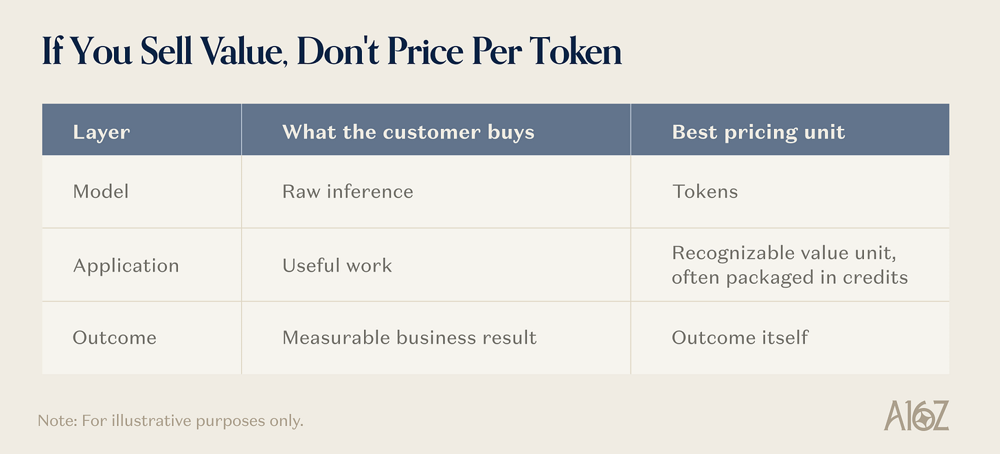
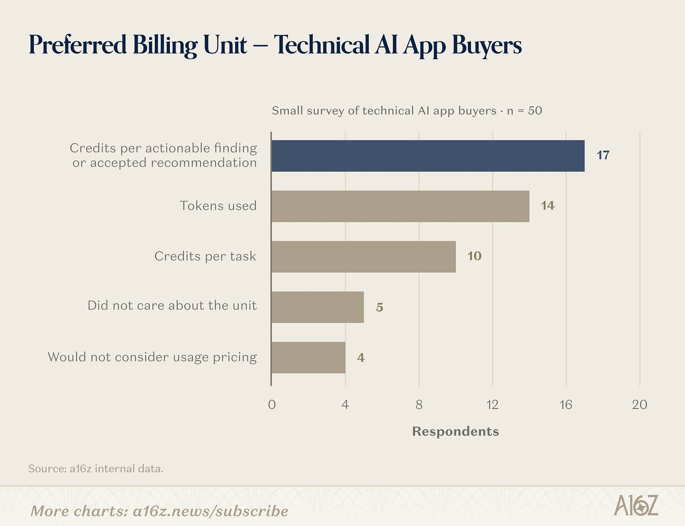

*Charging per token is becoming the default for AI companies. For most AI applications, it is a mistake.*

按 token 收费正在成为 AI 公司的默认做法。但对大多数 AI 应用来说，这是一个错误。

> 作者: Tugce Erten、Sarah Wang | 日期: 2026-08-27T22:02:04+08:00
> 原文链接: https://www.a16z.news/p/you-are-not-a-model-dont-price-per

Token pricing began in the right place: the model layer. When OpenAI launched its API in 2020, charging for the computation a model consumed was a sensible way to meter raw inference. However, ChatGPT’s debut two years later helped spark a wave of applications built on that infrastructure that do much more. These new products combine proprietary data, tools, orchestration, integrations, and workflow logic to complete work on a customer’s behalf.

按 token 定价的起点是对的：模型层。2020 年 OpenAI 开放 API 时，按模型消耗的计算量收费，是计量原始推理的合理方式。但两年后 ChatGPT 的走红，催生了大量构建在这一基础设施之上、能力远超推理本身的应用。这些新产品把专有数据、工具、编排、集成和工作流逻辑组合起来，替客户把工作真正做完。

When an application prices that work in tokens, it imports the model provider’s cost structure into the relationship with the customer and anchors the product’s value to a unit whose cost keeps falling. Based on our work, it’s often a mistake to carry the model layer’s pricing logic into the application layer.

当一个应用用 token 给这项工作定价时，它把模型供应商的成本结构搬进了与客户的关系里，并把自己的价值锚定在一个成本持续下降的计量单位上。根据我们的观察，把模型层的定价逻辑照搬到应用层，往往是个错误。

Instead, we believe companies should price at the highest layer of value that they can reliably measure, attribute, and defend.

我们认为，企业应该在自己能够稳定衡量、归因并守住的最高价值层上定价。

- If you sell model access, price tokens. / 如果你卖的是模型调用能力，就按 token 定价。
- If you turn models into useful work, price the recognizable value unit, often through credits. / 如果你把模型变成可用的工作成果，就按客户认得出来的价值单位定价，通常用积分（credits）。
- If you deliver a clear and attributable business result, price the outcome. / 如果你交付的是清晰可归因的业务结果，就按结果定价。

Getting this wrong is difficult to undo. A token-based price trains customers to compare an application with raw compute. It gives away the value of data, workflow, and orchestration; exposes customers to technical complexity they cannot forecast; and can lock the vendor into weak margins. Credits do not solve that problem on their own if they are merely cost-plus tokens; they still meter infrastructure as opposed to value.

这一步走错很难回头。基于 token 的定价会训练客户拿你的应用去和裸算力比价：它把数据、工作流和编排的价值白白让渡出去，让客户暴露在他们无法预测的技术复杂度面前，还可能把厂商自己锁死在微薄的毛利里。积分本身也解决不了这个问题——如果它只是"成本加成的 token"，计量的仍然是基础设施，而不是价值。

Pricing around the recognizable work does the opposite. It makes value legible, spend forecastable, and product improvements economically valuable to both sides. In our survey of 50 technical AI buyers, 27 preferred credits tied to recognizable work, while only 14 preferred tokens.

围绕"客户认得出来的工作"定价则完全相反：它让价值可读、让支出可预测，并让产品改进对供需双方都产生经济价值。在我们对 50 位技术型 AI 采购者的调研中，27 人偏好与可识别工作绑定的积分，只有 14 人偏好 token。

## 1. Price the Layer You Sell / 1. 按你售卖的层级定价

The two ends of the stack are relatively straightforward. Model providers sell inference, which can be metered in tokens. Some applications deliver outcomes that are observable and attributable enough to price directly.

技术栈的两端相对直白。模型供应商卖的是推理，可以用 token 计量；少数应用交付的结果足够可观测、可归因，可以直接按结果定价。

The middle is harder. That’s where most AI applications live.

难的是中间层，而大多数 AI 应用恰恰都在这里。

For example, an account-research agent is not selling searches and model calls. It is selling a completed account brief. A coding agent is selling an implemented change. A data platform might sell a completed query, pipeline, or agent run. The application’s job is to abstract the complexity beneath that unit of work.

举例来说，一个客户调研 Agent 卖的不是"搜索次数"和"模型调用次数"，而是一份完成的客户简报；一个编码 Agent 卖的是一次已落地的代码变更；一个数据平台卖的可以是一次完成的查询、一条跑通的管道或一次 Agent 运行。应用的职责，是把这个工作单位之下的复杂度抽象掉。

Because every category packages value differently, there is no universal AI application metric. Voice AI may begin with minutes, then move toward conversations resolved. Copilots may begin with seats, then add usage-based pricing as agentic work creates greater variation in cost and value.

由于每个品类打包价值的方式都不同，不存在一个放之四海而皆准的 AI 应用计量指标。语音 AI 可能从"分钟数"起步，再走向"已解决的对话数"；Copilot 可能从"席位"起步，随着 Agent 化工作带来更大的成本和价值差异，再加上按用量计费。

The right question is not, “What is the AI pricing metric?” It is: “**What unit of value does the customer already understand, and can we measure it consistently?”**

正确的问题不是"AI 的定价计量单位是什么"，而是："**客户已经理解的那个价值单位是什么，我们能否稳定地衡量它？**"

## 2. Customers Want Legibility, Not Tokens / 2. 客户要的是可读性，不是 token

Customers will still ask about tokens. Usually, they are asking for one of two things: comparability or control.

客户照样会问 token。通常他们要的是两样东西之一：可比性，或控制权。

First, buyers want a common benchmark. Tokens appear to let them compare a specialized application with a general-purpose model API or an internal build. But the comparison is usually false precision. Each application combines different models, data, tools, and levels of automation. A token flowing through one product does not produce the same work as a token flowing through another.

第一，采购方想要一个通用标尺。token 看起来能让他们把一个专用应用和通用模型 API 或自建方案放在一起比较。但这种比较往往是虚假的精确：每个应用组合了不同的模型、数据、工具和自动化程度，流过一款产品的 token 与流过另一款的 token，产出的工作并不相同。

Second, buyers want to allocate spend. Finance and IT teams need to trace AI spend to a department, project, client, or invoice, often across a growing portfolio of applications. Requiring them to forecast tokens separately for every product recreates the complexity those products are meant to hide.

第二，采购方想要分摊支出。财务和 IT 团队需要把 AI 支出追溯到部门、项目、客户或发票上，而且往往横跨一个不断膨胀的应用组合。要求他们为每个产品单独预测 token，等于把这些产品本该隐藏的复杂度又还给了客户。

Both needs are reasonable. Nonetheless, token pricing often creates more friction than clarity.

这两种需求都合理。尽管如此，按 token 定价往往带来的摩擦多于清晰。

A support leader can estimate how many conversations the company handles. It is much harder to predict context length, retrieval volume, retries, reasoning time, or output tokens. What should be a straightforward ROI calculation becomes a separate compute-forecasting exercise for every AI application the company deploys.

一位客服负责人能估算公司每月处理多少通对话，却很难预测上下文长度、检索量、重试次数、推理时长或输出 token 数。本该是一目了然的 ROI 测算，变成了每上线一个 AI 应用就要重做一次的计算量预测作业。

The better answer is to expose enough underlying usage detail to build trust without turning that usage into the commercial unit. Show customers what work was completed, where capacity went, and why certain tasks consumed more than others. Give finance and IT the reporting they need for budgets and chargebacks.

更好的做法是：暴露足够的底层用量细节以建立信任，但不要把用量变成商业计量单位。告诉客户完成了哪些工作、容量花在了哪里、为什么某些任务消耗更多；把财务和 IT 做预算与内部结算所需的报表给他们。

**Transparency does not require the billing meter and the underlying cost meter to be the same.**

**透明并不要求计费计量器和底层成本计量器是同一个。**

In highly competitive or technically sophisticated markets, companies may still need to offer token pass-through, particularly for unusually expensive or volatile model usage. But this should be an explicit component of a hybrid model, not the default expression of the product’s value.

在竞争极其激烈或客户技术能力很强的市场，企业可能仍需提供 token 成本透传，尤其是面对异常昂贵或波动剧烈的模型用量。但这应当作为混合定价模式中的一个显式组成部分，而不是产品价值的默认表达方式。

## 3. Credits Should Map Work to Value, Not Hide Tokens / 3. 积分应该把工作映射为价值，而不是把 token 藏起来

For the broad middle of the AI stack, credits can be an effective way to package variable work. But a credit is a currency, not a value metric. *What matters is what the credit buys*.

对 AI 技术栈中间这片广阔地带，积分是打包变动性工作的有效方式。但积分是一种货币，不是价值度量。**关键在于一个积分能买到什么**。

A weak credit system converts token counts into an opaque internal currency. It hides the meter without improving it.

孱弱的积分体系只是把 token 数量换算成一种不透明的内部货币，它把计量器藏了起来，却没有让它变得更好。

A strong credit system maps to work the customer recognizes. It might use a few intuitive effort bands: a small bug fix costs less than a multi-file feature; summarizing one contract clause costs less than reviewing the full agreement; enriching one record costs less than running a multi-step account research workflow.

强健的积分体系则映射到客户认得出来的工作上。它可以使用几档直观的"工作量档位"：修一个小 bug 比开发跨文件功能便宜；总结一个合同条款比审阅整份协议便宜；补全一条记录比跑一个多步骤的客户调研工作流便宜。

The best credit systems do three things:

最好的积分体系会做到三件事：

- **Abstract infrastructure complexity.** Customers buy the work, not the ingredients. / **抽象掉基础设施复杂度。** 客户买的是做好的工作，不是原材料。
- **Explain relative effort.** Simple work consumes a little; standard work consumes a predictable amount; complex work consumes more. / **解释相对工作量。** 简单工作消耗一点，标准工作消耗可预期的量，复杂工作消耗更多。
- **Create commercial flexibility.** One pool can cover several workloads, agents, or automations while procurement manages one contract. / **创造商业灵活性。** 一个积分池可以覆盖多种工作负载、Agent 或自动化流程，而采购只需管理一份合同。

The test is comprehension. Buyers usually know their workload before they know their compute load. If customers cannot understand the credit system in a few sentences, it is too complicated.

检验标准是"能不能听懂"。采购方通常先知道自己的业务量，再知道自己的算力负载。如果客户无法用几句话讲明白你的积分体系，它就是太复杂了。

## 4. Credits Can Protect Margins / 4. 积分还能保护毛利

Credits do more than just make usage understandable. Designed well, they also protect your gross margins.

积分的作用不止于让用量变得可理解。设计得当的话，它还能保护你的毛利率。

In traditional SaaS, an additional user often adds little marginal cost. In AI applications, every user can generate inference, retrieval, search, tool calls, third-party data, media generation, retries, and failed runs. Fast growth can hide a weak business if each new dollar of revenue is quickly paid back to model, cloud, or data providers.

在传统 SaaS 里，多一个用户往往只增加很少的边际成本。但在 AI 应用中，每个用户都可能产生推理、检索、搜索、工具调用、第三方数据、媒体生成、重试和失败运行。如果每一美元新增收入很快又付给了模型、云或数据供应商，高速增长就会掩盖一门脆弱的生意。

The pricing system needs to separate two decisions:

定价体系需要把两个决策分开：

1. **What is the work worth?** Customer value, willingness to pay, and competition determine the price of the credit pool / **这份工作值多少钱？** 客户价值、支付意愿和竞争，决定积分池的售价
2. **What does the work cost to deliver?** Relative cost and complexity determine how many credits each task consumes / **交付这份工作要花多少成本？** 相对成本与复杂度，决定每个任务消耗多少积分

This separation enables the vendor to protect margin while preserving the margin upside from model routing, caching, prompt optimization, better infrastructure, and a more diverse (and changing!) mix of proprietary and open-source models. In fact, if underlying model costs fall, the application may even be able to retain part of the benefit because customers are paying for work, not just reimbursing the company for compute.

这种分离让厂商既能守住毛利，又能保留来自模型路由、缓存、提示词优化、更优基础设施，以及更（且不断变化的）多样化闭源与开源模型组合的毛利上行空间。事实上，如果底层模型成本下降，应用甚至还能留下部分红利——因为客户是在为工作付费，而不只是在报销你的算力成本。

Clay offers a helpful example and has often been ahead of the curve in how they think about pricing. In a 2026 pricing memo, the company wrote that it had mispriced credits in its Pro segment back in 2022 and operated that segment at a loss for years. Its new model separates Data Credits for third-party data from Actions for orchestration work. Clay keeps fixed pricing for models with predictable costs while passing through the actual token cost of more volatile and expensive reasoning models without a markup. In other words, Clay uses different meters for different layers: Actions for platform value and token pass-through for unpredictable model costs.[1]

Clay 提供了一个很好的范例，并且在定价思路上一直领先于行业。在 2026 年的一份定价备忘录中，该公司写道：它在 2022 年给 Pro 档位的积分定错了价，导致该档位连年亏损。它的新模型把面向第三方数据的 Data Credits 与面向编排工作的 Actions 拆开：对成本可预测的模型维持固定定价，同时对波动更大、更昂贵的推理模型按实际 token 成本不加价透传。换句话说，Clay 对不同层级使用不同的计量器——用 Actions 计量平台价值，用 token 透传承接不可预测的模型成本。[1]

## 5. Move to Outcomes When Value Is Clear / 5. 当价值清晰时，就转向结果定价

Credits are most useful when the product performs valuable work but the final business result is not cleanly attributable. Once the outcome becomes observable, attributable, and valuable enough to support a stable price, the meter should move again.

当产品确实完成了有价值的工作、但最终业务结果无法干净归因时，积分最为有用。一旦结果变得可观测、可归因，且价值高到足以支撑一个稳定的价格，计量器就应该再次上移。

Under those conditions, price the outcome: a resolved support conversation, a qualified lead, a booked meeting, a processed claim, or a recovered dollar.

在这种条件下，就按结果定价：一次已解决的客服对话、一条合格的线索、一场敲定的会议、一笔处理完的理赔，或一美元追回的欠款。

If the results are not attributable enough, price the unit of work through credits.

如果结果还不足以归因，就用积分给工作单位定价。

If the customer is buying raw model access, price tokens.

如果客户买的是裸模型调用能力，就按 token 定价。

Many products will use hybrids: seats for access, credits for variable work, token pass-through for unusually expensive or unpredictable model calls, and outcome fees where attribution is clean. Multiple meters are not the problem, but avoid using the wrong meter for the wrong layer.

很多产品会采用混合模式：席位对应访问权，积分对应变动性工作，token 透传对应异常昂贵或不可预测的模型调用，结果费用于归因清晰的场景。多个计量器本身不是问题，要避免的是把错误的计量器用在错误的层级上。

## Make Value Visible / 让价值可见

Token pricing pulls the customer conversation toward a cost curve that keeps falling. This is a poor anchor for a product whose usefulness, reliability, and role in the workflow should keep rising.

按 token 定价，会把客户对话拽向一条持续下行的成本曲线。对于一款有用性、可靠性和在工作流中的地位都应当持续上升的产品来说，这是一个糟糕的锚点。

The better path is to price at the highest layer of value you can reliably measure, attribute, and defend. Translate variable work into understandable units. Use credits to package those units when flexibility matters. Move toward outcomes as soon as customers can recognize and trust them.

更好的路径是：在你能够稳定衡量、归因并守住的最高价值层上定价；把变动的工作翻译成可理解的单位；在需要灵活性时用积分打包这些单位；一旦客户能够识别并信任结果，就尽快转向结果定价。

[1] https://www.clay.com/blog/clay-pricing-memo-internal
